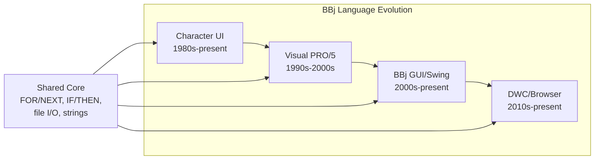
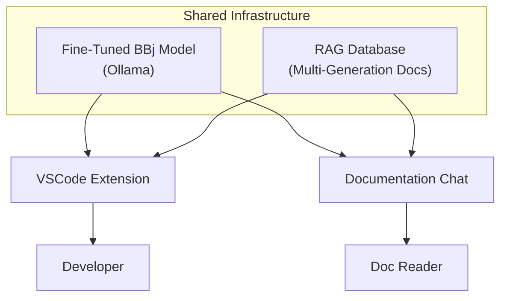

<objective>
Install Mermaid theme, create custom admonition CSS for TL;DR blocks and decision callouts, and demonstrate all three content patterns in placeholder chapter pages.

Purpose: Content patterns must be ready and proven before Phases 3-4 begin writing real chapter content. This plan installs the infrastructure (Mermaid theme, CSS) and demonstrates each pattern in sample content so authors know exactly how to use them.

Output: Working Mermaid diagrams, styled TL;DR blocks, styled decision callouts -- all demonstrated in `docs/01-bbj-challenge/index.md` and `docs/02-strategic-architecture/index.md`.
</objective>

<execution_context>
@/Users/beff/.claude/get-shit-done/workflows/execute-plan.md
@/Users/beff/.claude/get-shit-done/templates/summary.md
</execution_context>

<context>
@.planning/PROJECT.md
@.planning/ROADMAP.md
@.planning/STATE.md
@.planning/phases/02-content-architecture-landing-page/02-CONTEXT.md
@.planning/phases/02-content-architecture-landing-page/02-RESEARCH.md
@docusaurus.config.ts
@src/css/custom.css
@docs/01-bbj-challenge/index.md
@docs/02-strategic-architecture/index.md
@package.json
</context>

<tasks>

<task type="auto">
  <name>Task 1: Install Mermaid theme and configure docusaurus.config.ts</name>
  <files>docusaurus.config.ts, package.json</files>
  <action>
**Step 1: Install the Mermaid theme package.**

Run: `npm install --save @docusaurus/theme-mermaid@3.9.2`

This must match the project's Docusaurus version (3.9.2 confirmed in package.json). Use the exact version, not a caret range, to avoid version mismatch warnings.

**Step 2: Update `docusaurus.config.ts` with three changes.**

All three changes are documented in the RESEARCH.md with exact code. Apply them carefully:

1. **Add `mermaid: true` to the `markdown` section** (alongside the existing `hooks`):
```typescript
markdown: {
  mermaid: true,
  hooks: {
    onBrokenMarkdownLinks: 'warn',
  },
},
```

2. **Add the `themes` array at the top level of the config** (after `presets`, before `themeConfig`):
```typescript
themes: ['@docusaurus/theme-mermaid'],
```
This is a TOP-LEVEL config property, NOT inside `themeConfig`. Getting this wrong is a common pitfall per RESEARCH.md.

3. **Add `mermaid` to `themeConfig`** (inside the existing `themeConfig` object, at the same level as `colorMode`, `navbar`, etc.):
```typescript
mermaid: {
  theme: { light: 'neutral', dark: 'dark' },
},
```

**Step 3: Verify the build.**

Run: `npm run build`

This MUST succeed. If you get an error about `@mermaid-js/layout-elk`, check that the installed version is exactly 3.9.2 (the fix for this issue). If the build fails, try `npm run clear && npm run build` to clear the cache.

Do NOT modify `future.experimental_faster` -- leave it as `true`. The Mermaid/Rspack issue is fixed in 3.9.2.
  </action>
  <verify>
`npm run build` completes with zero errors. Verify `@docusaurus/theme-mermaid` appears in `package.json` dependencies. Verify `docusaurus.config.ts` has `markdown.mermaid: true`, `themes: ['@docusaurus/theme-mermaid']`, and `themeConfig.mermaid.theme` configured.
  </verify>
  <done>
Mermaid theme is installed and configured. Build succeeds with Rspack enabled. Config has all three required Mermaid settings in the correct locations.
  </done>
</task>

<task type="auto">
  <name>Task 2: Add admonition CSS and create sample content demonstrating all patterns</name>
  <files>src/css/custom.css, docs/01-bbj-challenge/index.md, docs/02-strategic-architecture/index.md</files>
  <action>
**Part A: Add admonition CSS to `src/css/custom.css`**

Append the following CSS rules to the existing `custom.css` file (after the existing dark theme variables). These style the two content patterns using CSS variable overrides as recommended by RESEARCH.md.

**TL;DR blocks (`:::tip` -> `.alert--success`):**
- Prominent left border (5px)
- Green-tinted background using the project's primary color
- Slightly larger font size (1.05rem)
- Light mode: `rgba(46, 133, 85, 0.08)` background, `rgba(46, 133, 85, 0.15)` highlight
- Dark mode: `rgba(37, 194, 160, 0.08)` background, `rgba(37, 194, 160, 0.15)` highlight
- Border color: `var(--ifm-color-primary)` (matches the site theme)

**Decision callouts (`:::info` -> `.alert--info`):**
- Prominent left border (5px)
- Blue-tinted background
- Light mode: `rgba(54, 120, 194, 0.06)` background, `rgba(54, 120, 194, 0.12)` highlight
- Dark mode: `rgba(54, 120, 194, 0.1)` background, `rgba(54, 120, 194, 0.18)` highlight
- Border color: `#3678c2`

Use CSS variable overrides (`--ifm-alert-background-color`, `--ifm-alert-background-color-highlight`, `--ifm-alert-border-color`) on the `.alert--success` and `.alert--info` selectors. This avoids specificity issues per RESEARCH.md Pitfall 4.

Add a CSS comment block at the top of the new section explaining the admonition type allocation:
- `:::tip` = TL;DR blocks (reserved site-wide)
- `:::info` = Decision records (reserved site-wide)
- `:::note` = General notes
- `:::warning` = Caveats/limitations
- `:::danger` = Critical warnings

**Part B: Rewrite `docs/01-bbj-challenge/index.md` with all three patterns**

Replace the placeholder content with sample content that demonstrates TL;DR, decision callout, AND Mermaid diagram. This is still placeholder/demo content (real chapter writing happens in Phase 3), but it should be realistic enough to validate the patterns.

Content structure:
```
---
sidebar_position: 1
title: "The BBj Challenge"
description: "Why generic LLMs fail on four generations of Business BASIC."
---

# The BBj Challenge

:::tip[TL;DR]
BBj spans four generations of Business BASIC -- from 1980s character terminals to
modern browser-based DWC applications. Generic LLMs have essentially zero training
data on BBj and will hallucinate incorrect syntax. A custom fine-tuned model is the
only viable path to AI-powered BBj development tools.
:::

[1-2 paragraphs of placeholder narrative about BBj being unique]

:::info[Decision: Custom Fine-Tuned Model Required]
**Choice:** Fine-tune a dedicated BBj language model rather than relying on prompt
engineering with generic LLMs.

**Rationale:** Base LLMs have essentially no knowledge of BBj syntax, idioms, or APIs.
Testing shows generic models hallucinate VB-style code when asked about BBj. No amount
of RAG context can compensate for fundamental language incomprehension.

**Status:** In progress -- training data structure defined, base model evaluation underway.
:::

[Brief intro to the four generations]



[Closing sentence noting this chapter is under development]

:::note[Coming Soon]
This chapter is under active development. Full content covering all four BBj
generations, LLM failure analysis, and the case for custom tooling will be
published as research and writing progress.
:::
```

Use the EXACT admonition syntax from RESEARCH.md. Keep empty lines around `:::` directives (Pitfall 3). The TL;DR text, decision callout, and Mermaid diagram should use the content from the RESEARCH.md code examples (adjusted slightly for natural flow).

**Part C: Update `docs/02-strategic-architecture/index.md` with Mermaid demo**

Replace placeholder with content demonstrating a Mermaid architecture diagram:

```
---
sidebar_position: 2  (change from 1 to 2)
title: "Strategic Architecture"
description: "A unified AI infrastructure powering IDE, chat, and future capabilities."
---

# Strategic Architecture

:::tip[TL;DR]
Rather than building isolated AI tools, the BBj strategy centers on a unified
infrastructure: a shared fine-tuned model and RAG pipeline that powers IDE completion,
documentation chat, and future AI capabilities from a single source of truth.
:::

[1-2 paragraph placeholder about the unified approach]



[Brief explanation of the diagram]

:::note[Coming Soon]
This chapter is under active development. Full architectural documentation including
component interactions, data flow, and deployment topology will be published as
research and writing progress.
:::
```

Keep `sidebar_position: 2` if it was 1 before (Strategic Architecture is the second chapter).
  </action>
  <verify>
Run `npm run build` -- must succeed with zero errors. Then `npm run serve` and check:
1. Visit `/docs/bbj-challenge` -- TL;DR block should appear with green styling, decision callout with blue styling, Mermaid diagram should render as a visual flowchart (not raw code)
2. Visit `/docs/strategic-architecture` -- TL;DR block and Mermaid architecture diagram should render correctly
3. Toggle dark mode -- admonition colors and Mermaid diagram theme should adapt
  </verify>
  <done>
Custom admonition CSS renders TL;DR blocks (green, prominent) and decision callouts (blue, structured) with distinct visual styling. Mermaid diagrams render as interactive SVG flowcharts in both chapters. All patterns work in light and dark themes. Build succeeds.
  </done>
</task>

</tasks>

<verification>
- `npm run build` completes with zero errors (Mermaid + Rspack works)
- `/docs/bbj-challenge` page shows: TL;DR block (green), decision callout (blue), Mermaid diagram (rendered SVG)
- `/docs/strategic-architecture` page shows: TL;DR block (green), Mermaid architecture diagram (rendered SVG)
- Admonition colors adapt correctly between light and dark themes
- Mermaid diagram themes switch between 'neutral' (light) and 'dark' (dark mode)
- No raw mermaid code blocks visible (all render as diagrams)
- `:::note[Coming Soon]` blocks still render with default neutral styling (not affected by custom CSS)
</verification>

<success_criteria>
- All three content patterns (TL;DR, decision callout, Mermaid) are demonstrated and rendering correctly
- Patterns are ready for chapter authors to copy-paste in Phases 3-4
- CSS uses variable overrides (not property overrides) for reliable dark mode support
- Mermaid theme is installed, configured, and building successfully with Rspack
</success_criteria>

<output>
After completion, create `.planning/phases/02-content-architecture-landing-page/02-02-SUMMARY.md`
</output>
