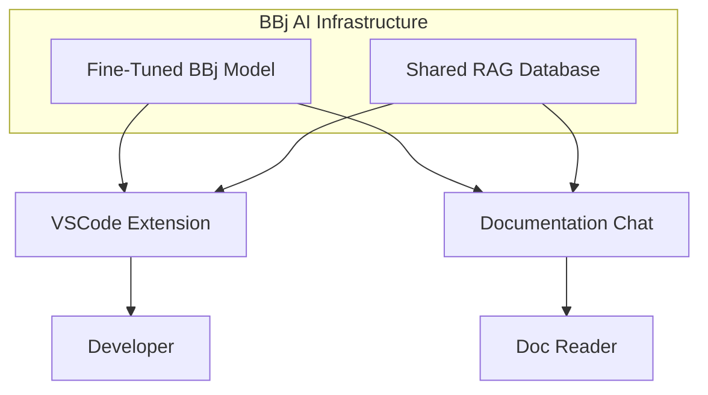
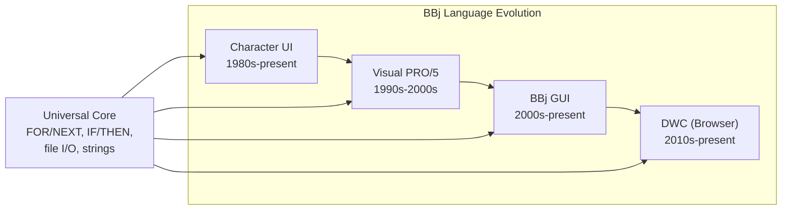

# Phase 2: Content Architecture & Landing Page - Research

**Researched:** 2026-01-31
**Domain:** Docusaurus content patterns (admonitions, Mermaid diagrams), landing page design
**Confidence:** HIGH

## Summary

This phase covers three distinct technical areas: (1) redesigning the landing page with an executive summary and audience routing for developers, leadership, and customers; (2) configuring content patterns using Docusaurus built-in admonitions styled via CSS for TL;DR blocks and decision callouts; and (3) installing and configuring `@docusaurus/theme-mermaid` for architecture diagrams.

All three areas use well-documented, stable Docusaurus features. The admonition system is built-in and requires only CSS customization. Mermaid is a first-party Docusaurus theme with straightforward installation. The landing page is a standard React page that already exists and needs content/layout changes, not a framework migration.

The key decision point is how to implement TL;DR blocks and decision callouts. The CONTEXT.md specifies using built-in admonitions with custom CSS (not custom React components). This means using existing admonition types (`:::tip`, `:::info`, etc.) with restyled CSS and custom titles -- not creating new admonition keywords, which would require component swizzling.

**Primary recommendation:** Use `:::tip[TL;DR]` for summary blocks and `:::info[Decision Record]` for decision callouts, styled with CSS overrides in `custom.css`. Install `@docusaurus/theme-mermaid@3.9.2` for diagrams. Rebuild the landing page with a problem-first narrative and card-based audience routing sections.

## Standard Stack

The established libraries/tools for this domain:

### Core
| Library | Version | Purpose | Why Standard |
|---------|---------|---------|--------------|
| `@docusaurus/theme-mermaid` | 3.9.2 | Mermaid diagram rendering in Markdown | First-party Docusaurus theme, matches project's Docusaurus version |
| Infima CSS framework | (bundled) | Admonition styling via CSS variables | Already included with Docusaurus classic preset |

### Supporting
| Library | Version | Purpose | When to Use |
|---------|---------|---------|-------------|
| `mermaid` | ^10.4.0 or ^11.x | Diagram rendering engine | Transitive dependency of theme-mermaid; both v10 and v11 supported since Docusaurus 3.6 |
| `clsx` | ^2.0.0 | Conditional CSS class names in React | Already installed; use in landing page component |

### Alternatives Considered
| Instead of | Could Use | Tradeoff |
|------------|-----------|----------|
| Built-in admonitions with CSS | Custom React components | More flexible but violates CONTEXT decision; harder to maintain, breaks Markdown portability |
| Built-in admonitions with CSS | Swizzled admonitions with new keywords | More semantic (`:::tldr` vs `:::tip[TL;DR]`) but requires component file creation, adds maintenance burden |
| `@docusaurus/theme-mermaid` | `mdx-mermaid` (third-party) | Community package; less integration, not maintained by Docusaurus team |

**Installation:**
```bash
npm install --save @docusaurus/theme-mermaid@3.9.2
```

No additional installs needed for admonitions (built-in) or landing page (existing React page).

## Architecture Patterns

### Recommended Project Structure
```
src/
├── css/
│   └── custom.css          # Admonition CSS overrides (TL;DR, decision callouts)
├── pages/
│   ├── index.tsx            # Landing page (redesigned)
│   └── index.module.css     # Landing page styles (expanded)
docs/
├── 01-bbj-challenge/
│   └── index.md             # Demo TL;DR block + decision callout + Mermaid diagram
├── 02-strategic-architecture/
│   └── index.md             # Demo Mermaid architecture diagram
```

No new directories or components needed. All changes go into existing files plus `docusaurus.config.ts`.

### Pattern 1: TL;DR Summary Blocks
**What:** A visually prominent summary block at the top of each chapter using `:::tip[TL;DR]` with custom CSS
**When to use:** Top of every chapter page, after the H1 heading

**Markdown syntax:**
```markdown
# The BBj Challenge

:::tip[TL;DR]
BBj spans four generations of Business BASIC. Generic LLMs have near-zero training data
on BBj and actively hallucinate incorrect syntax. A custom fine-tuned model is required --
off-the-shelf tools like GitHub Copilot cannot bridge this gap.
:::
```

**CSS styling in `custom.css`:**
```css
/* TL;DR blocks: use :::tip[TL;DR] -- more prominent than default tip */
.alert--success:has(.admonitionHeading_node_modules-\@docusaurus-theme-classic-lib-theme-Admonition-Layout-styles-module) {
  /* Target tip admonitions generically -- see note below */
}
```

**Important note on CSS targeting:** Docusaurus admonition types map to Infima alert classes. The `:::tip` type uses `alert--success`. To make TL;DR blocks more prominent without affecting ALL tip admonitions, there are two approaches:
1. **Simple approach (recommended):** Style ALL `:::tip` admonitions with TL;DR-appropriate prominence. Reserve `:::tip` exclusively for TL;DR blocks across the site. Use other types for other purposes.
2. **CSS class approach:** Use `:::tip[TL;DR]{.tldr-block}` syntax to add a custom CSS class, then target `.tldr-block` in CSS. (Docusaurus supports adding CSS classes via `{.className}` attribute syntax on admonitions.)

### Pattern 2: Decision Record Callouts
**What:** Styled callout blocks highlighting key strategic decisions using `:::info[Decision Record]` or `:::info[Decision: Title Here]`
**When to use:** Inline within chapter content where a strategic choice and its rationale need emphasis

**Markdown syntax:**
```markdown
:::info[Decision: Build Custom VSCode Extension]
**Choice:** Build a dedicated BBj VSCode extension with Langium integration rather than
adapting an existing tool like Continue.dev or Tabby.

**Rationale:** No existing tool can provide meaningful BBj assistance -- we are filling a gap
that Copilot and other AI coding tools cannot fill. Full control over the model, semantic
context from Langium, and self-hosting capability justify the custom investment.
:::
```

**CSS styling:** The `:::info` type uses `alert--info`. Style it with slightly different treatment (perhaps a distinct left border, subtle background) to visually distinguish decisions from regular informational notes.

### Pattern 3: Mermaid Architecture Diagrams
**What:** Mermaid code blocks rendered as diagrams, replacing ASCII art from the source strategy paper
**When to use:** Architecture overviews, data flow diagrams, system component relationships

**Markdown syntax:**
````markdown

````

### Pattern 4: Landing Page with Audience Routing
**What:** Redesigned landing page with problem-first narrative and card sections routing visitors by audience
**When to use:** `src/pages/index.tsx` -- the site homepage

**Structure:**
```
Hero Section
  - Problem-first headline: "Generic LLMs fail on BBj"
  - Subheadline: strategy tagline
  - Primary CTA: "Read the Strategy"

Executive Summary Section
  - 2-3 paragraph problem statement and solution overview
  - Three initiative cards (Fine-tuned model, IDE integration, Doc chat)

Audience Routing Section
  - "For Developers" card -> chapters on fine-tuning, IDE, RAG
  - "For Leadership" card -> chapters on strategy, architecture, roadmap
  - "For Customers & Partners" card -> chapters on challenge, architecture, roadmap

Chapter Overview
  - Existing 7-chapter card grid (keep, refine)
```

### Anti-Patterns to Avoid
- **Custom React components for content patterns:** The CONTEXT decision explicitly says admonitions with CSS, not React components. Don't create `<TldrBlock>` or `<DecisionCallout>` components.
- **Swizzling admonitions for this phase:** Adding custom admonition keywords (`:::tldr`, `:::decision`) requires creating `src/theme/Admonition/Type/` files and `Types.tsx`. This is unnecessary complexity when built-in types with custom titles achieve the same result.
- **Audience tabs on landing page:** Nielsen Norman Group research shows audience-based navigation (dropdown/tabs asking "I am a developer/executive") performs poorly. Card-based routing with descriptive labels is more effective -- let content describe itself rather than asking users to self-categorize.
- **Over-engineering Mermaid config:** Default Mermaid themes with minor customization are sufficient. Don't install ELK layout engine or add complex Mermaid options.

## Don't Hand-Roll

Problems that look simple but have existing solutions:

| Problem | Don't Build | Use Instead | Why |
|---------|-------------|-------------|-----|
| Summary blocks | Custom `<Summary>` React component | `:::tip[TL;DR]` admonition + CSS | Built-in, Markdown-portable, zero JS overhead |
| Decision callouts | Custom `<Decision>` React component | `:::info[Decision: ...]` admonition + CSS | Same reasons; consistent with admonition system |
| Architecture diagrams | Static images or embedded SVGs | Mermaid code blocks via `@docusaurus/theme-mermaid` | Text-based, versionable, auto-themed for dark mode |
| Audience routing | Client-side routing/state/tabs | Static card sections with links | No state needed; cards describe content, users click what interests them |
| Dark mode diagram support | Manual SVG theme switching | Mermaid `theme` config in `themeConfig` | Automatic light/dark via Mermaid theme config |

**Key insight:** Every content pattern in this phase has a Docusaurus-native solution. The value is in styling and content, not in building components.

## Common Pitfalls

### Pitfall 1: Mermaid + Rspack Build Failure
**What goes wrong:** Build error `Can't resolve '@mermaid-js/layout-elk'` when using `@docusaurus/theme-mermaid` with `@docusaurus/faster` (Rspack)
**Why it happens:** Regression in Docusaurus 3.9.1 where Rspack tries to resolve optional peer dependency
**How to avoid:** Use `@docusaurus/theme-mermaid@3.9.2` which includes the fix (PR #11437). If build fails, temporarily set `experimental_faster: { rspackBundler: false }` as diagnostic workaround.
**Warning signs:** Build error mentioning `@mermaid-js/layout-elk` during `npm run build`
**Confidence:** HIGH -- verified via GitHub issue #11470, fix confirmed in commit b4cc50a

### Pitfall 2: Mermaid Theme Not in themeConfig Root
**What goes wrong:** Mermaid diagrams render but don't respect dark mode or custom themes
**Why it happens:** Placing `mermaid` config inside `themes` array or inside a preset, instead of in `themeConfig`
**How to avoid:** Ensure `mermaid.theme` is inside `themeConfig`, while the `themes` array and `markdown.mermaid` are top-level config properties
**Warning signs:** Diagrams look identical in light and dark mode

### Pitfall 3: Prettier Reformatting Admonition Syntax
**What goes wrong:** Prettier (if configured) reformats `:::tip[TL;DR]` blocks into invalid syntax
**Why it happens:** Prettier doesn't understand Docusaurus admonition directives
**How to avoid:** Add empty lines around the opening `:::type` and closing `:::` directives. This is officially recommended by Docusaurus.
**Warning signs:** Admonitions stop rendering after formatting

### Pitfall 4: Admonition CSS Specificity Issues
**What goes wrong:** CSS overrides in `custom.css` don't apply or conflict with Infima defaults
**Why it happens:** Infima styles have specific selectors; custom CSS may have lower specificity
**How to avoid:** Use the CSS variable approach (override `--ifm-alert-*` variables on `.alert--success`, `.alert--info` etc.) rather than trying to override individual properties. CSS variables cascade correctly.
**Warning signs:** Styles don't apply, or only apply in one theme mode

### Pitfall 5: Landing Page baseUrl Mismatch in Links
**What goes wrong:** Links on landing page break when deployed to GitHub Pages at `/bbj-ai-strategy/` subpath
**Why it happens:** Hardcoding paths like `/docs/bbj-challenge` instead of using Docusaurus `Link` component which handles `baseUrl`
**How to avoid:** Always use the `<Link>` component from `@docusaurus/Link` (already in use in current `index.tsx`). Never use raw `<a>` tags for internal links.
**Warning signs:** Links work in dev but 404 on production

## Code Examples

Verified patterns from official sources:

### Mermaid Configuration in docusaurus.config.ts
```typescript
// Source: https://docusaurus.io/docs/markdown-features/diagrams
// Add to existing docusaurus.config.ts

const config: Config = {
  // ... existing config ...

  markdown: {
    mermaid: true,              // Enable Mermaid Remark plugin
    hooks: {
      onBrokenMarkdownLinks: 'warn',  // existing
    },
  },

  themes: ['@docusaurus/theme-mermaid'],  // Top-level, NOT inside themeConfig

  // ... existing presets ...

  themeConfig: {
    // ... existing themeConfig ...
    mermaid: {
      theme: { light: 'neutral', dark: 'dark' },
    },
  } satisfies Preset.ThemeConfig,
};
```

### TL;DR Admonition with Custom CSS
```css
/* src/css/custom.css -- TL;DR styling for :::tip admonitions */

/* Reserve :::tip for TL;DR blocks -- make them prominent */
.alert--success {
  --ifm-alert-background-color: rgba(46, 133, 85, 0.08);
  --ifm-alert-background-color-highlight: rgba(46, 133, 85, 0.15);
  --ifm-alert-border-color: var(--ifm-color-primary);
  font-size: 1.05rem;
  border-left-width: 5px;
}

[data-theme='dark'] .alert--success {
  --ifm-alert-background-color: rgba(37, 194, 160, 0.08);
  --ifm-alert-background-color-highlight: rgba(37, 194, 160, 0.15);
  --ifm-alert-border-color: var(--ifm-color-primary);
}
```

### Decision Callout with Custom CSS
```css
/* src/css/custom.css -- Decision record styling for :::info admonitions */

.alert--info {
  --ifm-alert-background-color: rgba(54, 120, 194, 0.06);
  --ifm-alert-background-color-highlight: rgba(54, 120, 194, 0.12);
  --ifm-alert-border-color: #3678c2;
  border-left-width: 5px;
}

[data-theme='dark'] .alert--info {
  --ifm-alert-background-color: rgba(54, 120, 194, 0.1);
  --ifm-alert-background-color-highlight: rgba(54, 120, 194, 0.18);
}
```

### Sample Chapter Content Demonstrating All Patterns
```markdown
---
sidebar_position: 1
title: "The BBj Challenge"
description: "Why generic LLMs fail on four generations of Business BASIC."
---

# The BBj Challenge

:::tip[TL;DR]
BBj spans four generations of Business BASIC -- from 1980s character terminals to
modern browser-based DWC applications. Generic LLMs have essentially zero training
data on BBj and will hallucinate incorrect syntax. A custom fine-tuned model is the
only viable path to AI-powered BBj development tools.
:::

## Why BBj Is Different

When a developer asks an AI assistant "How do I create a button?", the answer depends
entirely on which BBj generation they're working with...

:::info[Decision: Custom Fine-Tuned Model Required]
**Choice:** Fine-tune a dedicated BBj language model rather than relying on prompt
engineering with generic LLMs.

**Rationale:** Base LLMs have essentially no knowledge of BBj syntax, idioms, or APIs.
Testing shows generic models hallucinate VB-style code when asked about BBj. No amount
of RAG context can compensate for fundamental language incomprehension.

**Status:** In progress -- training data structure defined, base model evaluation underway.
:::

## The Four Generations



All four generations remain valid BBj code in production systems today.
```

### Landing Page Audience Routing Pattern
```tsx
// Audience routing cards in src/pages/index.tsx

const audiences = [
  {
    title: 'For Developers',
    description: 'How the fine-tuned model, IDE extension, and RAG pipeline work -- technical depth for implementers.',
    links: [
      { label: 'Fine-Tuning the Model', href: '/docs/fine-tuning' },
      { label: 'IDE Integration', href: '/docs/ide-integration' },
      { label: 'RAG Database Design', href: '/docs/rag-database' },
    ],
  },
  {
    title: 'For Leadership',
    description: 'Strategic vision, architecture decisions, and implementation roadmap -- the business case for BBj AI.',
    links: [
      { label: 'Strategic Architecture', href: '/docs/strategic-architecture' },
      { label: 'The BBj Challenge', href: '/docs/bbj-challenge' },
      { label: 'Implementation Roadmap', href: '/docs/implementation-roadmap' },
    ],
  },
  {
    title: 'For Customers & Partners',
    description: 'What this means for your BBj applications -- the developer experience improvements ahead.',
    links: [
      { label: 'The BBj Challenge', href: '/docs/bbj-challenge' },
      { label: 'Strategic Architecture', href: '/docs/strategic-architecture' },
      { label: 'Implementation Roadmap', href: '/docs/implementation-roadmap' },
    ],
  },
];
```

## State of the Art

| Old Approach | Current Approach | When Changed | Impact |
|--------------|------------------|--------------|--------|
| Mermaid locked to v10 | Mermaid v10 + v11 both supported | Docusaurus 3.6 (Nov 2024) | Architecture diagrams and other v11 types now available |
| `mdx-mermaid` community plugin | `@docusaurus/theme-mermaid` first-party | Docusaurus 2.x era | Official support, better maintained, auto dark mode |
| Custom admonition React components | Built-in admonitions + CSS variables | Stable since Docusaurus 2.x | Simpler, more maintainable, Markdown-portable |
| Webpack-only builds | Rspack via `@docusaurus/faster` | Docusaurus 3.5+ | Faster builds, but watch for Mermaid compatibility (fixed in 3.9.2) |

**Deprecated/outdated:**
- `mdx-mermaid`: Community alternative; `@docusaurus/theme-mermaid` is the standard
- `remark-admonitions`: Old plugin; Docusaurus built-in admonition system replaced it
- Admonition title via second line: Old syntax; `:::type[Title]` bracket syntax is current

## Admonition Type Allocation Strategy

Since the CONTEXT decision says to use built-in admonitions (not create new keywords), here is the recommended allocation of the 5 built-in types to avoid semantic collision:

| Admonition Type | CSS Class | Site Usage | Visual Treatment |
|----------------|-----------|------------|------------------|
| `:::tip[TL;DR]` | `alert--success` | Chapter summary blocks | Prominent, green-tinted, thick left border |
| `:::info[Decision: ...]` | `alert--info` | Decision record callouts | Blue-tinted, structured content |
| `:::note[...]` | `alert--secondary` | General notes, "Coming Soon" markers | Default neutral styling |
| `:::warning[...]` | `alert--warning` | Caveats, limitations, "not yet implemented" | Yellow/orange attention |
| `:::danger[...]` | `alert--danger` | Critical warnings, breaking changes | Red, high attention |

This allocation means `:::tip` is reserved for TL;DR blocks site-wide, and `:::info` is reserved for decision records. General "helpful tip" content should use `:::note` instead.

## Open Questions

Things that couldn't be fully resolved:

1. **Mermaid + Rspack in 3.9.2 stability**
   - What we know: The fix for `@mermaid-js/layout-elk` resolution was committed before 3.9.1 shipped and should be in 3.9.2. Multiple users report it working.
   - What's unclear: Whether there are other edge cases with `experimental_faster: true` and Mermaid that haven't been reported.
   - Recommendation: Install and test immediately. If build fails, the documented workaround is `rspackBundler: false` as a temporary toggle. Run `npm run build` as verification step after installation.

2. **Admonition CSS class targeting with custom titles**
   - What we know: `:::tip[TL;DR]{.tldr-block}` syntax should allow adding a custom CSS class to specific admonitions.
   - What's unclear: Whether the `{.className}` attribute syntax works reliably with admonitions in Docusaurus 3.9.2 (it's a newer MDX/remark-directive feature).
   - Recommendation: Start with the simpler approach (style all `:::tip` as TL;DR). Only add `{.className}` targeting if the site later needs `:::tip` for non-TL;DR purposes.

3. **Mermaid C4 diagram stability**
   - What we know: C4 diagrams (context, container, component) are marked "experimental" in Mermaid. They exist in both v10 and v11.
   - What's unclear: Whether C4 syntax is stable enough for production documentation.
   - Recommendation: Use standard `graph TD` flowcharts for the initial architecture diagrams. They're simpler, universally supported, and sufficient for the BBj AI infrastructure overview. Consider C4 only if a specific diagram demands it.

## Sources

### Primary (HIGH confidence)
- [Docusaurus Diagrams docs](https://docusaurus.io/docs/markdown-features/diagrams) -- Mermaid installation, config, usage
- [Docusaurus Admonitions docs](https://docusaurus.io/docs/markdown-features/admonitions) -- Built-in types, custom titles, syntax
- [Docusaurus theme-mermaid API](https://docusaurus.io/docs/api/themes/@docusaurus/theme-mermaid) -- Official theme docs
- [Docusaurus 3.6 release notes](https://docusaurus.io/blog/releases/3.6) -- Mermaid v10/v11 dual support
- [GitHub issue #11470](https://github.com/facebook/docusaurus/issues/11470) -- Rspack+Mermaid regression, fix confirmed

### Secondary (MEDIUM confidence)
- [Docusaurus.community admonition customization](https://docusaurus.community/knowledge/design/admonitions/) -- CSS variable overrides for admonition colors
- [Docusaurus.community custom admonitions](https://docusaurus.community/knowledge/component-library/existing/Admonitions/) -- Swizzle-based approach (documented as alternative we chose NOT to use)
- [Nielsen Norman Group](https://www.nngroup.com/articles/audience-based-navigation/) -- Audience-based navigation UX research (avoid tabs/dropdowns, use descriptive cards)
- [I'd Rather Be Writing](https://idratherbewriting.com/files/doc-navigation-wtd/design-principles-for-doc-navigation/) -- Documentation homepage card patterns

### Tertiary (LOW confidence)
- Mermaid C4 diagram stability -- marked experimental in Mermaid docs, no confirmed stability timeline

## Metadata

**Confidence breakdown:**
- Standard stack: HIGH -- all first-party Docusaurus features with official documentation
- Architecture patterns: HIGH -- admonition CSS approach verified across multiple official and community sources; Mermaid config is well-documented
- Landing page design: MEDIUM -- audience routing pattern informed by UX research but specific layout is a design decision
- Pitfalls: HIGH -- Rspack/Mermaid issue verified via GitHub; CSS patterns verified via community docs
- Mermaid C4 diagrams: LOW -- experimental status means uncertain stability

**Research date:** 2026-01-31
**Valid until:** 2026-03-31 (stable Docusaurus features, 60-day validity)
