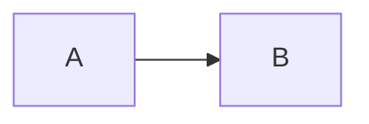
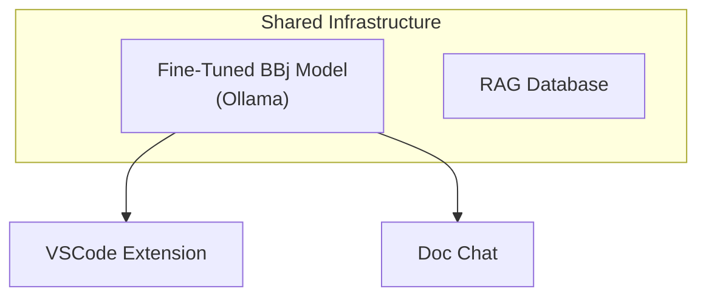
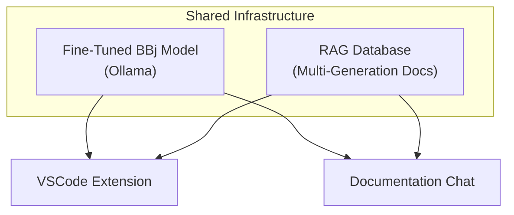

# Phase 3: Foundation Chapters - Research

**Researched:** 2026-01-31
**Domain:** Docusaurus content authoring (BBj syntax highlighting, code blocks, admonitions) + AI/ML landscape research for chapter content (code LLMs, LoRA/QLoRA, Ollama)
**Confidence:** HIGH (Prism/Docusaurus), MEDIUM (AI/ML landscape -- fast-moving field)

## Summary

This phase requires two distinct categories of work: (1) configuring BBj syntax highlighting in Docusaurus, and (2) writing three researched chapters about the BBj AI strategy. The research covers both **presentation** (how to render content well) and **content** (what the chapters should say about the current state of the art).

**BBj syntax highlighting is confirmed trivial.** Prism.js already ships a `prism-bbj.js` grammar (PR #3511, co-authored by Hyyan Abo Fakher). The file exists at `node_modules/prismjs/components/prism-bbj.js` in the current project. All token types (comment, string, number, keyword, function, boolean, operator, punctuation) map to styles in both the GitHub (light) and Dracula (dark) themes already configured. Configuration is a single line in `docusaurus.config.ts`.

**The AI/ML landscape has shifted significantly since the original strategy paper (January 2025).** The paper mentioned CodeLlama, DeepSeek Coder, and StarCoder2 as base model candidates. As of late 2025/early 2026, Qwen2.5-Coder has emerged as the clear leader for open-source code models at fine-tunable sizes (7B/14B/32B), with Qwen3-Coder (480B MoE, 30B MoE) released in mid-2025 for larger deployments. LoRA/QLoRA tooling has matured substantially (Unsloth, LLaMA-Factory, Axolotl). Ollama has evolved from a simple local LLM runner into a platform with desktop apps, agent capabilities, and direct GGUF/fine-tuned model import.

**Primary recommendation:** Add `additionalLanguages: ['bbj']` to the Prism config -- no swizzling needed. For chapter content, update model recommendations from the January 2025 paper to reflect the Qwen2.5-Coder family as the primary recommendation, and describe the current Unsloth + QLoRA + Ollama workflow as the practical fine-tuning pipeline.

## Standard Stack

The established tools/patterns for this phase:

### Core

| Library/Tool | Version | Purpose | Why Standard |
|---|---|---|---|
| `prismjs` (bundled) | 1.29+ | BBj syntax highlighting grammar | Ships with Docusaurus via prism-react-renderer; BBj grammar is an official Prism component |
| `prism-react-renderer` | ^2.3.0 | Renders Prism output to React with theming | Already installed; provides GitHub + Dracula themes |
| Docusaurus Tabs | Built-in | Side-by-side code comparisons | `@theme/Tabs` + `@theme/TabItem` -- no install needed |
| Docusaurus Admonitions | Built-in | TL;DR blocks, decision callouts | Already configured with custom CSS in Phase 2 |
| `@docusaurus/theme-mermaid` | ^3.9.2 | Architecture diagrams | Already installed and configured |

### Supporting

| Tool | Version | Purpose | When to Use |
|---|---|---|---|
| Code block `title` metastring | Built-in | Label code blocks with filenames | When showing config snippets (e.g., `title="docusaurus.config.ts"`) |
| Code block `showLineNumbers` | Built-in | Line numbers on longer blocks | For code blocks > 5 lines where line references matter |
| Code block line highlighting | Built-in | `{1,4-6}` metastring or `// highlight-next-line` | Draw attention to specific lines in examples |

### Alternatives Considered

| Instead of | Could Use | Tradeoff |
|---|---|---|
| Built-in Tabs for code comparison | `docusaurus-remark-plugin-codetabs` | Less verbose syntax, but adds a dependency for a one-time comparison pattern. Not worth it. |
| `additionalLanguages` config | Swizzle `prism-include-languages` | Only needed for languages NOT in Prism. BBj IS in Prism, so swizzling is unnecessary overhead. |

**No installation needed.** All required tools are already installed. The only change is a config line.

## Architecture Patterns

### BBj Syntax Highlighting Configuration

**What:** Add BBj to Docusaurus's Prism language list.
**How:** Single config change in `docusaurus.config.ts`.

```typescript
// Source: Docusaurus official docs - https://docusaurus.io/docs/markdown-features/code-blocks
// In docusaurus.config.ts, inside themeConfig:
prism: {
  theme: prismThemes.github,
  darkTheme: prismThemes.dracula,
  additionalLanguages: ['bbj'],
},
```

Then in markdown, use fenced code blocks with the `bbj` language identifier:

````markdown
```bbj
sysgui! = BBjAPI().getSysGui()
window! = sysgui!.addWindow(100, 100, 800, 600, "My App")
```
````

**Verification:** After adding `additionalLanguages: ['bbj']` and restarting the dev server, BBj code blocks should render with syntax-highlighted keywords (blue), strings (red/pink), comments (gray italic), numbers (teal), and functions (red) in both light and dark themes.

### Chapter Content Pattern

**What:** Each chapter follows the established section pattern with Docusaurus components.
**Structure:**

```markdown
---
sidebar_position: N
title: "Chapter Title"
description: "One-line description for SEO and sidebar."
---

# Chapter Title

:::tip[TL;DR]
2-3 sentence executive summary for non-technical readers.
:::

[Opening paragraph -- problem statement, hook]

:::info[Decision: Key Decision Name]
**Choice:** What was decided
**Rationale:** Why this was chosen
**Alternatives considered:** Brief list
**Status:** Current state
:::

## Section Heading

[Body content -- developer-first, technical, authoritative]

```bbj title="example-name.bbj"
REM Code example with syntax highlighting
```



## Current Status

[Where implementation stands as of writing date]
```

### Cross-Generation Code Comparison Pattern

**What:** Show the same task implemented across BBj generations using Tabs.
**When to use:** Chapter 1, to illustrate why LLMs struggle with BBj's multi-generation nature.

```markdown
import Tabs from '@theme/Tabs';
import TabItem from '@theme/TabItem';

<Tabs groupId="bbj-generation">
<TabItem value="character" label="Character UI" default>

```bbj title="Character UI (1980s)"
PRINT @(10,5),"Name: ",
INPUT name$
PRINT @(10,7),"Hello, ",name$
```

</TabItem>
<TabItem value="vpro5" label="Visual PRO/5">

```bbj title="Visual PRO/5 (1990s)"
WINDOW CREATE wnd, @(0,0), 80, 24, "Input"
BUTTON CREATE btn, wnd, "OK", @(10,20), 10, 1
```

</TabItem>
<TabItem value="gui" label="BBj GUI/DWC">

```bbj title="Modern BBj (2000s+)"
sysgui! = BBjAPI().getSysGui()
window! = sysgui!.addWindow(100,100,800,600,"Input")
button! = window!.addButton(101,80,400,96,25,"OK")
```

</TabItem>
</Tabs>
```

**Important MDX gotcha:** Leave blank lines between the `<TabItem>` opening tag and the fenced code block, and between the code block and the `</TabItem>` closing tag. MDX requires blank lines around Markdown content inside JSX tags.

**Tab syncing:** Use `groupId="bbj-generation"` on all cross-generation Tab groups to sync selection across multiple comparison blocks on the same page.

### Architecture Diagram Pattern (Mermaid)

**What:** Use Mermaid for all architecture and flow diagrams.
**Already configured:** `@docusaurus/theme-mermaid` is installed; theme pairing is `neutral` (light) / `dark` (dark).

````markdown

````

### Anti-Patterns to Avoid

- **Anti-pattern: Long uninterrupted prose.** Break content with code examples, diagrams, or callouts every 3-4 paragraphs maximum.
- **Anti-pattern: Code blocks without language identifier.** Always use ` ```bbj `, never bare ` ``` `. Without the language tag, no syntax highlighting renders.
- **Anti-pattern: Forgetting MDX blank lines in Tabs.** The MDX parser requires blank lines around Markdown content inside JSX components. Missing blank lines will cause the code block to render as literal text.
- **Anti-pattern: Copying source paper verbatim.** Per CONTEXT.md decision, chapters must be rewritten from scratch. The source paper (`bbj-llm-strategy.md`) is an outline for structure/ideas, not content to copy.
- **Anti-pattern: Making the chapter an .mdx file unnecessarily.** Only files that use JSX components (Tabs, custom components) need the `.mdx` extension. Chapters that only use Markdown features (admonitions, code blocks, Mermaid) can remain `.md`. However, **Chapter 1 will need Tabs for cross-generation comparisons**, so it should be renamed to `.mdx`.

## Don't Hand-Roll

Problems that have existing solutions:

| Problem | Don't Build | Use Instead | Why |
|---|---|---|---|
| BBj syntax highlighting | Custom Prism grammar | `additionalLanguages: ['bbj']` | Official Prism grammar exists (PR #3511), verified in `node_modules/prismjs/components/prism-bbj.js` |
| Side-by-side code comparison | Custom CSS grid layout | `<Tabs>` + `<TabItem>` components | Built-in, syncs across page, accessible, mobile-responsive |
| Architecture diagrams | Static images / SVGs | Mermaid code blocks | Already configured, editable as code, auto-themes for light/dark |
| Decision record formatting | Custom HTML/CSS | `:::info[Decision: ...]` admonition | Already styled in Phase 2 CSS |
| TL;DR formatting | Custom component | `:::tip[TL;DR]` admonition | Already styled in Phase 2 CSS |

**Key insight:** All presentation needs for this phase are solved by Docusaurus built-ins. The only configuration change is a single line for BBj syntax highlighting. The real work is content research and writing.

## Common Pitfalls

### Pitfall 1: MDX Blank Line Requirements in Tabs

**What goes wrong:** Code blocks inside `<TabItem>` render as literal markdown text instead of highlighted code.
**Why it happens:** MDX parser needs blank lines to distinguish Markdown from JSX content.
**How to avoid:** Always leave a blank line after `<TabItem ...>` and before `</TabItem>`. Also leave blank lines around fenced code blocks inside JSX.
**Warning signs:** Build succeeds but code blocks appear as plain text with backticks visible.

### Pitfall 2: File Extension (.md vs .mdx)

**What goes wrong:** JSX components (Tabs, TabItem) don't render -- they appear as literal `<Tabs>` text.
**Why it happens:** Only `.mdx` files process JSX imports and components. `.md` files treat JSX as literal text.
**How to avoid:** Any chapter using `<Tabs>`, `<TabItem>`, or other React components must have the `.mdx` extension. Chapters using only Markdown features (admonitions, code blocks, Mermaid) can stay as `.md`.
**Warning signs:** `<Tabs>` and `<TabItem>` tags appear literally in rendered output.

### Pitfall 3: Prism Token Types Without Theme Mapping

**What goes wrong:** Syntax highlighting renders but some tokens have no color (appear as plain text).
**Why it happens:** prism-react-renderer themes only style specific token types. If a grammar uses unusual token names, they won't have colors.
**How to avoid:** Not a concern for BBj -- verified that all BBj grammar token types (comment, string, number, keyword, function, boolean, operator, punctuation) are styled by both GitHub and Dracula themes.
**Warning signs:** N/A -- verified as safe.

### Pitfall 4: Outdated Model/Tool Claims in Chapter Content

**What goes wrong:** Chapters recommend models or tools that have been superseded or have major new versions.
**Why it happens:** The AI/ML field moves fast. The original paper (Jan 2025) is already 12+ months old.
**How to avoid:** Use the research findings below to write current recommendations. Include publication/research dates in claims. Frame recommendations as "as of [date]" rather than absolute statements.
**Warning signs:** Mentioning CodeLlama as a top candidate (now surpassed), or quoting benchmarks from 2023-era papers.

### Pitfall 5: Docusaurus Dev Server Caching After Config Change

**What goes wrong:** After adding `additionalLanguages: ['bbj']`, BBj code blocks still appear unstyled.
**Why it happens:** Docusaurus caches Prism language bundles. Config changes to `additionalLanguages` require a full dev server restart.
**How to avoid:** After modifying `docusaurus.config.ts`, stop the dev server and run `npm start` again. May also need `npm run clear` to clear the build cache.
**Warning signs:** Other languages work but BBj remains unstyled after config change.

## Code Examples

### Adding BBj to Docusaurus Config

```typescript
// Source: Docusaurus docs (https://docusaurus.io/docs/markdown-features/code-blocks)
// File: docusaurus.config.ts
// Change: Add 'bbj' to additionalLanguages array in prism config

prism: {
  theme: prismThemes.github,
  darkTheme: prismThemes.dracula,
  additionalLanguages: ['bbj'],
},
```

### BBj Code Block in Markdown

````markdown
```bbj title="Modern BBj Window Creation"
sysgui! = BBjAPI().getSysGui()
window! = sysgui!.addWindow(100, 100, 800, 600, "Order Entry")
button! = window!.addButton(101, 10, 10, 100, 25, "Save")
button!.setCallback(button!.ON_BUTTON_PUSH, "handleSave")
```
````

### Cross-Generation Tabs (MDX)

```mdx
import Tabs from '@theme/Tabs';
import TabItem from '@theme/TabItem';

<Tabs groupId="bbj-generation">
<TabItem value="character" label="Character UI (1980s)">

```bbj
PRINT @(10,5),"Enter name: ",
INPUT name$
```

</TabItem>
<TabItem value="modern" label="Modern BBj (2000s+)">

```bbj
field! = window!.addEditBox(201, 80, 100, 200, 25)
name$ = field!.getText()
```

</TabItem>
</Tabs>
```

### Mermaid Architecture Diagram

````markdown

````

## State of the Art

### AI/ML Landscape (Chapter Content Research)

This section captures current state-of-the-art findings that go INTO the chapter content. This is not about how to build the Docusaurus site -- it is research that informs what the chapters should SAY about models, fine-tuning, and hosting.

#### Base Model Landscape (for Chapter 3)

| Old Recommendation (Jan 2025 Paper) | Current Best (Jan 2026) | When Changed | Impact on Chapter Content |
|---|---|---|---|
| CodeLlama 7B/13B | Qwen2.5-Coder 7B/14B/32B | Sept 2024 release, benchmarks established throughout 2025 | Primary recommendation should be Qwen2.5-Coder. CodeLlama is now outdated for new projects. |
| DeepSeek Coder 6.7B/33B | DeepSeek-V3 (671B MoE, 41B active) | Dec 2025 | DeepSeek folded coding into general V3 line. Too large for self-hosting at most sizes. Mention as context but not primary recommendation. |
| StarCoder2 | Still available but benchmark-surpassed | 2024 | Mention historically; not competitive for new fine-tuning projects. |
| No mention of Qwen | Qwen2.5-Coder family (0.5B-32B) | Sept 2024 onwards | The family offers the best size variety for self-hosted fine-tuning. Apache 2.0 license. |

**Confidence:** MEDIUM -- Model landscape shifts rapidly. These findings are accurate as of January 2026, but Qwen3-Coder (released July 2025) and future releases could shift recommendations further.

##### Qwen2.5-Coder Key Facts (for Chapter 3 content)

- **Sizes:** 0.5B, 1.5B, 3B, 7B, 14B, 32B parameters (both Base and Instruct variants)
- **Training data:** 5.5 trillion tokens, 92+ programming languages, 70% code / 20% text / 10% math
- **Benchmarks:** 32B-Instruct matches GPT-4o on code generation; 7B-Instruct (88.4% HumanEval) surpasses models 3x its size
- **License:** Apache 2.0 (fully permissive for commercial use)
- **FIM support:** Yes (fill-in-the-middle, critical for code completion)
- **Fine-tuning ecosystem:** Native support in Hugging Face Transformers 4.37+, Axolotl, LLaMA-Factory, Unsloth, vLLM, SGLang
- **Practical recommendation for BBj:** Qwen2.5-Coder-7B-Base as the fine-tuning starting point. Small enough for single-GPU fine-tuning and customer self-hosting via Ollama. 14B or 32B if hardware budget allows.
- **Source:** https://qwenlm.github.io/blog/qwen2.5-coder-family/ and https://arxiv.org/html/2409.12186v3

##### Qwen3-Coder (Newer, for Context)

- **Released:** July 2025
- **Sizes:** 480B-A35B (MoE, 35B active) and 30B-A3B (MoE, 3B active)
- **Context:** 256K native, 1M with extrapolation
- **FIM:** Supported
- **Note for chapter:** Mention as the newest entry but emphasize that for fine-tuning a niche language, the Qwen2.5-Coder base models are more practical (available in smaller dense sizes, better documented fine-tuning workflows, more accessible hardware requirements).
- **Source:** https://github.com/QwenLM/Qwen3-Coder

#### Fine-Tuning Approach (for Chapter 3)

| Old Approach (Jan 2025 Paper) | Current Best Practice (Jan 2026) | Impact |
|---|---|---|
| "LoRA/QLoRA for efficient training" (generic mention) | QLoRA via Unsloth as the recommended toolchain | Unsloth provides 2x speed, 70% less VRAM, 0% accuracy loss vs vanilla QLoRA. Dominant tool in 2025. |
| No specific toolchain mentioned | Unsloth or LLaMA-Factory for training; llama.cpp for GGUF conversion | Concrete, actionable pipeline the chapter can describe |
| "10,000-50,000 training examples" | Same range is reasonable, but quality > quantity. 1,000 excellent examples can outperform 10,000 mediocre ones. | Chapter should emphasize data quality, not just volume. |
| Full fine-tuning implied as alternative | LoRA/QLoRA matches full fine-tuning quality at a fraction of the cost | Chapter should state this definitively -- PEFT is now proven, not experimental. |

**Key LoRA/QLoRA findings for chapter content:**

- **QLoRA on a single RTX 4090 ($1,500) can fine-tune a 7B model** that would cost $50K+ in hardware for full fine-tuning. This is the headline for making the case to leadership.
- **Apply LoRA to all layers (attention + MLP)** -- not just attention. Recent research confirms MLP-only LoRA outperforms attention-only LoRA.
- **1-3 epochs are sufficient** for instruction tuning. More epochs risk overfitting.
- **Data quality matters more than hyperparameters.** The chapter should emphasize curating high-quality BBj training examples over tuning learning rates.
- **Beware catastrophic forgetting** -- even with LoRA, the combined model can lose base capabilities. Chapter should mention evaluation of general code ability alongside BBj-specific ability.
- **LoRAFusion (EuroSys 2026)** provides system-level speedups (1.47x avg) for LoRA training at scale. Worth mentioning as a recent advance.
- **QR-Adaptor (ICLR 2026 submission)** jointly optimizes quantization bitwidth and LoRA rank per layer. Cutting-edge research worth a brief mention.
- **Sources:** https://www.index.dev/blog/top-ai-fine-tuning-tools-lora-vs-qlora-vs-full, https://docs.unsloth.ai/get-started/fine-tuning-llms-guide, https://arxiv.org/html/2510.00206v1

#### Ollama Hosting (for Chapter 3)

| Feature | Status (Jan 2026) | Chapter Impact |
|---|---|---|
| Version | 0.9.x+ (rapid releases throughout 2025) | Platform has matured significantly |
| GGUF import | Native -- `FROM /path/to/model.gguf` in Modelfile | Core workflow for deploying fine-tuned models |
| LoRA adapter import | Supported via GGUF adapters or Safetensors | Fine-tuned adapters can be loaded directly |
| Hugging Face integration | Direct -- `ollama run hf.co/user/model:Q4_K_M` | Easy access to 45K+ GGUF models |
| Desktop app | Native macOS and Windows (July 2025) | Lowers barrier for non-CLI users |
| API compatibility | OpenAI API + Anthropic API compatible | Easy integration with existing tools |
| Quantization | Q4_0 default; NVFP4/FP8 on RTX GPUs (NVIDIA partnership, CES 2026) | Chapter should mention quantization as key to self-hosting affordability |
| Agent capabilities | Experimental agent CLI, tool calling, function execution | Mention as future direction |
| Model architectures | Llama, Mistral, Gemma, Phi, Qwen, BERT, and more | Qwen2.5-Coder is fully supported |

**Practical pipeline for chapter content:**
1. Fine-tune Qwen2.5-Coder-7B-Base on BBj training data using QLoRA via Unsloth
2. Export to GGUF format using llama.cpp's `convert_hf_to_gguf.py`
3. Create Ollama Modelfile pointing to the GGUF file
4. Serve via `ollama serve` -- accessible via standard OpenAI-compatible API
5. Customers self-host with `ollama run bbj-coder` for data privacy

**Source:** https://docs.ollama.com/import, https://github.com/ollama/ollama/releases

#### Low-Resource Language Fine-Tuning (for Chapter 3)

BBj is effectively a "low-resource language" from an LLM training perspective -- near-zero representation in any public training corpus. Key findings for chapter content:

- **Fine-tuning is absolutely necessary** for low-resource languages. RAG alone cannot compensate for fundamental language incomprehension. The original paper's position is validated by current research.
- **Sequential fine-tuning** (continued pretraining on BBj corpus, then instruction fine-tuning) is the recommended approach for languages with very low base model exposure.
- **Synthetic data generation** using a larger model (e.g., Claude, GPT-4) to generate BBj training examples from documentation can augment hand-curated data. Chapter should discuss this as a data multiplication strategy.
- **Small models often beat large ones on specific tasks** when properly fine-tuned. A 7B fine-tuned model can match a 70B general model on BBj-specific tasks.
- **Source:** https://www.gocodeo.com/post/fine-tuning-llms-for-low-resource-languages-challenges-opportunities

### Presentation Patterns (Docusaurus)

| Old Approach | Current Approach | Impact |
|---|---|---|
| No BBj syntax highlighting | `additionalLanguages: ['bbj']` | One config line enables full syntax highlighting |
| Static code comparison | `<Tabs groupId="bbj-generation">` | Interactive, synced, accessible comparisons |
| Text-only architecture descriptions | Mermaid diagrams (already configured) | Visual communication for leadership readers |

**Deprecated/outdated:**
- The original strategy paper's base model candidates (CodeLlama, StarCoder2) are now outdated as primary recommendations.
- Docusaurus v1's `<!-- DOCUSAURUS_CODE_TABS -->` syntax is not applicable -- use v3's `<Tabs>` component.

## Open Questions

Things that couldn't be fully resolved:

1. **BBj Grammar Coverage Depth**
   - What we know: The Prism BBj grammar (PR #3511) covers comments, strings, numbers, keywords, functions, booleans, operators, and punctuation. It was co-authored by Hyyan Abo Fakher (who appears to be a BBj/BASIS contributor).
   - What's unclear: Whether the grammar covers ALL BBj syntax nuances (e.g., does it highlight the `!` in object references like `window!`? The `$` in string variables like `name$`? The `#` in field references like `#myField!`?). Looking at the grammar regex, the `!`, `$`, and `#` are not explicitly tokenized -- they would render as plain text color.
   - Recommendation: This is likely acceptable for short conceptual code fragments. The keywords, strings, and comments will be highlighted, which is sufficient for readability. If deeper highlighting is needed later, a custom grammar could be developed in a future phase. **Do not block on this -- the existing grammar is good enough for Phase 3.**

2. **Qwen2.5-Coder vs Qwen3-Coder for Fine-Tuning Recommendation**
   - What we know: Qwen2.5-Coder has established fine-tuning workflows and comes in practical dense sizes (7B, 14B, 32B). Qwen3-Coder is newer (July 2025) but only ships in large MoE sizes (30B-A3B, 480B-A35B).
   - What's unclear: Whether Qwen3 base models (dense 8B, 14B, 32B) would be better starting points than Qwen2.5-Coder base models for code fine-tuning. Qwen3 was trained on 36T tokens vs Qwen2.5's 5.5T.
   - Recommendation: Chapter should recommend Qwen2.5-Coder-7B-Base as the primary starting point (proven, documented, practical). Mention Qwen3 base models as an alternative worth evaluating. Frame model selection as a decision to validate through experimentation, not a fixed choice.

3. **Chapter File Extension Strategy**
   - What we know: Only files using JSX components (Tabs, TabItem) need `.mdx`. Regular Markdown features (admonitions, code blocks, Mermaid) work in `.md`.
   - What's unclear: Whether Chapter 2 or Chapter 3 will need Tabs for any comparisons.
   - Recommendation: Chapter 1 almost certainly needs `.mdx` (cross-generation code comparisons via Tabs). Chapters 2 and 3 can likely stay as `.md`. The planner should decide per-chapter when writing the task specs.

## Sources

### Primary (HIGH confidence)

- **prismjs/components/prism-bbj.js** -- Verified locally in `node_modules/`. File exists, grammar covers standard token types.
- **Docusaurus Code Blocks docs** (https://docusaurus.io/docs/markdown-features/code-blocks) -- `additionalLanguages` config, code block features, Tab-based code comparison.
- **Docusaurus Admonitions docs** (https://docusaurus.io/docs/markdown-features/admonitions) -- Admonition types, custom titles, nesting.
- **prism-react-renderer GitHub theme** -- Extracted from `node_modules/prism-react-renderer/dist/index.js`. Verified all BBj token types have style mappings.
- **PrismJS BBj PR #3511** (https://github.com/PrismJS/prism/commit/1134bdfc) -- Co-authored by Hyyan Abo Fakher, confirms official BBj support.

### Secondary (MEDIUM confidence)

- **Qwen2.5-Coder blog** (https://qwenlm.github.io/blog/qwen2.5-coder-family/) -- Model sizes, benchmarks, training data details. Official Alibaba/Qwen source.
- **Qwen2.5-Coder technical report** (https://arxiv.org/html/2409.12186v3) -- Detailed training methodology and evaluations. Peer-reviewed preprint.
- **Qwen3-Coder GitHub** (https://github.com/QwenLM/Qwen3-Coder) -- Model sizes, release info, FIM support. Official repository.
- **Ollama releases** (https://github.com/ollama/ollama/releases) -- Version history, features, GGUF import. Official repository.
- **Ollama import docs** (https://docs.ollama.com/import) -- GGUF and Safetensors adapter import workflows. Official documentation.
- **Unsloth documentation** (https://docs.unsloth.ai/get-started/fine-tuning-llms-guide) -- LoRA hyperparameters, QLoRA workflow, Ollama export.
- **Index.dev LoRA vs QLoRA comparison** (https://www.index.dev/blog/top-ai-fine-tuning-tools-lora-vs-qlora-vs-full) -- Best practices, hardware requirements, toolchain comparison.
- **LoRAFusion paper** (https://arxiv.org/html/2510.00206v1) -- System-level LoRA optimization, EuroSys 2026. Academic preprint.

### Tertiary (LOW confidence)

- **Brokk.ai open weights coding models 2025** (https://blog.brokk.ai/the-best-open-weights-coding-models-of-2025/) -- Landscape overview. Blog post, cross-verified with official sources.
- **GoCodeo low-resource language fine-tuning** (https://www.gocodeo.com/post/fine-tuning-llms-for-low-resource-languages-challenges-opportunities) -- General patterns for low-resource fine-tuning. Blog post.
- **Infralovers Ollama 2025 updates** (https://www.infralovers.com/blog/2025-08-13-ollama-2025-updates/) -- Desktop app, Secure Minions, agent CLI features. Third-party blog.

## Metadata

**Confidence breakdown:**
- BBj Syntax Highlighting (config): HIGH -- Verified locally, official Prism component, documented Docusaurus mechanism
- Content Patterns (Tabs, admonitions, Mermaid): HIGH -- Official Docusaurus docs, already partially configured in Phase 2
- Code LLM Landscape (chapter content): MEDIUM -- Multiple authoritative sources agree, but field moves fast
- LoRA/QLoRA Best Practices (chapter content): MEDIUM -- Well-established techniques with recent advances; specific tool recommendations may shift
- Ollama Capabilities (chapter content): MEDIUM -- Verified via official docs and releases, but rapid release cadence means specifics may change

**Research date:** 2026-01-31
**Valid until:** ~2026-03-01 (Docusaurus config: stable for months; AI/ML landscape: recheck in 30 days if delayed)
