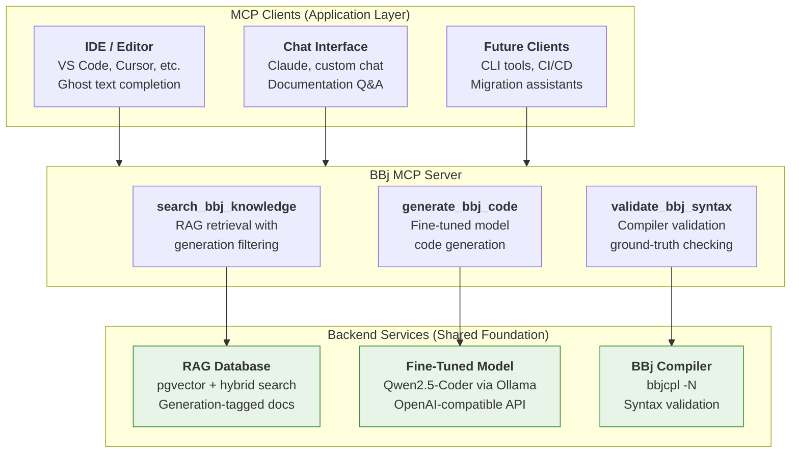
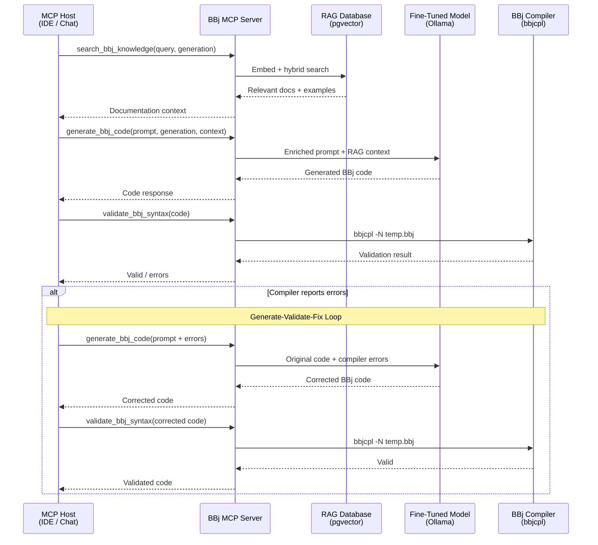

# Phase 15: Strategic Architecture - Research

**Researched:** 2026-02-01
**Domain:** Docusaurus documentation update -- weaving MCP server architecture into existing Chapter 2
**Confidence:** HIGH

## Summary

Phase 15 updates Chapter 2 ("Strategic Architecture") to make the existing "unified infrastructure" promise concrete: an MCP server with three tools (`search_bbj_knowledge`, `generate_bbj_code`, `validate_bbj_syntax`) and a generate-validate-fix loop. This is a documentation update to an existing 215-line chapter, not software development. The existing chapter's two-layer architecture (shared foundation + application layer) remains correct; MCP becomes the concrete interface boundary between those layers.

The milestone-level research (`.planning/research/`) already provides HIGH-confidence findings on the MCP specification, TypeScript SDK patterns, Docusaurus presentation stack, content architecture, and pitfalls. This phase-level research synthesizes those findings into prescriptive guidance for the planner: what exactly to change in Chapter 2, what patterns to follow, and what to avoid.

**Primary recommendation:** Update Chapter 2 by adding MCP content as new sections that extend the existing narrative. Frame MCP as the "concrete realization" of the two-layer architecture, not a replacement. Keep MCP protocol explanation to one paragraph; focus on BBj-specific tools and the generate-validate-fix loop. Match all existing conventions exactly (TL;DR, decision callouts, Mermaid diagrams, status blocks).

## Standard Stack

This phase is a documentation update, not a code project. The "stack" is the set of tools and patterns used to author and present the content.

### Core

| Tool | Version | Purpose | Why Standard |
|------|---------|---------|--------------|
| Docusaurus | 3.9.2 | Site framework (existing) | Already configured and deployed |
| Mermaid | (bundled with `@docusaurus/theme-mermaid`) | Architecture and sequence diagrams | Already configured in `docusaurus.config.ts` with `markdown: { mermaid: true }` |
| Prism | (bundled) | Syntax highlighting for TypeScript, JSON, BBj | Already configured with `additionalLanguages: ['bbj']` |

### Supporting

| Tool | Version | Purpose | When to Use |
|------|---------|---------|-------------|
| `:::tip[TL;DR]` admonition | Docusaurus built-in | Chapter opening summary | Update existing TL;DR to mention MCP, three tools, generate-validate-fix |
| `:::info[Decision: ...]` admonition | Docusaurus built-in | Architecture decision callouts | New decision: "MCP as the Unified Integration Protocol" |
| `:::note[Where Things Stand]` admonition | Docusaurus built-in | Current status block | Update to reflect v1.2 RAG shipped + v1.3 MCP architecture |
| Mermaid `graph TB` | Mermaid | Hierarchical architecture diagrams | MCP topology diagram (Host/Client/Server/backends) |
| Mermaid `sequenceDiagram` | Mermaid | Temporal flow diagrams | Generate-validate-fix loop sequence |

### Alternatives Considered

| Instead of | Could Use | Tradeoff |
|------------|-----------|----------|
| Mermaid `graph TB` | Mermaid `architecture-beta` | Requires custom icon registration, not used in existing chapters; visual inconsistency |
| TypeScript code blocks for schemas | `docusaurus-json-schema-plugin` | AGPL license, overkill for 3 tool schemas, audience reads TypeScript not JSON Schema trees |
| Docusaurus Tabs for TypeScript vs JSON-RPC | Code blocks only | Tabs add implementation detail (JSON-RPC wire format) that is out of scope for strategy docs |

**Installation:** No new dependencies. The entire phase uses the existing Docusaurus configuration. No `npm install` needed.

## Architecture Patterns

### Recommended Content Structure for Updated Chapter 2

The existing chapter has these sections (in order):
```
1. TL;DR block (:::tip)
2. Opening paragraph (links to Ch1, frames the question)
3. The Case Against Point Solutions
4. Decision: Unified Infrastructure Over Point Solutions (:::info)
5. Architecture Overview (diagram + text)
6. The Shared Foundation
   - Fine-Tuned BBj Model
   - RAG Database
   - How They Work Together (sequence diagram)
7. Three Initiatives (IDE, Chat, Future)
8. Benefits of This Approach
9. Current Status (:::note + table)
10. Closing paragraph
```

**Recommended structure after update:**
```
1. TL;DR block (:::tip) -- UPDATED to mention MCP server, three tools, generate-validate-fix
2. Opening paragraph -- UPDATED with one sentence about MCP making the architecture concrete
3. The Case Against Point Solutions -- KEEP AS-IS
4. Decision: Unified Infrastructure Over Point Solutions (:::info) -- KEEP AS-IS
5. Architecture Overview -- UPDATED diagram to show MCP topology
   - UPDATED explanatory text
6. The Shared Foundation -- KEEP (minor edits for MCP context)
   - Fine-Tuned BBj Model -- KEEP AS-IS
   - RAG Database -- KEEP AS-IS
   - How They Work Together -- KEEP existing sequence diagram, add sentence about MCP
7. The MCP Server: Concrete Integration Layer -- NEW SECTION
   - Brief MCP introduction (one paragraph, link to official docs)
   - MCP topology diagram (Host/Client/Server/backends) -- NEW
   - Three tool definitions with summarized schemas -- NEW
   - webforJ MCP precedent (one callout) -- NEW (ARCH-07)
   - Decision: MCP as the Unified Integration Protocol (:::info) -- NEW (ARCH-09)
8. Integration Patterns -- NEW SECTION
   - Generate-Validate-Fix loop (description + sequence diagram) -- NEW (ARCH-05, ARCH-08)
   - Documentation Query pattern -- NEW (ARCH-08)
   - Code Review / Migration pattern -- NEW (ARCH-08)
9. Deployment Options -- NEW SECTION (ARCH-06)
   - Local stdio (privacy, single developer)
   - Remote Streamable HTTP (team sharing)
10. Three Initiatives -- UPDATED (IDE/Chat now described as MCP clients)
11. Benefits of This Approach -- UPDATED (add MCP-specific benefits)
12. Current Status (:::note + table) -- UPDATED (ARCH-10)
13. Closing paragraph -- KEEP
```

**Key structural decision:** Add MCP as NEW SECTIONS after the existing "Shared Foundation" material, not by rewriting the existing sections. This preserves the narrative readers already know and extends it. The existing "How They Work Together" sequence diagram stays (it shows the conceptual flow that remains accurate). The new MCP section provides the concrete protocol-level detail.

### Pattern 1: TL;DR Block Convention

**What:** Every chapter opens with `:::tip[TL;DR]` containing 2-4 sentences that capture the chapter's key message. A skimming reader gets the essential concept in 30 seconds.

**Source:** All 7 existing chapters follow this pattern identically.

**Existing Ch2 TL;DR:**
```markdown
:::tip[TL;DR]
Instead of building three separate AI systems, the BBj strategy centers on unified
infrastructure: a single fine-tuned model and shared RAG pipeline that powers IDE
completion, documentation chat, and future capabilities from one source of truth.
Build it once, share it everywhere, maintain it in one place.
:::
```

**Updated TL;DR must:**
- Mention MCP server
- Mention three tools (search, generate, validate)
- Mention generate-validate-fix loop
- Keep the "unified infrastructure" framing
- Remain skimmable in 30 seconds (3-5 sentences max)

### Pattern 2: Decision Callout Convention

**What:** `:::info[Decision: Title]` with exactly four fields: **Choice**, **Rationale**, **Alternatives considered**, **Status**.

**Source:** 9 existing decision callouts across 6 chapters, all follow this format exactly.

**Template:**
```markdown
:::info[Decision: MCP as the Unified Integration Protocol]
**Choice:** {one sentence}

**Rationale:** {why, with evidence}

**Alternatives considered:** {what was rejected and why}

**Status:** {current state}
:::
```

**For ARCH-09, the decision must:**
- Title: "MCP as the Unified Integration Protocol"
- Frame as balanced comparison (not dismissive of alternatives)
- Alternatives: REST API, custom plugin system, language-specific extension API
- Explain why MCP fits BBj specifically (same lineage as LSP which Langium uses, any-client compatibility, webforJ precedent)
- Frame as evolution of the unified architecture, not replacement

### Pattern 3: Mermaid Diagram Conventions

**What:** All existing diagrams follow consistent styling:

| Convention | Pattern |
|-----------|---------|
| Layout | `graph TB` for hierarchical, `graph LR` for sequential |
| Subgraph labels | Quoted strings in ALL CAPS or Title Case |
| Node labels | HTML: `<b>Bold Title</b><br/>Line 2<br/><i>Italic detail</i>` |
| Fill colors | Green `#e8f4e8,stroke:#2d8a2d`, Blue `#e8e8f4,stroke:#2d2d8a`, Red `#f4e8e8,stroke:#8a2d2d`, Gray `#f0f0f0,stroke:#333` |
| Sequence diagrams | `participant Name as Display<br/>(detail)` |

**Source:** 11 Mermaid diagrams across 7 chapters, all using these conventions.

**For new diagrams:**
- MCP topology diagram: Use `graph TB` with subgraphs for "MCP Clients", "BBj MCP Server", "Backend Services"
- Generate-validate-fix sequence: Use `sequenceDiagram` with participants for Host, Server, Model, Compiler
- Use the same color palette -- do NOT introduce new colors
- Follow HTML node label format for consistency

### Pattern 4: Current Status Block Convention

**What:** `:::note[Where Things Stand -- {Month Year}]` with bulleted status items using bold labels (**Shipped:**, **In progress:**, **Planned:**), followed by a status table.

**Source:** All 7 chapters end with this block.

**For ARCH-10, the status block must:**
- Update date to reflect current milestone
- Update the RAG database row: "Ingestion pipeline built (v1.2). 6 source parsers, embedding pipeline, generation-aware tagging."
- Add MCP row or update architecture row: "MCP server architecture defined (v1.3). Three tools specified, generate-validate-fix loop validated by bbjcpltool proof-of-concept."
- Update the bbj-language-server version if changed
- Keep the component status table structure

### Pattern 5: Schema Presentation (Claude's Discretion)

**What:** The context decisions specify "summarized schemas in Chapter 2 (key fields, descriptions, compact format)" with full specs deferred to a future MCP server sub-project.

**Recommended approach:** Show each tool as a compact definition block with name, description, and key input parameters. Use a consistent format that is developer-readable but not overwhelming for a strategy chapter.

**Format recommendation -- compact JSON Schema style:**
```json
{
  "name": "search_bbj_knowledge",
  "description": "Search BBj documentation with generation-aware filtering",
  "inputSchema": {
    "type": "object",
    "properties": {
      "query": { "type": "string", "description": "Natural language search query" },
      "generation": { "type": "string", "enum": ["all", "character", "vpro5", "bbj-gui", "dwc"], "description": "Filter by BBj generation" },
      "limit": { "type": "integer", "default": 5, "description": "Maximum results" }
    },
    "required": ["query"]
  }
}
```

**Why JSON Schema format (not TypeScript SDK):** The strategy chapter should present schemas in the language-neutral JSON Schema format that MCP specifies, not in the TypeScript SDK's Zod format. This avoids implying a language decision (TypeScript vs Python) that is explicitly deferred. JSON Schema is what any developer -- regardless of implementation language -- would implement against. The milestone research recommends TypeScript SDK patterns, but the context decisions for THIS phase specify "compact format" suitable for a strategy chapter, and the full SDK patterns are deferred to a future sub-project.

**Show three tools in sequence:** `search_bbj_knowledge`, `generate_bbj_code`, `validate_bbj_syntax`. Each gets its schema block plus 2-3 sentences explaining what it does and which backend it connects to (RAG/Ollama/bbjcpl).

### Pattern 6: webforJ MCP Precedent (ARCH-07)

**What:** One callout referencing the webforJ MCP server as organizational precedent.

**Source:** The webforJ MCP server (https://mcp.webforj.com/) exposes three tools: `webforj-knowledge-base` (semantic search), `webforj-create-project` (scaffolding), `webforj-create-theme` (theming). It is hosted at `mcp.webforj.com` with both Streamable HTTP and SSE endpoints.

**How to use in Ch2:** Brief paragraph or `:::info` callout noting:
- BASIS already ships a webforJ MCP server, establishing organizational pattern
- webforJ needs only knowledge search (Java is well-understood by LLMs)
- BBj MCP server follows the same pattern but adds code generation and compiler validation (because LLMs do NOT understand BBj)
- This is not an experiment -- it is extending a proven organizational approach

**Keep it brief:** One paragraph or one `:::info` callout. Do not belabor. The requirement says "one callout, not belabored."

### Anti-Patterns to Avoid

- **MCP protocol tutorial:** Do NOT explain JSON-RPC, transport internals, capability negotiation. One paragraph introducing MCP with a link to the official spec. The chapter explains BBj's MCP tools, not MCP itself.
- **Technology contradictions:** All new content must reference Qwen2.5-Coder-7B (not CodeLlama), pgvector (not Qdrant), Ollama OpenAI-compatible API. These are locked decisions from Chapters 3 and 6.
- **Replacing the two-layer architecture:** The existing "shared foundation + application layer" model stays. MCP is the interface boundary WITHIN the shared foundation, not a new layer above it. PROJECT.md: "MCP is the integration layer connecting Ch3-6, not a separate initiative."
- **Full implementation code:** No TypeScript server implementation, no `registerTool()` code. Show tool schemas (JSON), not server code. Implementation belongs in a future MCP server sub-project.
- **Speculative MCP features:** Do NOT document Resources, Prompts, Sampling, or multi-agent patterns. Only the three defined Tools.
- **Over-specifying bbjcpltool:** Reference as proof-of-concept evidence (one sentence). No file paths, no hook scripts, no implementation details. Focus on the validated concept.

## Don't Hand-Roll

Problems that look simple but have existing solutions:

| Problem | Don't Build | Use Instead | Why |
|---------|-------------|-------------|-----|
| MCP architecture diagram | Custom SVG/PNG | Mermaid `graph TB` with subgraphs | Existing chapters use Mermaid exclusively; renders in both light/dark mode |
| JSON Schema rendering | Plugin or custom component | Fenced JSON code blocks | 3 schemas is too few to justify a plugin; code blocks match existing patterns |
| Schema validation display | Interactive component | Static code block with comments | Strategy docs, not API reference; keep it simple |
| Decision callout formatting | Ad-hoc markdown | `:::info[Decision: ...]` with 4-field template | 9 existing callouts follow this pattern; consistency is paramount |
| Sequence diagrams | PlantUML or D2 | Mermaid `sequenceDiagram` | Already configured; visual consistency with existing diagrams |

**Key insight:** This phase has zero new dependencies. Every presentation need is covered by existing Docusaurus configuration. Adding new tools/plugins introduces maintenance burden for a chapter update that should be purely content.

## Common Pitfalls

### Pitfall 1: The "Two Architecture" Problem
**What goes wrong:** The existing Ch2 presents a two-layer architecture (Apps -> Shared Foundation). MCP introduces an orchestration layer (Apps -> MCP Server -> Foundation). If framed as replacing the original, readers face cognitive dissonance and the chapter's core narrative breaks.
**Why it happens:** The existing diagram shows apps calling Model and RAG directly. MCP shows apps calling MCP Server which calls Model/RAG/Compiler. These ARE genuinely different flows.
**How to avoid:** Frame MCP as the concrete realization of the existing architecture. The two-layer model (shared foundation + applications) remains correct; MCP is HOW applications connect to the shared foundation. Keep the existing "How They Work Together" sequence diagram. Add MCP content as NEW SECTIONS after the existing material, not by replacing it. The MCP Server sits WITHIN the "Shared Foundation" subgraph.
**Warning signs:** If the existing sequence diagram is deleted, the framing is wrong.

### Pitfall 2: MCP Protocol Scope Creep
**What goes wrong:** The chapter becomes an MCP explainer instead of a BBj architecture chapter. Paragraphs about JSON-RPC, transport protocols, capability negotiation, and security models dilute the BBj-specific content.
**Why it happens:** MCP is technically interesting and readers may not know it. The impulse is to explain it.
**How to avoid:** One introductory paragraph on MCP with a link to the official spec. Everything else is BBj-specific: the three tools, the generate-validate-fix loop, the deployment options. Follow the QLoRA pattern from Ch3 -- 2 paragraphs of concept, then immediately into BBj application.
**Warning signs:** If MCP protocol explanation exceeds one paragraph, scope has crept.

### Pitfall 3: Technology Recommendation Contradictions
**What goes wrong:** New MCP content references CodeLlama or Qdrant (from the original strategy paper) instead of Qwen2.5-Coder-7B or pgvector (from the independently-researched published chapters).
**Why it happens:** The MCP concept was drafted from the January 2025 strategy paper, which predates the published chapters' technology selections.
**How to avoid:** All backend references must match published chapters: Qwen2.5-Coder-7B via Ollama (Ch3), pgvector (Ch6), bbjcpl compiler (Ch4). Never mention CodeLlama, Qdrant, StarCoder2, or DeepSeek as the current recommendation.
**Warning signs:** Grep new content for technology names; any mention of superseded tools is a contradiction.

### Pitfall 4: Stale Status Block
**What goes wrong:** MCP content is added but the Current Status block still says "RAG database: Schema designed" (v1.0 status) when the RAG pipeline was shipped in v1.2.
**Why it happens:** Status blocks are easy to overlook when focusing on new architecture content.
**How to avoid:** Update the status block AFTER all content changes. Cross-reference against actual project state: RAG pipeline is shipped (v1.2), fine-tuning is in progress, bbjcpltool v1 is shipped.
**Warning signs:** Any "not yet built" claim in the status block that contradicts the v1.2 milestone.

### Pitfall 5: Tool Naming Inconsistency
**What goes wrong:** Chapter 2 defines tools with one naming convention (e.g., `search_bbj_knowledge`) but the milestone research uses different names (e.g., `bbj_rag_search`). Downstream chapters (Ch4, Ch5) then reference inconsistent tool names.
**Why it happens:** Tool names evolved during research. The CONTEXT.md (user decisions) specifies `search_bbj_knowledge`, `generate_bbj_code`, `validate_bbj_syntax`. The milestone research used `bbj_rag_search`, `bbj_generate_code`, `bbj_compile_check`.
**How to avoid:** Use EXACTLY the names from the CONTEXT.md / success criteria: `search_bbj_knowledge`, `generate_bbj_code`, `validate_bbj_syntax`. These are the canonical names. All other chapters will reference these.
**Warning signs:** Any tool name in new content that does not match the three canonical names.

### Pitfall 6: Diagram Style Mismatch
**What goes wrong:** New MCP diagrams use different colors, node shapes, or layout directions than the 11 existing diagrams.
**Why it happens:** No documented diagram style guide; conventions are implicit.
**How to avoid:** Use the extracted style conventions: `graph TB` for hierarchical, HTML node labels with `<b>`/`<br/>`, fill colors from the established palette (`#e8f4e8`, `#e8e8f4`, `#f4e8e8`, `#f0f0f0`). When updating Ch2's architecture diagram, extend the existing structure rather than replacing it wholesale.
**Warning signs:** Visual comparison against existing diagrams shows inconsistent styling.

## Code Examples

### Example 1: Updated Architecture Diagram (MCP Topology)

This replaces or extends the existing Ch2 architecture diagram. Follows established `graph TB` pattern with subgraphs and HTML node labels.



### Example 2: Generate-Validate-Fix Sequence Diagram

Shows the compiler feedback cycle as described in ARCH-05. Follows established `sequenceDiagram` pattern.



### Example 3: Tool Schema (Compact JSON Schema Format)

Shows the summarized schema format for Chapter 2. One example for the planner to reference when creating all three.

```json
{
  "name": "search_bbj_knowledge",
  "description": "Search BBj documentation and code examples with generation-aware filtering. Returns ranked results from the RAG pipeline with source citations.",
  "inputSchema": {
    "type": "object",
    "properties": {
      "query": {
        "type": "string",
        "description": "Natural language search query"
      },
      "generation": {
        "type": "string",
        "enum": ["all", "character", "vpro5", "bbj-gui", "dwc"],
        "description": "Filter results by BBj generation. Omit for cross-generation search."
      },
      "limit": {
        "type": "integer",
        "default": 5,
        "description": "Maximum number of results to return"
      }
    },
    "required": ["query"]
  }
}
```

### Example 4: Decision Callout (follows established template)

```markdown
:::info[Decision: MCP as the Unified Integration Protocol]
**Choice:** Expose all BBj AI capabilities (RAG search, code generation, compiler
validation) through a single MCP server that any MCP-compatible client can consume.

**Rationale:** MCP provides a standard protocol for connecting AI applications to
external tools. Rather than building custom APIs for each consumer (IDE, chat, CLI),
a single MCP server exposes three tools that any MCP-enabled host -- Claude, VS Code
Copilot, Cursor, or custom applications -- can use without custom integration code.
This follows the same pattern as the webforJ MCP server already in production.

**Alternatives considered:** REST API (requires custom client code in each consumer;
no standard tool discovery), custom VS Code extension API (locks integration to one
editor), language-specific plugin system (fragments the ecosystem; each editor needs
its own plugin).

**Status:** Architecture defined. Three tool schemas specified. Generate-validate-fix
loop validated by bbjcpltool proof-of-concept. MCP server implementation planned.
:::
```

## State of the Art

| Old Approach | Current Approach | When Changed | Impact |
|--------------|------------------|--------------|--------|
| Direct Ollama API calls from each consumer app | MCP server mediates all tool access | MCP donated to Linux Foundation AAIF, Dec 2025 | Any MCP-compatible client can use BBj tools without custom code |
| LLM output accepted as-is | Generate-validate-fix loop with compiler feedback | Validated by bbjcpltool v1 (Jan 2026) | Ground-truth syntax validation eliminates hallucinated BBj code |
| Abstract "standard APIs" in Ch2 | Concrete MCP tool definitions with JSON schemas | v1.3 milestone | Chapter 2 delivers on its "unified infrastructure" promise |
| HTTP+SSE transport for remote MCP | Streamable HTTP transport | MCP spec 2025-11-25 | Simpler, more reliable remote MCP server deployment |

**Deprecated/outdated:**
- The milestone research references `bbj_rag_search`, `bbj_generate_code`, `bbj_compile_check` as tool names. The CONTEXT.md / success criteria settled on `search_bbj_knowledge`, `generate_bbj_code`, `validate_bbj_syntax`. Use the latter.
- MCP spec version `2025-06-18` is superseded by `2025-11-25`. Cite `2025-11-25` as current.

## Open Questions

1. **Chapter 2 section structure (Claude's Discretion)**
   - What we know: The context says "Claude's discretion on whether to add a new section or expand existing sections." The milestone research recommends new sections after existing content.
   - What's unclear: Exactly where to place the MCP topology diagram -- as an update to the existing "Architecture Overview" diagram or as a new diagram in a new section.
   - Recommendation: Add a NEW major section ("The MCP Server: Concrete Integration Layer") after the existing "The Shared Foundation" section. Keep the existing Architecture Overview diagram (it shows the conceptual two-layer model), and add the MCP topology diagram in the new section. This preserves both the conceptual and concrete views. The planner can adjust based on flow.

2. **TL;DR framing (Claude's Discretion)**
   - What we know: Must mention MCP server, three tools, generate-validate-fix loop, and be skimmable in 30 seconds.
   - What's unclear: How much of the existing TL;DR to preserve vs rewrite.
   - Recommendation: Rewrite entirely but keep the "unified infrastructure" framing from the original. The existing TL;DR does not mention MCP; it cannot be merely extended. The new TL;DR should open with the architectural concept (unified infrastructure) and immediately introduce the concrete mechanism (MCP server with three tools and the generate-validate-fix loop).

3. **Existing "How They Work Together" sequence diagram**
   - What we know: The existing diagram shows App -> RAG -> Model -> App flow. This is still conceptually valid.
   - What's unclear: Whether to keep it alongside the new MCP sequence diagram or update it.
   - Recommendation: Keep it with a brief note that this shows the conceptual flow. The MCP-mediated sequence diagram in the new section shows how this flow is realized through the protocol. Both views serve different levels of understanding.

4. **Annotation level on diagrams (Claude's Discretion)**
   - What we know: Existing diagrams use `<b>`, `<br/>`, and `<i>` in node labels.
   - Recommendation: Follow the same level of annotation. Each node gets a bold title and 1-2 description lines. Do not add more detail than existing diagrams show.

## Sources

### Primary (HIGH confidence)
- Existing Chapter 2 content: `/Users/beff/_workspace/bbj-ai-strategy/docs/02-strategic-architecture/index.md` (215 lines, read in full)
- Existing Chapters 1, 3-6 content: All read in full for pattern extraction (TL;DR, decision callouts, Mermaid styles, status blocks)
- `.planning/research/ARCHITECTURE.md` -- Per-chapter content assessment, MCP architecture patterns, conflict analysis
- `.planning/research/STACK.md` -- MCP SDK versions, Docusaurus configuration, diagram types, code example patterns
- `.planning/research/FEATURES.md` -- Content elements by chapter, differentiators, anti-features, per-chapter recommendations
- `.planning/research/PITFALLS.md` -- 14 documented pitfalls with prevention strategies
- `.planning/research/SUMMARY.md` -- Executive summary with phase ordering and confidence assessment
- `.planning/REQUIREMENTS.md` -- ARCH-01 through ARCH-10 requirement definitions
- `docusaurus.config.ts` -- Verified Mermaid, Prism (BBj), search, and theme configuration
- MCP Specification 2025-11-25: https://modelcontextprotocol.io/specification/2025-11-25
- webforJ MCP documentation: https://docs.webforj.com/docs/introduction/mcp (tools: webforj-knowledge-base, webforj-create-project, webforj-create-theme; hosted at mcp.webforj.com)

### Secondary (MEDIUM confidence)
- MCP TypeScript SDK v1.25.2: https://www.npmjs.com/package/@modelcontextprotocol/sdk (registerTool patterns, Zod schemas)
- MCP Architecture Overview: https://modelcontextprotocol.io/docs/learn/architecture (Host/Client/Server model)
- MCP Best Practices: https://modelcontextprotocol.info/docs/best-practices/ (tool naming, single responsibility)
- MCP Tool Schema Guide: https://www.merge.dev/blog/mcp-tool-schema (schema best practices, flat structures)

### Tertiary (LOW confidence)
- MCP SDK v2 timeline (anticipated Q1 2026) -- npm README, not confirmed

## Metadata

**Confidence breakdown:**
- Standard stack: HIGH -- Docusaurus configuration verified from source; no new dependencies
- Architecture: HIGH -- Chapter structure analyzed from all 7 published chapters; MCP patterns verified from official spec and SDK docs
- Pitfalls: HIGH -- All pitfalls derived from verified project history (v1.0/v1.1/v1.2 milestones) and direct chapter analysis

**Research date:** 2026-02-01
**Valid until:** 2026-04-01 (MCP ecosystem evolving; protocol version and SDK versions should be re-verified before implementation begins)
