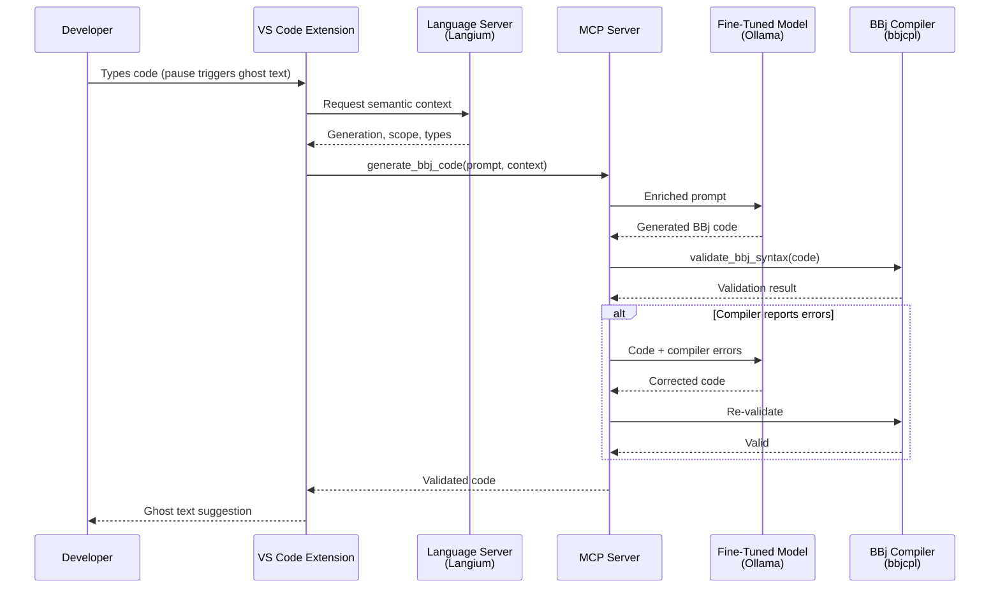

<objective>
Add the new "Compiler Validation: Ground-Truth Syntax Checking" section to Chapter 4, including bbjcpl concept, illustrative error example, bbjcpltool proof-of-concept subsection, MCP integration note, IDE completion pipeline sequence diagram, and the decision callout.

Purpose: This is the core new content for Phase 16. It establishes the compiler validation narrative in the IDE chapter — the missing piece between "the LLM generates code" and "the developer sees ghost text." All six IDE requirements are addressed in this section.

Output: Chapter 4 updated with a complete new section inserted after "Generation-Aware Completion" and before "LSP 3.18." The file is left in a valid state with all existing sections preserved. TL;DR and Current Status updates are handled in Plan 02.
</objective>

<execution_context>
@/Users/beff/.claude/get-shit-done/workflows/execute-plan.md
@/Users/beff/.claude/get-shit-done/templates/summary.md
</execution_context>

<context>
@.planning/PROJECT.md
@.planning/ROADMAP.md
@.planning/STATE.md
@.planning/REQUIREMENTS.md
@.planning/phases/16-compiler-validation/16-CONTEXT.md
@.planning/phases/16-compiler-validation/16-RESEARCH.md
@docs/04-ide-integration/index.md
@docs/02-strategic-architecture/index.md
</context>

<tasks>

<task type="auto">
  <name>Task 1: Add "Compiler Validation: Ground-Truth Syntax Checking" section with bbjcpl concept, error example, and proof-of-concept</name>
  <files>docs/04-ide-integration/index.md</files>
  <action>
Insert a new major section AFTER the "Generation-Aware Completion" section (which ends at line 296 with the text about "pick the most likely next action given full context") and BEFORE "## LSP 3.18: Server-Side Inline Completion" (line 298). This new section covers IDE-01, IDE-02, and IDE-03.

**Section structure:**

```
## Compiler Validation: Ground-Truth Syntax Checking
```

**1a. Introduction (2-3 paragraphs, IDE-01):**

Opening paragraph: Frame the problem — the fine-tuned model described above generates BBj code that is usually correct, but not always. Even a model trained on BBj-specific data can hallucinate syntax, particularly BBj's distinctive variable suffixes (`!`, `$`, `#`) and generation-specific APIs. The question is: how do you catch these errors before the developer sees them?

Second paragraph: Introduce bbjcpl — the BBj compiler (`bbjcpl`) provides a ground-truth answer. Unlike pattern matching or heuristic analysis, the compiler performs full syntax validation: the code either compiles or it does not. By running every AI-generated snippet through `bbjcpl` before presenting it as ghost text, the system eliminates an entire class of hallucination errors at the source.

Brief mention of the `-N` flag (syntax-only mode, no execution) in one sentence. Do NOT create a flag reference table. Do NOT explain other compiler flags in detail.

Third paragraph: Describe the generate-validate-fix loop concept at the Chapter 4 level — the LLM generates code, the compiler validates it, and if errors are found, the LLM receives the compiler's error messages and corrects the code. This loop runs automatically, invisible to the developer. Reference Chapter 2's architectural description: "The generate-validate-fix loop described in [Chapter 2](/docs/strategic-architecture#generate-validate-fix) defines this pattern at the architecture level; here we examine how it applies specifically to IDE completion."

**1b. Illustrative example (IDE-01 error format):**

Present the example INLINE (no separate subsection). Use the example from 16-RESEARCH.md "Example 1" as the basis. Show three code blocks:

First, a brief lead-in sentence: "Consider what happens when an LLM generates the following BBj code:"

Hallucinated code block (use ```bbj language tag):
```bbj
rem Create a window and add a button
sysgui! = BBjAPI().openSysGui("X0")
window = sysgui!.addWindow(100, 100, 400, 300, "My App")
button = window.addButton(101, 10, 250, 100, 25, "Click Me")
```

One paragraph explaining the error: The LLM assigned object return values to plain numeric variables (`window` and `button` instead of `window!` and `button!`). This is a hallucination pattern where the model confuses BBj with a BASIC variant that does not use type suffixes. It also called `addButton` on a plain variable instead of an object reference.

Compiler output block (use ```text or plain code block):
```
temp.bbj: error at line 3 (3): window = sysgui!.addWindow(100, 100, 400, 300, "My App")
```

One sentence: The compiler catches this because assigning an object return value to a plain numeric variable is a type violation. The LLM receives this error and produces corrected code:

Corrected code block (use ```bbj):
```bbj
rem Create a window and add a button
sysgui! = BBjAPI().openSysGui("X0")
window! = sysgui!.addWindow(100, 100, 400, 300, "My App")
button! = window!.addButton(101, 10, 250, 100, 25, "Click Me")
```

One closing sentence noting: This is a single illustrative example, but the pattern applies to any syntax error the compiler can detect — the model learns from the compiler's feedback in real time.

**1c. MCP Integration Note (IDE-03):**

After the illustrative example, add a paragraph (NOT a callout box, just prose):

The compiler validation capability is not limited to the custom VS Code extension. Because it is exposed as the `validate_bbj_syntax` MCP tool (defined in [Chapter 2](/docs/strategic-architecture#validate_bbj_syntax)), any MCP-compatible host — Claude, Cursor, VS Code, or custom applications — can validate BBj syntax against the compiler. The custom extension provides the richest integration (Langium semantic context enriches the generation step), but the MCP server makes compiler validation accessible to any AI-powered development tool without custom code.

**1d. bbjcpltool: Proof of Concept subsection (IDE-02):**

```
### bbjcpltool: Proof of Concept
```

2-3 paragraphs with a measured, factual tone — "we built it, tested it, here's what we learned."

Paragraph 1: Describe WHAT was built at the concept level. "To validate the compiler-in-the-loop concept, a proof-of-concept tool (bbjcpltool v1) was developed that automatically invokes the BBj compiler after every AI-generated code change. When the compiler detects syntax errors, the error messages are surfaced to the AI assistant, which then corrects the code before the developer sees the result."

Paragraph 2: Describe WHAT was learned. The proof-of-concept demonstrated three key findings: (1) the BBj compiler reliably catches syntax errors that the LLM produces, including the variable suffix hallucinations described above; (2) LLMs can interpret bbjcpl error messages and self-correct without human intervention; (3) the correction cycle adds minimal latency — a single validation-and-fix pass typically resolves the error.

Paragraph 3: Frame the significance. "The bbjcpltool v1 transforms compiler validation from a theoretical architecture pattern into a demonstrated capability. The generate-validate-fix loop works in practice, not just on paper."

**CRITICAL anti-patterns:**
- Do NOT mention PostToolUse, hooks, bash scripts, settings.json, stderr, exit codes, ~/.claude/, or any file paths
- Do NOT include specific metrics (no "caught N errors across M completions") — describe qualitatively
- Do NOT contrast with other language ecosystems (no Rust, TypeScript, Go comparisons)
- Do NOT frame compiler validation as a "third layer" — it is a quality gate on the LLM layer, the two-layer model (popup + ghost text) remains correct
- Technology references must match published chapters: Qwen2.5-Coder-7B via Ollama, pgvector, bbjcpl
  </action>
  <verify>
Run `cd /Users/beff/_workspace/bbj-ai-strategy && npx docusaurus build 2>&1 | tail -20` — build must complete without errors. Verify:
1. `grep "## Compiler Validation: Ground-Truth Syntax Checking" docs/04-ide-integration/index.md` — found
2. `grep "### bbjcpltool: Proof of Concept" docs/04-ide-integration/index.md` — found
3. `grep "validate_bbj_syntax" docs/04-ide-integration/index.md` — found (MCP note)
4. `grep "window! = sysgui!" docs/04-ide-integration/index.md` — found (corrected code example)
5. `grep "temp.bbj: error at line" docs/04-ide-integration/index.md` — found (compiler output)
6. Section appears AFTER "Generation-Aware Completion" and BEFORE "LSP 3.18"
7. No mentions of PostToolUse, hooks, bash, settings.json, stderr, exit code, ~/.claude/
  </verify>
  <done>New "Compiler Validation: Ground-Truth Syntax Checking" section exists with: bbjcpl introduction and generate-validate-fix concept, one illustrative hallucination example (missing ! suffix) with compiler error and corrected code, MCP integration note referencing validate_bbj_syntax tool, and "bbjcpltool: Proof of Concept" subsection documenting findings without implementation details. Section is placed after "Generation-Aware Completion" and before "LSP 3.18".</done>
</task>

<task type="auto">
  <name>Task 2: Add IDE completion pipeline sequence diagram and decision callout</name>
  <files>docs/04-ide-integration/index.md</files>
  <action>
Add the architecture diagram (IDE-04) and decision callout (IDE-05) within the new Compiler Validation section created by Task 1. Insert the diagram AFTER the "bbjcpltool: Proof of Concept" subsection and BEFORE the decision callout. The decision callout is the last element in the Compiler Validation section, immediately before "## LSP 3.18".

**2a. IDE Completion Pipeline Diagram (IDE-04):**

Add a brief lead-in sentence: "The following diagram shows the complete IDE completion pipeline, including the compiler validation step between code generation and ghost text presentation:"

Use a **sequence diagram** (Mermaid `sequenceDiagram`) showing the IDE-specific completion flow with the error/retry path. This complements Chapter 4's existing `graph TD` (which shows static architecture) with a temporal view of the completion request lifecycle.

Use the diagram from 16-RESEARCH.md "Example 2, Option B" as the starting point:



After the diagram, add one sentence: "The `alt` block shows the generate-validate-fix cycle — the same pattern described in [Chapter 2](/docs/strategic-architecture#generate-validate-fix), viewed from the IDE completion perspective."

**2b. Decision Callout (IDE-05):**

Add the decision callout using the established four-field format. Use the example from 16-RESEARCH.md "Example 3" as the starting point:

```markdown
:::info[Decision: Compiler Validation via bbjcpl]
**Choice:** Use the BBj compiler (`bbjcpl`) as a ground-truth validation step in the code generation pipeline, verifying every AI-generated BBj snippet before it reaches the developer.

**Rationale:** A fine-tuned model hallucinates less than a generic LLM, but it still produces syntax errors — particularly with BBj's distinctive variable suffixes (`!`, `$`, `#`) and generation-specific APIs. The compiler provides a binary, authoritative answer: the code either compiles or it does not. This eliminates an entire class of errors that statistical confidence alone cannot catch.

**Alternatives considered:** Language server / static analysis (catches patterns and known symbols, but does not validate full syntax — BBj does not have a standalone linter, and the language server is the closest alternative, which is already used for deterministic completions); LLM self-check (the model that hallucinated the error cannot reliably detect its own mistakes — this is asking the source of the problem to be the solution).

**Status:** Concept validated. bbjcpltool v1 proof-of-concept demonstrates compiler-in-the-loop validation in a working development environment. Integration as the `validate_bbj_syntax` MCP tool is planned.
:::
```

The decision callout MUST:
- Mention both alternatives as specified in CONTEXT.md decisions:
  1. Language server / static analysis — rejected (catches patterns, not ground-truth syntax; BBj doesn't have a standalone linter)
  2. LLM self-check — rejected (the LLM that hallucinated can't reliably catch its own errors)
- Frame as ground-truth validation, not heuristic
- Have all four fields: Choice, Rationale, Alternatives considered, Status

**Anti-patterns to avoid:**
- Do NOT duplicate Chapter 2's generate-validate-fix sequence diagram — this diagram is IDE-specific (shows Developer, Extension, Language Server participants that Ch2 does not have)
- Do NOT frame compiler validation as a "third layer" or "third completion mechanism"
- The diagram must show the error/retry path (the `alt` block) — this is the whole point per CONTEXT.md decisions
  </action>
  <verify>
Run `cd /Users/beff/_workspace/bbj-ai-strategy && npx docusaurus build 2>&1 | tail -20` — build succeeds.
Verify:
1. `grep "sequenceDiagram" docs/04-ide-integration/index.md` — found (new diagram)
2. `grep "participant Dev as Developer" docs/04-ide-integration/index.md` — found
3. `grep "alt Compiler reports errors" docs/04-ide-integration/index.md` — found (error/retry path)
4. `grep "Decision: Compiler Validation via bbjcpl" docs/04-ide-integration/index.md` — found
5. `grep "Alternatives considered:" docs/04-ide-integration/index.md` — found in the new decision callout
6. `grep -c ":::info\[Decision:" docs/04-ide-integration/index.md` — appears exactly 4 times (3 existing + 1 new)
7. Diagram appears within the Compiler Validation section, before the decision callout
  </verify>
  <done>IDE completion pipeline sequence diagram shows 6 participants (Developer, Extension, Language Server, MCP Server, LLM, Compiler) with the error/retry `alt` block visible. Decision callout "Compiler Validation via bbjcpl" has all four fields and mentions both rejected alternatives (language server/static analysis, LLM self-check). Both elements are within the Compiler Validation section, before "LSP 3.18".</done>
</task>

</tasks>

<verification>
After both tasks complete:
1. IDE-01: New "Compiler Validation" section explains bbjcpl concept, error format (illustrative example), and generate-validate-fix loop
2. IDE-02: "bbjcpltool: Proof of Concept" subsection documents concept validated without implementation details
3. IDE-03: MCP integration note explains validate_bbj_syntax availability to any MCP-compatible host
4. IDE-04: Sequence diagram shows compiler validation in the IDE completion pipeline with error/retry path
5. IDE-05: Decision callout has all four fields and frames compiler validation as ground-truth
6. New section is placed after "Generation-Aware Completion" and before "LSP 3.18" — preserving the pipeline flow
7. Existing chapter sections (Two-Layer decision, Ghost Text, Copilot Bridge, Alternative Architectures, etc.) are preserved unchanged
8. No implementation details exposed (no PostToolUse, hooks, bash, paths)
9. No technology contradictions (Qwen2.5-Coder-7B, Ollama, pgvector, bbjcpl only)
10. `npx docusaurus build` completes with zero errors
</verification>

<success_criteria>
- IDE-01 satisfied: Compiler Validation section with bbjcpl concept, error format, generate-validate-fix loop
- IDE-02 satisfied: bbjcpltool proof-of-concept subsection (concept level, no implementation details)
- IDE-03 satisfied: MCP integration note referencing validate_bbj_syntax
- IDE-04 satisfied: Sequence diagram with 6 participants and error/retry path
- IDE-05 satisfied: Decision callout with all four fields, two rejected alternatives
- Chapter narrative flows naturally: generation -> validation -> presentation
- Docusaurus build passes
</success_criteria>

<output>
After completion, create `.planning/phases/16-compiler-validation/16-01-SUMMARY.md`
</output>
