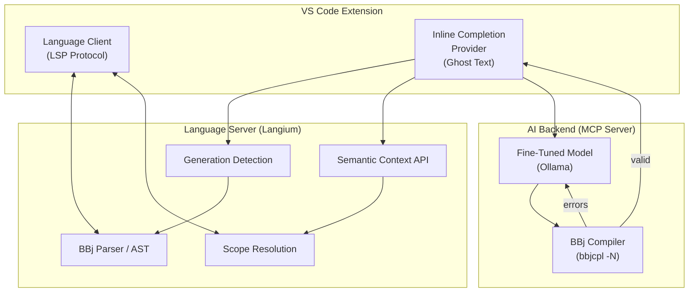
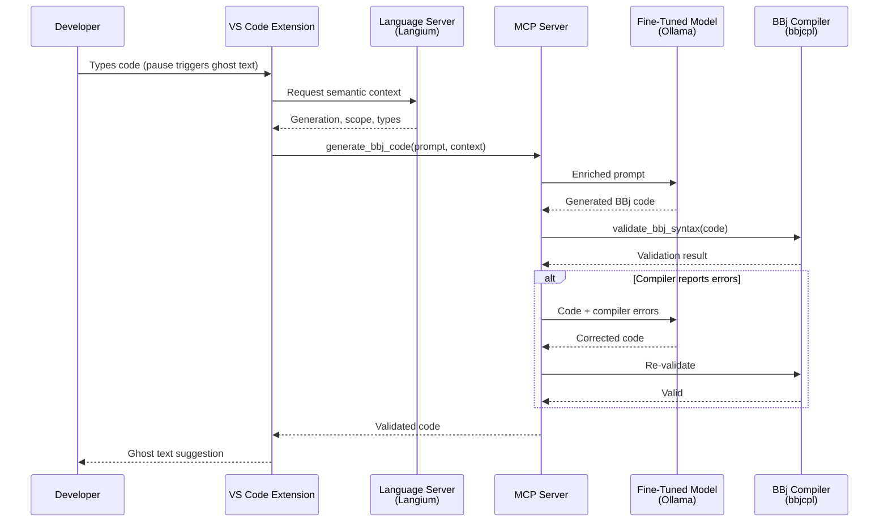

# Phase 16: Compiler Validation - Research

**Researched:** 2026-02-01
**Domain:** Docusaurus documentation update -- adding compiler validation section and bbjcpltool proof-of-concept to Chapter 4 (IDE Integration)
**Confidence:** HIGH

## Summary

Phase 16 updates Chapter 4 ("IDE Integration") to explain how BBj's compiler (`bbjcpl`) provides ground-truth syntax validation in the IDE completion pipeline. This is a documentation update to an existing 431-line chapter, not software development. The chapter currently covers two-layer completion (Langium + LLM), ghost text architecture, generation-aware completion, LSP 3.18, and the Copilot bridge. Compiler validation fills the missing piece: what happens between "the LLM generates code" and "the developer sees ghost text."

The bbjcpltool v1 proof-of-concept (shipped January 2026) validates the compiler-in-the-loop concept in a real development environment. The project documentation at `/Users/beff/bbjcpltool/.planning/PROJECT.md` provides concrete evidence: a PostToolUse hook runs `bbjcpl -N` on every `.bbj` file Claude writes or edits, errors are surfaced via stderr (since bbjcpl always exits 0), and Claude self-corrects. This transforms the compiler validation narrative from "we plan to" into "we have demonstrated."

Phase 15 already added the generate-validate-fix sequence diagram and `validate_bbj_syntax` tool definition to Chapter 2. Phase 16's job is to tell the Chapter 4 story: the compiler is the authoritative source for syntax validity, not pattern matching, not the LLM guessing, and not heuristic analysis. The bbjcpltool proves this works today.

**Primary recommendation:** Add a substantial new "Compiler Validation" section to Chapter 4 after the existing "Generation-Aware Completion" material and before the "LSP 3.18" section. The section explains the bbjcpl concept, shows one illustrative error example, documents the bbjcpltool proof-of-concept at a measured level of detail, and includes a decision callout positioning compiler validation as ground-truth (not heuristic). Update the architecture diagram to show the compiler step. Update the status block to reflect bbjcpltool v1 shipped.

## Standard Stack

This phase is a documentation update, not a code project. The "stack" is the set of tools and patterns used to author and present the content.

### Core

| Tool | Version | Purpose | Why Standard |
|------|---------|---------|--------------|
| Docusaurus | 3.9.2 | Site framework (existing) | Already configured and deployed |
| Mermaid | (bundled with `@docusaurus/theme-mermaid`) | Architecture and sequence diagrams | Already configured in `docusaurus.config.ts` with `markdown: { mermaid: true }` |
| Prism | (bundled) | Syntax highlighting for TypeScript, JSON, BBj | Already configured with `additionalLanguages: ['bbj']` |

### Supporting

| Tool | Version | Purpose | When to Use |
|------|---------|---------|-------------|
| `:::info[Decision: ...]` admonition | Docusaurus built-in | Decision callout for compiler validation | IDE-05: "Decision: Compiler Validation via bbjcpl" |
| `:::note[Where Things Stand]` admonition | Docusaurus built-in | Current status block | IDE-06: Update to reflect bbjcpltool v1 shipped |
| Mermaid `graph TD` | Mermaid | Architecture diagrams | IDE-04: Updated pipeline diagram showing compiler step |

### Alternatives Considered

| Instead of | Could Use | Tradeoff |
|------------|-----------|----------|
| Mermaid `graph TD` for updated diagram | Mermaid `sequenceDiagram` | Ch2 already has the full generate-validate-fix sequence diagram (Phase 15); Ch4 should show the IDE pipeline view, not duplicate the sequence |
| Detailed bbjcpl flag reference table | Inline prose mentions | A detailed flag table shifts the tone from strategy to implementation manual; one sentence about `-N` and a brief mention of `-t`/`-W` is sufficient |
| Full compiler output parsing code | Redacted narrative | Phase context explicitly says "no file paths, no hook scripts"; show the concept, not the implementation |

**Installation:** No new dependencies. The entire phase uses the existing Docusaurus configuration. No `npm install` needed.

## Architecture Patterns

### Recommended Content Structure for Updated Chapter 4

The existing chapter has these sections (in order):
```
1. TL;DR block (:::tip)
2. Opening paragraphs (links to Ch3, frames IDE question)
3. The Foundation: bbj-language-server
   - Why Langium Matters
4. Two Completion Mechanisms
   - Ghost Text Architecture (with Mermaid diagram)
5. Generation-Aware Completion
   - Semantic Context for Prompts
   - Enriched Prompt Example
6. LSP 3.18: Server-Side Inline Completion
7. The Copilot Bridge
   - What BYOK Offers
   - What BYOK Does Not Offer
8. Alternative Architectures
   - Continue.dev
   - Langium AI
9. Current Status (:::note)
10. What Comes Next
```

**Recommended structure after update:**
```
1. TL;DR block (:::tip) -- UPDATED to mention compiler validation and generate-validate-fix
2. Opening paragraphs -- UPDATED with one sentence about compiler validation completing the picture
3. The Foundation: bbj-language-server -- KEEP AS-IS
   - Why Langium Matters -- KEEP AS-IS
4. Two Completion Mechanisms -- KEEP AS-IS
   - Ghost Text Architecture (with Mermaid diagram) -- KEEP AS-IS
5. Generation-Aware Completion -- KEEP AS-IS
   - Semantic Context for Prompts -- KEEP AS-IS
   - Enriched Prompt Example -- KEEP AS-IS
6. Compiler Validation: Ground-Truth Syntax Checking -- NEW SECTION (IDE-01)
   - Brief bbjcpl introduction (what it is, why it matters)
   - Error format with one illustrative example (hallucinated code + compiler error)
   - The generate-validate-fix loop (reference Ch2's sequence diagram, don't duplicate)
   - MCP integration note (IDE-03): BBj tools work in any MCP-enabled host
   - bbjcpltool: Proof of Concept -- NEW SUBSECTION (IDE-02)
   - Decision callout: "Decision: Compiler Validation via bbjcpl" -- NEW (IDE-05)
7. Updated Architecture Diagram -- UPDATED (IDE-04)
   - Shows compiler validation step in the completion pipeline
8. LSP 3.18: Server-Side Inline Completion -- KEEP AS-IS
9. The Copilot Bridge -- KEEP AS-IS
10. Alternative Architectures -- KEEP AS-IS
11. Current Status (:::note) -- UPDATED (IDE-06)
12. What Comes Next -- KEEP AS-IS (or minor edit)
```

**Key structural decision:** Add compiler validation as a NEW SECTION between "Generation-Aware Completion" and "LSP 3.18." This placement follows the natural pipeline flow: the LLM generates code (sections 4-5), the compiler validates it (new section 6), and then the validated code is presented as ghost text. LSP 3.18 and Copilot remain after because they are alternative delivery mechanisms, not pipeline steps.

### Pattern 1: Decision Callout Convention

**What:** `:::info[Decision: Title]` with exactly four fields: **Choice**, **Rationale**, **Alternatives considered**, **Status**.

**Source:** 15 existing decision callouts across 7 chapters, all follow this format exactly. Chapter 4 already has 3 decision callouts.

**Template for IDE-05:**
```markdown
:::info[Decision: Compiler Validation via bbjcpl]
**Choice:** {one sentence}

**Rationale:** {why ground-truth beats heuristics}

**Alternatives considered:** {language server / static analysis -- rejected; LLM self-check -- rejected}

**Status:** {bbjcpltool v1 validates the concept}
:::
```

**Requirements from CONTEXT.md decisions:**
- Must mention two specific alternatives:
  1. Language server / static analysis -- rejected because it catches patterns, not ground-truth syntax
  2. LLM self-check -- rejected because the LLM that hallucinated cannot reliably catch its own errors
- Must note: BBj does not have a traditional linter; the language server is the closest alternative
- Frame as ground-truth validation, not heuristic

### Pattern 2: bbjcpltool Proof-of-Concept Documentation

**What:** A measured, factual subsection documenting what was validated and what it proved.

**Constraints from CONTEXT.md:**
- Validation report tone: factual, measured -- "we built it, tested it, here's what we learned"
- Include one illustrative example: hallucinated BBj code + compiler error output
- Light metrics if available (e.g., "caught N errors across M completions") -- but don't invent precision
- NO file paths, NO hook scripts (per success criteria)
- Redaction boundaries beyond these rules are Claude's discretion

**Recommended approach:**
- 2-3 paragraphs describing WHAT was validated (compiler-in-the-loop concept, automatic error detection, self-correction cycle)
- One concrete example block showing: (a) hallucinated code, (b) compiler error, (c) the fix
- Summary of what the proof-of-concept proved
- Keep implementation details vague: "a development tool that automatically invokes the compiler" -- no mention of PostToolUse, hooks, bash scripts, or specific paths

**What we know about bbjcpl error format (from PROJECT.md and official docs):**
- Errors written to stderr
- Format: `filename: error at line NN (N): <source line>`
- Contains both BBj line number and ASCII file line number
- Exit code is always 0 regardless of errors (must parse stderr)
- Catches: syntax errors, type checking violations (with `-t`), duplicate labels, duplicate DEF FN names, undeclared variables (with `-t -W`)

### Pattern 3: Architecture Diagram (Claude's Discretion)

**Context decisions:** "Detailed diagram with 5-6 participants (IDE, Extension, MCP Client, MCP Server, LLM, Compiler)" and "Must show the error/retry path."

**Two discretion areas:**
1. **Diagram format:** Sequence diagram vs flowchart
2. **Diagram scope:** Zoom into validation step vs IDE pipeline view

**Recommendation: Sequence diagram showing the IDE completion pipeline with compiler validation.**

Rationale:
- Chapter 2 already has a `graph TB` topology diagram and a `sequenceDiagram` for the full generate-validate-fix flow
- Chapter 4's existing diagram (line 144) is a `graph TD` showing VS Code Extension -> Language Server -> AI Backend
- A sequence diagram showing the completion request flow (IDE -> Extension -> MCP Client -> MCP Server -> LLM -> Compiler -> back) with the error/retry path would complement both existing diagrams
- The sequence diagram format naturally shows the temporal generate-validate-fix cycle
- The relationship to Chapter 2's diagram: this is the IDE-specific view of the same pattern, showing where Langium, the MCP client, and the compiler fit in the IDE pipeline specifically

**Alternatively:** A flowchart (`graph TD`) showing the pipeline stages would be simpler and could be a zoom-in on the ghost text lifecycle. The context says "Relationship to Chapter 2's diagram is Claude's discretion."

**Style conventions (from Phase 15 research):**
- Use `graph TD` or `sequenceDiagram` (match existing chapter patterns)
- HTML node labels: `<b>Bold Title</b><br/>Description`
- Fill colors: Green `#e8f4e8,stroke:#2d8a2d`, Blue `#e8e8f4,stroke:#2d2d8a`, Red `#f4e8e8,stroke:#8a2d2d`, Gray `#f0f0f0,stroke:#333`
- Sequence diagram participants: `participant Name as Display<br/>(detail)`

### Pattern 4: Current Status Block Convention

**What:** `:::note[Where Things Stand -- {Month Year}]` with bulleted status items using bold labels, followed by a status table if present.

**Source:** All 7 chapters use this pattern. Chapter 4's current status block is at line 412.

**For IDE-06, the status block must:**
- Update the month/year to February 2026
- Add bbjcpltool v1 shipped as a **Shipped** item
- Add compiler-in-the-loop validated
- Keep all existing shipped/in-progress/planned items
- Adjust the "Planned" items to reflect that compiler validation is now validated (not just planned)

### Pattern 5: Illustrative Error Example

**Requirements from CONTEXT.md:** "Include one illustrative example showing hallucinated BBj code alongside the compiler error output -- makes validation tangible."

**Recommended approach:** Show a plausible LLM hallucination that a BBj developer would recognize as wrong, the compiler's error output, and briefly note that the corrected version compiles cleanly.

**Example structure:**
```
Hallucinated code (what an LLM might produce):
  [BBj code with a plausible error -- e.g., wrong syntax, missing suffix, incorrect API]

Compiler output:
  [bbjcpl error message in its actual format]

Corrected code:
  [Fixed version that compiles cleanly]
```

The error format from official docs: `filename: error at line NN (N): <source line>`

**Important:** The example should be realistic but simple. A common LLM hallucination pattern for BBj would be:
- Forgetting the `!` suffix on an object reference (assigning object to plain variable)
- Using a method that does not exist on the class
- Incorrect syntax for callbacks or event handling

### Pattern 6: MCP Integration Note (IDE-03)

**What:** A brief note (1-2 paragraphs or an inline callout) explaining that BBj tools work in any MCP-enabled host, not just the custom VS Code extension.

**Where:** Within the new Compiler Validation section, after describing the validate_bbj_syntax tool's role.

**Key message:** The compiler validation capability is exposed as an MCP tool (`validate_bbj_syntax`), which means any MCP-compatible host -- Claude, Cursor, VS Code, or custom applications -- can validate BBj syntax against the compiler. The custom extension is the richest integration point (because Langium provides semantic context), but the MCP server makes the compiler accessible to the broader ecosystem.

**Source:** Chapter 2 (Phase 15) already defines the `validate_bbj_syntax` tool schema and describes MCP client compatibility. This note cross-references that architecture.

### Anti-Patterns to Avoid

- **Implementation how-to:** Do NOT explain how to set up bbjcpl, install hooks, or configure compiler flags. The audience is technical decision-makers understanding WHY compiler validation matters. The success criteria explicitly say "no file paths, no hook scripts."
- **Duplicating Chapter 2's sequence diagram:** Chapter 2 already has the full generate-validate-fix sequence diagram. Chapter 4 should reference it (with a link), not copy it. If Chapter 4 gets its own diagram, it should show a different view (IDE pipeline focus, not the MCP protocol flow).
- **Contrasting with other ecosystems:** CONTEXT.md: "No contrast with other language ecosystems -- let BBj's compiler validation story stand on its own." Do NOT compare to Rust's compiler, TypeScript, Go, etc.
- **Over-specifying bbjcpltool:** Keep implementation details vague. Describe what it does and what it proved, not how it does it. No PostToolUse hooks, no bash scripts, no settings.json, no specific paths.
- **Technology contradictions:** All backend references must match published chapters: Qwen2.5-Coder-7B via Ollama (Ch3), pgvector (Ch6), bbjcpl compiler. Never mention CodeLlama or other superseded tools.
- **Inventing precision metrics:** CONTEXT.md says "light metrics if available... but don't invent precision." If specific numbers are not available from the bbjcpltool project, describe the concept qualitatively.
- **Treating the TL;DR as appendable:** The TL;DR needs to mention compiler validation now. It should be rewritten to flow naturally while preserving existing content about Langium and ghost text.

## Don't Hand-Roll

Problems that look simple but have existing solutions:

| Problem | Don't Build | Use Instead | Why |
|---------|-------------|-------------|-----|
| Generate-validate-fix diagram | New diagram from scratch | Reference Ch2's existing sequence diagram | Phase 15 already created the authoritative diagram; duplication creates maintenance burden and potential inconsistency |
| Compiler flag documentation | Full reference table | Inline mention of `-N` (syntax-only) | Official docs at documentation.basis.cloud cover flags comprehensively; strategy chapter need only mention the relevant flag |
| MCP tool schema for validate_bbj_syntax | Repeat the JSON schema | Cross-reference to Ch2's tool definitions | Schema is already published in Ch2 (Phase 15); repeating it means updating two places |
| Error format specification | Formal spec | One illustrative example | A single concrete example communicates the error format more effectively than a format specification |
| Research citations for compiler-in-the-loop | Original literature survey | Reference established pattern briefly | The milestone research (FEATURES.md) already identified LLMLOOP, Clover, ProCoder; a brief mention is sufficient for a strategy chapter |

**Key insight:** This phase has zero new dependencies and should add zero new diagrams to Chapter 2. Everything references existing content from Phase 15 or the existing chapter. The only new diagram is the updated Chapter 4 architecture diagram (IDE-04).

## Common Pitfalls

### Pitfall 1: Duplicating Chapter 2's Generate-Validate-Fix Content
**What goes wrong:** Chapter 4 repeats the generate-validate-fix explanation and sequence diagram that Chapter 2 already provides in detail (Phase 15 added this). The reader encounters the same content twice, the chapters are inconsistent if one is updated later, and the narrative feels padded.
**Why it happens:** The generate-validate-fix loop is central to both chapters -- Ch2 defines it architecturally, Ch4 applies it to IDE completion. The temptation is to re-explain fully.
**How to avoid:** Chapter 4 should explain the compiler validation concept (what bbjcpl does, why ground-truth matters) and then REFERENCE Chapter 2's sequence diagram for the full flow. One sentence: "The generate-validate-fix loop described in [Chapter 2](/docs/strategic-architecture#generate-validate-fix) applies directly here." Chapter 4's unique contribution is the IDE-specific context: where compiler validation sits in the ghost text pipeline, what the developer experience is.
**Warning signs:** If Ch4's new section contains a Mermaid `sequenceDiagram` with MCP Host, Server, RAG, Model, Compiler participants, it is duplicating Ch2.

### Pitfall 2: Exposing bbjcpltool Implementation Details
**What goes wrong:** The proof-of-concept subsection reveals PostToolUse hooks, bash scripts, settings.json configuration, file paths, or specific Claude Code integration details. This violates the success criteria ("no file paths, no hook scripts") and shifts the tone from strategy to implementation guide.
**Why it happens:** The bbjcpltool project documentation is detailed and it is tempting to show the concrete implementation to prove the concept is real.
**How to avoid:** Describe the proof-of-concept at the CONCEPT level: "A development tool was built that automatically invokes the BBj compiler after every code generation. When the compiler detects syntax errors, it surfaces the error messages so the AI assistant can self-correct before the developer sees the result." The reader learns what was validated without learning how to build it.
**Warning signs:** Mentions of: PostToolUse, hooks, bash, settings.json, stderr, exit code, `/Users/beff/`, `~/.claude/`, `bbjcpl-check.sh`.

### Pitfall 3: Treating Compiler Validation as a New Architecture Layer
**What goes wrong:** The narrative frames compiler validation as a "third layer" added to the existing "two-layer completion" (Langium + LLM), creating the impression that the architecture was revised. This confuses the established terminology and decision callout from the existing chapter.
**Why it happens:** It is natural to describe the pipeline as "three layers" (Langium + LLM + Compiler). But the existing Decision callout (line 73) is titled "Two-Layer Completion Architecture" and explicitly defines the two layers as Langium (deterministic) and LLM (generative).
**How to avoid:** Frame compiler validation as a QUALITY GATE on the LLM layer, not a new layer. The two-layer model (popup + ghost text) remains correct. Compiler validation is a step within the ghost text pipeline that ensures LLM-generated code is syntactically valid before presentation. The existing decision callout does not need updating.
**Warning signs:** Phrases like "three-layer completion" or "three completion mechanisms" or updates to the existing Two-Layer decision callout.

### Pitfall 4: Inventing a Hallucinated Code Example That Would Not Actually Fail
**What goes wrong:** The illustrative example shows "hallucinated" BBj code that actually compiles, or shows an error message that does not match bbjcpl's actual format. This undermines the credibility of the example.
**Why it happens:** Creating a realistic hallucination requires understanding what errors LLMs actually make with BBj syntax. Generic "bad code" might accidentally be valid BBj.
**How to avoid:** Use a pattern that is known to be a common LLM hallucination for BBj: forgetting the `!` suffix on object references (most generic LLMs do not know about this), using a method name that does not exist, or using syntax from another BASIC variant. The error format must match: `filename: error at line NN (N): <source line>`. The bbjcpltool PROJECT.md confirms this format.
**Warning signs:** Example code that uses valid BBj syntax, or error messages that do not include line numbers in the documented format.

### Pitfall 5: Stale Status Block
**What goes wrong:** New compiler validation content is added but the Current Status block (line 412) still says "Planned: LLM-powered ghost text completion..." without mentioning bbjcpltool v1 shipped or compiler-in-the-loop validated.
**Why it happens:** Status blocks are easy to overlook when focusing on new narrative content.
**How to avoid:** Update the status block AFTER all content changes. Must add: bbjcpltool v1 shipped as a "Shipped" item, compiler-in-the-loop concept validated. Cross-check against Ch2's status block (updated in Phase 15) to ensure consistency.
**Warning signs:** Any status block that does not mention bbjcpltool or compiler validation.

### Pitfall 6: Diagram Style Mismatch with Existing Chapter 4 Diagram
**What goes wrong:** The new/updated architecture diagram uses different node shapes, layout direction, or styling than the existing Ch4 diagram (line 144, `graph TD`).
**Why it happens:** The Phase 15 research documented style conventions from across all chapters, but the planner might follow general conventions rather than Ch4-specific patterns.
**How to avoid:** The existing Ch4 diagram (line 144) uses `graph TD` with subgraphs ("VS Code Extension", "Language Server (Langium)", "AI Backend"), simple quoted labels (not HTML labels with `<b>`), and arrow connections. The new/updated diagram should match this specific style. If choosing a sequence diagram instead, follow the Ch2 sequence diagram style from Phase 15.
**Warning signs:** Visual inconsistency between the existing Ch4 diagram and the new one -- different node formats, different color usage, different label conventions.

## Code Examples

### Example 1: Illustrative Hallucination + Compiler Error

This is the key example required by CONTEXT.md decisions. Shows hallucinated BBj code and the compiler's error output.

**Hallucinated code (what an LLM might generate):**
```bbj
rem Create a window and add a button
sysgui! = BBjAPI().openSysGui("X0")
window = sysgui!.addWindow(100, 100, 400, 300, "My App")
button = window.addButton(101, 10, 250, 100, 25, "Click Me")
```

**What is wrong:** The LLM assigned object references to plain numeric variables (`window` and `button` instead of `window!` and `button!`). It also called `addButton` on a plain variable, not an object reference. This is a hallucination pattern where the LLM confuses BBj with a BASIC variant that does not use type suffixes.

**Compiler output (bbjcpl -N):**
```
temp.bbj: error at line 3 (3): window = sysgui!.addWindow(100, 100, 400, 300, "My App")
```

The compiler catches this because assigning an object return value to a plain numeric variable is a type violation. The LLM then receives this error and produces corrected code with proper `!` suffixes.

**Corrected code:**
```bbj
rem Create a window and add a button
sysgui! = BBjAPI().openSysGui("X0")
window! = sysgui!.addWindow(100, 100, 400, 300, "My App")
button! = window!.addButton(101, 10, 250, 100, 25, "Click Me")
```

**Note on this example:** The specific error shown is realistic but simplified for clarity. The actual error message format includes both the BBj line number and the ASCII file line number. The example should be treated as illustrative, not a precise transcript. The planner should verify any BBj code examples against the actual compiler (`bbjcpl -N`) before publishing (per QUAL-01).

### Example 2: Updated Architecture Diagram (IDE Pipeline with Compiler)

This extends the existing Ch4 diagram (line 144, `graph TD`) to show the compiler validation step. Two options depending on Claude's discretion on diagram format:

**Option A: Flowchart (extends existing Ch4 style)**


**Option B: Sequence diagram (IDE-specific completion flow)**


**Recommendation:** Option B (sequence diagram) is preferred because:
- It shows the temporal flow that the developer experiences (type -> wait -> see suggestion)
- It naturally shows the error/retry path (the `alt` block)
- It shows all 5-6 participants requested in the CONTEXT.md decisions
- It differentiates from Ch4's existing `graph TD` (provides a complementary view)
- It focuses on the IDE pipeline specifically (Ch2's sequence shows the MCP protocol view)

### Example 3: Decision Callout (IDE-05)

```markdown
:::info[Decision: Compiler Validation via bbjcpl]
**Choice:** Use the BBj compiler (`bbjcpl`) as a ground-truth validation step in the
code generation pipeline, verifying every AI-generated BBj snippet before it reaches
the developer.

**Rationale:** A fine-tuned model hallucinates less than a generic LLM, but it still
produces syntax errors -- particularly with BBj's distinctive variable suffixes (`!`,
`$`, `#`) and generation-specific APIs. The compiler provides a binary, authoritative
answer: the code either compiles or it does not. This eliminates an entire class of
errors that statistical confidence alone cannot catch.

**Alternatives considered:** Language server / static analysis (catches patterns and
known symbols, but does not validate full syntax -- BBj does not have a standalone
linter, and the language server is the closest alternative, which is already used for
deterministic completions); LLM self-check (the model that hallucinated the error
cannot reliably detect its own mistakes -- this is asking the source of the problem
to be the solution).

**Status:** Concept validated. bbjcpltool v1 proof-of-concept demonstrates compiler-
in-the-loop validation in a working development environment. Integration as the
`validate_bbj_syntax` MCP tool is planned.
:::
```

### Example 4: MCP Integration Note (IDE-03)

```markdown
The compiler validation capability is not limited to the custom VS Code extension.
Because it is exposed as the `validate_bbj_syntax` MCP tool
(defined in [Chapter 2](/docs/strategic-architecture#validate_bbj_syntax)), any
MCP-compatible host -- Claude, Cursor, VS Code, or custom applications -- can
validate BBj syntax against the compiler. The custom extension provides the richest
integration (Langium semantic context enriches the generation step), but the MCP
server makes compiler validation accessible to any AI-powered development tool
without custom code.
```

## State of the Art

| Old Approach (Ch4 as-is) | Current Approach (after Phase 16) | When Changed | Impact |
|--------------------------|-----------------------------------|--------------|--------|
| LLM output presented as ghost text without validation | Compiler validates LLM output before presentation; errors trigger re-generation | bbjcpltool v1 shipped Jan 2026 | Ground-truth syntax validation eliminates hallucinated BBj code from reaching developers |
| Ch4 describes two-layer completion only | Ch4 describes two-layer completion + compiler validation quality gate | Phase 16 (Feb 2026) | Complete pipeline picture: Langium (correctness) + LLM (creativity) + Compiler (validation) |
| "Compiler validation" mentioned only in Ch2 architecture | Ch4 provides IDE-specific explanation with bbjcpltool evidence | Phase 16 (Feb 2026) | Readers understand the validated concept, not just the architectural vision |
| Ch4 status says "ghost text completion planned" | Ch4 status reflects bbjcpltool v1 shipped, compiler-in-the-loop validated | Phase 16 (Feb 2026) | Demonstrates tangible progress beyond architecture documents |

**Deprecated/outdated:**
- The milestone research (FEATURES.md) mentions showing bbjcpltool's "PostToolUse hook architecture" and "stderr parsing" in the documentation. The CONTEXT.md decisions override this: "no file paths, no hook scripts." The proof-of-concept is documented at the concept level, not the implementation level.

## Open Questions

1. **Section placement within Chapter 4 (Claude's Discretion)**
   - What we know: CONTEXT.md says placement is Claude's discretion based on existing chapter flow. The research recommends after "Generation-Aware Completion" and before "LSP 3.18."
   - What's unclear: Whether the compiler validation section should come before or after the existing architecture diagram (line 144). Logically it extends the pipeline; visually it may flow better after the diagram.
   - Recommendation: Place the new section AFTER "Generation-Aware Completion" (which ends around line 296) and BEFORE "LSP 3.18" (which starts at line 298). The existing architecture diagram at line 144 is in the "Ghost Text Architecture" subsection; the updated/new diagram belongs in or near the new compiler validation section. This preserves the chapter's flow: foundation -> completion mechanisms -> ghost text details -> generation awareness -> compiler validation -> delivery mechanisms (LSP, Copilot).

2. **Error format presentation (Claude's Discretion)**
   - What we know: CONTEXT.md says "Error format presentation (own subsection vs inline) is Claude's discretion."
   - Recommendation: Present inline within the main compiler validation narrative. One code block showing the hallucinated code, one showing the error, one showing the fix. This is more readable than a separate "Error Format" subsection and keeps the narrative flowing.

3. **Diagram format (Claude's Discretion)**
   - What we know: CONTEXT.md says diagram format (sequence vs flowchart) and scope (zoom-in vs IDE pipeline) are Claude's discretion.
   - Recommendation: Sequence diagram (Option B from Code Examples). It shows the temporal flow, accommodates the error/retry path naturally, includes the 5-6 participants requested, and provides a complementary view to both Ch4's existing `graph TD` and Ch2's MCP sequence diagram. The scope should be IDE-pipeline-focused, showing the developer experience from typing to ghost text.

4. **Whether light metrics strengthen the narrative**
   - What we know: CONTEXT.md says "light metrics if available (e.g., 'caught N errors across M completions') but don't invent precision."
   - What's unclear: The bbjcpltool project documentation does not include specific metrics about error rates or completion counts.
   - Recommendation: Do not include specific metrics. The proof-of-concept validates the concept qualitatively: "compiler errors were detected and surfaced automatically, enabling self-correction." Inventing numbers would undermine the "factual, measured" tone the user requested.

5. **TL;DR update scope**
   - What we know: The existing TL;DR mentions bbj-language-server, two completion mechanisms, ghost text, and Copilot BYOK bridge. It needs to mention compiler validation.
   - Recommendation: Add one sentence about compiler validation completing the pipeline. Keep the existing content structure but weave in the new concept. The TL;DR should not grow beyond 4-5 sentences.

## Sources

### Primary (HIGH confidence)
- Chapter 4 existing content: `/Users/beff/_workspace/bbj-ai-strategy/docs/04-ide-integration/index.md` (431 lines, read in full)
- Chapter 2 existing content (post-Phase 15): `/Users/beff/_workspace/bbj-ai-strategy/docs/02-strategic-architecture/index.md` (387 lines, read in full -- includes generate-validate-fix diagram, validate_bbj_syntax tool definition, bbjcpltool references)
- bbjcpltool PROJECT.md: `/Users/beff/bbjcpltool/.planning/PROJECT.md` (proof-of-concept details, compiler flags, error format, design decisions)
- bbjcpltool Phase 01 Summary: `/Users/beff/bbjcpltool/.planning/phases/01-hook-infrastructure/01-01-SUMMARY.md` (hook implementation details, verification results)
- bbjcpltool Claude Template: `/Users/beff/bbjcpltool/.planning/bbj-claude-template.md` (compiler flag documentation, verification workflow)
- Phase 15 Research: `/Users/beff/_workspace/bbj-ai-strategy/.planning/phases/15-strategic-architecture/15-RESEARCH.md` (diagram conventions, decision callout format, status block patterns, tool naming)
- v1.3 Requirements: `/Users/beff/_workspace/bbj-ai-strategy/.planning/REQUIREMENTS.md` (IDE-01 through IDE-06 definitions)
- Milestone Research FEATURES.md: `/Users/beff/_workspace/bbj-ai-strategy/.planning/research/FEATURES.md` (per-chapter content assessment, compiler validation as strongest differentiator, research citations)
- Milestone Research STACK.md: `/Users/beff/_workspace/bbj-ai-strategy/.planning/research/STACK.md` (bbjcpl details, PostToolUse patterns, validation loop diagram patterns)
- Official bbjcpl documentation: https://documentation.basis.cloud/BASISHelp/WebHelp/util/bbjcpl_bbj_compiler.htm (full flag reference, error reporting details)

### Secondary (MEDIUM confidence)
- LLMLOOP (ICSME 2025): https://valerio-terragni.github.io/assets/pdf/ravi-icsme-2025.pdf (compiler feedback loops improve pass@10 from 76% to 90%)
- ProCoder: https://arxiv.org/html/2403.16792v2 (compiler-guided iterative refinement, 80%+ improvement)
- Compiler-Generated Feedback for LLMs: https://www.emergentmind.com/papers/2403.14714 (compiler as oracle pattern in optimization)

### Tertiary (LOW confidence)
- None -- all findings verified against primary sources.

## Metadata

**Confidence breakdown:**
- Standard stack: HIGH -- Docusaurus configuration verified from source; no new dependencies; same stack as Phase 15
- Architecture: HIGH -- Chapter 4 structure analyzed in full; Phase 15 established conventions for new MCP content; bbjcpltool project documentation provides concrete evidence
- Pitfalls: HIGH -- All pitfalls derived from CONTEXT.md constraints (redaction boundaries, no duplication, no ecosystem comparisons) and Chapter 4 structural analysis (existing decision callouts, diagram styles, status block format)
- Content: HIGH -- bbjcpl compiler documented by official BASIS documentation; error format confirmed by both official docs and bbjcpltool project; illustrative example pattern verified against known LLM hallucination patterns for BBj

**Research date:** 2026-02-01
**Valid until:** 2026-04-01 (chapter content and compiler documentation are stable; no fast-moving dependencies)
