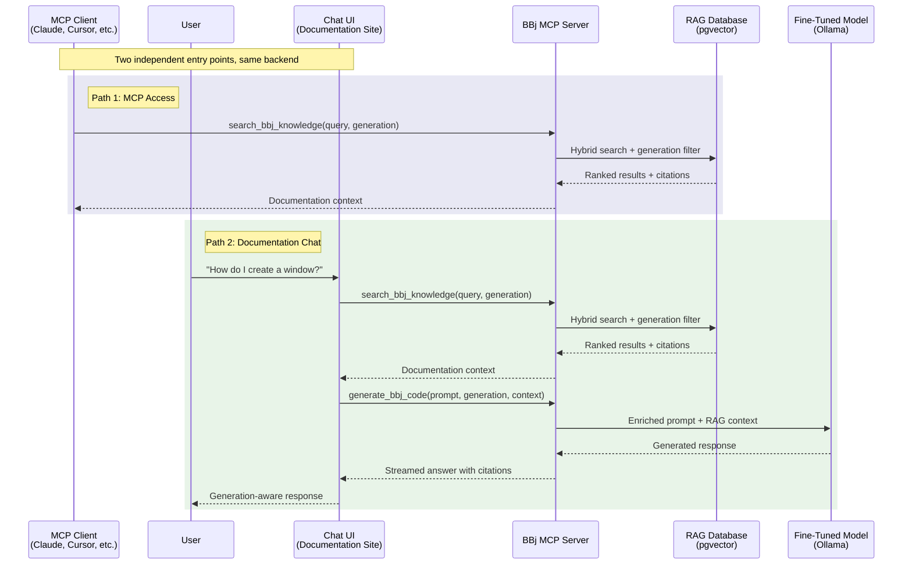

<objective>
Restructure Chapter 5 (Documentation Chat) around two independent paths -- MCP access for AI clients and embedded chat for human users -- both consuming the same shared foundation through MCP tools.

Purpose: Readers following Chapter 5 understand that BBj AI capabilities are accessible through two equally important paths: any MCP-compatible client (Claude, Cursor, etc.) for AI-to-AI access, and an embedded chat interface for human documentation browsing. This connects Chapter 5 to the MCP architecture established in Chapter 2.

Output: Fully restructured docs/05-documentation-chat/index.md satisfying CHAT-01, CHAT-02, CHAT-03, CHAT-04, CHAT-05.
</objective>

<execution_context>
@/Users/beff/.claude/get-shit-done/workflows/execute-plan.md
@/Users/beff/.claude/get-shit-done/templates/summary.md
</execution_context>

<context>
@.planning/PROJECT.md
@.planning/ROADMAP.md
@.planning/STATE.md
@.planning/phases/17-chat-cross-references/17-RESEARCH.md
@docs/05-documentation-chat/index.md
@docs/02-strategic-architecture/index.md
</context>

<tasks>

<task type="auto">
  <name>Task 1: Restructure Chapter 5 content around shared-foundation + two-path framing</name>
  <files>docs/05-documentation-chat/index.md</files>
  <action>
Rewrite Chapter 5 following the structure below. Read the RESEARCH.md recommended structure carefully -- it maps every existing section to its fate (KEEP, REWRITE, NEW, REMOVE).

**LOCKED DECISIONS from CONTEXT.md (honor exactly):**
- Chat and MCP are two independent, equally important paths -- NOT a stepping stone relationship
- Chat serves humans on the website, documentation page, and inside the IDE
- MCP is the interface for AI clients talking to BBj AI infrastructure
- Structure: shared foundation first, then diverge into how each path surfaces it
- Chat deployment simplified to one path: embedded on the documentation site
- One unified Mermaid sequence diagram showing both entry points converging on the shared backend
- Explicit MCP tool names in the diagram (`search_bbj_knowledge`, `generate_bbj_code`, `validate_bbj_syntax`)

**Target structure (preserves the argument flow: problem -> foundation -> paths -> architecture -> decision -> status):**

1. **TL;DR block** -- REWRITE. 3-5 sentences. Open with shared foundation concept. Introduce both paths as independent, equally important. Keep the "generic services fail" reference. Close with "same infrastructure, two access methods." Mention MCP tool names.

2. **Opening paragraphs** -- REWRITE (2-3 paragraphs). First paragraph: developers need BBj answers (keep existing framing). Second paragraph: this chapter describes two independent paths to the same shared infrastructure. Third paragraph: the vision is still forming for the chat side, while MCP access is architecturally defined.

3. **Why Generic Chat Services Fail** -- KEEP section largely as-is. The table and kapa.ai analysis remain valid. Trim only if needed for flow. Keep "The webforJ Contrast" subsection unchanged.

4. **The Shared Foundation** -- NEW section (### heading). 2-3 paragraphs explaining what BOTH paths share: RAG retrieval (search_bbj_knowledge) + fine-tuned model (generate_bbj_code). Brief recap connecting to Ch2 and Ch3. This is the "before the divergence" section. Do NOT duplicate schemas from Ch2 -- cross-reference with inline links. Mention all three tools by name with backticks.

5. **Path 1: MCP Access** -- NEW section (## heading). Framing: "MCP is the interface for AI talking to our AI infrastructure." Any MCP client (Claude, Cursor, custom tools) can consume BBj knowledge with zero custom code. References Ch2 tool definitions. List the three tools and what they do (one sentence each, no schemas). Emphasize: zero custom code required.

6. **Path 2: Documentation Chat** -- RESTRUCTURED section (## heading). Opening: chat serves humans on the documentation site. Then nest the PRESERVED content:
   - **Generation-Aware Response Design** (### heading) -- KEEP existing content including "Default Behavior: Modern First", "Legacy Context Detection", "How Generation Hints Flow" subsections. These are UNCHANGED.
   - **Streaming and Citations** (### heading) -- KEEP existing content including "Citation Format" subsection. UNCHANGED.
   - **Conversation Context** (### heading) -- KEEP existing content including "Token Budget Management" subsection. UNCHANGED.
   Brief note that deployment is embedded on the documentation site (one sentence -- no table, no embedded/standalone/hybrid discussion).

7. **Unified Architecture** -- NEW section (## heading). Contains the unified Mermaid sequence diagram. Use this exact diagram from RESEARCH.md:

After the diagram, 1-2 paragraphs explaining: both paths call the same `search_bbj_knowledge` tool (visual similarity in diagram). The chat path goes further by also calling `generate_bbj_code`. The `validate_bbj_syntax` tool completes the MCP ecosystem (referenced in Ch2 and Ch4 for the generate-validate-fix loop). Replaces the old "Chat Architecture" section entirely.

8. **Decision: MCP Tool for RAG Access** -- NEW :::info block (CHAT-04). Use the exact template from RESEARCH.md Example: Pattern 2. Four fields: Choice, Rationale, Alternatives considered, Status. References Ch2 link.

9. **Architectural Requirements** -- KEEP existing section including the existing :::info decision callout "Decision: Shared Infrastructure for Documentation Chat". The 6 requirements remain valid. Do NOT modify the existing decision callout. Position AFTER the new MCP decision callout.

10. **Current Status** -- UPDATE the :::note block (CHAT-05). Use RESEARCH.md Example 5 as the template:
    - Date: "February 2026"
    - Shipped: Nothing
    - Defined: Two-path architecture + generation-aware response strategy + shared infrastructure decision
    - Available upstream: RAG pipeline (v1.2), fine-tuned model (~10K examples), MCP server architecture (Ch2)
    - Planned: Chat backend service, embedded chat component

11. **Closing paragraphs + What Comes Next** -- UPDATE. Fix the stale status references:
    - Line 238: "RAG database (source corpus identified, pipeline not yet built)" -> reflect v1.2 shipped pipeline
    - Line 235: "deployment model (embedded, standalone, or hybrid) is not yet decided" -> simplified to embedded
    - Keep the "What Comes Next" section links but update descriptions if stale.

**WHAT TO REMOVE:**
- The existing "Deployment Options" section (the 3-option table at lines 161-173) -- REMOVE ENTIRELY. Embedded deployment is mentioned briefly in Path 2 instead.
- The existing "Chat Architecture" section (lines 128-159) -- REPLACED by the Unified Architecture section.
- The "hybrid approach is architecturally recommended" paragraph (lines 171-173) -- REMOVED with deployment options.

**ANTI-PATTERNS TO AVOID:**
- Do NOT frame MCP as a stepping stone to chat or vice versa
- Do NOT duplicate JSON schemas from Chapter 2
- Do NOT explain MCP protocol internals (one linking sentence is sufficient)
- Do NOT rewrite the Generation-Aware Response Design content (preserve it under Path 2)
- Do NOT change the existing "Decision: Shared Infrastructure" callout
- Keep tool names in backticks consistently: `search_bbj_knowledge`, `generate_bbj_code`, `validate_bbj_syntax`
  </action>
  <verify>
Read the modified file. Confirm:
1. TL;DR mentions both paths and MCP tool names
2. "The Shared Foundation" section exists before the two paths
3. "Path 1: MCP Access" and "Path 2: Documentation Chat" are peer-level headings (both ##)
4. Generation-Aware Response Design content is preserved under Path 2
5. Unified sequence diagram with `rect` blocks and MCP tool names is present
6. "Decision: MCP Tool for RAG Access" :::info block exists with all four fields
7. "Decision: Shared Infrastructure for Documentation Chat" :::info block is UNCHANGED
8. Deployment Options table is GONE
9. Status block says "February 2026"
10. No JSON schemas duplicated from Ch2
11. Stale references to "pipeline not yet built" and "deployment model not yet decided" are fixed
12. File builds without errors: `cd /Users/beff/_workspace/bbj-ai-strategy && npx docusaurus build 2>&1 | tail -5`
  </verify>
  <done>Chapter 5 restructured with two-path framing (MCP + chat), unified sequence diagram, MCP decision callout, updated status, and no schema duplication. All CHAT-01 through CHAT-05 requirements satisfied.</done>
</task>

</tasks>

<verification>
After task completion, verify:
1. `grep -c "search_bbj_knowledge" docs/05-documentation-chat/index.md` returns 3+ (diagram + prose references)
2. `grep -c "generate_bbj_code" docs/05-documentation-chat/index.md` returns 2+ (diagram + prose references)
3. `grep -c "validate_bbj_syntax" docs/05-documentation-chat/index.md` returns 1+ (mentioned in ecosystem)
4. `grep "Decision: MCP Tool for RAG Access" docs/05-documentation-chat/index.md` finds the new decision callout
5. `grep "Decision: Shared Infrastructure" docs/05-documentation-chat/index.md` finds the preserved decision callout
6. `grep "Deployment Options" docs/05-documentation-chat/index.md` returns NOTHING (section removed)
7. `grep "February 2026" docs/05-documentation-chat/index.md` finds the updated status block
8. `grep "embedded, standalone, or hybrid" docs/05-documentation-chat/index.md` returns NOTHING (stale reference removed)
9. `grep "pipeline not yet built" docs/05-documentation-chat/index.md` returns NOTHING (stale reference removed)
10. Docusaurus builds clean: `npx docusaurus build` exits 0
</verification>

<success_criteria>
- Chapter 5 presents MCP access and embedded chat as two independent, equally important paths
- Unified Mermaid sequence diagram shows both entry points with explicit MCP tool names
- Decision callout "MCP Tool for RAG Access" follows the four-field format
- Status block reflects February 2026 with accurate upstream state
- Generation-Aware Response Design content is preserved verbatim under Path 2
- No deployment options table; deployment simplified to "embedded on the documentation site"
- No schema duplication from Chapter 2; all tool references use inline cross-reference links
- Site builds clean with zero broken links
</success_criteria>

<output>
After completion, create `.planning/phases/17-chat-cross-references/17-01-SUMMARY.md`
</output>
