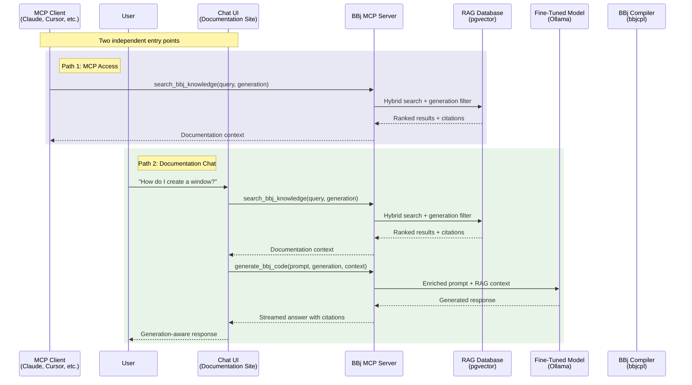
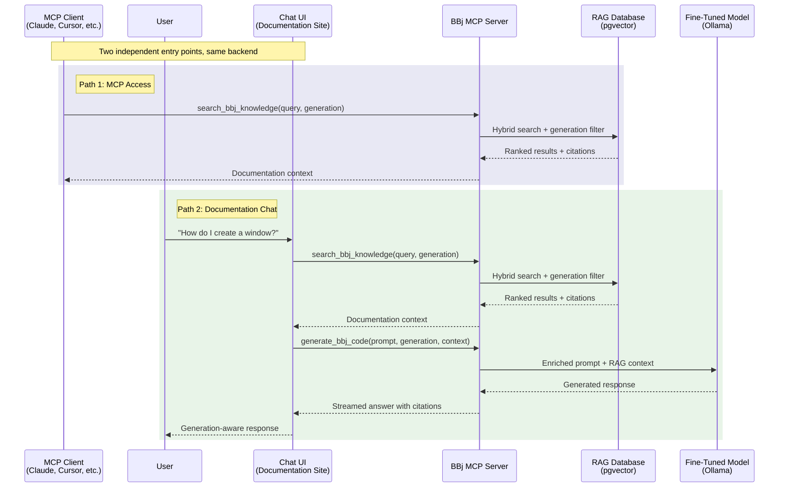

# Phase 17: Chat & Cross-References - Research

**Researched:** 2026-02-01
**Domain:** Docusaurus documentation update -- restructuring Chapter 5 around two-path framing (chat + MCP), adding MCP Integration subsections to Chapters 3 and 6, updating status blocks
**Confidence:** HIGH

## Summary

Phase 17 updates three chapters to connect them to the MCP architecture established in Chapter 2 (Phase 15). Chapter 5 (Documentation Chat) gets the most significant change: a restructure around a shared-foundation-then-divergence framing where human-facing chat and MCP-client access are presented as two independent, equally important paths. Chapters 3 (Fine-Tuning) and 6 (RAG Database) each get a dedicated "MCP Integration" subsection with cross-references to Chapter 2's tool definitions. Chapter 6 also gets an updated status block reflecting the v1.2 shipped pipeline.

This is a documentation update to three existing chapters (254 lines, 416 lines, and 517 lines respectively), not software development. No new capabilities are added. All three chapters already reference the shared infrastructure concept; this phase makes the MCP connection explicit and consistent. The existing conventions from Phases 15 and 16 (decision callouts, Mermaid diagram styles, status block format, cross-reference patterns) apply directly.

The key narrative challenge is Chapter 5's restructure. The current chapter presents documentation chat as a single system with a linear request flow (User -> Chat Widget -> Backend -> RAG -> LLM). The CONTEXT.md decisions require restructuring this around a shared foundation (RAG retrieval + fine-tuned model) that diverges into two independent paths: (1) human-facing chat embedded on the documentation site, and (2) MCP tool access for any AI client. The existing content about generation-aware responses, architectural requirements, and generic service failures remains valid and largely preserved. The deployment options section simplifies from three options (embedded/standalone/hybrid) to one path: embedded on the documentation site.

**Primary recommendation:** Restructure Chapter 5 with "shared foundation first, then two independent paths" framing. One unified Mermaid sequence diagram shows both MCP client and chat UI entry points converging on the same backend. Chapters 3 and 6 each get a concise MCP Integration subsection placed near the end of their technical content (before the status block), using inline cross-reference links to Chapter 2. Chapter 6's status block updates to reflect v1.2 pipeline shipped.

## Standard Stack

This phase is a documentation update, not a code project. The "stack" is the set of tools and patterns used to author and present the content.

### Core

| Tool | Version | Purpose | Why Standard |
|------|---------|---------|--------------|
| Docusaurus | 3.9.2 | Site framework (existing) | Already configured and deployed |
| Mermaid | (bundled with `@docusaurus/theme-mermaid`) | Sequence diagrams | Already configured in `docusaurus.config.ts` with `markdown: { mermaid: true }` |
| Prism | (bundled) | Syntax highlighting for JSON, BBj | Already configured with `additionalLanguages: ['bbj']` |

### Supporting

| Tool | Version | Purpose | When to Use |
|------|---------|---------|-------------|
| `:::tip[TL;DR]` admonition | Docusaurus built-in | Chapter opening summary | Update Ch5 TL;DR to mention two-path framing and MCP |
| `:::info[Decision: ...]` admonition | Docusaurus built-in | Architecture decision callouts | CHAT-04: "Decision: MCP Tool for RAG Access" |
| `:::note[Where Things Stand]` admonition | Docusaurus built-in | Current status block | Update Ch5 and Ch6 status blocks |
| Mermaid `sequenceDiagram` | Mermaid | Unified flow diagram | Ch5: both entry points converging on shared backend |

### Alternatives Considered

| Instead of | Could Use | Tradeoff |
|------------|-----------|----------|
| Single unified sequence diagram | Two separate diagrams (one per path) | Single diagram better shows convergence on shared backend; two diagrams would obscure the "same foundation" message |
| Inline cross-reference links | `:::info` styled blocks for cross-references | Inline links match Ch3 and Ch6's established style (prose with embedded links); styled blocks would break the flow of technical narrative |
| Mermaid `sequenceDiagram` | Mermaid `graph TB` | Sequence diagram shows temporal request flow clearly; matches Ch2's generate-validate-fix and Ch4's IDE pipeline diagrams; `graph TB` better for static topology (already in Ch2) |

**Installation:** No new dependencies. The entire phase uses the existing Docusaurus configuration. No `npm install` needed.

## Architecture Patterns

### Chapter 5: Recommended Content Structure After Restructure

The existing chapter has these sections (in order):
```
1. TL;DR block (:::tip)
2. Opening paragraphs (frames chat as second consumer of shared infrastructure)
3. Why Generic Chat Services Fail
   - The webforJ Contrast
4. Architectural Requirements (6 requirements)
   - Decision: Shared Infrastructure for Documentation Chat (:::info)
5. Generation-Aware Response Design
   - Default Behavior: Modern First
   - Legacy Context Detection
   - How Generation Hints Flow
6. Chat Architecture (sequence diagram + step descriptions)
7. Deployment Options (embedded/standalone/hybrid table)
8. Streaming and Citations
   - Citation Format
9. Conversation Context
   - Token Budget Management
10. Current Status (:::note)
11. What Comes Next
```

**Recommended structure after restructure:**
```
1. TL;DR block (:::tip) -- REWRITTEN for two-path framing
2. Opening paragraphs -- REWRITTEN to introduce two paths
3. Why Generic Chat Services Fail -- KEEP (trimmed)
   - The webforJ Contrast -- KEEP AS-IS
4. The Shared Foundation -- NEW framing section
   - Explains what both paths share: RAG retrieval + fine-tuned model
   - Brief recap (not duplication) of the generation-aware pipeline
5. Path 1: MCP Access (Any AI Client) -- NEW section (CHAT-01, CHAT-02 partial)
   - "MCP is the interface for AI talking to our AI infrastructure"
   - Any MCP client (Claude, Cursor, custom tools) can consume BBj knowledge
   - References Ch2 tool definitions (search_bbj_knowledge, generate_bbj_code, validate_bbj_syntax)
   - Zero custom code required
6. Path 2: Documentation Chat (Human-Facing) -- RESTRUCTURED from existing content
   - Embedded on the documentation site (simplified from 3 deployment options to 1)
   - Generation-Aware Response Design -- PRESERVED from existing
     - Default Behavior: Modern First -- KEEP AS-IS
     - Legacy Context Detection -- KEEP AS-IS
     - How Generation Hints Flow -- KEEP AS-IS
   - Streaming and Citations -- PRESERVED from existing
   - Conversation Context -- PRESERVED from existing
     - Token Budget Management -- KEEP AS-IS
7. Unified Architecture -- NEW section containing the unified diagram (CHAT-03)
   - One Mermaid sequence diagram showing both entry points converging
   - Explicit MCP tool names in the diagram
   - Replaces the existing Chat Architecture sequence diagram
8. Decision: MCP Tool for RAG Access (:::info) -- NEW (CHAT-04)
9. Architectural Requirements -- KEPT but repositioned/updated
   - Decision: Shared Infrastructure for Documentation Chat (:::info) -- KEEP AS-IS
10. Current Status (:::note) -- UPDATED (CHAT-05)
11. What Comes Next -- UPDATED
```

**Key structural decisions:**
- The "Why Generic Chat Services Fail" section is preserved because it establishes the core problem that motivates the entire chapter. It may be trimmed slightly but the argument remains.
- The unified diagram placement after both paths are described ensures the reader understands what converges before seeing how.
- Deployment options section is eliminated entirely (per CONTEXT.md: "simplified to one path: embedded on the documentation site"). The embedded deployment is mentioned briefly in Path 2, not as a standalone section.
- The existing Architectural Requirements section is preserved but can be repositioned. The 6 requirements remain valid.

### Chapter 3: MCP Integration Subsection

**Placement recommendation:** After the "Hosting via Ollama" section (which ends around line 399) and before the "Current Status" block (line 403). This is where the chapter transitions from "how the model is built and served" to "where things stand." The MCP Integration subsection bridges these naturally: "the model is served via Ollama, and it is consumed through the MCP server's `generate_bbj_code` tool."

**Content:** 2-3 paragraphs explaining:
1. The fine-tuned model described in this chapter is consumed by the MCP server's `generate_bbj_code` tool (defined in [Chapter 2](/docs/strategic-architecture#generate_bbj_code))
2. The tool accepts a prompt, target generation, and optional context -- then assembles RAG-retrieved documentation into an enriched prompt for the Ollama-hosted model
3. This means any MCP-compatible client can leverage the fine-tuned model without building custom Ollama integration code

**Cross-reference format:** Inline links, matching Ch3's established style. The chapter already uses inline links extensively: `[Chapter 1](/docs/bbj-challenge)`, `[IDE completion use case](/docs/ide-integration)`, `[RAG database](/docs/rag-database)`. Adding `[Chapter 2](/docs/strategic-architecture#generate_bbj_code)` follows this pattern naturally. No styled block needed.

### Chapter 6: MCP Integration Subsection

**Placement recommendation:** After the "Generation-Aware Retrieval" section (which ends around line 497) and before the "Current Status" block (line 500). Similar rationale as Ch3: the subsection bridges the technical content and the status update.

**Content:** 2-3 paragraphs explaining:
1. The RAG retrieval pipeline described in this chapter is exposed through the MCP server's `search_bbj_knowledge` tool (defined in [Chapter 2](/docs/strategic-architecture#search_bbj_knowledge))
2. The tool accepts a natural language query and optional generation filter, performs the hybrid search described in this chapter, and returns ranked results with source citations
3. This means any MCP-compatible client -- Claude, Cursor, the documentation chat backend, or custom applications -- can query the BBj knowledge base without building custom retrieval code

**Cross-reference format:** Inline links, matching Ch6's established style. The chapter uses the same inline link pattern as Ch3.

### Chapter 6: Status Block Update

**What changes:**
- Date: "January 2026" updates to "February 2026"
- First bullet changes from "Defined: Source corpus identified" to reflect v1.2 shipped pipeline
- New status: "built and tested (v1.2), awaiting deployment against production corpus"
- Add MCP reference: `search_bbj_knowledge` tool as the planned interface for retrieval
- Keep "Not built" bullet for items still not built (infrastructure provisioning, retrieval API)
- Update "Planned next" to reflect current state

**Per CONTEXT.md decisions:** "Status block only -- prose descriptions remain as-is (they describe the design, which is still accurate)." The prose sections of Chapter 6 are NOT modified -- only the status block and the new MCP Integration subsection.

### Pattern 1: Unified Sequence Diagram (Ch5, CHAT-03)

**What:** One Mermaid sequence diagram showing both entry points (MCP client and chat UI) converging on the shared backend. Replaces the existing text-based request flow diagram.

**Per CONTEXT.md:** "Explicit MCP tool names in the diagram (`search_bbj_knowledge`, `generate_bbj_code`, `validate_bbj_syntax`) -- connects directly to Ch2's tool definitions. All three tools included for a complete picture of the MCP ecosystem."

**Recommended diagram:**


**Design rationale:**
- Both paths call the same `search_bbj_knowledge` tool -- the diagram shows this visually
- The chat path goes further by also calling `generate_bbj_code` for richer answers
- `validate_bbj_syntax` is included in the tool set but the diagram focuses on the retrieval/generation flow that is most relevant to documentation chat
- Colored `rect` blocks visually distinguish the two paths
- Participant names match Ch2's established conventions

**Alternative considered:** Including `validate_bbj_syntax` in the chat flow explicitly. Rejected because the documentation chat's primary function is Q&A, not code generation + validation. The MCP path DOES support validation (any client can call all three tools), but showing it in the chat flow would misrepresent the typical chat interaction. The diagram mentions all three tools exist in the MCP ecosystem via the server participant.

**Mermaid style note:** The `rect` directive creates colored background regions in sequence diagrams. This is a standard Mermaid feature supported by the Docusaurus-bundled version. The color values use the established palette: blue-ish `rgb(232, 232, 244)` and green-ish `rgb(232, 244, 232)` matching the `#e8e8f4` and `#e8f4e8` fills used in `graph TB` diagrams across all chapters.

**Important caveat about `rect` blocks:** Mermaid's `rect` feature is well-supported in modern versions but some older renderers may not display them. The Docusaurus bundled Mermaid version (via `@docusaurus/theme-mermaid`) supports `rect`. If during implementation the `rect` blocks cause rendering issues, fall back to `Note over` annotations to label the two paths instead. The diagram still works without `rect` -- it just loses the visual grouping.

### Pattern 2: Decision Callout (CHAT-04)

**What:** `:::info[Decision: MCP Tool for RAG Access]` with the standard four fields.

**Template:**
```markdown
:::info[Decision: MCP Tool for RAG Access]
**Choice:** Expose RAG retrieval through the MCP `search_bbj_knowledge` tool,
making the BBj knowledge base accessible to any MCP-compatible client without
custom integration code.

**Rationale:** The documentation chat backend and every other AI consumer need
the same thing: generation-aware retrieval from the BBj knowledge base. Rather
than building a custom retrieval API for the chat system, the MCP server exposes
`search_bbj_knowledge` as a standard tool that any client can invoke. The chat
backend is one consumer; Claude, Cursor, and custom applications are others.
This follows the [unified infrastructure principle](/docs/strategic-architecture)
established in Chapter 2.

**Alternatives considered:** Custom REST API for chat retrieval (requires
maintaining a separate API alongside MCP; duplicates effort); direct database
queries from the chat backend (couples the chat system to the database schema;
breaks the abstraction layer; prevents other clients from benefiting).

**Status:** Architecture defined. The `search_bbj_knowledge` tool schema is
specified in [Chapter 2](/docs/strategic-architecture#search_bbj_knowledge).
Implementation depends on the MCP server being built.
:::
```

### Pattern 3: TL;DR Convention for Ch5

**Current Ch5 TL;DR:**
```markdown
:::tip[TL;DR]
Generic documentation chat services (kapa.ai, Algolia Ask AI) fail for BBj because
their underlying LLMs have zero BBj training data -- the same core problem Chapter 1
establishes for all generic AI tools. A BBj documentation chat must use the fine-tuned
model and generation-tagged RAG pipeline described in earlier chapters, streaming
generation-aware answers with source citations. The key insight: this is the same
shared infrastructure the IDE extension uses, not a second AI system.
:::
```

**Updated TL;DR must:**
- Introduce the two-path framing (MCP access + human chat)
- Maintain the "generic services fail" message (core motivation)
- Mention the shared foundation (RAG + fine-tuned model)
- Reference MCP tools by name
- Remain 3-5 sentences, skimmable in 30 seconds

**Recommended direction:**
- Open with the shared foundation concept
- Introduce both paths as independent, equally important
- Keep the "generic services fail" reference
- Close with the key insight: same infrastructure, two access methods

### Pattern 4: Cross-Reference Style

**Research finding:** Both Ch3 and Ch6 use inline links for cross-references, not styled blocks. Examples from existing text:

Ch3 (line 13): `As [Chapter 1](/docs/bbj-challenge) establishes...`
Ch3 (line 415): `The fine-tuned model is the foundation that both the [IDE extension](/docs/ide-integration) and the planned [documentation chat](/docs/documentation-chat) depend on.`

Ch6 (line 15): `As [Chapter 2](/docs/strategic-architecture) establishes...`
Ch6 (line 132): `As [Chapter 3](/docs/fine-tuning) establishes...`
Ch6 (line 428): `This function is the shared retrieval API that both the [IDE extension](/docs/ide-integration) and [documentation chat](/docs/documentation-chat) consume.`

**Recommendation:** Use inline links for the MCP Integration subsections. This matches both chapters' established style. The subsections themselves are the "styled block" -- a dedicated `### MCP Integration` heading groups the MCP-related content. Within the subsection, inline links reference Chapter 2's tool definitions.

**Format:** `[Chapter 2](/docs/strategic-architecture#tool-anchor)` for specific tool references. The anchor format should match the heading IDs generated by Docusaurus from the Ch2 heading text.

**Ch2 heading anchors (verified from content):**
- `search_bbj_knowledge` section heading -> anchor: `#search_bbj_knowledge`
- `generate_bbj_code` section heading -> anchor: `#generate_bbj_code`
- `validate_bbj_syntax` section heading -> anchor: `#validate_bbj_syntax`
- MCP Server section -> anchor: `#the-mcp-server-concrete-integration-layer`

### Pattern 5: Status Block Convention

**Format:** `:::note[Where Things Stand -- {Month Year}]` with bulleted status items.

**Ch5 status update (CHAT-05):**
- Date: "February 2026"
- Add MCP context: the chat system's retrieval layer is exposed via `search_bbj_knowledge` MCP tool
- Reflect current state: architecture defined, MCP framing added, implementation not started
- Reference the v1.2 RAG pipeline as available upstream infrastructure

**Ch6 status update (XREF-02):**
- Date: "February 2026"
- First bullet: "Shipped: RAG ingestion pipeline (v1.2) -- 6 source parsers, embedding pipeline, generation-aware tagging, hybrid search. Built and tested, awaiting deployment against production corpus."
- Add: "Planned: Retrieval exposed via MCP `search_bbj_knowledge` tool ([Chapter 2](/docs/strategic-architecture#search_bbj_knowledge)) for consumption by documentation chat and any MCP client."
- Existing "Not built" items may need adjustment based on what v1.2 actually shipped

### Anti-Patterns to Avoid

- **"Stepping stone" framing:** CONTEXT.md explicitly says chat and MCP are "two independent, equally important paths -- not a stepping stone relationship." Do NOT frame MCP as a prerequisite for chat, or chat as a nicer interface over MCP. They are parallel paths to the same foundation.
- **Schema duplication:** CONTEXT.md says "no schema duplication across chapters." Ch3 and Ch6 subsections reference Ch2 for tool definitions, not repeat them. Even partial schema duplication creates maintenance burden.
- **Rewriting Ch6 prose:** CONTEXT.md says "Status block only -- prose descriptions remain as-is (they describe the design, which is still accurate)." Only modify Ch6's status block and add the MCP Integration subsection. Do not rewrite existing technical descriptions.
- **Three deployment options in Ch5:** The existing chapter presents embedded/standalone/hybrid options with a table. CONTEXT.md simplifies this to one path: "embedded on the documentation site." Remove or replace the deployment options table.
- **Technology contradictions:** All backend references must match published chapters: Qwen2.5-Coder-7B via Ollama (Ch3), pgvector (Ch6), bbjcpl compiler (Ch4). These are locked decisions.
- **MCP protocol explanation:** Do not explain MCP protocol internals in Ch3, Ch5, or Ch6. One sentence introducing MCP with a link to Ch2 is sufficient. Ch2 already provides the introduction.
- **Over-long MCP Integration subsections:** Ch3 and Ch6 subsections should be 2-3 paragraphs each. They are cross-references, not new chapters. The reader should be directed to Ch2 for details.
- **Stale cross-references in Ch5:** The current Ch5 references "RAG database (source corpus identified, pipeline not yet built)" in line 238. This is now stale -- the pipeline IS built (v1.2). Any preserved text that mentions upstream status must be checked and updated.

## Don't Hand-Roll

Problems that look simple but have existing solutions:

| Problem | Don't Build | Use Instead | Why |
|---------|-------------|-------------|-----|
| MCP tool schema for search_bbj_knowledge | Repeat the JSON schema in Ch5/Ch6 | Cross-reference to Ch2's tool definitions | Schema is already published in Ch2 (Phase 15); repeating it means updating multiple places |
| MCP tool schema for generate_bbj_code | Repeat the JSON schema in Ch3 | Cross-reference to Ch2's tool definitions | Same reason -- single source of truth in Ch2 |
| New architecture diagram in Ch3 or Ch6 | Custom diagrams showing MCP integration | Inline text references to Ch2's topology diagram | Ch2 already has the topology diagram showing all three tools and their backend connections; Ch3/Ch6 only need a textual mention |
| Deployment options analysis in Ch5 | New deployment comparison | Single sentence: "embedded on the documentation site" | CONTEXT.md explicitly simplifies to one deployment path |
| Generation-aware response examples in Ch5 | New examples | Preserve existing examples | The "How do I create a window?" examples in the current Ch5 are well-crafted and remain valid |

**Key insight:** This phase adds zero new diagrams to Chapters 3 and 6. The only new diagram is the unified sequence diagram in Chapter 5 (replacing the existing one). All other changes are textual.

## Common Pitfalls

### Pitfall 1: The "Stepping Stone" Trap
**What goes wrong:** The restructured Chapter 5 presents MCP as the "basic" path and chat as the "advanced" path, creating an implicit hierarchy. Or it presents chat as the primary purpose and MCP as an afterthought tacked on.
**Why it happens:** The existing chapter is entirely about documentation chat. It is natural to treat MCP access as an addition to the chat story rather than as an equal peer.
**How to avoid:** The shared foundation section must come FIRST, before either path. Both paths should get comparable treatment: similar heading levels, similar amounts of content, similar levels of detail. The CONTEXT.md framing is clear: "two independent, equally important paths."
**Warning signs:** If one path gets a major heading and the other gets a subsection, or if one path gets detailed examples and the other gets a brief mention, the framing is wrong.

### Pitfall 2: Duplicating Chapter 2's MCP Content
**What goes wrong:** The Ch5 restructure re-explains MCP, repeats tool schemas, or recreates the topology diagram from Ch2. Ch3 and Ch6 MCP Integration subsections repeat tool details instead of cross-referencing.
**Why it happens:** Each chapter wants to be self-contained. Writers include MCP context "for readers who skipped Ch2."
**How to avoid:** Strict cross-reference discipline. Ch5 can introduce MCP in one sentence ("The Model Context Protocol (MCP) provides a standard interface for AI applications to access external tools -- see [Chapter 2](/docs/strategic-architecture#the-mcp-server-concrete-integration-layer) for the full architecture"). Ch3 and Ch6 name the specific tool and link to Ch2's definition. No schemas, no topology diagrams, no protocol explanations outside Ch2.
**Warning signs:** Any JSON schema block in Ch3, Ch5, or Ch6. Any Mermaid `graph TB` diagram showing MCP topology outside Ch2. Any paragraph explaining what MCP is (beyond one linking sentence).

### Pitfall 3: Stale Status Information
**What goes wrong:** Ch5 or Ch6 status blocks reference outdated information. Ch5 currently says "RAG database (source corpus identified, pipeline not yet built)" and "the deployment model (embedded, standalone, or hybrid) is not yet decided." Both are now stale.
**Why it happens:** Status blocks and inline status references are scattered throughout the prose. It is easy to update the explicit `:::note` block but miss a status reference embedded in a paragraph.
**How to avoid:** After updating the `:::note` status blocks, grep for status-related phrases in the modified chapters: "not yet built", "not yet decided", "pipeline not yet", "source corpus identified". Update any stale references. Key updates needed:
- Ch5 line 238: "RAG database (source corpus identified, pipeline not yet built)" -> reflect v1.2 shipped
- Ch5 line 235: "deployment model (embedded, standalone, or hybrid) is not yet decided" -> simplified to embedded
- Ch6 line 502: "Not built: Ingestion pipeline, vector store, embedding computation" -> reflect v1.2 shipped
**Warning signs:** Any "not yet built" claim for the RAG pipeline in Ch5 or Ch6 text.

### Pitfall 4: Breaking the Chapter 5 Narrative Flow
**What goes wrong:** The restructure rearranges sections in a way that breaks the logical argument flow. The "Why Generic Chat Services Fail" section loses its connection to the solution. Generation-aware response examples appear before the reader understands why they matter.
**Why it happens:** Restructuring means moving sections around. The original flow was carefully constructed: problem (generic services fail) -> requirements -> solution (generation-aware design) -> architecture -> deployment.
**How to avoid:** Preserve the argument structure even while changing the section order. The recommended flow maintains: problem (generic services fail) -> shared foundation -> two paths (with generation-aware design under the chat path) -> unified architecture -> decision -> status. The "why" always comes before the "what."
**Warning signs:** If generation-aware response examples appear before the reader knows about the shared foundation, or if the MCP path is introduced before the generic services failure is established.

### Pitfall 5: Inconsistent MCP Tool References
**What goes wrong:** Ch3 references `generate_bbj_code` but with slightly different parameter descriptions than Ch2. Ch6 references `search_bbj_knowledge` but describes capabilities not in the Ch2 schema. Ch5 uses tool names that do not match Ch2.
**Why it happens:** Each chapter author describes the tool from that chapter's perspective and might paraphrase differently.
**How to avoid:** All tool references use the EXACT canonical names from Ch2: `search_bbj_knowledge`, `generate_bbj_code`, `validate_bbj_syntax`. When describing what a tool does, reference Ch2 rather than restating. Use backtick formatting for tool names consistently.
**Warning signs:** Tool names without backticks. Descriptions of tool capabilities that contradict or extend Ch2's definitions.

### Pitfall 6: Ch5 Existing Decision Callout Conflict
**What goes wrong:** The new CHAT-04 decision callout ("MCP Tool for RAG Access") says something that contradicts the existing Ch5 decision callout ("Shared Infrastructure for Documentation Chat", currently at line 59).
**Why it happens:** Both decisions are about how the chat system accesses the shared infrastructure. The new one adds the MCP dimension; the old one established the shared infrastructure principle.
**How to avoid:** The existing decision callout (line 59) establishes that chat uses the SAME Ollama and RAG as the IDE. This is still true and still correct. The new CHAT-04 callout adds HOW the chat system accesses that infrastructure: through the MCP `search_bbj_knowledge` tool. Frame CHAT-04 as building on the existing decision, not replacing it. Both callouts should coexist.
**Warning signs:** If the existing decision callout is deleted or significantly modified, or if CHAT-04 contradicts its rationale.

## Code Examples

### Example 1: Unified Sequence Diagram for Chapter 5 (CHAT-03)

This replaces the existing Chat Architecture sequence diagram (Ch5 lines 132-150). Shows both entry points converging on the shared backend with explicit MCP tool names.



**Design notes:**
- Both paths call `search_bbj_knowledge` -- the visual similarity makes the shared foundation obvious
- The chat path additionally calls `generate_bbj_code` for richer conversational responses
- Participant naming follows Ch2/Ch4 conventions: descriptive name with technology in parentheses
- `rect` blocks use colors from the established palette (converted to RGB)
- `validate_bbj_syntax` is part of the MCP server's tool set but not shown in the typical chat/query flow -- it is primarily relevant for code generation + validation patterns (documented in Ch2 and Ch4)

**Fallback if `rect` causes rendering issues:** Remove `rect` blocks and use `Note over` annotations instead:
```
Note over MCPClient,Server: --- Path 1: MCP Access ---
...
Note over User,Model: --- Path 2: Documentation Chat ---
```

### Example 2: Ch3 MCP Integration Subsection

```markdown
### MCP Integration

The fine-tuned model described in this chapter is not accessed directly by consumer
applications. Instead, it is consumed through the BBj MCP server's `generate_bbj_code`
tool, defined in [Chapter 2](/docs/strategic-architecture#generate_bbj_code). The tool
accepts a natural language prompt, a target BBj generation, and optional surrounding
code context. It assembles RAG-retrieved documentation into an enriched prompt and
forwards it to the Ollama-hosted model -- the same model built through the QLoRA
pipeline described above.

This means any MCP-compatible client -- Claude, Cursor, VS Code, or a custom
application -- can generate BBj code using the fine-tuned model without building
custom Ollama integration code. The model's generation awareness, trained through
the labeled examples in this chapter, is available to every client through a single
standard tool interface. When the model improves through continued fine-tuning,
every client benefits immediately.

For the complete MCP server architecture, tool schemas, and integration patterns,
see [Chapter 2: Strategic Architecture](/docs/strategic-architecture#the-mcp-server-concrete-integration-layer).
```

### Example 3: Ch6 MCP Integration Subsection

```markdown
### MCP Integration

The retrieval pipeline described in this chapter is exposed through the BBj MCP
server's `search_bbj_knowledge` tool, defined in
[Chapter 2](/docs/strategic-architecture#search_bbj_knowledge). The tool accepts a
natural language query and an optional generation filter, performs the hybrid search
pipeline described above (dense vector search, BM25 keyword matching, reciprocal
rank fusion, cross-encoder reranking), and returns ranked results with source citations.

This is the primary interface for the [documentation chat](/docs/documentation-chat)
and for any MCP-compatible client that needs to query BBj documentation. Whether a
developer asks a question through the chat interface, through Claude, or through
Cursor, the same retrieval pipeline returns the same generation-aware results. The
generation metadata, chunking strategy, and hybrid search logic described in this
chapter are what make those results accurate.

For the complete MCP server architecture and the other two tools (`generate_bbj_code`
and `validate_bbj_syntax`), see
[Chapter 2: Strategic Architecture](/docs/strategic-architecture#the-mcp-server-concrete-integration-layer).
```

### Example 4: Ch6 Updated Status Block

```markdown
:::note[Where Things Stand -- February 2026]
- **Shipped:** RAG ingestion pipeline (v1.2) -- 6 source parsers, embedding pipeline,
  generation-aware tagging, hybrid search. Built and tested, awaiting deployment against
  production corpus.
- **Defined:** Source corpus identified -- MadCap Flare documentation (primary), BBj
  source code, API references, and knowledge base articles. Generation metadata schema
  established (shared with [training data](/docs/fine-tuning)).
- **Planned:** Retrieval exposed via MCP `search_bbj_knowledge` tool
  ([Chapter 2](/docs/strategic-architecture#search_bbj_knowledge)) for consumption by
  documentation chat and any MCP client.
- **Planned next:** Deploy pipeline against production corpus. Index full BBj
  documentation, tune retrieval quality, validate with representative queries.
:::
```

### Example 5: Ch5 Updated Status Block

```markdown
:::note[Where Things Stand -- February 2026]
- **Shipped:** Nothing. The documentation chat is a planned capability, not a shipped
  product.
- **Defined:** Two-path architecture -- MCP access for AI clients and embedded chat
  for human users -- both consuming the shared foundation through MCP tools. Generation-
  aware response strategy. Shared infrastructure decision.
- **Available upstream:** [RAG ingestion pipeline](/docs/rag-database) (v1.2) shipped.
  [Fine-tuned model](/docs/fine-tuning) in progress (~10K training examples). MCP server
  architecture defined ([Chapter 2](/docs/strategic-architecture)).
- **Planned:** Chat backend service, embedded chat component for the documentation
  site. Depends on MCP server being operational.
:::
```

## State of the Art

| Old Approach (current chapters) | Current Approach (after Phase 17) | When Changed | Impact |
|---------------------------------|-----------------------------------|--------------|--------|
| Ch5 presents chat as single system with linear flow | Ch5 presents two independent paths (MCP + chat) converging on shared foundation | Phase 17 (Feb 2026) | Readers understand that MCP access and chat are equal peers, not a hierarchy |
| Ch5 has three deployment options (embedded/standalone/hybrid) | Ch5 simplified to one deployment path (embedded on docs site) | Phase 17 (Feb 2026) | Eliminates decision paralysis; focuses the narrative |
| Ch5 sequence diagram shows Chat Widget -> Backend -> RAG -> LLM | Ch5 unified diagram shows both MCP client and Chat UI entry points | Phase 17 (Feb 2026) | Visual proof of shared infrastructure; explicit MCP tool names |
| Ch3 does not mention MCP | Ch3 has "MCP Integration" subsection referencing generate_bbj_code | Phase 17 (Feb 2026) | Readers following Ch3 learn how the model connects to the MCP ecosystem |
| Ch6 does not mention MCP | Ch6 has "MCP Integration" subsection referencing search_bbj_knowledge | Phase 17 (Feb 2026) | Readers following Ch6 learn how retrieval connects to the MCP ecosystem |
| Ch6 status says "Not built: Ingestion pipeline" | Ch6 status reflects v1.2 shipped pipeline | Phase 17 (Feb 2026) | Accurate status -- pipeline IS built |
| Ch5 status references stale upstream state | Ch5 status reflects current upstream state (v1.2 RAG, model in progress) | Phase 17 (Feb 2026) | No contradictions between chapters |

**Deprecated/outdated after Phase 17:**
- The existing Ch5 "Deployment Options" table (embedded/standalone/hybrid) is replaced by a single embedded deployment path
- The existing Ch5 sequence diagram (User -> Chat Widget -> Backend -> RAG -> LLM) is replaced by the unified two-path diagram
- Ch6 status claim "Not built: Ingestion pipeline" is no longer accurate (v1.2 shipped)

## Open Questions

1. **How much of Ch5's existing "Architectural Requirements" section to preserve**
   - What we know: The 6 requirements (BBj-aware model, generation-tagged retrieval, streaming, citations, generation adaptation, shared infrastructure) are all still valid. The decision callout is still valid.
   - What's unclear: Whether to keep the numbered list as-is, integrate some requirements into the two-path sections, or consolidate.
   - Recommendation: Keep the requirements section largely intact. They validate the architecture for both paths. Optionally reposition after the two paths are described (so the reader has context for why these requirements matter). This is Claude's discretion on content preservation.

2. **Whether to update Ch3's status block date**
   - What we know: Ch3's status block says "January 2026." Adding an MCP Integration subsection means the chapter is updated in February 2026.
   - What's unclear: Whether to also update the date on Ch3's status block when the only change is adding a cross-reference subsection (no new status information).
   - Recommendation: Do NOT update Ch3's status block date or content unless there is actual new status to report. The MCP Integration subsection is a cross-reference addition, not a status change. Changing the date implies status updates that did not happen.

3. **Whether Ch5's "webforJ Contrast" subsection needs updating**
   - What we know: The webforJ Contrast (Ch5 lines 37-41) explains why generic services work for webforJ (Java is well-understood) but fail for BBj. This argument remains valid.
   - What's unclear: Whether the MCP context changes the contrast -- webforJ has its own MCP server, which could be mentioned.
   - Recommendation: Keep the webforJ Contrast as-is. The webforJ MCP precedent is already documented in Ch2 (ARCH-07). Mentioning it again in Ch5 would be redundant. The webforJ Contrast in Ch5 is about model comprehension, not MCP integration.

4. **Exact heading for the MCP Integration subsections in Ch3 and Ch6**
   - What we know: CONTEXT.md says "dedicated 'MCP Integration' subsections."
   - Recommendation: Use `### MCP Integration` as an H3 heading. Both Ch3 and Ch6 use H3 for their subsections (e.g., Ch3's "### How LoRA Works", Ch6's "### Generation Scoring Logic"). An H3 heading places the MCP content at the same structural level as other technical subsections, which is appropriate for a 2-3 paragraph cross-reference section.

5. **Whether to include `validate_bbj_syntax` in the unified Ch5 diagram**
   - What we know: CONTEXT.md says "All three tools included for a complete picture of the MCP ecosystem." The sequence diagram recommended above shows `search_bbj_knowledge` and `generate_bbj_code` in the flow but not `validate_bbj_syntax` as a call.
   - Recommendation: The diagram includes the BBj Compiler as a participant (acknowledging it exists), but the typical chat/query flow does not invoke validation. If the user wants all three tools shown as active calls, the MCP path in the diagram could show a code generation + validation sequence. The planner should interpret "all three tools included" as: visible in the diagram (as participants or labeled on the server), not necessarily as active calls in the shown flow. If the planner judges that active calls for all three are needed, extend the MCP path to show a `generate_bbj_code` -> `validate_bbj_syntax` sequence after the `search_bbj_knowledge` call.

## Sources

### Primary (HIGH confidence)
- Chapter 5 existing content: `/Users/beff/_workspace/bbj-ai-strategy/docs/05-documentation-chat/index.md` (254 lines, read in full)
- Chapter 3 existing content: `/Users/beff/_workspace/bbj-ai-strategy/docs/03-fine-tuning/index.md` (416 lines, read in full)
- Chapter 6 existing content: `/Users/beff/_workspace/bbj-ai-strategy/docs/06-rag-database/index.md` (517 lines, read in full)
- Chapter 2 existing content (post-Phase 15): `/Users/beff/_workspace/bbj-ai-strategy/docs/02-strategic-architecture/index.md` (387 lines, read in full -- MCP tool definitions, topology diagram, generate-validate-fix sequence)
- Chapter 4 existing content (post-Phase 16): `/Users/beff/_workspace/bbj-ai-strategy/docs/04-ide-integration/index.md` (compiler validation section, IDE pipeline sequence diagram)
- Chapter 6 getting-started page: `/Users/beff/_workspace/bbj-ai-strategy/docs/06-rag-database/getting-started.md` (v1.2 pipeline implementation details, 6 source parsers)
- Phase 15 Research: `/Users/beff/_workspace/bbj-ai-strategy/.planning/phases/15-strategic-architecture/15-RESEARCH.md` (diagram conventions, decision callout format, status block patterns, cross-reference patterns)
- Phase 16 Research: `/Users/beff/_workspace/bbj-ai-strategy/.planning/phases/16-compiler-validation/16-RESEARCH.md` (continuation of conventions, anti-patterns for cross-chapter content)
- Phase 17 Context: `/Users/beff/_workspace/bbj-ai-strategy/.planning/phases/17-chat-cross-references/17-CONTEXT.md` (user decisions, two-path framing, deployment simplification)
- v1.3 Requirements: `/Users/beff/_workspace/bbj-ai-strategy/.planning/REQUIREMENTS.md` (CHAT-01 through CHAT-05, XREF-01, XREF-02 definitions)

### Secondary (MEDIUM confidence)
- Mermaid sequence diagram `rect` syntax: Verified as standard Mermaid feature in the Mermaid documentation. Supported by Docusaurus-bundled Mermaid version. Fallback strategy documented if rendering issues occur.

### Tertiary (LOW confidence)
- None -- all findings verified against primary sources (existing codebase content).

## Metadata

**Confidence breakdown:**
- Standard stack: HIGH -- Docusaurus configuration verified from source; no new dependencies; same stack as Phases 15 and 16
- Architecture: HIGH -- All three target chapters analyzed in full; restructure plan follows established conventions from 15 prior phases; CONTEXT.md decisions are specific and unambiguous
- Pitfalls: HIGH -- All pitfalls derived from CONTEXT.md constraints (two-path equality, no schema duplication, status-only Ch6 prose changes) and structural analysis of all seven published chapters
- Content: HIGH -- All cross-reference targets (Ch2 tool definitions, Ch2 heading anchors) verified against the published Chapter 2 content

**Research date:** 2026-02-01
**Valid until:** 2026-04-01 (chapter content is stable; no fast-moving dependencies)
