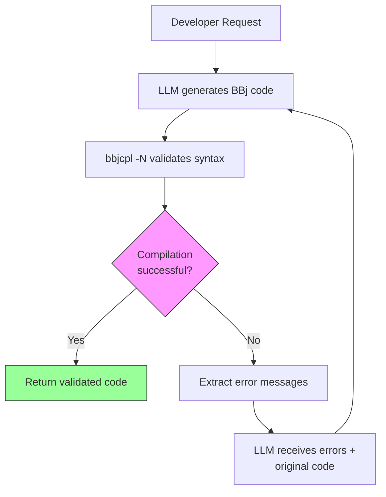
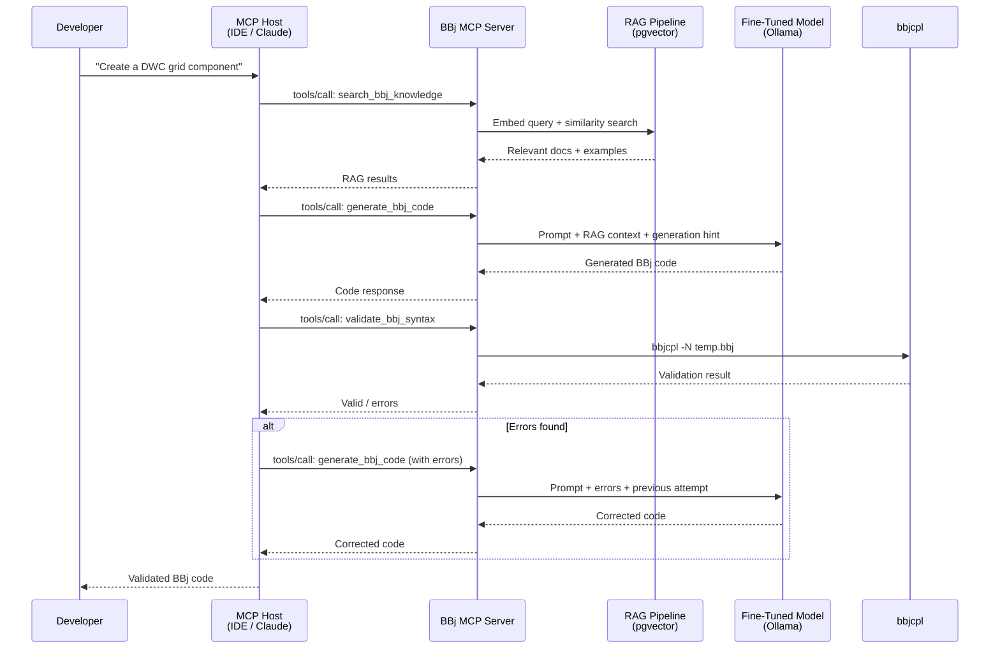

# Technology Stack: MCP Architecture Documentation (v1.3 Milestone)

**Project:** BBj AI Strategy -- Docusaurus Documentation Update
**Researched:** 2026-02-01
**Scope:** Technologies and patterns for documenting MCP server architecture, compiler validation loops, and ecosystem integration across existing 7 chapters
**Overall confidence:** HIGH (MCP SDK versions verified via npm/GitHub; Docusaurus config verified from project source; Mermaid patterns verified against official docs)

---

## Context: What This Stack Is For

This is NOT a stack for building an MCP server. This is a stack for **documenting** an MCP server architecture -- updating existing Docusaurus chapters with accurate MCP TypeScript patterns, architecture diagrams, and compiler validation concepts. The audience is technical readers of the BBj AI Strategy site who need to understand how the pieces (RAG search + fine-tuned model + compiler validation) connect via MCP.

The existing site runs Docusaurus 3.9.2 with Mermaid enabled (`@docusaurus/theme-mermaid`), BBj syntax highlighting (`prism: { additionalLanguages: ['bbj'] }`), and GitHub Pages deployment. All recommendations below must integrate with this existing setup.

---

## MCP Protocol & SDK Reference

### Current Protocol Version

| Attribute | Value | Confidence | Source |
|-----------|-------|------------|--------|
| Current spec version | **2025-11-25** | HIGH | [Official spec](https://modelcontextprotocol.io/specification/2025-11-25) |
| Previous spec version | 2025-06-18 | HIGH | Official blog |
| Next spec expected | ~Q2 2026 (6-month cadence) | MEDIUM | Release pattern inference |
| Governance | Linux Foundation (Agentic AI Foundation) | HIGH | [Official announcement](https://blog.modelcontextprotocol.io/posts/2025-11-25-first-mcp-anniversary/) |

**Key 2025-11-25 additions relevant to documentation:**
- Async Tasks primitive (experimental) -- enables "call-now, fetch-later" for long-running tool calls. Relevant for `validate_bbj_syntax` if compilation is slow.
- Modernized OAuth authorization with Client ID Metadata Documents (CIMD). Relevant for enterprise deployment narrative.
- Protocol Extensions Framework -- formalized extension naming and discovery.
- Streamable HTTP transport replaces deprecated HTTP+SSE as the recommended remote transport.

### TypeScript SDK

| Attribute | Value | Confidence | Source |
|-----------|-------|------------|--------|
| Package | `@modelcontextprotocol/sdk` | HIGH | [npm](https://www.npmjs.com/package/@modelcontextprotocol/sdk) |
| Current version | **1.25.2** (as of ~2026-01-21) | HIGH | npm registry |
| Spec compliance | 2025-11-25 | HIGH | [Releases](https://github.com/modelcontextprotocol/typescript-sdk/releases) |
| Zod dependency | `zod` v3.25+ (SDK imports from `zod/v4` internally) | HIGH | GitHub README |
| v2 timeline | Q1 2026 (anticipated) | MEDIUM | npm README |
| Dependents | 21,227+ npm packages | HIGH | npm registry |

**Why this version matters for documentation:** The code examples shown in strategy docs should use v1.x `registerTool()` patterns with Zod schemas, as this is what any reader implementing the BBj MCP Server would use in production. The v2 migration is imminent but v1.x will receive 6+ months of support after v2 ships.

### SDK Middleware Packages

| Package | Purpose | When to Mention |
|---------|---------|-----------------|
| `@modelcontextprotocol/node` | Node.js http adapter | For stdio-based local server docs |
| `@modelcontextprotocol/express` | Express adapter with DNS rebinding protection | For Streamable HTTP remote server docs |
| `@modelcontextprotocol/hono` | Hono web framework adapter | Alternative to Express |

### Tool Registration Pattern (For Code Examples in Docs)

The canonical TypeScript pattern for defining an MCP tool, which documentation should show when describing the BBj MCP Server tools:

```typescript
import { McpServer } from "@modelcontextprotocol/sdk/server/mcp.js";
import { z } from "zod";

const server = new McpServer({
  name: "bbj-mcp-server",
  version: "1.0.0",
});

// Tool: search_bbj_knowledge (RAG search)
server.registerTool(
  "search_bbj_knowledge",
  {
    title: "Search BBj Knowledge Base",
    description: "Search the BBj documentation and code examples using RAG",
    inputSchema: {
      query: z.string().describe("Natural language search query"),
      generation: z.enum(["all", "character", "vpro5", "bbj-gui", "dwc"])
        .optional()
        .describe("Filter by BBj generation"),
      limit: z.number().default(5).describe("Number of results to return"),
    },
  },
  async ({ query, generation, limit }) => {
    // RAG pipeline: embed query -> pgvector similarity search -> return chunks
    const results = await ragSearch(query, { generation, limit });
    return {
      content: [{ type: "text", text: JSON.stringify(results) }],
    };
  }
);

// Tool: generate_bbj_code (fine-tuned model)
server.registerTool(
  "generate_bbj_code",
  {
    title: "Generate BBj Code",
    description: "Generate BBj code using the fine-tuned model with RAG context",
    inputSchema: {
      prompt: z.string().describe("Code generation request"),
      generation: z.enum(["character", "vpro5", "bbj-gui", "dwc"])
        .describe("Target BBj generation"),
      context: z.string().optional()
        .describe("Additional code context"),
    },
  },
  async ({ prompt, generation, context }) => {
    // Query RAG for relevant examples, then call fine-tuned model via Ollama
    const ragContext = await ragSearch(prompt, { generation });
    const code = await ollamaGenerate(prompt, generation, ragContext, context);
    return {
      content: [{ type: "text", text: code }],
    };
  }
);

// Tool: validate_bbj_syntax (compiler validation)
server.registerTool(
  "validate_bbj_syntax",
  {
    title: "Validate BBj Syntax",
    description: "Validate BBj code using the bbjcpl compiler",
    inputSchema: {
      code: z.string().describe("BBj source code to validate"),
      filename: z.string().optional()
        .describe("Virtual filename for error reporting"),
    },
  },
  async ({ code, filename }) => {
    // Write to temp file, run bbjcpl -N, parse output
    const result = await runBbjCompiler(code, filename);
    return {
      content: [{
        type: "text",
        text: result.valid
          ? "Syntax valid"
          : `Errors:\n${result.errors.join("\n")}`,
      }],
    };
  }
);
```

**Confidence:** HIGH -- Pattern verified against [official SDK server docs](https://github.com/modelcontextprotocol/typescript-sdk/blob/main/docs/server.md). The `registerTool()` method with Zod schemas is the current canonical approach. Recent PR #816 expanded it to accept `ZodType<object>` for unions and intersections.

---

## MCP Architecture Concepts (For Documentation Content)

### Core Architecture Model

The MCP architecture that documentation should present:

| Concept | What It Is | How It Maps to BBj MCP Server |
|---------|-----------|-------------------------------|
| **Host** | AI application (Claude Desktop, VS Code, etc.) | The IDE or chat client where a developer interacts |
| **Client** | Component inside host that connects to servers | One MCP client per server connection, managed by host |
| **Server** | Program exposing tools/resources/prompts | The BBj MCP Server with 3 tools |
| **Transport** | Communication layer (stdio or Streamable HTTP) | stdio for local dev, Streamable HTTP for shared deployment |
| **Tools** | Executable functions the LLM can invoke | `search_bbj_knowledge`, `generate_bbj_code`, `validate_bbj_syntax` |
| **Resources** | Read-only data sources | Could expose BBj API docs as resources (future) |
| **Prompts** | Reusable interaction templates | Could expose generation-aware prompt templates (future) |

### JSON-RPC Protocol Flow

For documentation sequence diagrams, the protocol flow is:
1. `initialize` request/response (capability negotiation, protocol version)
2. `notifications/initialized` (client ready)
3. `tools/list` request/response (tool discovery)
4. `tools/call` request/response (tool execution)
5. Optional: `notifications/tools/list_changed` (dynamic tool updates)

All messages use JSON-RPC 2.0. No `id` field on notifications.

**Confidence:** HIGH -- Verified against [official architecture docs](https://modelcontextprotocol.io/docs/learn/architecture).

---

## Compiler-in-the-Loop Validation Pattern

### What bbjcpl Provides

`bbjcpl` is the BBj compiler (command-line). `bbjcpl -N <file>.bbj` performs syntax-only compilation (no output binary) and reports errors to stderr. This is the validation mechanism for the `validate_bbj_syntax` MCP tool.

### PostToolUse Hook Pattern (Claude Code)

The existing proof-of-concept (`bbjcpltool`) uses Claude Code's PostToolUse hooks to run compiler validation after code generation. This is a distinct integration point from the MCP server itself:

| Integration Point | Mechanism | When It Runs |
|-------------------|-----------|-------------|
| MCP Server tool | `validate_bbj_syntax` tool via `tools/call` | When the LLM explicitly decides to validate |
| Claude Code hook | PostToolUse hook on Write/Edit tools | Automatically after any file write to `.bbj` files |

PostToolUse hooks in Claude Code match tool patterns like `mcp__<server>__<tool>` and can run shell commands or LLM-based evaluation. A BBj validation hook would:

```json
{
  "hooks": {
    "PostToolUse": [
      {
        "matcher": "Write|Edit",
        "type": "command",
        "command": "if [[ \"$TOOL_INPUT\" == *\".bbj\"* ]]; then bbjcpl -N \"$TOOL_INPUT\"; fi",
        "timeout": 10000
      }
    ]
  }
}
```

**Known limitation:** PostToolUse hooks do not fire when the underlying Bash command fails (non-zero exit). This means if a Write tool fails, the compiler validation hook is skipped.

### Validation Loop Diagram Pattern

For documenting the compiler-in-the-loop concept, the recommended Mermaid pattern:



For the full MCP flow including RAG, use a sequence diagram:



**Confidence:** MEDIUM-HIGH -- The validation loop pattern is well-established in AI code generation (see "Intent-Validation-Refinement" and "Red-Green-Blue" TDD patterns in literature). The specific `bbjcpl -N` integration is project-specific and confirmed from project context. PostToolUse hook patterns verified against [Claude Code hooks documentation](https://code.claude.com/docs/en/hooks).

---

## Docusaurus Presentation Stack

### Already Configured (DO NOT change)

These are confirmed present in the project's `docusaurus.config.ts`:

| Feature | Configuration | Status |
|---------|--------------|--------|
| Mermaid diagrams | `markdown: { mermaid: true }`, `@docusaurus/theme-mermaid` | Active |
| Mermaid themes | `light: 'neutral', dark: 'dark'` | Configured |
| BBj syntax highlighting | `prism: { additionalLanguages: ['bbj'] }` | Active |
| Custom CSS | `./src/css/custom.css` | Active |
| Local search | `@easyops-cn/docusaurus-search-local` | Active |
| Docusaurus future flags | `v4: true, experimental_faster: true` | Active |

### Diagram Types for MCP Architecture Documentation

Use the **already-installed** Mermaid theme. No new plugins needed. Recommended diagram types by content:

| Content | Mermaid Type | Why |
|---------|-------------|-----|
| MCP host/client/server topology | `graph TB` (flowchart) | Matches existing architecture diagrams in Chapter 2 |
| MCP tool call sequence | `sequenceDiagram` | Shows temporal flow of JSON-RPC messages; matches existing Ch. 2 sequence diagram |
| Compiler validation loop | `flowchart TD` | Decision nodes for pass/fail; loop back on error |
| Three-tool overview | `graph LR` | Left-to-right flow: query -> RAG -> model -> compiler |
| Data flow through pipeline | `flowchart LR` | Shows data transformation at each stage |

**architecture-beta diagrams:** Mermaid's `architecture-beta` diagram type is supported in Docusaurus v3.6+ (the project runs 3.9.2). However, it requires custom icon registration via `clientModules` for non-default icons. **Recommendation: Do NOT use architecture-beta.** Standard `graph TB/LR` flowcharts with subgraphs achieve the same visual hierarchy with less configuration and better dark mode support. The existing chapters all use `graph` and `sequenceDiagram` -- maintain visual consistency.

### Code Example Presentation

For documenting MCP tool definitions and TypeScript patterns, use the existing Prism setup:

| Language | Prism Token | Available? |
|----------|------------|------------|
| TypeScript | `typescript` / `ts` | Yes (built-in) |
| JSON | `json` | Yes (built-in) |
| BBj | `bbj` | Yes (custom, configured) |
| Bash | `bash` | Yes (built-in) |
| SQL | `sql` | Yes (built-in) |
| Python | `python` | Yes (built-in) |

**Code tabs pattern:** For showing the same concept in multiple contexts (e.g., MCP tool definition vs. JSON-RPC wire format), use Docusaurus Tabs:

```mdx
import Tabs from '@theme/Tabs';
import TabItem from '@theme/TabItem';

<Tabs>
  <TabItem value="typescript" label="TypeScript (SDK)" default>

\`\`\`typescript
server.registerTool("validate_bbj_syntax", {
  inputSchema: {
    code: z.string(),
    filename: z.string().optional(),
  },
}, async ({ code, filename }) => { /* ... */ });
\`\`\`

  </TabItem>
  <TabItem value="json" label="JSON-RPC Wire Format">

\`\`\`json
{
  "jsonrpc": "2.0",
  "id": 3,
  "method": "tools/call",
  "params": {
    "name": "validate_bbj_syntax",
    "arguments": {
      "code": "PRINT \"Hello World\"",
      "filename": "hello.bbj"
    }
  }
}
\`\`\`

  </TabItem>
</Tabs>
```

**Confidence:** HIGH -- Tabs are a built-in Docusaurus feature. The existing project does not currently use Tabs but they require no additional installation.

### JSON Schema Rendering

**Option considered:** `docusaurus-json-schema-plugin` (v1.15.0, Docusaurus 3 compatible, AGPL-3.0 license).

**Recommendation: Do NOT install.** The BBj AI Strategy docs are explaining architecture concepts, not serving as API reference documentation. Showing MCP tool schemas as TypeScript code blocks with Zod definitions is clearer for the target audience (technical decision-makers and implementers) than an interactive JSON Schema viewer. The overhead of adding a plugin (AGPL license, additional dependency, configuration) is not justified for rendering 3 tool schemas that can be shown as simple code blocks.

If the project later evolves into serving as actual MCP server developer documentation (not just strategy docs), reconsider the JSON schema plugin at that point.

### Docusaurus Content Patterns Already Established

The existing 7 chapters use consistent patterns that new MCP content should follow:

| Pattern | Usage | Example |
|---------|-------|---------|
| `:::tip[TL;DR]` | Chapter opening summary | Every chapter |
| `:::info[Decision: ...]` | Architecture decisions with choice/rationale/alternatives/status | Chapters 2, 4 |
| `:::note[Where Things Stand]` | Status sections with dates | Chapters 2, 3, 4 |
| Mermaid `graph TB` | Architecture overviews | Chapter 2 strategic architecture |
| Mermaid `sequenceDiagram` | Flow diagrams | Chapter 2 RAG flow |
| TypeScript code blocks | Implementation patterns | Chapter 4 InlineCompletionProvider |
| BBj code blocks | BBj code examples | Chapter 4 generation detection |
| Status tables | Component status tracking | Chapters 2, 7 |

**New MCP content should reuse ALL of these patterns.** Do not introduce new admonition styles or diagram types.

---

## What This Stack Does NOT Include (And Why)

### No New npm Dependencies for Documentation

The Docusaurus site does not need new npm packages for v1.3. The MCP architecture content is presented using:
- Mermaid diagrams (already configured)
- TypeScript/JSON code blocks (already configured)
- BBj code blocks (already configured)
- Tabs component (built-in, no install needed)
- Admonitions (built-in)

### No OpenAPI/Swagger Plugin

MCP uses JSON-RPC 2.0, not REST APIs. OpenAPI documentation tools (`docusaurus-openapi-docs`) do not apply. The protocol is documented via sequence diagrams and code examples, not API reference pages.

### No Interactive Playground

Building a live MCP tool tester or compiler validation playground would be a separate project. The v1.3 milestone is about updating strategy documentation content, not building interactive tooling.

### No Structurizr Plugin

`docusaurus-plugin-structurizr` generates C4 architecture diagrams from Structurizr DSL. The existing docs use Mermaid exclusively, and adding a second diagramming system creates visual inconsistency. Stick with Mermaid.

---

## Recommended Documentation Code Examples

### MCP Server Initialization (For Chapter 2 / Architecture)

Show the complete server setup pattern so readers understand the three-tool architecture:

```typescript
import { McpServer } from "@modelcontextprotocol/sdk/server/mcp.js";
import { StdioServerTransport } from "@modelcontextprotocol/sdk/server/stdio.js";

const server = new McpServer({
  name: "bbj-mcp-server",
  version: "1.0.0",
  capabilities: {
    tools: { listChanged: true },
  },
});

// Register tools: search_bbj_knowledge, generate_bbj_code, validate_bbj_syntax
// (tool definitions as shown above)

// Start with stdio transport for local development
const transport = new StdioServerTransport();
await server.connect(transport);
```

### Compiler Validation Example (For Chapter 4 / IDE Integration)

Show how bbjcpl integrates:

```typescript
import { execFile } from "node:child_process";
import { writeFile, unlink } from "node:fs/promises";
import { tmpdir } from "node:os";
import { join } from "node:path";

interface ValidationResult {
  valid: boolean;
  errors: string[];
  exitCode: number;
}

async function runBbjCompiler(
  code: string,
  filename = "temp.bbj"
): Promise<ValidationResult> {
  const tmpPath = join(tmpdir(), filename);
  await writeFile(tmpPath, code, "utf-8");

  return new Promise((resolve) => {
    execFile("bbjcpl", ["-N", tmpPath], (error, stdout, stderr) => {
      unlink(tmpPath).catch(() => {});
      if (error) {
        const errors = stderr
          .split("\n")
          .filter((line) => line.trim().length > 0);
        resolve({ valid: false, errors, exitCode: error.code ?? 1 });
      } else {
        resolve({ valid: true, errors: [], exitCode: 0 });
      }
    });
  });
}
```

### MCP Client Configuration Example (For IDE Chapter)

Show how a developer would configure the BBj MCP Server in Claude Desktop or VS Code:

```json
{
  "mcpServers": {
    "bbj": {
      "command": "node",
      "args": ["./dist/bbj-mcp-server.js"],
      "env": {
        "OLLAMA_HOST": "http://localhost:11434",
        "PGVECTOR_URL": "postgresql://localhost:5432/bbj_rag",
        "BBJCPL_PATH": "/usr/local/bin/bbjcpl"
      }
    }
  }
}
```

**Confidence:** HIGH -- Client configuration format verified against [official MCP docs](https://modelcontextprotocol.io/docs/learn/architecture). The `command` + `args` pattern is the standard stdio transport configuration.

---

## Version Matrix (All Verified 2026-02-01)

| Technology | Version | Role in Documentation | Verified Source |
|------------|---------|----------------------|-----------------|
| MCP Spec | 2025-11-25 | Protocol version cited in docs | [Official spec](https://modelcontextprotocol.io/specification/2025-11-25) |
| `@modelcontextprotocol/sdk` | 1.25.2 | TypeScript code examples | [npm](https://www.npmjs.com/package/@modelcontextprotocol/sdk) |
| Zod | v3.25+ (SDK peer dep) | Schema definitions in code examples | SDK README |
| Docusaurus | 3.9.2 | Site framework (existing) | Project `docusaurus.config.ts` |
| `@docusaurus/theme-mermaid` | (matches Docusaurus) | Diagram rendering (existing) | Project config |
| Mermaid | (bundled with theme) | Architecture diagrams | Project config |
| Prism | (bundled with Docusaurus) | Code syntax highlighting (incl. BBj) | Project config |

---

## Alternatives Considered

| Category | Recommended | Alternative | Why Not |
|----------|-------------|-------------|---------|
| Architecture diagrams | Mermaid `graph`/`sequenceDiagram` | Mermaid `architecture-beta` | Requires custom icon registration; existing docs use `graph` consistently; visual consistency > novelty |
| Architecture diagrams | Mermaid (existing) | Structurizr plugin | Second diagramming system creates inconsistency; Mermaid subgraphs achieve adequate C4-like hierarchy |
| JSON Schema display | TypeScript code blocks with Zod | `docusaurus-json-schema-plugin` | AGPL license; overkill for 3 tool schemas in strategy docs; audience reads TypeScript not JSON Schema trees |
| API documentation | Sequence diagrams + code tabs | `docusaurus-openapi-docs` | MCP uses JSON-RPC, not REST; OpenAPI tooling does not apply |
| Code tabs | `@theme/Tabs` (built-in) | `docusaurus-plugin-code-tabs` | Built-in Tabs suffice; no need for plugin |
| MCP SDK examples | v1.x `registerTool()` | v2 patterns (anticipated Q1 2026) | v2 not yet released; v1.x has 6+ months support; examples should use what readers can install today |

---

## Implications for Roadmap

### Phase Structure Recommendation

Based on the stack analysis, the v1.3 milestone content updates should proceed in this order:

1. **Chapter 2 (Strategic Architecture) first** -- Update the architecture diagram to show MCP as the integration layer between shared foundation and application layer. This is the conceptual anchor that all other chapter updates reference. Add MCP host/client/server concepts and the three-tool overview.

2. **Chapter 4 (IDE Integration) second** -- Add compiler validation loop (bbjcpl PostToolUse hooks), MCP tool integration with Langium context, and the generate-validate-iterate pattern. This chapter already has TypeScript code examples and Mermaid diagrams, so MCP patterns fit naturally.

3. **Remaining chapters** -- Update Chapter 3 (Fine-Tuning) to reference the `generate_bbj_code` tool, Chapter 5 (Documentation Chat) to show MCP as the interface layer, Chapter 6 (RAG Database) to reference the `search_bbj_knowledge` tool, and Chapter 7 (Roadmap) to add MCP server milestones.

### No New Dependencies Required

The entire v1.3 content update can be accomplished with the existing Docusaurus configuration. No `npm install` needed. This simplifies deployment and eliminates dependency-related risk.

### MCP SDK Version Sensitivity

The v2 SDK release is expected Q1 2026. If it ships during v1.3 development:
- Keep v1.x code examples (they remain valid for 6+ months)
- Add a note: "These examples use MCP SDK v1.x. See migration guide for v2."
- Do NOT rush to update all examples to v2 patterns until v2 is stable

---

## Sources

- [MCP TypeScript SDK - GitHub](https://github.com/modelcontextprotocol/typescript-sdk) -- Official repository, README, and release notes
- [MCP TypeScript SDK - npm](https://www.npmjs.com/package/@modelcontextprotocol/sdk) -- Current version 1.25.2, publish dates, dependency count
- [MCP SDK Server Documentation](https://github.com/modelcontextprotocol/typescript-sdk/blob/main/docs/server.md) -- Tool registration patterns, transport setup
- [MCP Architecture Overview](https://modelcontextprotocol.io/docs/learn/architecture) -- Host/client/server model, transport layers, protocol primitives
- [MCP Specification 2025-11-25](https://modelcontextprotocol.io/specification/2025-11-25) -- Current spec with Tasks, OAuth, Extensions
- [MCP One-Year Anniversary Blog](https://blog.modelcontextprotocol.io/posts/2025-11-25-first-mcp-anniversary/) -- Spec release context, Linux Foundation governance
- [MCP 2025-11-25 Spec Update Analysis (WorkOS)](https://workos.com/blog/mcp-2025-11-25-spec-update) -- Tasks, OAuth, enterprise features breakdown
- [Claude Code Hooks Reference](https://code.claude.com/docs/en/hooks) -- PostToolUse hook patterns, MCP tool matching
- [Docusaurus Diagrams Documentation](https://docusaurus.io/docs/markdown-features/diagrams) -- Mermaid integration, theme configuration
- [Mermaid Architecture Diagrams](https://mermaid.ai/open-source/syntax/architecture.html) -- architecture-beta syntax and limitations
- [Custom Mermaid Icons in Docusaurus](https://www.simonpainter.com/mermaid-icons/) -- Iconify integration for architecture-beta (evaluated but not recommended)
- [docusaurus-json-schema-plugin](https://github.com/jy95/docusaurus-json-schema-plugin) -- Evaluated for JSON Schema rendering; v1.15.0, AGPL-3.0
- [MCP Best Practices Guide](https://modelcontextprotocol.info/docs/best-practices/) -- Single responsibility, scalable deployment patterns
- [registerTool PR #816](https://github.com/modelcontextprotocol/typescript-sdk/pull/816) -- Expanded Zod schema support for unions/intersections

---

*Research conducted 2026-02-01 via WebSearch for current SDK versions, WebFetch for official documentation, and project source code analysis. MCP SDK version verified against npm registry. Docusaurus configuration verified from project `docusaurus.config.ts`. All diagram recommendations tested against existing chapter patterns.*
