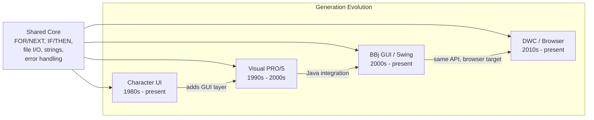

import Tabs from '@theme/Tabs';
import TabItem from '@theme/TabItem';

# The BBj Challenge

:::tip[TL;DR]
BBj is a programming language with a 40+ year lineage spanning four distinct generations --
from 1980s character terminals to modern browser applications. Generic LLMs like ChatGPT
and GitHub Copilot have essentially zero BBj training data and will hallucinate incorrect
code when asked for help. A custom fine-tuned model is the only viable path to AI-powered
BBj development tools.
:::

When a developer asks an AI assistant to "create a button in BBj," the response should depend on which of BBj's four generations they are targeting. Instead, every mainstream LLM produces the same result: fabricated code that looks vaguely like Visual Basic and does not compile. This is not a prompt engineering problem. It is a training data problem -- and it demands a fundamentally different approach to AI tooling.

BBj is not simply an obscure language. It is the living descendant of Business BASIC, a lineage that began on minicomputers in the late 1970s and has been continuously evolved by BASIS International through four major generations. Each generation introduced new paradigms -- terminal I/O, Windows-style GUI, Java Swing integration, browser rendering -- while preserving full backward compatibility. The result is a uniquely layered language where code from 1985 and code from 2025 coexist in the same runtime.

This chapter examines what makes BBj fundamentally different from languages that LLMs handle well, and why that difference demands a purpose-built AI strategy.

## Four Generations of BBj

BBj's evolution is not the typical story of a language replacing its predecessor. Each generation added capabilities on top of the previous ones, and all four remain valid, compilable BBj code today. A single enterprise codebase may contain modules written across three decades.



### Character UI (1980s -- present)

The original generation. Programs run in a terminal and use `@(x,y)` cursor positioning for all screen layout. Mnemonics control terminal behavior -- clearing the screen, setting colors, positioning the cursor. There are no windows, no buttons, no mouse events. Everything is `PRINT` and `INPUT`.

```bbj title="Character UI -- Terminal I/O"
PRINT 'CS',
PRINT @(10,5),"Customer Name: ",
INPUT name$
PRINT @(10,7),"Hello, ",name$,"!"
```

Character-mode programs are still in active production at enterprises running BBj-based ERP and accounting systems. Developers maintaining these systems need AI that understands `@(x,y)` positioning, mnemonic codes, and the procedural `GOSUB`/`RETURN` flow that predates structured programming.

### Visual PRO/5 (1990s -- 2000s)

The first graphical generation. Visual PRO/5 introduced Windows-style GUI elements through a verb-based syntax: `WINDOW CREATE`, `BUTTON CREATE`, `CTRL()` for reading control values. Positioning still used character-cell coordinates (`@(col,row)`), but programs could now display windows, buttons, menus, and dialogs.

```bbj title="Visual PRO/5 -- Verb-Based GUI"
WINDOW CREATE wnd_id, @(0,0), 80, 24, "Order Entry"
BUTTON CREATE btn_id, wnd_id, "Save", @(10,20), 12, 1
status = CTRL(wnd_id, 6)
```

Visual PRO/5 is largely superseded by BBj GUI, but legacy code in this style still exists and occasionally needs maintenance. An AI tool that does not understand the `WINDOW CREATE` / `BUTTON CREATE` verb pattern will misinterpret this code entirely.

### BBj GUI / Swing (2000s -- present)

A major architectural shift. BBj GUI introduced a Java-based object model accessed through the `BBjAPI()` entry point. Programs create objects, hold references with the `!` suffix convention, and register callbacks by method name. Under the hood, the UI renders via Java Swing.

```bbj title="BBj GUI -- Object-Oriented API"
sysgui! = BBjAPI().getSysGui()
window! = sysgui!.addWindow(100, 100, 800, 600, "Order Entry")
button! = window!.addButton(101, 10, 530, 100, 25, "Save")
button!.setCallback(button!.ON_BUTTON_PUSH, "handleSave")
```

This generation introduced BBj's class system (`class`/`classend`, `method`/`methodend`), `use` statements for Java interop, and field references with `#` (e.g., `#window!` inside a class). It is the dominant style for new BBj development.

### DWC / Browser (2010s -- present)

DWC (Dynamic Web Client) uses the **same BBjAPI** as BBj GUI but renders the application in a web browser instead of a Swing window. From the developer's perspective, the code is nearly identical -- the key addition is `BBjWebManager` for browser-specific operations like executing JavaScript or responding to browser events.

```bbj title="DWC -- Browser Rendering with BBjWebManager"
bui! = BBjAPI().getWebManager()
bui!.setCallback(bui!.ON_BROWSER_CLOSE, "handleClose")
index = bui!.executeAsyncScript("navigator.userAgent", 1)
```

DWC is the strategic direction for BBj applications. It enables deploying existing BBj GUI code to the browser with minimal changes, while also exposing browser-native capabilities. New applications increasingly target DWC from the start.

## Cross-Generation Code Comparison

The argument for custom AI tooling becomes visceral when you see the same task implemented across all four generations. Consider two fundamental operations: displaying a greeting and handling user interaction.

### Task: Display a Greeting

<Tabs groupId="bbj-generation">
<TabItem value="character" label="Character UI" default>

```bbj title="Character UI (1980s)"
PRINT 'CS',
PRINT @(10,3),"Welcome to Order Entry"
PRINT @(10,5),"Press any key to continue..."
INPUT x$
```

</TabItem>
<TabItem value="vpro5" label="Visual PRO/5">

```bbj title="Visual PRO/5 (1990s)"
WINDOW CREATE wnd, @(5,3), 40, 8, "Welcome"
BUTTON CREATE btn, wnd, "Continue", @(14,5), 12, 1
```

</TabItem>
<TabItem value="gui" label="BBj GUI">

```bbj title="BBj GUI / Swing (2000s)"
sysgui! = BBjAPI().getSysGui()
window! = sysgui!.addWindow(200, 150, 400, 200, "Welcome")
window!.addStaticText(100, 20, 30, 360, 25, "Welcome to Order Entry")
window!.addButton(101, 150, 120, 100, 30, "Continue")
```

</TabItem>
<TabItem value="dwc" label="DWC / Browser">

```bbj title="DWC / Browser (2010s)"
sysgui! = BBjAPI().getSysGui()
window! = sysgui!.addWindow("Welcome", $01101000$)
window!.addStaticText(100, "Welcome to Order Entry")
window!.addButton(101, "Continue")
bui! = BBjAPI().getWebManager()
bui!.setTitle("Welcome to Order Entry")
```

</TabItem>
</Tabs>

### Task: Read a Customer Record

<Tabs groupId="bbj-generation">
<TabItem value="character" label="Character UI" default>

```bbj title="Character UI (1980s)"
PRINT @(0,2),"Customer ID: ",
INPUT custId$
OPEN (1)"customers.dat"
READ (1, KEY=custId$, err=*next) name$, balance
PRINT @(0,4),"Name: ",name$
CLOSE (1)
```

</TabItem>
<TabItem value="vpro5" label="Visual PRO/5">

```bbj title="Visual PRO/5 (1990s)"
custId$ = CTRL(wnd, 3)
OPEN (1)"customers.dat"
READ (1, KEY=custId$, err=*next) name$, balance
CTRL(wnd, 5, 0) = name$
CLOSE (1)
```

</TabItem>
<TabItem value="gui" label="BBj GUI">

```bbj title="BBj GUI / Swing (2000s)"
custId$ = idField!.getText()
ch = unt
OPEN (ch)"customers.dat"
READ (ch, KEY=custId$, err=*next) name$, balance
nameField!.setText(name$)
CLOSE (ch)
```

</TabItem>
<TabItem value="dwc" label="DWC / Browser">

```bbj title="DWC / Browser (2010s)"
custId$ = idField!.getText()
ch = unt
OPEN (ch)"customers.dat"
READ (ch, KEY=custId$, err=*next) name$, balance
nameField!.setText(name$)
CLOSE (ch)
REM Same API as BBj GUI -- DWC renders in browser
```

</TabItem>
</Tabs>

Notice how the file I/O core (`OPEN`, `READ`, `CLOSE`) is identical across generations -- it is the UI layer and variable access patterns that diverge. An AI model must understand both the universal core and the generation-specific surface syntax to be useful.

## Universal vs. Generation-Specific Syntax

BBj's shared core is substantial. String handling, numeric operations, control flow, file I/O, and error handling work identically whether you are writing a character-mode program or a DWC application. The generations diverge at the UI and interaction layer.

| Scope | Applies To | Examples |
|-------|-----------|----------|
| **Universal** | All generations | `FOR/NEXT`, `IF/THEN/ELSE`, `GOSUB/RETURN`, string functions (`$` suffix), file I/O (`OPEN`, `READ`, `WRITE`), `SETERR`, `PRINT` (non-UI) |
| **Modern BBj** | BBj GUI + DWC | `class`/`classend`, `method`/`methodend`, `use`, object references (`!` suffix), `BBjAPI()`, field references (`#` prefix) |
| **Any GUI** | Visual PRO/5 + BBj GUI + DWC | Window and control concepts (syntax varies by generation) |
| **DWC Only** | DWC | `BBjWebManager`, `executeAsyncScript`, browser events |
| **Legacy GUI** | Visual PRO/5 | `WINDOW CREATE`, `BUTTON CREATE`, `CTRL()` |
| **Character Only** | Character UI | `@(x,y)` positioning, terminal mnemonics (`'CS'`, `'SF'`, `'SB'`) |

This distinction matters enormously for AI tooling. A model that understands only modern BBj syntax will fail on legacy character-mode code. A model trained only on universal patterns will not know how to create a window. The training data must be **generation-tagged** so the model learns which patterns apply where.

## The Generic LLM Problem

Modern LLMs are trained on billions of lines of public code -- Python, JavaScript, Java, C++, and hundreds of other languages represented on GitHub and Stack Overflow. BBj is not among them. The language is proprietary to BASIS International, with no significant open-source corpus, no Stack Overflow tag with thousands of answers, and no representation in any known LLM training dataset.

The result is not merely ignorance -- it is confident hallucination:

```
User: "How do I create a button in BBj?"

Generic LLM response (hallucinated):
    Dim button As New BBjButton
    button.Caption = "Click Me"
    button.OnClick = Sub()
        MsgBox("Hello")
    End Sub

Correct BBj:
    button! = window!.addButton(101, 10, 10, 100, 25, "Click Me")
    button!.setCallback(button!.ON_BUTTON_PUSH, "handleClick")
```

The LLM does not understand:

- **Object references** ending with `!` (e.g., `window!`, `button!`) -- a BBj convention with no equivalent in mainstream languages
- **String variables** ending with `$` (e.g., `name$`, `custId$`) -- inherited from BASIC but absent from modern LLM training data
- **Field references** starting with `#` (e.g., `#window!`, `#this!`) -- class instance field access
- **The callback pattern** using string method names (`"handleClick"`) rather than function references or lambdas
- **Error handling** via `err=*next` and `SETERR` rather than try/catch
- **Any actual BBjAPI method** -- `addWindow`, `addButton`, `getSysGui`, `getWebManager`, and hundreds of others

RAG (Retrieval-Augmented Generation) can supplement a model's knowledge with documentation context, but it cannot fix fundamental language incomprehension. A model that does not understand BBj's type system, variable naming conventions, or object model will misinterpret even perfect documentation snippets injected into its context window.

:::info[Decision: Custom Fine-Tuned Model Required]
**Choice:** Fine-tune a dedicated BBj language model rather than relying on prompt
engineering or RAG-only approaches with generic LLMs.

**Rationale:** Base LLMs have essentially no BBj training data. Testing shows they
hallucinate VB/VBA-style code when asked about BBj. RAG can supplement but cannot
replace fundamental language comprehension. Fine-tuning teaches the model BBj's
syntax, idioms, and APIs at the weight level.

**Alternatives considered:** Prompt engineering with few-shot examples (insufficient
for code completion), RAG-only approach (fails on syntax-level understanding),
waiting for future LLMs to learn BBj naturally (unlikely given BBj's proprietary
nature and small community).

**Status:** Training data structure defined; base model evaluation underway.
:::

## Why GitHub Copilot Will Not Work

A common question: "Can we just use GitHub Copilot?" The short answer is no -- Copilot is a closed system that does not allow custom models.

| Aspect | GitHub Copilot | What BBj Needs |
|--------|---------------|----------------|
| **Model** | OpenAI Codex/GPT (fixed) | Fine-tuned BBj model |
| **Customization** | None for base completions | Full control over model weights |
| **Training data** | Public GitHub repos | Custom BBj training corpus |
| **Hosting** | GitHub cloud only | Self-hosted option for data privacy |

Copilot does offer extensibility features -- Copilot Extensions for chat plugins, Copilot for Business with policy controls, and the VS Code Language Model API for requesting completions. None of these change the underlying model. The base code completion engine has no meaningful BBj training data, and no amount of context injection through these extension points will teach it the language.

The fundamental mismatch: Copilot's model will suggest `Dim` instead of `declare`, invent method names that do not exist, confuse BBj with VB/VBA, and misinterpret the `!`, `$`, and `#` suffixes that are central to BBj's type system.

Building a custom VSCode extension with our own fine-tuned model is not competing with Copilot -- it is filling a gap that Copilot structurally cannot fill.

## The webforJ Contrast

BASIS International also develops [webforJ](https://webforj.com/), a Java-based web framework. The AI story for webforJ is entirely different -- and the contrast illustrates exactly why BBj needs special treatment.

| Aspect | webforJ | BBj |
|--------|---------|-----|
| **Base language** | Java | BBj (Business BASIC) |
| **LLM training data** | Billions of examples | Near zero |
| **Generic LLM comprehension** | Excellent -- understands Java natively | None -- hallucinates wrong syntax |
| **What AI needs** | Framework-specific context via RAG | Fundamental language understanding via fine-tuning |
| **Fine-tuning required?** | No | Yes -- absolutely essential |
| **Generic tools (Copilot, etc.)** | Work reasonably well | Actively harmful -- teach wrong patterns |

For webforJ, providing an MCP (Model Context Protocol) server that gives AI assistants access to framework documentation is sufficient. The base LLM already understands Java; we just supplement with webforJ-specific API knowledge.

For BBj, we must teach the model the **language itself** before any framework or API knowledge becomes useful. This is a fundamentally harder problem, but it is also what makes the investment worthwhile -- no one else will solve it, and the developers who depend on BBj have no alternative.

## Current Status

:::note[Where Things Stand -- January 2026]
The strategy described in this document is being actively implemented, not just planned.

- **Shipped:** The [bbj-language-server](https://github.com/BBx-Kitchen/bbj-language-server) brings Langium-powered IDE features to VS Code -- syntax highlighting, code completion, diagnostics, formatting, and code execution. It is published on the [VS Code Marketplace](https://marketplace.visualstudio.com/) with 450+ commits and 13 contributors. See [IDE Integration](/docs/ide-integration) for the AI-powered extension roadmap.
- **In progress:** A fine-tuned model based on [Qwen2.5-Coder-7B](/docs/fine-tuning) is being trained with approximately 10,000 curated examples and showing promising results. The generation-tagged training data format described above is in active use.
- **In progress:** Copilot BYOK integration is in early exploration -- initial testing of the fine-tuned model through Copilot Chat shows encouraging results.
- **Validated:** Testing with ChatGPT, Claude, and GitHub Copilot confirms that all major LLMs produce incorrect BBj code. The hallucination pattern is consistent -- they default to VB/VBA-style syntax.
- **webforJ AI tools operational:** The MCP server approach is working for webforJ, validating the broader infrastructure design. BBj is the remaining -- and harder -- challenge.
:::

The chapters that follow detail each component of the strategy: the [unified architecture](/docs/strategic-architecture), [model fine-tuning](/docs/fine-tuning), [IDE integration](/docs/ide-integration), [documentation chat](/docs/documentation-chat), [RAG database design](/docs/rag-database), and the [implementation roadmap](/docs/implementation-roadmap).
