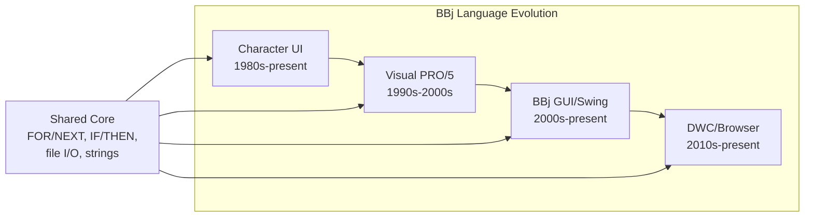

# The BBj Challenge

:::tip[TL;DR]
BBj spans four generations of Business BASIC -- from 1980s character terminals to
modern browser-based DWC applications. Generic LLMs have essentially zero training
data on BBj and will hallucinate incorrect syntax. A custom fine-tuned model is the
only viable path to AI-powered BBj development tools.
:::

BBj is not simply an obscure language -- it is the living descendant of a four-decade lineage that began with Business BASIC on minicomputers. Each generation introduced new paradigms while preserving backward compatibility, creating a uniquely layered codebase that no public LLM training corpus has ever captured. When developers turn to Copilot or ChatGPT for help with BBj, the results range from subtly wrong to completely fabricated.

This chapter examines what makes BBj fundamentally different from languages that LLMs handle well, and why that difference demands a purpose-built AI strategy.

:::info[Decision: Custom Fine-Tuned Model Required]
**Choice:** Fine-tune a dedicated BBj language model rather than relying on prompt
engineering with generic LLMs.

**Rationale:** Base LLMs have essentially no knowledge of BBj syntax, idioms, or APIs.
Testing shows generic models hallucinate VB-style code when asked about BBj. No amount
of RAG context can compensate for fundamental language incomprehension.

**Status:** In progress -- training data structure defined, base model evaluation underway.
:::

The four generations of BBj share a common core of string handling, file I/O, and control flow -- but diverge dramatically in their UI models, event handling, and deployment targets.

:::note[Coming Soon]
This chapter is under active development. Full content covering all four BBj
generations, LLM failure analysis, and the case for custom tooling will be
published as research and writing progress.
:::
