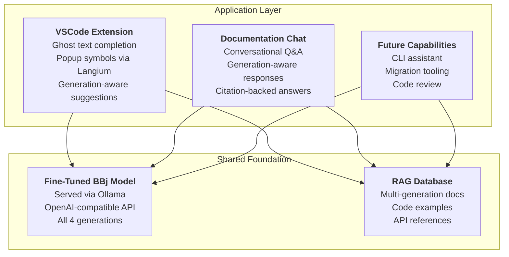
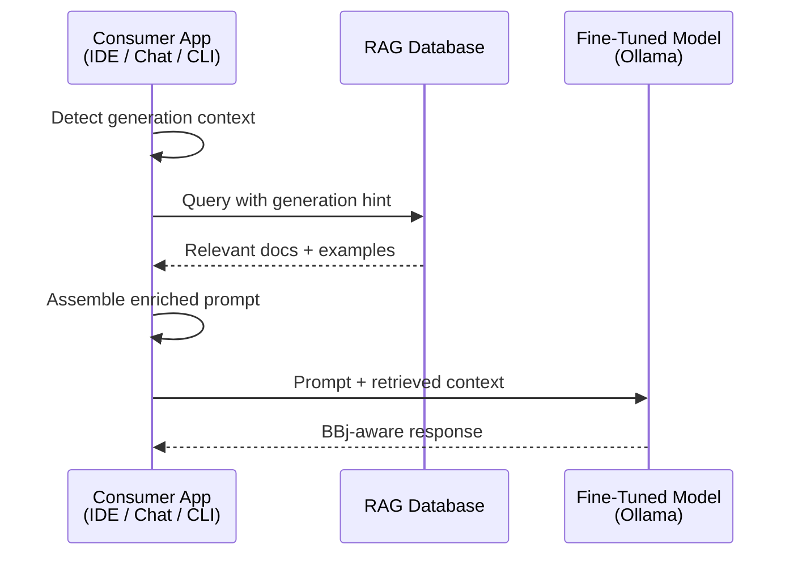

# Strategic Architecture

:::tip[TL;DR]
Instead of building three separate AI systems, the BBj strategy centers on unified
infrastructure: a single fine-tuned model and shared RAG pipeline that powers IDE
completion, documentation chat, and future capabilities from one source of truth.
Build it once, share it everywhere, maintain it in one place.
:::

The [previous chapter](/docs/bbj-challenge) established that BBj is invisible to generic LLMs and that a fine-tuned model is unavoidable. This chapter addresses the next question: **how should that model -- and the infrastructure around it -- be organized?**

The answer is deceptively simple. Every AI-powered BBj tool needs the same two things: a model that understands BBj syntax across all four generations, and a retrieval layer that can surface relevant documentation and code examples. Rather than letting each tool reinvent these capabilities independently, the strategy builds them once as shared infrastructure and exposes them to any consumer application through standard APIs.

This is the architectural decision that makes the entire strategy economically viable. Without it, each new BBj AI capability would require its own model training, its own document pipeline, and its own maintenance burden.

## The Case Against Point Solutions

Consider the alternative: each initiative builds its own AI stack.

The VSCode extension trains a code-completion model. The documentation chat trains a Q&A model. A future CLI assistant trains yet another model. Each team curates its own training data, manages its own RAG database, and deploys its own Ollama instance.

The result is three models that understand BBj slightly differently, three document pipelines that drift out of sync, and three maintenance burdens that grow linearly with every new capability. When a new BBj API is released, three teams update three systems. When a training data bug is found, it must be hunted down in three places.

:::info[Decision: Unified Infrastructure Over Point Solutions]
**Choice:** Build a single shared foundation (fine-tuned model + RAG database) consumed by
all BBj AI applications through standard APIs.

**Rationale:** Unified infrastructure means one training investment benefits every consumer,
documentation updates propagate everywhere automatically, and answers remain consistent
whether a developer asks via IDE or chat. The alternative -- independent AI stacks per
tool -- multiplies cost and introduces inconsistency.

**Alternatives considered:** Per-tool models with shared training data (rejected: still
duplicates compute and deployment); cloud-hosted API with no self-hosting (rejected:
customers need data privacy options).

**Status:** Architecture defined. Model fine-tuning and RAG pipeline are in progress.
:::

## Architecture Overview

The system is organized into two layers: a **shared foundation** that encapsulates all BBj AI knowledge, and an **application layer** where consumer tools access that knowledge through standard interfaces.

Every application in the top layer connects to the same model and the same RAG database. When the model improves through additional fine-tuning, every consumer benefits immediately. When new documentation is indexed into the RAG pipeline, every consumer can surface it in its next response.

The Ollama server exposes an OpenAI-compatible API, which means any tool that speaks the OpenAI protocol -- whether it is a custom VSCode extension, a chat backend, or a third-party integration -- can consume the fine-tuned BBj model without custom client code.

## The Shared Foundation

Two components form the foundation layer. Each is covered in depth in its own chapter; this section explains what they are and why they exist as shared resources.

### Fine-Tuned BBj Model

The core of the infrastructure is a language model fine-tuned specifically on BBj. Starting from a strong open-source code model (the current recommendation is [Qwen2.5-Coder-7B](https://qwenlm.github.io/blog/qwen2.5-coder-family/), selected for its benchmark performance, Apache 2.0 license, and practical size for self-hosting), the model is trained on curated BBj examples covering all four generations.

The fine-tuned model is hosted via [Ollama](https://ollama.com/), which provides:

- **Local deployment** -- runs on commodity hardware, no cloud dependency
- **OpenAI-compatible API** -- standard interface any client can consume
- **Customer self-hosting** -- organizations can run `ollama run bbj-coder` on their own infrastructure for complete data privacy
- **Quantization support** -- Q4/Q8 quantization makes even 7B+ models practical on consumer GPUs

The model develops two capabilities through training:

1. **Comprehension** -- reading and explaining code from any BBj generation, supporting migration and debugging workflows
2. **Generation** -- producing syntactically correct, generation-appropriate BBj code that matches the context of the surrounding codebase

Chapter 3 covers base model selection, training data structure, the QLoRA fine-tuning workflow, and deployment via Ollama in full detail.

### RAG Database

The fine-tuned model provides language understanding, but it cannot memorize every API signature, every version-specific behavior, or every code example in the BBj ecosystem. That is the RAG database's job.

The RAG (Retrieval-Augmented Generation) pipeline stores BBj documentation, API references, code examples, best practices, and migration guides -- all tagged with generation metadata. When a consumer application receives a query, it retrieves relevant context from the RAG database and includes it in the prompt alongside the user's request.

The critical design choice is **generation-aware tagging**. Every document chunk carries metadata indicating which BBj generation(s) it applies to:

- `"all"` -- universal syntax like `FOR/NEXT`, string functions, file I/O
- `["bbj-gui", "dwc"]` -- modern object-oriented API patterns
- `["vpro5"]` -- legacy Visual PRO/5 verb-based syntax
- `["character"]` -- character terminal mnemonics

This tagging enables the retrieval layer to prioritize generation-appropriate documentation. When a developer is working in DWC code, the system surfaces modern API references first -- while still including legacy documentation when relevant for migration context.

Chapter 6 covers the multi-generation document structure, embedding strategy, and retrieval algorithms in detail.

### How They Work Together

When any consumer application handles a request, the shared foundation operates as a pipeline:

1. The consumer app detects the generation context (from the code being edited, the user's question, or explicit configuration)
2. It queries the RAG database with a generation hint, retrieving the most relevant documentation
3. The retrieved context is assembled into a prompt alongside the user's input
4. The fine-tuned model processes the enriched prompt and returns a generation-appropriate response

This flow is identical regardless of whether the consumer is the VSCode extension completing code, the documentation chat answering a question, or a future CLI tool suggesting fixes. The shared foundation handles the BBj-specific intelligence; the consumer apps handle their domain-specific UX.

## Three Initiatives

The shared foundation supports three planned consumer applications. Each is introduced briefly here and covered in full in its own chapter.

### VSCode Extension (Chapter 4)

The IDE integration combines **Langium-powered language server capabilities** with **AI-powered code completion** to deliver a development experience comparable to what mainstream languages enjoy through Copilot.

Langium provides deterministic, 100%-correct completions for symbols, types, and keywords -- the things a parser can resolve definitively. The fine-tuned model provides generative completions for multi-line code, pattern completion, and context-aware suggestions -- the things that require understanding intent.

The extension is generation-aware: it detects whether the developer is working in character UI, Visual PRO/5, BBj GUI, or DWC code and adjusts its suggestions accordingly. A developer editing a 1990s Visual PRO/5 module receives `PRINT (sysgui)'WINDOW'(...)` suggestions; a developer building a new DWC application receives `BBjAPI()` patterns.

### Documentation Chat (Chapter 5)

A conversational AI interface embedded in the BBj documentation website, allowing developers to ask natural language questions and receive accurate, cited answers.

Unlike generic documentation chat services (Algolia Ask AI, kapa.ai), which rely on base LLMs that have no BBj understanding, this system uses the shared fine-tuned model. The chat backend queries the shared RAG database for relevant documentation, assembles an enriched prompt, and streams a response with source citations.

The chat system is generation-aware in the same way as the IDE extension: it detects generation hints in the user's question and prioritizes appropriate documentation. A question about "creating a window" yields different primary answers depending on whether the user mentions Visual PRO/5 or DWC context.

### Future Capabilities

The unified architecture is designed to support capabilities beyond the initial two applications:

- **CLI assistant** -- terminal-based BBj help for developers who prefer command-line workflows
- **Migration tooling** -- automated analysis and modernization suggestions for legacy BBj codebases
- **Code review** -- generation-aware review that flags deprecated patterns and suggests modern alternatives
- **Training data feedback loop** -- user questions and corrections from chat and IDE usage feed back into model improvement

Each of these capabilities requires the same two things -- a model that understands BBj and a retrieval layer with BBj documentation. Because those exist as shared infrastructure, adding a new consumer application is primarily a UX problem, not an AI problem.

## Benefits of This Approach

The unified architecture creates different value for different stakeholders.

**For leadership and decision-makers:**
- **Single investment, multiple returns** -- one fine-tuning effort and one RAG pipeline serve every current and future BBj AI tool
- **Consistent messaging** -- the same model ensures consistent guidance regardless of which tool a developer uses
- **Predictable scaling** -- adding new AI capabilities is incremental cost, not new infrastructure
- **Customer offering** -- self-hosted Ollama deployment enables customers to run BBj AI tools on their own infrastructure

**For developers building with the infrastructure:**
- **Standard API** -- Ollama's OpenAI-compatible endpoint means any HTTP client works; no proprietary SDK needed
- **Separation of concerns** -- consumer apps focus on UX, not AI/ML plumbing
- **Shared improvements** -- model retraining and RAG updates benefit all consumers automatically
- **Generation context** -- the foundation provides generation detection and appropriate document retrieval out of the box

**For BBj developers using the tools:**
- **Consistent answers** -- the same question gets the same answer whether asked in the IDE, in documentation chat, or via a CLI tool
- **Generation awareness** -- tools understand which BBj generation is in play and adapt accordingly
- **Privacy option** -- self-hosted deployment means sensitive code never leaves the organization's network
- **Improving over time** -- the feedback loop from usage across all tools continuously improves model quality

## Current Status

:::note[Where Things Stand -- January 2026]
The unified architecture is being built incrementally -- foundation first, consumers next.

- **Shipped:** The [bbj-language-server](https://github.com/BBx-Kitchen/bbj-language-server) (v0.5.0) is published on the [VS Code Marketplace](https://marketplace.visualstudio.com/) with syntax highlighting, completion, diagnostics, formatting, and code execution. This is the first consumer application of the shared foundation.
- **In progress:** The [fine-tuned BBj model](/docs/fine-tuning) -- the core of the shared foundation -- is being trained on Qwen2.5-Coder-7B with approximately 10,000 curated examples and showing promising results.
- **In progress:** [Copilot BYOK integration](/docs/ide-integration#the-copilot-bridge) is in early exploration as an interim bridge for chat-based BBj assistance.
- **Planned:** The [RAG pipeline](/docs/rag-database) (shared foundation component #2) -- source corpus identified (MadCap Flare documentation), ingestion pipeline not yet built.
- **Planned:** [Documentation chat](/docs/documentation-chat) -- architectural requirements defined, implementation depends on the model and RAG pipeline.
:::

| Component | Status | Next Steps |
|-----------|--------|------------|
| Fine-tuned BBj model | ~10K training examples curated; Qwen2.5-Coder-7B fine-tuning in progress | Expand dataset, establish evaluation benchmarks, validate for IDE completion |
| RAG database | Schema designed with generation-aware tagging | Build ingestion pipeline, index BBj documentation |
| VSCode extension | v0.5.0 shipped on Marketplace; AI integration planned | Add ghost text completion via fine-tuned model |
| Documentation chat | Architecture defined | Build chat backend after model and RAG are operational |
| Ollama deployment | Validated for model serving | Package fine-tuned model, test customer self-hosting |

The chapters that follow cover each component in implementation-level detail: [model fine-tuning](/docs/fine-tuning) (Chapter 3), [IDE integration](/docs/ide-integration) (Chapter 4), [documentation chat](/docs/documentation-chat) (Chapter 5), [RAG database design](/docs/rag-database) (Chapter 6), and the [implementation roadmap](/docs/implementation-roadmap) with timelines and resource planning (Chapter 7).
