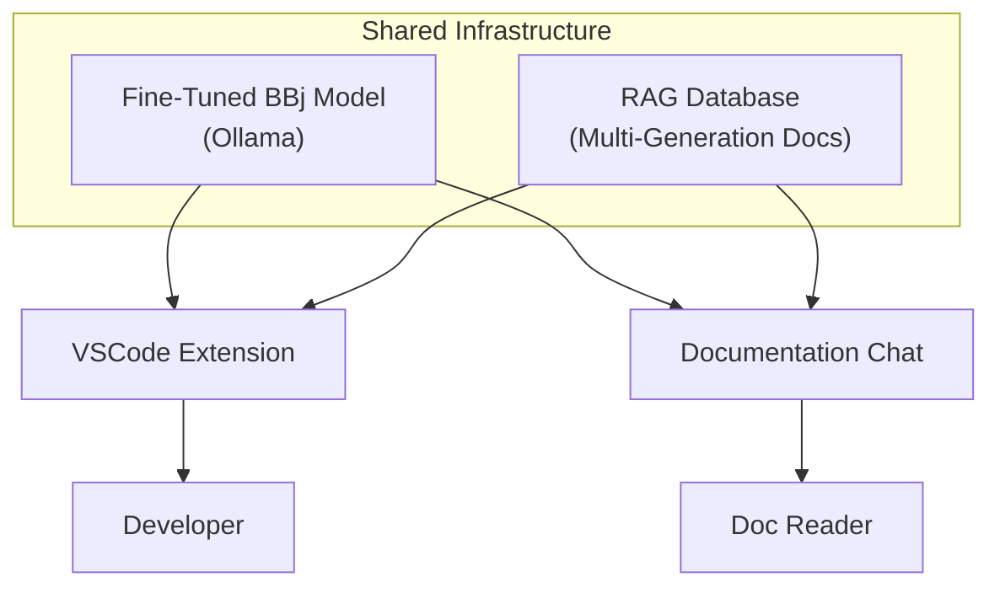

# Strategic Architecture

:::tip[TL;DR]
Rather than building isolated AI tools, the BBj strategy centers on a unified
infrastructure: a shared fine-tuned model and RAG pipeline that powers IDE completion,
documentation chat, and future AI capabilities from a single source of truth.
:::

The core insight behind this architecture is that BBj AI capabilities should not be developed as independent point solutions. A code completion engine, a documentation chatbot, and future tools all need the same foundational understanding of BBj -- its syntax, its four generations, its APIs, and its idioms. Building that understanding once and sharing it across all consumer applications is both more efficient and more maintainable than duplicating effort across siloed tools.

The diagram below illustrates how the shared infrastructure layer connects to the two primary consumer applications planned for initial delivery.

:::note[Coming Soon]
This chapter is under active development. Full architectural documentation including
component interactions, data flow, and deployment topology will be published as
research and writing progress.
:::
