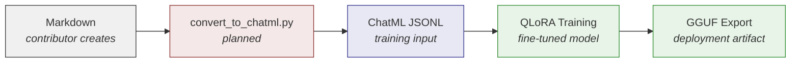
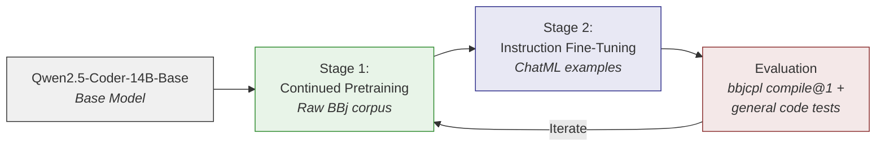
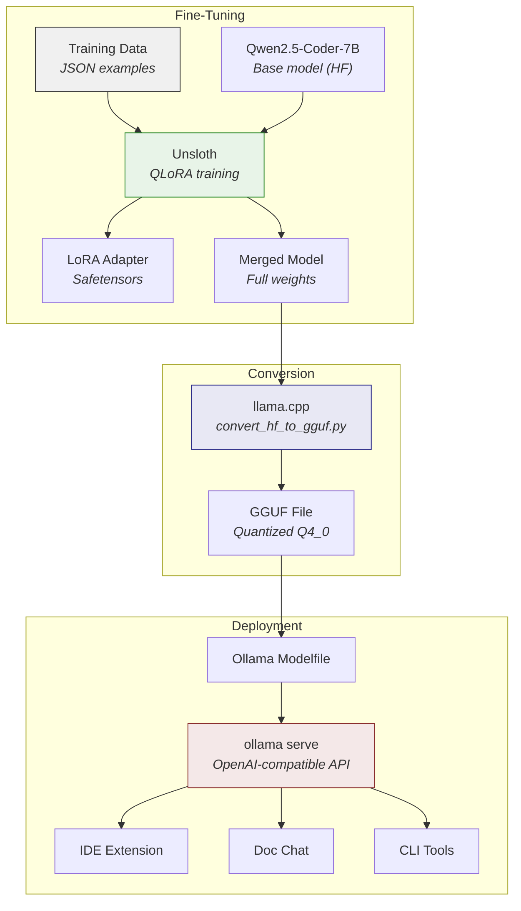
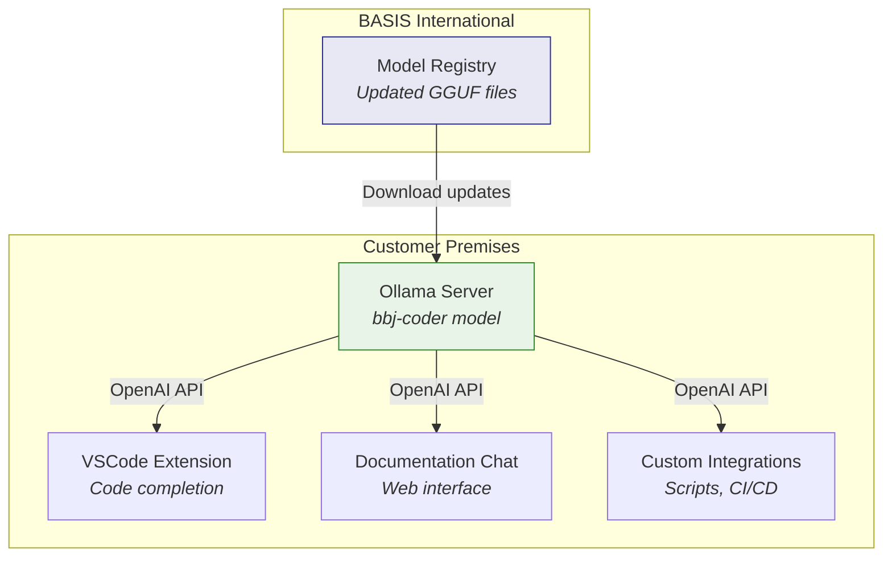

# Fine-Tuning the Model

:::tip[TL;DR]
We fine-tune [Qwen2.5-Coder-14B-Base](https://qwenlm.github.io/blog/qwen2.5-coder-family/) using a two-stage QLoRA approach -- continued pretraining on raw BBj source code, then instruction fine-tuning on curated ChatML examples -- informed by findings from the [bbjllm](https://gitlab.basis.cloud/bbj-llm) experiment. The resulting model is exported to GGUF format, evaluated using the bbjcpl compiler's compile@1 metric, and served through [Ollama](https://ollama.com/) for local, self-hosted inference with zero per-query costs and complete data privacy.
:::

The foundation of the entire BBj AI strategy is a fine-tuned language model. Every other component -- IDE integration, documentation chat, migration tooling -- depends on a model that actually understands BBj syntax, idioms, and multi-generational patterns. Generic LLMs cannot provide this. As [Chapter 1](/docs/bbj-challenge) establishes, BBj is effectively invisible in public training corpora. Fine-tuning bridges that gap.

This chapter is the technical blueprint: what the existing bbjllm experiment established and where the recommended approach diverges, why Qwen2.5-Coder-14B-Base is the recommended base model, how training data is structured and pipelined, how two-stage QLoRA training addresses the unique challenges of a zero-representation language, how to evaluate the results using BBj's own compiler, and how the finished model reaches end users through Ollama.

## The bbjllm Foundation

The [bbjllm repository](https://gitlab.basis.cloud/bbj-llm) represents a valuable first attempt at fine-tuning a BBj-aware code model. It demonstrated that fine-tuning is feasible for BBj, produced working training infrastructure, and created a substantial dataset of curated examples. The recommended approach described in this chapter builds on that foundation while addressing specific gaps identified through analysis of the training methodology.

### What bbjllm Built

The bbjllm experiment accomplished several important things:

- **Working QLoRA pipeline:** A functional training script using Qwen2.5-Coder-32B-Instruct with 4-bit NF4 quantization, LoRA rank 32, and alpha 64 -- a sound, standard QLoRA configuration.
- **9,922 curated ChatML examples:** A substantial dataset in ChatML format aligned with Qwen's native chat template, covering BBj comprehension, completion, and explanation tasks.
- **Proved fine-tuning viability for BBj:** Demonstrated that QLoRA can adapt a general-purpose code model toward BBj-specific tasks, establishing the foundation for continued iteration.
- **Established Qwen2.5-Coder as the right model family:** Validated that the Qwen2.5-Coder architecture is suitable for BBj fine-tuning, narrowing the model selection question to which variant and size.
- **Correct target module selection:** Applied LoRA to all linear layers including MLP -- the recommended configuration for code tasks.

### Current Approach vs. Recommended Approach

| Aspect | bbjllm Current | Recommended Approach |
|--------|---------------|---------------------|
| **Model** | Qwen2.5-Coder-32B-Instruct | Qwen2.5-Coder-14B-Base |
| **Model variant** | Instruct (pre-aligned) | Base (clean slate for domain adaptation) |
| **Training stages** | Single stage (instruction fine-tuning only) | Two stages (continued pretraining + instruction fine-tuning) |
| **Loss computation** | Full sequence (system + user + assistant) | Completion only (assistant response tokens) |
| **Validation** | None (100% data used for training) | 90/10 train/validation split with periodic evaluation |
| **Learning rate** | 2e-5 | 2e-4 to 5e-5 (QLoRA-recommended range) |
| **Library stack** | PEFT 0.12.0 + transformers 4.44.0 | Unsloth 2026.1.4 (2-3x faster, 70% less VRAM) |
| **Evaluation** | 3 hardcoded test questions | bbjcpl-based compile@1 metric + held-out test set |
| **Artifact management** | Adapters on training server only | Version-controlled with model cards |

### Gaps the Recommended Approach Addresses

Analysis of the bbjllm training methodology identified three issues that should be resolved before the next training iteration.

**1. No validation set.** The training script uses 100% of the 9,922 examples for training with zero held-out data. Without a validation set, there is no way to detect overfitting -- the model may memorize training examples rather than learning generalizable BBj patterns. The training loss will decrease regardless of whether the model is actually improving. **Fix:** Reserve 10% of examples as a validation set and configure `evaluation_strategy="steps"` to monitor validation loss during training.

**2. Full-sequence loss computation.** The training script computes loss on the entire sequence: system prompt, user question, and assistant response. The system prompt ("You are an expert BBj programmer...") appears identically in all 9,922 examples, and the user questions are fixed input text. Computing gradients on these constant tokens wastes an estimated 30-40% of the gradient signal on tokens the model does not need to learn to generate. **Fix:** Mask non-assistant tokens in the loss computation (set labels to -100 for system and user tokens), or use TRL's SFTTrainer which handles completion-only training automatically.

**3. Instruct model choice.** Fine-tuning Qwen2.5-Coder-32B-Instruct -- a model already trained to follow instructions -- on domain-specific BBj data risks degrading the instruction-following capability that makes the model useful in the first place. This phenomenon, known as the alignment tax, is discussed in detail in the [Base Model Selection](#the-alignment-tax) section below. **Fix:** Switch to a Base variant (14B-Base recommended) where domain adaptation starts from a clean foundation rather than overwriting existing instruction alignment.

The recommended approach described in the remainder of this chapter builds on bbjllm's foundation -- the same model family, the same QLoRA method, the same curated dataset -- while addressing these three gaps to improve training outcomes.

## Base Model Selection

Choosing the right base model determines the ceiling for the fine-tuned result. The model must be capable enough to learn a new language from relatively few examples, licensed for commercial deployment, and available in a Base variant suitable for domain adaptation.

:::info[Decision: Qwen2.5-Coder-14B-Base as Primary Recommendation]
**Choice:** Qwen2.5-Coder-14B-Base for fine-tuning, selected based on research into training outcomes and alignment characteristics.

**Rationale:** 14B shows greater improvement from fine-tuning than 7B (per [Qwen technical report](https://arxiv.org/html/2409.12186v3)), remains trainable on a single 24GB GPU, and the Base variant avoids the alignment tax of fine-tuning an already instruction-tuned model.

**Alternatives considered:** 7B-Base (smaller but less fine-tuning headroom), 32B-Instruct (used by bbjllm; higher base quality but alignment tax makes domain adaptation counterproductive).

**Status:** Active research -- bbjllm experiment used 32B-Instruct; research recommends switching to 14B-Base for next training iteration.
:::

### Why Qwen2.5-Coder

The [Qwen2.5-Coder family](https://arxiv.org/html/2409.12186v3) (released September 2024 by Alibaba's Qwen team) represents the current state of the art for open-source code models at fine-tunable sizes. The bbjllm experiment validated this choice, and the recommended approach stays within the same model family. Key facts:

- **Sizes available:** 0.5B, 1.5B, 3B, 7B, 14B, 32B (both Base and Instruct variants)
- **Training data:** 5.5 trillion tokens -- 70% code, 20% text, 10% math -- covering 92+ programming languages
- **Benchmarks:** The 14B-Instruct variant exceeds the 7B on all code benchmarks, while the 32B-Instruct matches GPT-4o on code generation tasks. Critically, the [Qwen technical report](https://arxiv.org/html/2409.12186v3) shows the 14B model demonstrates greater improvement from fine-tuning compared to smaller variants.
- **License:** Apache 2.0 -- fully permissive for commercial use, modification, and redistribution
- **FIM support:** Native fill-in-the-middle capability, critical for IDE code completion where the model must generate code between existing lines

### Training Suitability Comparison

The choice between model variants is primarily about training suitability -- how well the model responds to fine-tuning on a niche language like BBj:

| Model | Parameters | Fine-Tuning Improvement | Base vs Instruct | Alignment Tax Risk | Recommendation |
|-------|-----------|------------------------|-----------------|-------------------|---------------|
| Qwen2.5-Coder-7B-Base | 7B | Moderate | Base (clean slate) | None | Starting point for experimentation |
| **Qwen2.5-Coder-14B-Base** | **14B** | **High** (per Qwen technical report) | **Base (clean slate)** | **None** | **Primary recommendation** |
| Qwen2.5-Coder-32B-Instruct | 32B | Low (alignment tax) | Instruct (pre-aligned) | High | Not recommended for domain fine-tuning |

The 14B-Base model occupies the sweet spot: large enough to show substantial improvement from fine-tuning on new domain data, small enough to train on a single GPU, and available as a Base variant that avoids the alignment tax entirely.

### The Alignment Tax

Fine-tuning an Instruct model on BBj data risks degrading its ability to follow instructions -- the very capability that makes it useful. This is the alignment tax: the hidden cost of fine-tuning a model that has already been trained to follow instructions.

The mechanism is straightforward. An Instruct model's weights encode *both* domain knowledge (how to write code) *and* instruction-following behavior (how to structure responses, handle multi-step prompts, refuse harmful requests). When you fine-tune on domain-specific BBj data, the training process cannot selectively update only the "code knowledge" portion of the weights. It overwrites both simultaneously. The model may learn BBj syntax but degrade its response quality, producing less structured answers, ignoring parts of complex prompts, or losing its ability to explain its reasoning.

Research confirms this risk. The [Shadow-FT study](https://arxiv.org/abs/2505.12716) (ICLR 2025) demonstrates that directly fine-tuning Instruct models on domain data can lead to "marginal improvements and even performance degeneration." The authors propose fine-tuning a Base model instead and grafting the weight deltas onto the Instruct version -- evidence that the research community recognizes Instruct fine-tuning as problematic for domain adaptation.

For BBj specifically, this is why the bbjllm experiment's choice of 32B-Instruct is identified as an area for improvement. The model may learn to generate syntactically valid BBj code, but it may simultaneously lose the instruction-following quality that makes a coding assistant useful -- producing code without adequate explanation, misunderstanding multi-part prompts, or generating responses that do not address what was asked.

This is why the recommended approach uses 14B-Base, not 32B-Instruct. Starting from a Base model means the two-stage training process (continued pretraining for syntax, instruction fine-tuning for response quality) builds both capabilities from a clean foundation rather than risking degradation of existing alignment.

### Landscape Comparison (as of February 2026)

Beyond the three Qwen variants under active consideration, the broader code model landscape provides additional context:

| Model | Size | FIM | License | Notes |
|-------|------|-----|---------|-------|
| **Qwen2.5-Coder (7B/14B/32B)** | 7-32B dense | Yes | Apache 2.0 | **Recommended family.** Proven fine-tuning ecosystem, Base + Instruct variants |
| Qwen3 dense (0.6B-32B) | 0.6-32B dense | Yes | Apache 2.0 | Newer architecture; not yet evaluated for BBj fine-tuning |
| Qwen3-Coder | 480B/30B MoE | Yes | Apache 2.0 | MoE-only (no dense variants); impractical for single-GPU fine-tuning |
| CodeLlama-7B | 7B dense | Yes | Llama 2 | Superseded by Qwen family on all code benchmarks |
| StarCoder2-7B | 7B dense | Yes | BigCode Open | Superseded by Qwen family on all code benchmarks |

The original strategy paper (January 2025) listed CodeLlama, DeepSeek Coder, and StarCoder2 as candidates. All three have been superseded by Qwen2.5-Coder on code generation benchmarks. [Qwen3-Coder](https://github.com/QwenLM/Qwen3-Coder) (released July 2025) offers impressive capabilities but ships only in large MoE sizes that are impractical for single-GPU fine-tuning and customer self-hosting. The Qwen3 dense models (non-Coder variants) exist but have not been evaluated for BBj fine-tuning. As the Qwen3 ecosystem matures, it may become the preferred base.

Model selection is not a permanent decision. The fine-tuning pipeline described below is model-agnostic -- when a better base model emerges, we retrain on the same curated data.

## Training Data Structure

The quality of training data determines the quality of the fine-tuned model. For a low-resource language like BBj, this is the single most important factor -- more important than model size, hyperparameter tuning, or training duration.

### Format and Schema

Each training example is a Markdown file with YAML front matter for metadata and structured content sections. The critical design choice is **generation labeling**: every example is tagged with the BBj generation(s) it applies to, so the model learns to distinguish between character UI patterns, Visual PRO/5 idioms, modern BBj GUI code, and DWC browser-based patterns.

````markdown title="training-data/gui/hello-window.md"
---
title: "Hello World Window"
type: completion
generation: ["bbj-gui", "dwc"]
difficulty: basic
tags: [gui, window, sysgui, hello-world]
description: "Create and display a basic BBj window"
---

## Code

```bbj
REM Hello World Window - Modern BBj
sysgui! = BBjAPI().getSysGui()
window! = sysgui!.addWindow(100, 100, 400, 300, "Hello World")
window!.setCallback(window!.ON_CLOSE, "handleClose")

process_events

handleClose:
    release
```

## Expected Behavior

A 400x300 pixel window appears at screen position (100,100)
with the title "Hello World". The window remains open until
the user closes it, at which point the program terminates cleanly.

## Explanation

1. **Get GUI manager**: `BBjAPI().getSysGui()` returns the
   system GUI interface
2. **Create window**: `addWindow(x, y, width, height, title)`
   creates a top-level window
3. **Handle close event**: `setCallback()` connects the
   window's close event to a label
4. **Event loop**: `process_events` starts the BBj event
   processing loop
5. **Cleanup**: `release` frees all resources and exits
````

The **generation label** uses a simple schema:

| Label | Scope | Examples |
|-------|-------|---------|
| `"all"` | Universal patterns | FOR/NEXT loops, file I/O, string functions |
| `"character"` | Character UI (1980s) | `PRINT @(x,y)`, `INPUT` |
| `"vpro5"` | Visual PRO/5 (1990s) | `PRINT (sysgui)'WINDOW'(...)`, `PRINT (sysgui)'BUTTON'(...)`, `CTRL(sysgui,id,index)` |
| `"bbj-gui"` | BBj GUI/Swing (2000s) | `BBjAPI().getSysGui()`, `addWindow()` |
| `"dwc"` | DWC/Browser (2010s+) | `getWebManager()`, `executeAsyncScript` |
| `["bbj-gui", "dwc"]` | Subset array | Patterns shared by modern generations |

### Example Types

Training examples fall into four categories, each teaching the model a different capability:

- **Comprehension** -- "Explain this BBj code." The model learns to read and describe legacy patterns, a prerequisite for migration assistance.
- **Completion** -- "Complete this code." The model learns to generate syntactically valid BBj that matches the surrounding generation context.
- **Migration** -- "Convert this Visual PRO/5 code to modern BBj." The model learns to bridge between generations.
- **Explanation** -- "What does `BBjAPI().getSysGui()` do?" The model learns API semantics.

### BBj Code in Training Data

To illustrate what the model learns from, here is a modern BBj event handler -- the kind of pattern that generic LLMs consistently fabricate:

```bbj title="Modern BBj Event Handler"
class public OrderForm

    field private BBjTopLevelWindow window!
    field private BBjEditBox customerField!
    field private BBjButton saveButton!

    method public void create()
        sysgui! = BBjAPI().getSysGui()
        #window! = sysgui!.addWindow(100, 100, 600, 400, "Order Entry")
        #customerField! = #window!.addEditBox(201, 80, 30, 200, 25)
        #saveButton! = #window!.addButton(202, 80, 350, 100, 25, "Save")
        #saveButton!.setCallback(#saveButton!.ON_BUTTON_PUSH, #this!, "onSave")
    methodend

    method public void onSave(BBjButtonPushEvent event!)
        customer$ = #customerField!.getText()
        rem Process the order...
    methodend

classend
```

A fine-tuned model that has seen hundreds of examples like this will understand that `!` suffixes denote object references, that `#` prefixes reference instance fields, and that `methodend` closes a method block -- none of which a generic LLM knows.

### Volume and Quality Targets

Current research consistently shows that **data quality outweighs data quantity** for instruction fine-tuning. One thousand carefully curated, expert-reviewed examples can outperform ten thousand hastily generated ones.

The data collection strategy combines two independent efforts:

1. **bbjllm dataset:** 9,922 ChatML examples created independently, covering BBj comprehension, completion, and explanation tasks. This dataset has known quality issues (duplicate entries, formatting inconsistencies) that should be addressed before the next training iteration.
2. **training-data/ repository (this repo):** 2 seed examples in Markdown format with JSON Schema validation, organized across 7 topic directories ready for expansion. This is the canonical format for new contributions.
3. **Iterative expansion (Ongoing):** Analyze model failures in evaluation, create targeted examples for weak areas, retrain.

:::info[Decision: Quality-First Data Strategy]
**Choice:** Start with a smaller, expert-curated dataset rather than attempting to scrape or auto-generate tens of thousands of examples upfront.

**Rationale:** For low-resource languages, training data quality is the dominant factor in model performance. A [fine-tuned 7B model on high-quality data can match a 70B general model](https://www.gocodeo.com/post/fine-tuning-llms-for-low-resource-languages-challenges-opportunities) on domain-specific tasks. Investing engineering time in data curation yields better returns than investing in larger models or longer training.

**Alternatives considered:** Bulk scraping of BBj source repositories (risk of including broken/outdated code), fully automated synthetic generation (risk of compounding errors without human review).

**Status:** The bbjllm repository contains 9,922 ChatML examples created independently. The training-data/ repository provides 2 seed examples in Markdown format with JSON Schema validation and contributor guides. Conversion pipeline from Markdown to ChatML is planned.
:::

### Training Data Pipeline

Two repositories contribute to the training data, each serving a different role:

**training-data/ (this repository):** The canonical source for new training examples. Contributors create Markdown files with YAML front matter specifying the example type, target generation(s), and difficulty level. Files are validated against a JSON Schema and organized by topic (`gui/`, `file-io/`, etc.). This format is human-readable, GitHub-renderable, and designed for expert review.

**bbjllm (separate repository):** Contains 9,922 ChatML JSONL examples -- the actual input to the training script. These examples were created independently using a different workflow, not converted from the training-data/ Markdown format.

**Conversion pipeline (planned):** A `convert_to_chatml.py` script will transform training-data/ Markdown examples into ChatML JSONL suitable for training. This pipeline does not yet exist. The bbjllm examples and training-data/ examples are currently disconnected -- unifying them through a conversion pipeline is a planned improvement.

The intended flow from contribution to deployment:



The bbjllm dataset also has known quality issues -- approximately 375 duplicate entries and 60 examples with formatting inconsistencies -- that should be cleaned before the next training run. These are manageable data preprocessing tasks, not fundamental problems with the dataset.

## The QLoRA Fine-Tuning Approach

Full fine-tuning of a 14B parameter model requires updating all ~14 billion weights, demanding multiple high-end GPUs and substantial memory. **QLoRA** (Quantized Low-Rank Adaptation) achieves comparable results at a fraction of the cost by freezing the base model weights and training only small adapter matrices.

### How LoRA Works

[LoRA](https://arxiv.org/abs/2106.09685) (Low-Rank Adaptation) decomposes weight updates into two small matrices rather than modifying the full weight matrix. For a weight matrix **W** of dimension *d x d*, instead of computing the full update **deltaW** (d x d parameters), LoRA factorizes it as **deltaW = A x B** where **A** is *d x r* and **B** is *r x d*, with rank *r* typically between 16 and 64. This reduces trainable parameters from d-squared to 2dr -- a reduction of over 99% for typical model dimensions.

**QLoRA** adds quantization: the frozen base model weights are stored in 4-bit precision (NF4 format), reducing memory by ~75% compared to full 16-bit weights. Only the LoRA adapter matrices are trained in higher precision.

The result:

| Approach | VRAM Required (14B) | Hardware | Approximate Cost |
|----------|-------------------|----------|-----------------|
| Full fine-tuning (FP16) | 120-160 GB | 8x A100 80GB | $100,000+ |
| LoRA (FP16 base) | 40-56 GB | 2-4x A100 | $30,000+ |
| **QLoRA (NF4 base)** | **16-20 GB** | **1x RTX 4090** | **~$1,500** |

QLoRA on a single RTX 4090 makes fine-tuning a 14B model accessible on hardware that would be orders of magnitude more expensive for full fine-tuning. This is not a compromise -- [research shows QLoRA matches full fine-tuning quality](https://www.index.dev/blog/top-ai-fine-tuning-tools-lora-vs-qlora-vs-full) with no measurable accuracy loss.

### Recommended Hyperparameters

Based on current best practices for [code model fine-tuning via Unsloth](https://docs.unsloth.ai/get-started/fine-tuning-llms-guide):

| Parameter | Value | Rationale |
|-----------|-------|-----------|
| LoRA rank (r) | 32-64 | Higher rank for learning a new language; 16 is typical for style tuning |
| LoRA alpha | 2x rank | Standard scaling factor |
| LoRA target | All linear layers | Apply to attention AND MLP layers -- not just attention |
| Quantization | NF4 (4-bit) | QLoRA default; best memory/quality tradeoff |
| Learning rate | 2e-4 to 5e-5 | Lower end for continued pretraining, higher for instruction tuning |
| Epochs | 1-3 | More risks overfitting on small datasets |
| Batch size | 4-8 (with gradient accumulation) | Effective batch size of 32-64 |
| Max sequence length | 2048-4096 | BBj functions are typically compact |
| Completion masking | Assistant tokens only | Mask system/user tokens with -100 in labels |

A critical detail: **apply LoRA to all linear layers**, not just the attention matrices. Recent research confirms that including MLP layers in the LoRA adaptation significantly improves performance on code tasks compared to attention-only LoRA.

**A note on learning rate:** The bbjllm training script uses a learning rate of 2e-5, which is 5-10x lower than the recommended QLoRA range of 2e-4 to 5e-5. At this rate, adapter weights may not move far enough from initialization to meaningfully encode BBj knowledge -- the model produces plausible output because the base model is already capable, but the fine-tuning adds minimal value. The learning rate range in the table above is the correct starting point for QLoRA.

**Completion masking** is equally important: training should compute loss only on the assistant's response tokens, not on the system prompt or user question. The system prompt appears identically in all examples, and computing gradients on these constant tokens wastes 30-40% of the gradient signal. TRL's SFTTrainer handles this automatically when configured for completion-only training.

### Two-Stage Training Approach

For a language with near-zero representation in the base model's training data, a two-stage approach produces better results than jumping directly to instruction fine-tuning:



**Stage 1 -- Continued Pretraining:** Feed the model raw BBj source code (without instruction/response formatting) so it learns the language's syntax, token patterns, and idioms. This builds foundational understanding. The base model needs to learn that `!` suffixes denote object references, that `#` prefixes reference instance fields, that `methodend` closes a method block, and that `process_events` is a control flow statement -- none of which appear in its pre-training data.

**Stage 2 -- Instruction Fine-Tuning:** Train on the ChatML examples (comprehension, completion, migration) so the model learns to follow instructions and produce useful outputs in the BBj domain. This is where the 9,922 examples from bbjllm -- plus any additional examples from the training-data/ repository -- provide the instruction-following capability.

The bbjllm experiment skipped Stage 1 entirely, going directly to instruction fine-tuning on the 32B-Instruct model. The recommended approach includes Stage 1 because BBj has near-zero representation in the base model's pre-training data. Without continued pretraining, the model must simultaneously learn BBj syntax *and* learn to follow instructions about BBj -- two distinct learning objectives that compete for the same gradient updates. Separating them into stages allows each to be optimized independently.

Stage 1 matters specifically for zero-representation languages because the base model's tokenizer was not designed for BBj. Common BBj tokens like `methodend`, `classend`, `BBjAPI`, and `sysgui!` will be split into subword fragments. Continued pretraining on raw BBj source code teaches the model's attention layers to recognize these fragment patterns as coherent constructs, even though the tokenizer splits them.

### Avoiding Catastrophic Forgetting

A persistent risk in fine-tuning is **catastrophic forgetting** -- the model loses general capabilities while acquiring domain-specific ones. A BBj-fine-tuned model that can no longer write Python or explain algorithms is less useful than one that retains broad knowledge while adding BBj expertise.

Mitigations:

- **LoRA inherently helps** -- by only modifying small adapter weights, the base model's general knowledge is largely preserved.
- **Mixed training data** -- include some general code examples (Python, Java, JavaScript) in the training mix to reinforce broad capabilities.
- **Evaluation on both domains** -- always measure performance on general code benchmarks (HumanEval) alongside BBj-specific benchmarks. If general performance drops more than 5%, adjust the training mix.

## Evaluation Methodology

Without a BBj-specific evaluation framework, improvements from fine-tuning cannot be measured. No public BBj benchmark exists -- the language is too niche for standard code evaluation suites like HumanEval or MBPP. A custom evaluation approach is required, built around BBj's unique advantage: the bbjcpl compiler provides ground-truth syntax validation.

### compile@1: Automated Syntax Validation

The **compile@1** metric measures the percentage of generated BBj code samples that compile successfully on first attempt using the `bbjcpl` compiler.

The evaluation process:

1. Prompt the model with N test cases (natural language descriptions of BBj programs)
2. Collect the generated code for each test case
3. Validate each sample with `bbjcpl -N` (the `-N` flag compiles without linking, checking syntax only)
4. Compute the pass rate: `compile@1 = (samples that compile) / (total samples)`

This metric leverages BBj's "secret weapon": the `bbjcpl` compiler IS ground truth for syntactic correctness. Unlike natural language evaluation (which requires expensive human review or unreliable LLM-as-judge approaches), compilation is binary and deterministic. A BBj program either compiles or it does not. This creates a unique, non-gameable metric that most niche-language fine-tuning efforts lack.

compile@1 does not measure whether the code is *correct* (it may compile but produce wrong output), but it establishes a necessary floor: code that does not compile is definitively wrong. For a language where generic LLMs consistently fabricate syntax (`.addEventListener()` instead of `.setCallback()`, missing `methodend`, inventing non-existent API methods), compile@1 is the most important first metric.

### Qualitative Evaluation

Compilation alone does not guarantee useful code. Human review evaluates dimensions that automated metrics cannot:

- **Code quality:** Does the generated code follow BBj conventions? Proper use of `!` suffixes for object references, `#` prefixes for instance fields, `REM` comments, and appropriate error handling.
- **Idiomatic patterns:** Does the model use generation-appropriate idioms? DWC patterns should use `getWebManager()` and modern event handling, not legacy `PRINT (sysgui)'WINDOW'(...)` syntax. Character-mode examples should use `PRINT @(x,y)`, not GUI calls.
- **Documentation quality:** Are explanations accurate and helpful? When asked to explain code, does the model correctly identify BBj-specific constructs and their purposes?

Qualitative evaluation is subjective and time-consuming, but it catches failure modes that compile@1 misses: code that compiles but uses deprecated patterns, code that works but is not idiomatic for the target generation, and explanations that are technically incorrect despite sounding plausible.

### Baseline Comparison

Evaluation results are meaningful only in comparison. Three baselines establish the performance spectrum:

1. **Qwen2.5-Coder-14B-Base (unmodified):** What can the base model do before any fine-tuning? This is the floor. If the fine-tuned model does not beat this baseline on compile@1, fine-tuning has not helped.
2. **Claude API (current system):** What does the current RAG + Claude approach achieve? This is the bar to clear for practical deployment. The fine-tuned model does not need to match Claude's general reasoning, but it should approach Claude's BBj-specific output quality.
3. **bbjllm 32B output:** What did the existing fine-tuning experiment produce? This is the direct comparison point -- the recommended approach should outperform bbjllm's output, demonstrating that the methodology changes (Base model, two-stage training, completion masking) translate to measurable improvement.

Run the same test set against all three baselines. Report results side-by-side to make improvement (or lack thereof) unambiguous.

### Test Set Structure

A well-constructed test set is the foundation of reliable evaluation:

- **Held-out split:** Reserve 10% of training data for evaluation -- these examples are never used during training. The training script must enforce this split consistently across runs.
- **Category coverage:** Test cases should span all generation labels (`all`, `character`, `vpro5`, `bbj-gui`, `dwc`) and all example types (comprehension, completion, migration, explanation). Evaluation results broken down by category reveal which areas the model has learned well and which need more training data.
- **Size:** A minimum of 50-100 test cases is needed for statistically meaningful results. Smaller test sets produce noisy metrics where a single test case swings the score by 1-2 percentage points.
- **Difficulty distribution:** Include basic, intermediate, and advanced examples. A model that scores 90% on basic examples but 10% on advanced ones has a different profile than one scoring 50% uniformly.

### Sample Evaluation Test Case

To make the methodology concrete, here is what a single evaluation test case looks like end-to-end:

**Prompt:** "Write a BBj program that creates a window with a button. When the button is clicked, display a message box saying 'Hello'."

**PASS example** -- syntactically valid BBj that compiles:

```bbj
REM Create window with button and message box
sysgui! = BBjAPI().getSysGui()
window! = sysgui!.addWindow(100, 100, 400, 300, "Button Demo")
button! = window!.addButton(1, 50, 50, 120, 30, "Click Me")
button!.setCallback(button!.ON_BUTTON_PUSH, "onButtonClick")
window!.setCallback(window!.ON_CLOSE, "onClose")

process_events

onButtonClick:
    i = msgbox("Hello")
    return

onClose:
    release
```

```text
$ bbjcpl -N button_demo.bbj
$ echo $?
0
```

The compiler returns exit code 0 -- the code compiles successfully. This test case passes compile@1.

**FAIL example** -- code with a common LLM fabrication error:

```bbj
REM Create window with button - INCORRECT
sysgui! = BBjAPI().getSysGui()
window! = sysgui!.addWindow(100, 100, 400, 300, "Button Demo")
button! = window!.addButton(1, 50, 50, 120, 30, "Click Me")
button!.addEventListener("click", "onButtonClick")
window!.setCallback(window!.ON_CLOSE, "onClose")

process_events

onButtonClick:
    alert("Hello")
    return

onClose:
    release
```

```text
$ bbjcpl -N button_demo_bad.bbj
**Error on line 5: Method addEventListener not found in BBjButton
**Error on line 11: alert is not a recognized function
$ echo $?
1
```

The compiler returns exit code 1 with specific error messages. The model fabricated `.addEventListener()` (a JavaScript pattern) instead of using BBj's `.setCallback()`, and used `alert()` (JavaScript) instead of `msgbox()` (BBj). These are exactly the kinds of errors that generic LLMs make when they lack BBj training data -- and exactly what fine-tuning should fix.

### Reporting Format

Evaluation results should be reported in a standardized format for comparison across training runs:

| Model | compile@1 | Qualitative | Date | Notes |
|-------|----------|-------------|------|-------|
| Qwen2.5-Coder-14B-Base (unmodified) | --% | -- | -- | Baseline (pre-fine-tuning) |
| bbjllm 32B-Instruct | --% | -- | -- | Previous experiment |
| Claude API + RAG | --% | -- | -- | Current system |
| 14B-Base fine-tuned (v1) | --% | -- | -- | First recommended-approach run |

Dashes indicate that these evaluations have not yet been run -- the evaluation framework itself is planned. Building it before the next training iteration is a prerequisite for measuring whether methodology changes actually improve outcomes.

## Toolchain: Unsloth + llama.cpp + Ollama

The fine-tuning-to-deployment pipeline uses three tools, each handling a distinct stage:



### Unsloth -- Fine-Tuning

[Unsloth](https://unsloth.ai/) is the recommended training framework for QLoRA fine-tuning. Compared to vanilla Hugging Face Transformers + PEFT:

- **2x training speed** through custom CUDA kernels
- **70% less VRAM** usage via aggressive memory optimization
- **0% accuracy loss** -- same mathematical operations, just more efficient execution

Unsloth natively supports Qwen2.5-Coder and provides direct export to GGUF format, eliminating the need for a separate conversion step in some workflows. It also integrates with Hugging Face datasets for data loading.

Alternative frameworks worth noting: [LLaMA-Factory](https://github.com/hiyouga/LLaMA-Factory) provides a web UI for fine-tuning configuration, and [Axolotl](https://github.com/OpenAccess-AI-Collective/axolotl) supports advanced training recipes. Both are viable, but Unsloth's speed and memory advantages make it the preferred choice for single-GPU setups.

### llama.cpp -- GGUF Conversion

After training, the merged model weights (in Hugging Face Safetensors format) need to be converted to [GGUF format](https://github.com/ggerganov/gguf) for efficient CPU/GPU inference. The `convert_hf_to_gguf.py` script from [llama.cpp](https://github.com/ggerganov/llama.cpp) handles this conversion, including optional quantization to reduce model size.

Common quantization levels:

| Format | Size (7B model) | Quality | Use Case |
|--------|-----------------|---------|----------|
| F16 | ~14 GB | Full | Development/evaluation |
| Q8_0 | ~7 GB | Near-full | High-end workstations |
| **Q4_0** | **~4 GB** | **Good** | **Default for deployment** |
| Q4_K_M | ~4.5 GB | Better than Q4_0 | Recommended balance |
| Q2_K | ~2.5 GB | Reduced | Low-resource environments |

Q4_0 is Ollama's default quantization level. For BBj code generation, where output quality matters more than inference speed, Q4_K_M provides a better quality-to-size ratio and is the recommended deployment format.

### Ollama Modelfile

The final step is packaging the GGUF model for Ollama. A Modelfile is a simple text file that tells Ollama how to load and configure the model:

```text title="Modelfile"
FROM ./bbj-coder-7b-q4_k_m.gguf

TEMPLATE """{{ if .System }}<|im_start|>system
{{ .System }}<|im_end|>
{{ end }}<|im_start|>user
{{ .Prompt }}<|im_end|>
<|im_start|>assistant
"""

SYSTEM "You are a BBj programming assistant. You understand all four generations of BBj: character UI, Visual PRO/5, BBj GUI/Swing, and DWC/browser. When generating code, match the generation context of the surrounding code. Default to modern DWC patterns for new projects."

PARAMETER temperature 0.2
PARAMETER top_p 0.9
PARAMETER num_ctx 4096
```

Creating the model in Ollama is then a single command:

```bash
ollama create bbj-coder -f Modelfile
```

## Hosting via Ollama

Self-hosted inference via [Ollama](https://ollama.com/) is a deliberate architectural choice, not just a deployment convenience. It addresses the two most common objections to AI tooling in enterprise environments: **data privacy** and **ongoing costs**.

:::info[Decision: Ollama for Local Model Serving]
**Choice:** [Ollama](https://ollama.com/) (v0.9.x+) as the inference runtime for the fine-tuned BBj model. Customers self-host on their own hardware.

**Rationale:** Zero per-query API costs after initial setup. Customer source code never leaves their network. OpenAI-compatible API means existing tooling (IDE extensions, chat interfaces) can integrate without custom adapters. Cross-platform support (macOS, Windows, Linux) with native desktop applications as of mid-2025.

**Alternatives considered:** vLLM (higher throughput but more complex deployment), llama.cpp server directly (lower-level, less user-friendly), cloud API (privacy concerns, ongoing costs).

**Status:** Ollama infrastructure validated. Model packaging workflow not yet automated.
:::

### Why Self-Hosting Matters

For BBj customers, the source code being processed by AI tools often represents decades of business logic -- proprietary algorithms, customer data handling, financial calculations. Sending this to a cloud API is a non-starter for many organizations.

With Ollama:

- **Source code stays on-premises.** The model runs on the customer's hardware, behind their firewall.
- **No per-query costs.** Once the model is deployed, usage is unlimited. This matters when IDE completions can generate hundreds of inference requests per developer per day.
- **Air-gapped operation.** The model works without an internet connection, critical for customers in regulated industries or secure environments.
- **Simple deployment.** Customers install Ollama and run a single command: `ollama run bbj-coder`.

### Hardware Requirements for Inference

| Tier | Hardware | Model Size | Performance | Audience |
|------|----------|-----------|-------------|----------|
| Minimum | 8GB RAM, any modern CPU | 7B Q4_0 | ~5-10 tokens/sec | Individual developer |
| Recommended | 16GB RAM, GPU with 6GB+ VRAM | 7B Q4_K_M | ~30-50 tokens/sec | Individual developer |
| Team | 32GB+ RAM, RTX 3090/4090 | 14B Q4_K_M | ~20-40 tokens/sec | Shared inference server |
| Enterprise | 64GB+ RAM, A100/H100 | 32B Q4_K_M | ~30-50 tokens/sec | Organization-wide |

The 7B Q4_0 model at approximately 4GB can even run on a laptop CPU, though with reduced throughput. For IDE code completion where latency matters, a GPU is strongly recommended.

### API Compatibility

Ollama exposes an [OpenAI-compatible API](https://github.com/ollama/ollama/blob/main/docs/openai.md) out of the box. This means any tool built against the OpenAI API -- including the VSCode extension and documentation chat system described in later chapters -- can point to a local Ollama instance by changing only the base URL:

```text
# Instead of:
OPENAI_API_BASE=https://api.openai.com/v1

# Point to local Ollama:
OPENAI_API_BASE=http://localhost:11434/v1
```

As of Ollama v0.9.x, the API also supports [Anthropic-format requests](https://github.com/ollama/ollama/releases), tool calling, and structured JSON output -- features that enable more sophisticated integrations as the BBj AI tooling matures.

### Deployment Architecture



Model updates are distributed as GGUF files. Customers download new versions from a model registry (which could be a simple file server, Hugging Face Hub, or the Ollama model library) and update with `ollama create bbj-coder -f Modelfile`. No retraining on the customer side.

### MCP Integration

The fine-tuned model described in this chapter is not accessed directly by consumer applications. Instead, it is consumed through the BBj MCP server's `generate_bbj_code` tool, defined in [Chapter 2](/docs/strategic-architecture#generate_bbj_code). The tool accepts a natural language prompt, a target BBj generation, and optional surrounding code context. It assembles RAG-retrieved documentation into an enriched prompt and forwards it to the Ollama-hosted model -- the same model built through the QLoRA pipeline described above.

This means any MCP-compatible client -- Claude, Cursor, VS Code, or a custom application -- can generate BBj code using the fine-tuned model without building custom Ollama integration code. The model's generation awareness, trained through the labeled examples in this chapter, is available to every client through a single standard tool interface. When the model improves through continued fine-tuning, every client benefits immediately.

For the complete MCP server architecture, tool schemas, and integration patterns, see [Chapter 2: Strategic Architecture](/docs/strategic-architecture#the-mcp-server-concrete-integration-layer).

## Current Status

:::note[Where Things Stand]
**Training data:** Approximately 10,000 training examples have been curated using the generation labeling system described above. Results are promising and ongoing expansion continues with targeted additions for underrepresented patterns and generations.

**Base model:** Qwen2.5-Coder-7B-Base selected and actively being fine-tuned. Experiments are producing promising results. The model is available on [Hugging Face](https://huggingface.co/Qwen/Qwen2.5-Coder-7B) and loads successfully in Unsloth.

**Toolchain:** The fine-tuning pipeline is validated through active use. Unsloth, llama.cpp, and Ollama are all publicly available and actively maintained. The workflow described in this chapter is operational, not speculative.

**Hosting:** Ollama infrastructure is validated and in use for model evaluation. The Modelfile configuration is being refined based on real inference results.

**What's next:** Continue expanding the training dataset with targeted examples for weak areas identified during evaluation. Establish formal evaluation benchmarks for the [IDE completion use case](/docs/ide-integration). The [implementation roadmap](/docs/implementation-roadmap) in Chapter 7 provides the full phasing and timeline.
:::

The fine-tuned model is the foundation that both the [IDE extension](/docs/ide-integration) and the planned [documentation chat](/docs/documentation-chat) depend on. The generation labeling schema defined in this chapter is shared with the [RAG database](/docs/rag-database), ensuring consistency between what the model learned and what the retrieval system provides. As the model improves through continued fine-tuning, every consumer application benefits immediately -- this is the core value of the [unified architecture](/docs/strategic-architecture).
