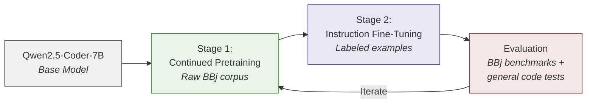
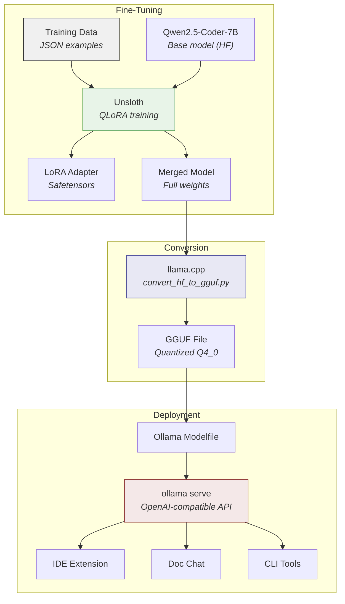
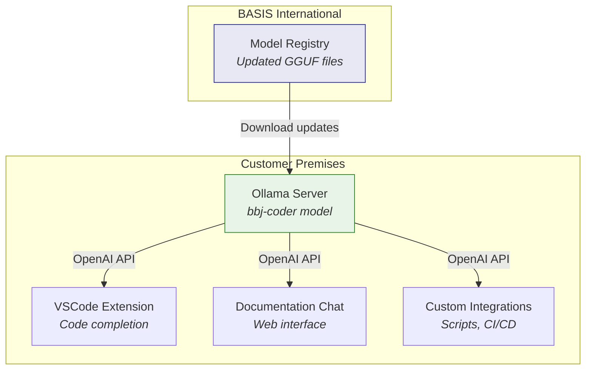

# Fine-Tuning the Model

:::tip[TL;DR]
We fine-tune [Qwen2.5-Coder-7B](https://qwenlm.github.io/blog/qwen2.5-coder-family/) using QLoRA via [Unsloth](https://unsloth.ai/) on a single $1,500 GPU, export to GGUF format, and serve through [Ollama](https://ollama.com/) for local, self-hosted inference. The result is a BBj-aware code model that customers can run on their own hardware with zero per-query costs and complete data privacy.
:::

The foundation of the entire BBj AI strategy is a fine-tuned language model. Every other component -- IDE integration, documentation chat, migration tooling -- depends on a model that actually understands BBj syntax, idioms, and multi-generational patterns. Generic LLMs cannot provide this. As [Chapter 1](/docs/bbj-challenge) establishes, BBj is effectively invisible in public training corpora. Fine-tuning bridges that gap.

This chapter is the technical blueprint: what training data looks like, why we chose the base model we did, how QLoRA makes fine-tuning affordable, and how the finished model reaches end users through Ollama.

## Training Data Structure

The quality of training data determines the quality of the fine-tuned model. For a low-resource language like BBj, this is the single most important factor -- more important than model size, hyperparameter tuning, or training duration.

### Format and Schema

Each training example is a JSON object with structured metadata. The critical design choice is **generation labeling**: every example is tagged with the BBj generation(s) it applies to, so the model learns to distinguish between character UI patterns, Visual PRO/5 idioms, modern BBj GUI code, and DWC browser-based patterns.

```json title="training-example-universal.json"
{
  "id": "universal-file-io-001",
  "type": "comprehension",
  "generation": "all",
  "difficulty": "intermediate",
  "instruction": "Explain this file operation",
  "input": "OPEN (1)\"customer.dat\"\nREAD (1,KEY=custId$)name$,address$,balance\nCLOSE (1)",
  "output": "This code reads a customer record from a keyed file:\n1. OPEN (1) opens 'customer.dat' on channel 1\n2. READ (1,KEY=custId$) reads the record matching custId$\n3. CLOSE (1) closes the file channel\n\nThis keyed file access pattern works across all BBj generations."
}
```

```json title="training-example-modern.json"
{
  "id": "comp-modern-001",
  "type": "completion",
  "generation": ["bbj-gui", "dwc"],
  "difficulty": "basic",
  "instruction": "Complete the event handler setup",
  "prefix": "class public MyApp\n  field private BBjTopLevelWindow window!\n  method public void init()\n    sysgui! = BBjAPI().getSysGui()\n    #window! = sysgui!.addWindow(100,100,400,300,\"Test\")\n    #button! = #window!.addButton(101,10,10,100,25,\"Click\")\n",
  "completion": "    #button!.setCallback(#button!.ON_BUTTON_PUSH, #this!, \"onClick\")\n  methodend\n  method public void onClick(BBjButtonPushEvent event!)\n    rem Handle button click\n  methodend"
}
```

The **generation label** uses a simple schema:

| Label | Scope | Examples |
|-------|-------|---------|
| `"all"` | Universal patterns | FOR/NEXT loops, file I/O, string functions |
| `"character"` | Character UI (1980s) | `PRINT @(x,y)`, `INPUT` |
| `"vpro5"` | Visual PRO/5 (1990s) | `PRINT (sysgui)'WINDOW'(...)`, `PRINT (sysgui)'BUTTON'(...)`, `CTRL(sysgui,id,index)` |
| `"bbj-gui"` | BBj GUI/Swing (2000s) | `BBjAPI().getSysGui()`, `addWindow()` |
| `"dwc"` | DWC/Browser (2010s+) | `getWebManager()`, `executeAsyncScript` |
| `["bbj-gui", "dwc"]` | Subset array | Patterns shared by modern generations |

### Example Types

Training examples fall into four categories, each teaching the model a different capability:

- **Comprehension** -- "Explain this BBj code." The model learns to read and describe legacy patterns, a prerequisite for migration assistance.
- **Completion** -- "Complete this code." The model learns to generate syntactically valid BBj that matches the surrounding generation context.
- **Migration** -- "Convert this Visual PRO/5 code to modern BBj." The model learns to bridge between generations.
- **Explanation** -- "What does `BBjAPI().getSysGui()` do?" The model learns API semantics.

### BBj Code in Training Data

To illustrate what the model learns from, here is a modern BBj event handler -- the kind of pattern that generic LLMs consistently fabricate:

```bbj title="Modern BBj Event Handler"
class public OrderForm

    field private BBjTopLevelWindow window!
    field private BBjEditBox customerField!
    field private BBjButton saveButton!

    method public void create()
        sysgui! = BBjAPI().getSysGui()
        #window! = sysgui!.addWindow(100, 100, 600, 400, "Order Entry")
        #customerField! = #window!.addEditBox(201, 80, 30, 200, 25)
        #saveButton! = #window!.addButton(202, 80, 350, 100, 25, "Save")
        #saveButton!.setCallback(#saveButton!.ON_BUTTON_PUSH, #this!, "onSave")
    methodend

    method public void onSave(BBjButtonPushEvent event!)
        customer$ = #customerField!.getText()
        rem Process the order...
    methodend

classend
```

A fine-tuned model that has seen hundreds of examples like this will understand that `!` suffixes denote object references, that `#` prefixes reference instance fields, and that `methodend` closes a method block -- none of which a generic LLM knows.

### Volume and Quality Targets

The target is **10,000 to 50,000** labeled training examples. However, current research consistently shows that **data quality outweighs data quantity** for instruction fine-tuning. One thousand carefully curated, expert-reviewed examples can outperform ten thousand hastily generated ones.

The data collection strategy is sequential:

1. **Manual curation (Phase 1):** 2,000-5,000 examples written and reviewed by BBj experts. These anchor the model's understanding of correct patterns.
2. **Synthetic augmentation (Phase 2):** Use a larger model (Claude, GPT-4) to generate additional BBj examples from documentation and existing code samples. Human review filters for correctness.
3. **Iterative expansion (Ongoing):** Analyze model failures in evaluation, create targeted examples for weak areas, retrain.

:::info[Decision: Quality-First Data Strategy]
**Choice:** Start with a smaller, expert-curated dataset rather than attempting to scrape or auto-generate tens of thousands of examples upfront.

**Rationale:** For low-resource languages, training data quality is the dominant factor in model performance. A [fine-tuned 7B model on high-quality data can match a 70B general model](https://www.gocodeo.com/post/fine-tuning-llms-for-low-resource-languages-challenges-opportunities) on domain-specific tasks. Investing engineering time in data curation yields better returns than investing in larger models or longer training.

**Alternatives considered:** Bulk scraping of BBj source repositories (risk of including broken/outdated code), fully automated synthetic generation (risk of compounding errors without human review).

**Status:** Approximately 10,000 training examples curated. Generation labeling system in active use. Ongoing expansion continues with targeted additions for underrepresented patterns.
:::

## Base Model Selection

Choosing the right base model determines the ceiling for the fine-tuned result. The model must be small enough to fine-tune on accessible hardware, capable enough to learn a new language from relatively few examples, and licensed for commercial deployment.

:::info[Decision: Qwen2.5-Coder-7B-Base as Starting Point]
**Choice:** [Qwen2.5-Coder-7B-Base](https://qwenlm.github.io/blog/qwen2.5-coder-family/) as the primary base model for fine-tuning. As of January 2026.

**Rationale:** Best-in-class code generation benchmarks at the 7B parameter scale. Trained on 5.5 trillion tokens across 92+ programming languages. Apache 2.0 license allows unrestricted commercial use. Native fill-in-the-middle (FIM) support is essential for IDE code completion.

**Alternatives considered:** See comparison table below.

**Status:** Selected for initial experiments. Subject to revision as models evolve.
:::

### Why Qwen2.5-Coder

The [Qwen2.5-Coder family](https://arxiv.org/html/2409.12186v3) (released September 2024 by Alibaba's Qwen team) represents the current state of the art for open-source code models at fine-tunable sizes. Key facts:

- **Sizes available:** 0.5B, 1.5B, 3B, 7B, 14B, 32B (both Base and Instruct variants)
- **Training data:** 5.5 trillion tokens -- 70% code, 20% text, 10% math -- covering 92+ programming languages
- **Benchmarks:** The 7B-Instruct variant achieves [88.4% on HumanEval](https://qwenlm.github.io/blog/qwen2.5-coder-family/), surpassing models three times its size. The 32B-Instruct matches GPT-4o on code generation tasks.
- **License:** Apache 2.0 -- fully permissive for commercial use, modification, and redistribution
- **FIM support:** Native fill-in-the-middle capability, critical for IDE code completion where the model must generate code between existing lines

### Model Comparison (as of January 2026)

| Model | Size | HumanEval | FIM | License | Fine-Tune Friendly | Notes |
|-------|------|-----------|-----|---------|---------------------|-------|
| **Qwen2.5-Coder-7B** | 7B | 88.4% | Yes | Apache 2.0 | Yes (single GPU) | **Recommended** |
| Qwen2.5-Coder-14B | 14B | Higher | Yes | Apache 2.0 | Yes (24GB+ VRAM) | If hardware allows |
| Qwen2.5-Coder-32B | 32B | GPT-4o level | Yes | Apache 2.0 | Multi-GPU needed | Best quality, higher cost |
| CodeLlama-7B | 7B | ~62% | Yes | Llama 2 | Yes | Surpassed; not recommended for new projects |
| StarCoder2-7B | 7B | ~65% | Yes | BigCode Open | Yes | Benchmark-surpassed by Qwen family |
| DeepSeek-V3 | 671B MoE | Very high | Yes | Custom | No (too large) | Cloud-only; not self-hostable |

The original strategy paper (January 2025) listed CodeLlama, DeepSeek Coder, and StarCoder2 as candidates. All three have been surpassed by Qwen2.5-Coder on code generation benchmarks. For a new fine-tuning project in 2026, Qwen2.5-Coder is the clear starting point.

### Size Rationale

We recommend **7B parameters** as the starting point:

- **Fine-tuning:** A 7B model can be fine-tuned on a single consumer GPU (RTX 4090, 24GB VRAM) using QLoRA. No multi-GPU setup or cloud compute required.
- **Inference:** A 7B model quantized to 4-bit (Q4_0) requires approximately 4GB of RAM, making it accessible on virtually any modern workstation.
- **Quality:** For domain-specific tasks like BBj code generation, a well-fine-tuned 7B model can match or exceed a general-purpose 70B model. The fine-tuning data compensates for the smaller parameter count.

If hardware budgets allow, the 14B variant offers improved quality while remaining fine-tunable on a single 24GB+ GPU. The 32B variant requires multi-GPU setups but delivers the highest quality.

### A Note on Newer Models

[Qwen3-Coder](https://github.com/QwenLM/Qwen3-Coder) was released in July 2025 with impressive capabilities (256K native context, 1M with extrapolation). However, it currently ships only in large Mixture-of-Experts (MoE) sizes -- 480B-A35B and 30B-A3B -- which are impractical for single-GPU fine-tuning and customer self-hosting. As the Qwen3 family matures with smaller dense variants, it may become the preferred base. For now, Qwen2.5-Coder's proven fine-tuning ecosystem and practical size range make it the better choice.

Model selection is not a permanent decision. The fine-tuning pipeline we describe below is model-agnostic -- when a better base model emerges, we retrain on the same curated data.

## The QLoRA Fine-Tuning Approach

Full fine-tuning of a 7B parameter model requires updating all ~7 billion weights, demanding multiple high-end GPUs and substantial memory. **QLoRA** (Quantized Low-Rank Adaptation) achieves comparable results at a fraction of the cost by freezing the base model weights and training only small adapter matrices.

### How LoRA Works

[LoRA](https://arxiv.org/abs/2106.09685) (Low-Rank Adaptation) decomposes weight updates into two small matrices rather than modifying the full weight matrix. For a weight matrix **W** of dimension *d x d*, instead of computing the full update **deltaW** (d x d parameters), LoRA factorizes it as **deltaW = A x B** where **A** is *d x r* and **B** is *r x d*, with rank *r* typically between 16 and 64. This reduces trainable parameters from d-squared to 2dr -- a reduction of over 99% for typical model dimensions.

**QLoRA** adds quantization: the frozen base model weights are stored in 4-bit precision (NF4 format), reducing memory by ~75% compared to full 16-bit weights. Only the LoRA adapter matrices are trained in higher precision.

The result:

| Approach | VRAM Required (7B) | Hardware | Approximate Cost |
|----------|-------------------|----------|-----------------|
| Full fine-tuning (FP16) | 60-80 GB | 4x A100 80GB | $50,000+ |
| LoRA (FP16 base) | 24-32 GB | 1-2x A100 | $15,000+ |
| **QLoRA (NF4 base)** | **12-16 GB** | **1x RTX 4090** | **~$1,500** |

QLoRA on a single RTX 4090 ($1,500) can fine-tune a 7B model that would cost $50,000+ in hardware for full fine-tuning. This is not a compromise -- [research shows QLoRA matches full fine-tuning quality](https://www.index.dev/blog/top-ai-fine-tuning-tools-lora-vs-qlora-vs-full) with no measurable accuracy loss.

### Recommended Hyperparameters

Based on current best practices for [code model fine-tuning via Unsloth](https://docs.unsloth.ai/get-started/fine-tuning-llms-guide):

| Parameter | Value | Rationale |
|-----------|-------|-----------|
| LoRA rank (r) | 32-64 | Higher rank for learning a new language; 16 is typical for style tuning |
| LoRA alpha | 2x rank | Standard scaling factor |
| LoRA target | All linear layers | Apply to attention AND MLP layers -- not just attention |
| Quantization | NF4 (4-bit) | QLoRA default; best memory/quality tradeoff |
| Learning rate | 2e-4 to 5e-5 | Lower end for continued pretraining, higher for instruction tuning |
| Epochs | 1-3 | More risks overfitting on small datasets |
| Batch size | 4-8 (with gradient accumulation) | Effective batch size of 32-64 |
| Max sequence length | 2048-4096 | BBj functions are typically compact |

A critical detail: **apply LoRA to all linear layers**, not just the attention matrices. Recent research confirms that including MLP layers in the LoRA adaptation significantly improves performance on code tasks compared to attention-only LoRA.

### Sequential Fine-Tuning

For a language with near-zero representation in the base model's training data, we recommend a two-stage approach:



**Stage 1 -- Continued Pretraining:** Feed the model raw BBj source code (without instruction/response formatting) so it learns the language's syntax, token patterns, and idioms. This builds foundational understanding.

**Stage 2 -- Instruction Fine-Tuning:** Train on the structured JSON examples (comprehension, completion, migration) so the model learns to follow instructions and produce useful outputs in the BBj domain.

Skipping Stage 1 and jumping directly to instruction fine-tuning can work, but performance is typically lower for languages the base model has never seen. The continued pretraining stage is especially valuable for BBj because even Qwen2.5-Coder's 92-language training set almost certainly does not include BBj.

### Avoiding Catastrophic Forgetting

A persistent risk in fine-tuning is **catastrophic forgetting** -- the model loses general capabilities while acquiring domain-specific ones. A BBj-fine-tuned model that can no longer write Python or explain algorithms is less useful than one that retains broad knowledge while adding BBj expertise.

Mitigations:

- **LoRA inherently helps** -- by only modifying small adapter weights, the base model's general knowledge is largely preserved.
- **Mixed training data** -- include some general code examples (Python, Java, JavaScript) in the training mix to reinforce broad capabilities.
- **Evaluation on both domains** -- always measure performance on general code benchmarks (HumanEval) alongside BBj-specific benchmarks. If general performance drops more than 5%, adjust the training mix.

## Toolchain: Unsloth + llama.cpp + Ollama

The fine-tuning-to-deployment pipeline uses three tools, each handling a distinct stage:



### Unsloth -- Fine-Tuning

[Unsloth](https://unsloth.ai/) is the recommended training framework for QLoRA fine-tuning. Compared to vanilla Hugging Face Transformers + PEFT:

- **2x training speed** through custom CUDA kernels
- **70% less VRAM** usage via aggressive memory optimization
- **0% accuracy loss** -- same mathematical operations, just more efficient execution

Unsloth natively supports Qwen2.5-Coder and provides direct export to GGUF format, eliminating the need for a separate conversion step in some workflows. It also integrates with Hugging Face datasets for data loading.

Alternative frameworks worth noting: [LLaMA-Factory](https://github.com/hiyouga/LLaMA-Factory) provides a web UI for fine-tuning configuration, and [Axolotl](https://github.com/OpenAccess-AI-Collective/axolotl) supports advanced training recipes. Both are viable, but Unsloth's speed and memory advantages make it the preferred choice for single-GPU setups.

### llama.cpp -- GGUF Conversion

After training, the merged model weights (in Hugging Face Safetensors format) need to be converted to [GGUF format](https://github.com/ggerganov/gguf) for efficient CPU/GPU inference. The `convert_hf_to_gguf.py` script from [llama.cpp](https://github.com/ggerganov/llama.cpp) handles this conversion, including optional quantization to reduce model size.

Common quantization levels:

| Format | Size (7B model) | Quality | Use Case |
|--------|-----------------|---------|----------|
| F16 | ~14 GB | Full | Development/evaluation |
| Q8_0 | ~7 GB | Near-full | High-end workstations |
| **Q4_0** | **~4 GB** | **Good** | **Default for deployment** |
| Q4_K_M | ~4.5 GB | Better than Q4_0 | Recommended balance |
| Q2_K | ~2.5 GB | Reduced | Low-resource environments |

Q4_0 is Ollama's default quantization level. For BBj code generation, where output quality matters more than inference speed, Q4_K_M provides a better quality-to-size ratio and is the recommended deployment format.

### Ollama Modelfile

The final step is packaging the GGUF model for Ollama. A Modelfile is a simple text file that tells Ollama how to load and configure the model:

```text title="Modelfile"
FROM ./bbj-coder-7b-q4_k_m.gguf

TEMPLATE """{{ if .System }}<|im_start|>system
{{ .System }}<|im_end|>
{{ end }}<|im_start|>user
{{ .Prompt }}<|im_end|>
<|im_start|>assistant
"""

SYSTEM "You are a BBj programming assistant. You understand all four generations of BBj: character UI, Visual PRO/5, BBj GUI/Swing, and DWC/browser. When generating code, match the generation context of the surrounding code. Default to modern DWC patterns for new projects."

PARAMETER temperature 0.2
PARAMETER top_p 0.9
PARAMETER num_ctx 4096
```

Creating the model in Ollama is then a single command:

```bash
ollama create bbj-coder -f Modelfile
```

## Hosting via Ollama

Self-hosted inference via [Ollama](https://ollama.com/) is a deliberate architectural choice, not just a deployment convenience. It addresses the two most common objections to AI tooling in enterprise environments: **data privacy** and **ongoing costs**.

:::info[Decision: Ollama for Local Model Serving]
**Choice:** [Ollama](https://ollama.com/) (v0.9.x+) as the inference runtime for the fine-tuned BBj model. Customers self-host on their own hardware.

**Rationale:** Zero per-query API costs after initial setup. Customer source code never leaves their network. OpenAI-compatible API means existing tooling (IDE extensions, chat interfaces) can integrate without custom adapters. Cross-platform support (macOS, Windows, Linux) with native desktop applications as of mid-2025.

**Alternatives considered:** vLLM (higher throughput but more complex deployment), llama.cpp server directly (lower-level, less user-friendly), cloud API (privacy concerns, ongoing costs).

**Status:** Ollama infrastructure validated. Model packaging workflow not yet automated.
:::

### Why Self-Hosting Matters

For BBj customers, the source code being processed by AI tools often represents decades of business logic -- proprietary algorithms, customer data handling, financial calculations. Sending this to a cloud API is a non-starter for many organizations.

With Ollama:

- **Source code stays on-premises.** The model runs on the customer's hardware, behind their firewall.
- **No per-query costs.** Once the model is deployed, usage is unlimited. This matters when IDE completions can generate hundreds of inference requests per developer per day.
- **Air-gapped operation.** The model works without an internet connection, critical for customers in regulated industries or secure environments.
- **Simple deployment.** Customers install Ollama and run a single command: `ollama run bbj-coder`.

### Hardware Requirements for Inference

| Tier | Hardware | Model Size | Performance | Audience |
|------|----------|-----------|-------------|----------|
| Minimum | 8GB RAM, any modern CPU | 7B Q4_0 | ~5-10 tokens/sec | Individual developer |
| Recommended | 16GB RAM, GPU with 6GB+ VRAM | 7B Q4_K_M | ~30-50 tokens/sec | Individual developer |
| Team | 32GB+ RAM, RTX 3090/4090 | 14B Q4_K_M | ~20-40 tokens/sec | Shared inference server |
| Enterprise | 64GB+ RAM, A100/H100 | 32B Q4_K_M | ~30-50 tokens/sec | Organization-wide |

The 7B Q4_0 model at approximately 4GB can even run on a laptop CPU, though with reduced throughput. For IDE code completion where latency matters, a GPU is strongly recommended.

### API Compatibility

Ollama exposes an [OpenAI-compatible API](https://github.com/ollama/ollama/blob/main/docs/openai.md) out of the box. This means any tool built against the OpenAI API -- including the VSCode extension and documentation chat system described in later chapters -- can point to a local Ollama instance by changing only the base URL:

```text
# Instead of:
OPENAI_API_BASE=https://api.openai.com/v1

# Point to local Ollama:
OPENAI_API_BASE=http://localhost:11434/v1
```

As of Ollama v0.9.x, the API also supports [Anthropic-format requests](https://github.com/ollama/ollama/releases), tool calling, and structured JSON output -- features that enable more sophisticated integrations as the BBj AI tooling matures.

### Deployment Architecture



Model updates are distributed as GGUF files. Customers download new versions from a model registry (which could be a simple file server, Hugging Face Hub, or the Ollama model library) and update with `ollama create bbj-coder -f Modelfile`. No retraining on the customer side.

## Current Status

:::note[Where Things Stand -- January 2026]
**Training data:** Approximately 10,000 training examples have been curated using the generation labeling system described above. Results are promising and ongoing expansion continues with targeted additions for underrepresented patterns and generations.

**Base model:** Qwen2.5-Coder-7B-Base selected and actively being fine-tuned. Experiments are producing promising results. The model is available on [Hugging Face](https://huggingface.co/Qwen/Qwen2.5-Coder-7B) and loads successfully in Unsloth.

**Toolchain:** The fine-tuning pipeline is validated through active use. Unsloth, llama.cpp, and Ollama are all publicly available and actively maintained. The workflow described in this chapter is operational, not speculative.

**Hosting:** Ollama infrastructure is validated and in use for model evaluation. The Modelfile configuration is being refined based on real inference results.

**What's next:** Continue expanding the training dataset with targeted examples for weak areas identified during evaluation. Establish formal evaluation benchmarks for the [IDE completion use case](/docs/ide-integration). The [implementation roadmap](/docs/implementation-roadmap) in Chapter 7 provides the full phasing and timeline.
:::

The fine-tuned model is the foundation that both the [IDE extension](/docs/ide-integration) and the planned [documentation chat](/docs/documentation-chat) depend on. The generation labeling schema defined in this chapter is shared with the [RAG database](/docs/rag-database), ensuring consistency between what the model learned and what the retrieval system provides. As the model improves through continued fine-tuning, every consumer application benefits immediately -- this is the core value of the [unified architecture](/docs/strategic-architecture).
