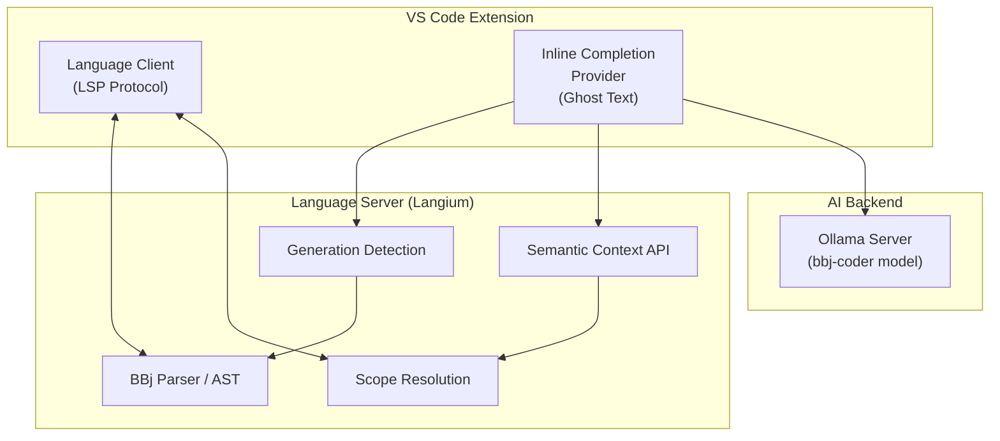
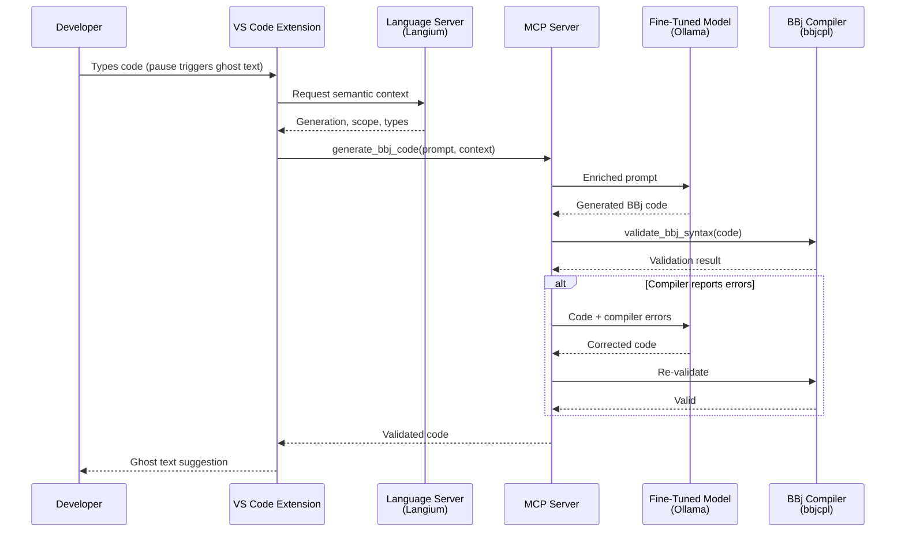

# IDE Integration

:::tip[TL;DR]
The architecture layers two completion mechanisms -- deterministic popup completion via Langium and generative ghost text via a fine-tuned LLM -- with a compiler validation step that runs every AI-generated snippet through the BBj compiler before presentation. [Continue.dev](https://continue.dev/) provides the near-term delivery path for connecting fine-tuned models to the IDE, supporting both chat and tab completion with local Ollama models. The [bbj-language-server](https://github.com/BBx-Kitchen/bbj-language-server) provides the BBj-specific intelligence layer: Langium parsing, scope resolution, generation detection, and semantic context that generic tools cannot offer. These are parallel strategies -- Continue.dev for model delivery, the language server for language understanding.
:::

[Chapter 3](/docs/fine-tuning) describes how to build a BBj-aware language model. This chapter answers the next question: how does that model reach the developer?

BBj has zero representation in the training data of any mainstream AI coding tool. GitHub Copilot, Cursor, Codeium -- none of them have seen BBj source code during training. The result is predictable: generic copilots produce plausible-looking code that fails to compile. They guess at syntax, hallucinate method names, and confuse BBj with other BASIC variants. For a language with four distinct generations of syntax and idioms, "close enough" is not close at all.

IDE integration for a zero-representation language like BBj needs three things: a model that understands BBj (the fine-tuned model from [Chapter 3](/docs/fine-tuning)), a delivery mechanism that reaches the editor (how the model's output appears as suggestions), and validation that catches remaining errors (the BBj compiler as a ground-truth check). This chapter addresses all three.

Two parallel strategies make this practical. [Continue.dev](https://continue.dev/) provides the near-term path: an open-source IDE extension that connects local Ollama models to VS Code and JetBrains for both chat and inline completion, with a simple config file and no subscription required. The [bbj-language-server](https://github.com/BBx-Kitchen/bbj-language-server) provides the long-term path: BBj-specific intelligence through Langium parsing, generation-aware completion, and compiler validation that no generic tool can offer. These strategies complement each other -- Continue.dev delivers the model, the language server provides the understanding.

## The Near-Term Path: Continue.dev

[Continue.dev](https://continue.dev/) is an open-source AI code assistant (Apache 2.0) that supports VS Code and JetBrains IDEs. It connects to local Ollama models for both conversational chat and inline tab completion -- the two capabilities most relevant to BBj development. Unlike Copilot BYOK (which limits local models to chat only), Continue.dev provides a complete local AI coding experience with a single configuration file.

The critical insight for BBj: Continue.dev supports **separate models for different roles**. A larger instruction-tuned model handles chat, while a smaller FIM-capable model handles tab completion. This maps directly to the BBj fine-tuning strategy described in [Chapter 3](/docs/fine-tuning) -- the instruction-tuned BBj model serves chat, and a future FIM-trained BBj model would serve autocomplete.

### Chat Mode: Works Today

Chat mode uses an instruction-tuned model to answer conversational questions about BBj code. This works with the current training data format -- the 9,922 ChatML examples in the bbjllm training set are instruction-tuned, which is exactly what chat mode expects.

The chat portion of Continue.dev's configuration points to a larger model via Ollama:

```yaml
models:
  # Chat model -- instruction-tuned, handles conversational questions
  # When the fine-tuned BBj model is ready, swap qwen2.5-coder:14b for bbj-coder:14b
  - name: Qwen2.5 Coder 14B
    provider: ollama
    model: qwen2.5-coder:14b
    roles:
      - chat
      - edit
      - apply
```

The `roles` field assigns this model to chat, edit, and apply tasks. A developer can ask "How do I create a DWC window in BBj?" or "Convert this Visual PRO/5 code to object-oriented BBj" and receive responses from a model running entirely on their local machine. Today, this uses a generic Qwen2.5-Coder model; when the fine-tuned BBj model from Chapter 3 is ready, a single line change (`model: bbj-coder:14b`) connects BBj-specific intelligence to the same chat interface.

### Tab Completion: Needs FIM-Trained Model

Tab completion -- the dimmed ghost text that appears as you type -- uses a fundamentally different model format than chat. Where chat uses ChatML instruction format (`<|im_start|>`, `<|im_end|>`), tab completion uses FIM (Fill-in-the-Middle) format (`<|fim_prefix|>`, `<|fim_suffix|>`, `<|fim_middle|>`). Autocomplete models are intentionally small (1.5B-7B parameters) because latency matters more than raw capability for inline suggestions.

The autocomplete portion of the configuration uses a separate, smaller model:

```yaml
models:
  # Autocomplete model -- FIM-capable, provides inline ghost text
  # When a FIM-trained BBj model is ready, swap qwen2.5-coder:1.5b for bbj-coder-fim:1.5b
  - name: Qwen2.5 Coder 1.5B Autocomplete
    provider: ollama
    model: qwen2.5-coder:1.5b
    roles:
      - autocomplete
    autocompleteOptions:
      maxPromptTokens: 1024
      debounceDelay: 250
      modelTimeout: 150
      maxSuffixPercentage: 0.2
      prefixPercentage: 0.3
      multilineCompletions: always
```

The `autocompleteOptions` control the inline completion behavior: `debounceDelay` prevents triggering on every keystroke, `modelTimeout` ensures suggestions appear quickly or not at all, and `multilineCompletions: always` enables multi-line ghost text suggestions. A generic Qwen2.5-Coder-1.5B provides general code completion today; BBj-specific tab completion requires a FIM-trained model (see [The FIM Training Gap](#the-fim-training-gap) below).

### The FIM Training Gap

The current bbjllm training data (9,922 examples) is in ChatML instruction format. This supports chat but **structurally cannot produce FIM completions**. The formats are fundamentally incompatible:

**ChatML format** (instruction-tuned, for chat):
```text
<|im_start|>user
How do I load data into a grid in BBj?<|im_end|>
<|im_start|>assistant
Use the setData method with a BBjRecordSet...<|im_end|>
```

**FIM format** (for tab completion):
```text
<|fim_prefix|>method public void loadOrder(BBjNumber orderId)
    #currentOrderId = orderId
    declare BBjRecordSet rs!
    rs! = #getOrderRecordSet(orderId)
    #custGrid!.<|fim_suffix|>
    methodend<|fim_middle|>setData(rs!)<|endoftext|>
```

The FIM format uses PSM (Prefix-Suffix-Middle) strategy: the code before the cursor becomes the prefix, the code after becomes the suffix, and the model predicts the middle -- the code that fills the gap. This is how tab completion "knows" what to insert at the cursor position.

The Qwen2.5-Coder Base model already has FIM capability from pretraining -- it understands the `<|fim_prefix|>`, `<|fim_suffix|>`, `<|fim_middle|>` tokens natively. But fine-tuning exclusively on ChatML instruction data (as the current bbjllm pipeline does) would overwrite this capability. Supporting both chat and tab completion requires either two separate models -- one instruction-tuned for chat, one FIM-trained for autocomplete -- or mixed FIM + instruction training data.

Continue.dev handles this naturally with its role-based model assignment. The path forward:

1. **Today:** Generic Qwen2.5-Coder models provide general-purpose chat and autocomplete
2. **After instruction fine-tuning** ([Chapter 3](/docs/fine-tuning)): Swap in `bbj-coder:14b` for chat -- BBj-aware conversational assistance
3. **After FIM fine-tuning** on BBj source code: Swap in `bbj-coder-fim:1.5b` for autocomplete -- BBj-aware tab completion

The FIM fine-tuning step creates training data by sampling random cursor positions in BBj source files, splitting each into prefix/suffix/middle segments. This is a separate training pipeline from the instruction fine-tuning described in Chapter 3, using the same Qwen2.5-Coder Base model but with FIM-formatted data. The two-stage training approach from Chapter 3 (continued pretraining + instruction fine-tuning) produces the chat model; a parallel FIM fine-tuning step would produce the autocomplete model.

### Full Configuration

Continue.dev uses `~/.continue/config.yaml` (the older JSON format is deprecated but still works). Here is the complete configuration for a BBj development setup:

```yaml
name: BBj Development
version: 0.0.1
schema: v1

models:
  # Chat model -- instruction-tuned, handles conversational BBj questions
  # Swap qwen2.5-coder:14b for bbj-coder:14b when the fine-tuned model is ready
  - name: Qwen2.5 Coder 14B
    provider: ollama
    model: qwen2.5-coder:14b
    roles:
      - chat
      - edit
      - apply

  # Autocomplete model -- FIM-capable, provides inline ghost text
  # Swap qwen2.5-coder:1.5b for bbj-coder-fim:1.5b when the FIM-trained model is ready
  - name: Qwen2.5 Coder 1.5B Autocomplete
    provider: ollama
    model: qwen2.5-coder:1.5b
    roles:
      - autocomplete
    autocompleteOptions:
      maxPromptTokens: 1024
      debounceDelay: 250
      modelTimeout: 150
      maxSuffixPercentage: 0.2
      prefixPercentage: 0.3
      multilineCompletions: always

context:
  - provider: code
  - provider: docs
  - provider: diff
  - provider: terminal
  - provider: problems
  - provider: folder
  - provider: codebase
```

The configuration defines two models with distinct roles: a 14B instruction-tuned model for chat, edit, and apply tasks, and a 1.5B FIM-capable model for autocomplete. The context providers give Continue.dev access to code definitions, documentation, git diffs, terminal output, editor problems, folder structure, and codebase-wide search -- enriching both chat and completion with project context.

Continue.dev's autocomplete implementation uses VS Code's `InlineCompletionItemProvider` API internally -- the same API described later in the [Ghost Text Architecture](#ghost-text-architecture) section. This creates a natural connection: Continue.dev delivers the "pragmatic now" (local model tab completion with a config file), while the bbj-language-server's planned ghost text integration provides the "strategic future" (BBj-aware completion with Langium semantic context, generation detection, and compiler validation).

## Why Not Copilot?

Developers will naturally ask: "Can't we just use GitHub Copilot with a custom model?" The short answer is: partially, and only for chat -- not for inline completions. The contrast with Continue.dev makes the limitation clear.

### What BYOK Offers

As of VS Code v1.99 (March 2025), Copilot supports [Bring Your Own Key (BYOK)](https://code.visualstudio.com/docs/copilot/customization/language-models) with Ollama as a built-in model provider. Configuration is straightforward:

1. Open Command Palette and select **Chat: Manage Language Models**
2. Select **Add Models** and choose **Ollama**
3. Enter endpoint: `http://localhost:11434`
4. Select the model (e.g., `bbj-coder`)

This gives Copilot Chat access to the fine-tuned BBj model in Ask Mode. Developers can ask questions like "How do I create a window in BBj?" or "Convert this Visual PRO/5 code to DWC" and receive answers from a model that understands BBj. The January 2026 enhancements expanded provider support to include AWS Bedrock, Google AI Studio, and OpenAI-compatible endpoints alongside the existing Anthropic and OpenAI providers.

Enterprise and Business BYOK is now in [public preview](https://github.blog/changelog/2026-01-15-github-copilot-bring-your-own-key-byok-enhancements/) as of January 2026, with admin configuration through organization and enterprise settings. This removes the earlier limitation that restricted BYOK to individual subscriptions.

### What BYOK Does Not Offer

From the [VS Code official documentation](https://code.visualstudio.com/docs/copilot/customization/language-models): **"BYOK does not currently work with completions."** The dimmed ghost text suggestions that appear as you type -- arguably the most valuable Copilot feature for daily coding -- still come exclusively from GitHub's cloud-hosted models. There is no mechanism to route inline completions through a local Ollama model via BYOK, regardless of plan tier.

This means BYOK with a fine-tuned BBj model gives you:
- **Chat:** BBj-aware conversational assistance via Ask Mode (works)
- **Inline completions:** Generic suggestions from GitHub's models, with no BBj knowledge (unchanged)

Additionally, even with BYOK, the Copilot service remains a dependency: embeddings, repository indexing, query refinement, and intent detection still require internet connectivity and an active Copilot subscription. BYOK routes chat through a local model but does not eliminate the cloud dependency.

The contrast with Continue.dev is direct: Continue.dev gives you both chat **and** tab completion with local models, works across VS Code and JetBrains, requires no subscription, and runs entirely offline. Copilot BYOK gives you chat only, works in VS Code only, requires a Copilot subscription, and still depends on internet for supporting services.

### Comparison: Continue.dev vs Copilot BYOK vs Language Server

| Feature | Continue.dev | Copilot BYOK | Custom Language Server |
|---------|-------------|-------------|----------------------|
| Chat with local model | Yes (Ollama) | Yes (Ask Mode only) | Planned (via MCP) |
| Tab completion with local model | Yes (FIM-capable models) | No | Planned (InlineCompletionItemProvider) |
| BBj language awareness | None (generic) | None (generic) | Full (Langium parser, AST, scope) |
| Generation detection | No | No | Planned (character/vpro5/bbj-gui/dwc) |
| Compiler validation | No | No | Planned (bbjcpl in-the-loop) |
| Multi-editor support | VS Code + JetBrains | VS Code only | VS Code + IntelliJ (extensions in repo) |
| Effort to integrate | Low (config file) | Low (built-in) | High (custom development) |
| Subscription required | No (open source) | Yes (Copilot + internet) | No |

Continue.dev has the best near-term coverage: both chat and tab completion with local models, minimal setup, and no subscription. The custom language server has the best long-term potential: BBj-specific intelligence, generation-aware prompting, and compiler validation that no generic tool can provide. Copilot BYOK occupies the middle -- useful if developers already have a Copilot subscription, but not the recommended path for BBj-specific AI integration.

:::info[Decision: Continue.dev as Primary IDE Integration Path]
**Choice:** Evaluate Continue.dev as the primary near-term path for connecting fine-tuned BBj models to the IDE, with Copilot BYOK as a supplementary option for developers who already have Copilot.

**Rationale:** Continue.dev fills the gap that Copilot BYOK leaves -- both chat and inline completion with local models. It supports separate models for chat and autocomplete roles, matching the BBj fine-tuning strategy (instruction-tuned for chat, FIM-trained for autocomplete). The language server remains the strategic path for BBj-specific intelligence, but Continue.dev provides immediate model delivery without custom extension development.

**Alternatives considered:** Copilot BYOK as primary (no inline completion support, subscription required), custom extension only (high development effort, delays model delivery to developers), wait for Copilot to add local inline completions (timeline uncertain, may never happen).

**Status:** Active research: Copilot BYOK integration (chat only). Continue.dev evaluation as primary IDE integration path.
:::

Continue.dev and Copilot BYOK address the model delivery problem -- how the fine-tuned BBj model's output reaches the developer's editor. But model delivery is only half the picture. The other half is language understanding: knowing which BBj generation the code belongs to, which symbols are in scope, what type a variable resolves to, and whether the generated code actually compiles. That understanding comes from the bbj-language-server.

## The Foundation: bbj-language-server

The [bbj-language-server](https://github.com/BBx-Kitchen/bbj-language-server) is the BBj language extension for VS Code, built on the [Langium](https://langium.org/) framework and published on the [VS Code Marketplace](https://marketplace.visualstudio.com/). It is the single most important piece of existing infrastructure for BBj AI integration.

Key facts:

| Attribute | Value |
|-----------|-------|
| Version | v0.5.0 (January 2026) |
| Framework | Langium (Eclipse Foundation, v4.x) |
| Language | TypeScript (87.9%), with Java interop |
| License | MIT |
| Contributors | 13 |
| Commits | 508 |
| Structure | `bbj-vscode` (VS Code extension + language server) + `bbj-intellij` (IntelliJ support) + `java-interop` (classpath via JSON-RPC) |

The extension provides full-featured language support:

- **Syntax highlighting** -- full BBj grammar support including all four generational syntaxes
- **Code completion** -- Langium-powered symbol completion with scope awareness
- **Diagnostics** -- real-time error detection and reporting
- **Code formatting** -- automatic formatting for BBj source files
- **BBj Properties viewing** -- inspect `config.bbx` and BBj properties from the editor
- **Code execution** -- run BBj programs directly from VS Code
- **Enterprise Manager integration** -- connect to BBj Enterprise Manager

This is not a future plan. It is an operational, actively maintained product with 508 commits and 13 contributors. Every AI integration feature described in this chapter builds on top of this foundation.

### Why Langium Matters

[Langium](https://langium.org/) is a language engineering framework from the Eclipse Foundation that generates a full language server from a grammar definition. It provides:

- **Parser and AST generation** -- the BBj grammar is defined declaratively; Langium generates the parser, AST types, and visitor infrastructure
- **Scope resolution** -- knows which symbols are visible at any given cursor position
- **Type inference** -- understands BBj's type system including object references (`!` suffix), field references (`#` prefix), and generation-specific APIs
- **LSP integration** -- native Language Server Protocol support, so the language server works with any LSP-compatible editor
- **Dependency injection** -- services like completion providers, validators, and formatters can be customized or extended without modifying the core

For AI integration, the critical value of Langium is **semantic context**. A Langium-based language server does not just tokenize text -- it builds a full abstract syntax tree with scope information, type resolution, and cross-reference analysis. This structured understanding of the code is exactly what an LLM needs in its prompt to generate accurate, context-appropriate completions.

## Two Completion Mechanisms

The architecture uses two fundamentally different completion mechanisms, each optimized for a different use case. Understanding why both are necessary is key to the design.

| | Popup Completion | Ghost Text |
|---|---|---|
| **Source** | Langium scope resolution | Fine-tuned LLM via Ollama |
| **Trigger** | `.` key or Ctrl+Space | Pause in typing (debounced) |
| **Latency** | < 10ms | 200-1000ms |
| **Correctness** | 100% -- only valid symbols | High but not guaranteed |
| **Output** | List of symbols to choose from | Inline suggestion to accept/reject |
| **Use case** | Member access, keyword selection, method names | Multi-line code, pattern completion, boilerplate |
| **Generation-aware** | Inherently (Langium knows the AST) | Via prompt engineering with generation context |

:::info[Decision: Two-Layer Completion Architecture]
**Choice:** Maintain both deterministic Langium completion and generative LLM completion as separate, complementary mechanisms.

**Rationale:** Popup completion must be instant and correct -- developers rely on it for discovering available APIs. A 200ms delay or a hallucinated method name would destroy trust. Ghost text can afford higher latency because it appears passively, and developers evaluate it before accepting. Merging these into a single mechanism would compromise the strengths of both.

**Alternatives considered:** LLM-only completion (too slow for popup, too unreliable for symbol lists), Langium-only completion (cannot generate multi-line code or novel patterns), hybrid single provider (latency compromise unacceptable for popup).

**Status:** Popup completion is operational via the bbj-language-server. Ghost text completion is planned.
:::

### Ghost Text Architecture

Ghost text -- the dimmed inline suggestion that appears as you type -- is powered by VS Code's [`InlineCompletionItemProvider`](https://code.visualstudio.com/api/references/vscode-api#InlineCompletionItemProvider) API. This is the same API that GitHub Copilot uses internally for its suggestions, and the same API that Continue.dev uses for its autocomplete feature.

Implementing ghost text in the bbj-language-server is one of the closest next milestones for BBj AI integration. The infrastructure is already in place: the `bbj-vscode` extension provides the VS Code host, the `bbj-intellij` extension provides the IntelliJ host, and the Langium language server provides the parser, AST, and semantic context. What remains is connecting an LLM completion provider to this existing infrastructure -- extending the language server, not building from scratch.

The lifecycle for a ghost text completion:

1. **User types** -- the developer writes or modifies code
2. **Debounce** -- a short delay (300-500ms) prevents triggering on every keystroke
3. **Context extraction** -- the extension queries the Langium language server for semantic context: current scope, containing class/method, detected generation, visible symbols
4. **Prompt assembly** -- the extracted context is assembled into a structured prompt for the LLM (see [Generation-Aware Completion](#generation-aware-completion) below)
5. **LLM call** -- the prompt is sent to the Ollama server running the fine-tuned BBj model
6. **Render ghost text** -- the response is displayed as dimmed inline text; the developer presses Tab to accept or continues typing to dismiss

Continue.dev already uses this same `InlineCompletionItemProvider` API for its autocomplete feature -- so the pattern is proven in practice with local Ollama models. The bbj-language-server's ghost text implementation adds what Continue.dev cannot: Langium semantic context, generation detection, and compiler validation in the completion pipeline.

The extension-side implementation follows the standard VS Code pattern:

```typescript
import * as vscode from 'vscode';

const provider: vscode.InlineCompletionItemProvider = {
    async provideInlineCompletionItems(
        document: vscode.TextDocument,
        position: vscode.Position,
        context: vscode.InlineCompletionContext,
        token: vscode.CancellationToken
    ): Promise<vscode.InlineCompletionList> {
        // 1. Extract semantic context from Langium language server
        const semanticContext = await languageClient.sendRequest(
            'bbj/semanticContext', { uri: document.uri.toString(), position }
        );

        // 2. Detect BBj generation from AST
        const generation = semanticContext.generation;

        // 3. Assemble prompt with generation context + scope info
        const prompt = buildPrompt(document, position, semanticContext);

        // 4. Call Ollama API for completion
        const completion = await ollama.generate({
            model: 'bbj-coder',
            prompt,
            options: { temperature: 0.2, num_predict: 256 }
        });

        // 5. Return inline completion items
        return {
            items: [{
                insertText: completion.response,
                range: new vscode.Range(position, position),
            }],
        };
    },
};

vscode.languages.registerInlineCompletionItemProvider(
    { language: 'bbj' },
    provider
);
```

The `bbj/semanticContext` custom LSP request is the bridge between the Langium language server and the AI completion provider. It exposes the structured understanding that Langium has already built -- scope, types, generation context -- to the component that assembles the LLM prompt.



## Generation-Aware Completion

The most distinctive aspect of BBj AI completion is **generation detection**. As [Chapter 1](/docs/bbj-challenge) establishes, BBj spans four generations of syntax and idioms. Suggesting a `PRINT (sysgui)'WINDOW'(...)` mnemonic in DWC code -- or a `getWebManager()` call in a character UI program -- is worse than no suggestion at all. The LLM must know which generation it is operating in.

The Langium parser can detect the code generation by analyzing AST patterns:

```typescript
interface GenerationContext {
    detected: 'character' | 'vpro5' | 'bbj-gui' | 'dwc' | 'mixed' | 'unknown';
    confidence: number;
    signals: string[];
}

function detectGeneration(ast: BbjProgram): GenerationContext {
    const signals: string[] = [];

    // DWC-specific signals
    if (hasCall(ast, 'BBjAPI().getWebManager')) {
        signals.push('dwc:getWebManager');
    }

    // BBj GUI signals (also valid in DWC)
    if (hasCall(ast, 'BBjAPI().getSysGui')) {
        signals.push('bbj:getSysGui');
    }

    // Visual PRO/5 signals
    if (hasStatement(ast, "PRINT (sysgui)'WINDOW'")) {
        signals.push('vpro5:window-mnemonic');
    }

    // Character UI signals
    if (hasMnemonic(ast, '@(') && !hasAnyGuiCode(ast)) {
        signals.push('character:mnemonics-only');
    }

    return inferGeneration(signals);
}
```

The detection relies on **signal accumulation** rather than single-token matching. A file that contains both `BBjAPI().getSysGui()` and `getWebManager()` calls is classified as `dwc` (DWC subsumes BBj GUI). A file with only `@(x,y)` mnemonics and no GUI API calls is classified as `character`. Mixed-generation files -- which exist in real codebases during migration -- are flagged as `mixed` with reduced confidence.

### Semantic Context for Prompts

Generation detection is one component of the broader semantic context that Langium provides. The full context available for prompt assembly includes:

```typescript
interface SemanticContext {
    // Structural context
    containingClass: string | null;
    containingMethod: string | null;

    // Generation context
    generation: GenerationContext;

    // Scope information
    visibleSymbols: Array<{
        name: string;
        type: string;
        kind: 'field' | 'local' | 'parameter' | 'method';
    }>;

    // Expression context (if completing after dot)
    receiver: {
        expression: string;
        resolvedType: string;
        availableMembers: MemberInfo[];
    } | null;

    // Recent code for flow understanding
    precedingStatements: string[];
}
```

This structured context is what differentiates BBj AI completion from generic code completion tools. A generic LLM sees only raw text. The BBj extension sees an AST with scope, types, generation, and member information -- and encodes all of it in the prompt.

### Enriched Prompt Example

To illustrate the difference, consider a developer with their cursor at `#custGrid!.` after fetching a recordset. Without semantic context, the LLM receives raw code text and must guess at types, members, and generation. With the Langium-powered context, the prompt looks like this:

```text
You are a BBj code completion assistant.

<generation>
Detected: BBj DWC (Browser-based)
Confidence: High
Signals: BBjAPI().getSysGui(), BBjTopLevelWindow, setCallback()
</generation>

<rules>
- Generate code matching the BBj DWC generation
- Use object-oriented patterns (window!, button!, etc.)
- Do NOT suggest Visual PRO/5 mnemonics (PRINT (sysgui)'WINDOW'(...))
- Do NOT suggest character mnemonics (@(x,y)) for GUI code
</rules>

<receiver>
Expression `#custGrid!` has type `CustomerGrid` with members:
- method: setData(BBjRecordSet rs!) returns void
- method: refresh() returns void
- method: clearSelection() returns void
- method: getSelectedRow() returns BBjNumber
</receiver>

<scope>
orderId: BBjNumber (parameter)
rs!: BBjRecordSet (local)
#window!: BBjTopLevelWindow (field)
#custGrid!: CustomerGrid (field)
</scope>

<code>
    method public void loadOrder(BBjNumber orderId)
        #currentOrderId = orderId
        declare BBjRecordSet rs!
        rs! = #getOrderRecordSet(orderId)
        #custGrid!.
    methodend
</code>

Generate only the completion. No explanation.
```

Expected output: `setData(rs!)`

The model does not have to guess that `#custGrid!` is a `CustomerGrid` or that `setData` accepts a `BBjRecordSet`. Langium already resolved the types and members. The LLM's job is reduced from "understand everything about this code" to "pick the most likely next action given full context."

## Compiler Validation: Ground-Truth Syntax Checking

The fine-tuned model described above generates BBj code that is usually correct, but not always. Even a model trained on BBj-specific data can hallucinate syntax, particularly BBj's distinctive variable suffixes (`!`, `$`, `#`) and generation-specific APIs. A model that confuses BBj with another BASIC variant might omit the `!` suffix on object references or use method signatures that do not exist. The question is: how do you catch these errors before the developer sees them as ghost text?

The BBj compiler (`bbjcpl`) provides a ground-truth answer. Unlike pattern matching or heuristic analysis, the compiler performs full syntax validation: the code either compiles or it does not. By running every AI-generated snippet through `bbjcpl` before presenting it as ghost text, the system eliminates an entire class of hallucination errors at the source. The compiler's `-N` flag enables syntax-only validation without execution, making it suitable for rapid checks during the completion pipeline.

The generate-validate-fix loop makes this practical. The LLM generates code, the compiler validates it, and if errors are found, the LLM receives the compiler's error messages and corrects the code. This loop runs automatically, invisible to the developer -- they see only the validated result. The generate-validate-fix loop described in [Chapter 2](/docs/strategic-architecture#generate-validate-fix) defines this pattern at the architecture level; here we examine how it applies specifically to IDE completion.

Consider what happens when an LLM generates the following BBj code:

```bbj
rem Create a window and add a button
sysgui! = BBjAPI().openSysGui("X0")
window = sysgui!.addWindow(100, 100, 400, 300, "My App")
button = window.addButton(101, 10, 250, 100, 25, "Click Me")
```

The LLM assigned object return values to plain numeric variables (`window` and `button` instead of `window!` and `button!`). This is a hallucination pattern where the model confuses BBj with a BASIC variant that does not use type suffixes. It also called `addButton` on a plain variable instead of an object reference. The compiler catches this immediately:

```
temp.bbj: error at line 3 (3): window = sysgui!.addWindow(100, 100, 400, 300, "My App")
```

The compiler reports an error because assigning an object return value to a plain numeric variable is a type violation. The LLM receives this error and produces corrected code:

```bbj
rem Create a window and add a button
sysgui! = BBjAPI().openSysGui("X0")
window! = sysgui!.addWindow(100, 100, 400, 300, "My App")
button! = window!.addButton(101, 10, 250, 100, 25, "Click Me")
```

This is a single illustrative example, but the pattern applies to any syntax error the compiler can detect -- the model learns from the compiler's feedback in real time.

The compiler validation capability is not limited to the custom VS Code extension. Because it is exposed as the `validate_bbj_syntax` MCP tool (defined in [Chapter 2](/docs/strategic-architecture#validate_bbj_syntax)), any MCP-compatible host -- Claude, Cursor, VS Code, or custom applications -- can validate BBj syntax against the compiler. The custom extension provides the richest integration (Langium semantic context enriches the generation step), but the MCP server makes compiler validation accessible to any AI-powered development tool without custom code.

### bbjcpltool: Proof of Concept

To validate the compiler-in-the-loop concept, a proof-of-concept tool (bbjcpltool v1) was developed that automatically invokes the BBj compiler after every AI-generated code change. When the compiler detects syntax errors, the error messages are surfaced to the AI assistant, which then corrects the code before the developer sees the result.

The proof-of-concept demonstrated three key findings: first, the BBj compiler reliably catches syntax errors that the LLM produces, including the variable suffix hallucinations described above; second, LLMs can interpret `bbjcpl` error messages and self-correct without human intervention; and third, the correction cycle adds minimal latency -- a single validation-and-fix pass typically resolves the error.

The bbjcpltool v1 transforms compiler validation from a theoretical architecture pattern into a demonstrated capability. The generate-validate-fix loop works in practice, not just on paper.

The following diagram shows the complete IDE completion pipeline, including the compiler validation step between code generation and ghost text presentation:



The `alt` block shows the generate-validate-fix cycle -- the same pattern described in [Chapter 2](/docs/strategic-architecture#generate-validate-fix), viewed from the IDE completion perspective.

:::info[Decision: Compiler Validation via bbjcpl]
**Choice:** Use the BBj compiler (`bbjcpl`) as a ground-truth validation step in the code generation pipeline, verifying every AI-generated BBj snippet before it reaches the developer.

**Rationale:** A fine-tuned model hallucinates less than a generic LLM, but it still produces syntax errors -- particularly with BBj's distinctive variable suffixes (`!`, `$`, `#`) and generation-specific APIs. The compiler provides a binary, authoritative answer: the code either compiles or it does not. This eliminates an entire class of errors that statistical confidence alone cannot catch.

**Alternatives considered:** Language server / static analysis (catches patterns and known symbols, but does not validate full syntax -- BBj does not have a standalone linter, and the language server is the closest alternative, which is already used for deterministic completions); LLM self-check (the model that hallucinated the error cannot reliably detect its own mistakes -- this is asking the source of the problem to be the solution).

**Status:** Concept validated. bbjcpltool v1 proof-of-concept demonstrates compiler-in-the-loop validation in a working development environment. Integration as the `validate_bbj_syntax` MCP tool is planned.
:::

## LSP 3.18: Server-Side Inline Completion

The VS Code `InlineCompletionItemProvider` API works, but it is an editor-specific extension API. [LSP 3.18](https://microsoft.github.io/language-server-protocol/specifications/lsp/3.18/specification/) introduces `textDocument/inlineCompletion` as a **protocol-level feature**, meaning inline completion can be served from the language server itself rather than requiring editor-specific extension code.

This is architecturally significant for Langium-based servers. Currently, the ghost text provider would live in the VS Code extension client and query the language server for context via custom requests. With LSP 3.18, the completion logic could live directly in the language server -- closer to the parser, the AST, and the semantic context it needs.

```typescript
// Server capability registration
{
    capabilities: {
        inlineCompletionProvider: {
            // Enable textDocument/inlineCompletion
        }
    }
}

// Handler for textDocument/inlineCompletion
connection.onRequest('textDocument/inlineCompletion', async (params) => {
    const { textDocument, position, context } = params;
    // context.triggerKind: Invoked (1) or Automatic (2)

    // The language server already has the AST and semantic context
    const ast = documentManager.getAST(textDocument.uri);
    const generation = detectGeneration(ast);
    const semanticCtx = extractSemanticContext(ast, position);

    // Assemble prompt and call Ollama directly from the server
    const prompt = buildPrompt(semanticCtx);
    const completion = await ollama.generate({
        model: 'bbj-coder', prompt
    });

    return {
        items: [{
            insertText: completion.response,
            range: { start: position, end: position }
        }]
    };
});
```

Editor adoption of LSP 3.18 inline completion is progressing: [Neovim has merged support](https://github.com/neovim/neovim), Helix has an open pull request, and Zed has an open issue tracking implementation. If the bbj-language-server implements `textDocument/inlineCompletion`, it could provide AI-powered ghost text completion to any LSP-compatible editor -- not just VS Code. This represents a potential migration path from the VS Code-specific `InlineCompletionItemProvider` to a standardized, multi-editor approach.

:::info[Decision: Extension API Now, LSP 3.18 Migration Path]
**Choice:** Implement ghost text completion using VS Code's `InlineCompletionItemProvider` API initially, with a potential migration to LSP 3.18 `textDocument/inlineCompletion` as editor adoption matures.

**Rationale:** VS Code is the primary target editor and supports the extension API today. LSP 3.18 inline completion is not yet universally adopted. Starting with the extension API delivers value immediately while the LSP migration path ensures multi-editor support in the future. The semantic context extraction logic is shared between both approaches.

**Alternatives considered:** Wait for LSP 3.18 adoption (delays delivery), implement both simultaneously (duplicated effort), LSP 3.18 only (limited editor support today).

**Status:** Planned. The bbj-language-server's Langium foundation supports either approach.
:::

## Langium AI: Extending the Language Server

The bbj-language-server is built on [Langium](https://langium.org/), the Eclipse Foundation's language engineering framework. [Langium AI](https://github.com/eclipse-langium/langium-ai) is the natural extension of this architecture -- a toolbox for bridging Langium-based DSL parsers with LLM integration, developed under the same Eclipse Langium umbrella.

The project originated at [TypeFox](https://www.typefox.io/) (the company behind Langium) as [langium-ai-tools](https://www.typefox.io/blog/langium-ai-the-fusion-of-dsls-and-llms/) in 2025. The original TypeFox/langium-ai repository was archived in September 2025, and development moved to [eclipse-langium/langium-ai](https://github.com/eclipse-langium/langium-ai) under the Eclipse Langium organization. Both Langium itself and Langium AI are now maintained under the same Eclipse umbrella -- suggesting that version alignment is a matter of when, not if.

The tools provide three capabilities directly relevant to BBj AI integration:

- **Evaluation pipelines** -- composable evaluators that score LLM output against DSL grammars, enabling automated testing of generated BBj code
- **DSL-aware splitting** -- chunking code for RAG that respects grammar boundaries, leveraging AST types and concrete syntax tree offsets rather than arbitrary line counts
- **Constraint generation** -- deriving validation rules from Langium grammars that restrict LLM token output to syntactically valid constructs

For the bbj-language-server, constraint generation is particularly compelling: it could ensure the fine-tuned model's suggestions are always syntactically valid BBj before they reach the developer -- a grammar-level guarantee that complements the compiler validation described above.

Currently, langium-ai-tools v0.0.2 targets Langium 3.4.x, while the bbj-language-server is built on Langium 4.x. This version gap means the tools cannot be used directly today. However, with both projects now under the Eclipse Langium organization, the path to compatibility is clear. When the gap is bridged, Langium AI tools would integrate naturally with the bbj-language-server's existing Langium foundation -- no architectural changes required, just a version update.

:::note[Where Things Stand]
- **Operational:** bbj-language-server v0.5.0 -- syntax highlighting, code completion, diagnostics, formatting, and code execution on the [VS Code Marketplace](https://marketplace.visualstudio.com/). 508 commits, 13 contributors.
- **Operational:** bbjcpltool v1 -- compiler-in-the-loop validation demonstrated. LLMs interpret `bbjcpl` error messages and self-correct.
- **Active research:** Continue.dev evaluation as primary IDE integration path for fine-tuned BBj model delivery (chat + tab completion).
- **Active research:** Copilot BYOK integration (chat only -- inline completions not supported for BYOK models).
- **Planned:** Ghost text completion via `InlineCompletionItemProvider` with compiler validation in the pipeline.
- **Planned:** FIM fine-tuning on BBj source code for tab completion support.
- **Planned:** Generation detection in the Langium parser, semantic context API for enriched prompts.
- **Planned:** Migration to LSP 3.18 `textDocument/inlineCompletion` for multi-editor support.
:::

## What Comes Next

The path from current state to AI-powered completion is incremental, not revolutionary. The bbj-language-server already provides the Langium parser, AST, scope resolution, and VS Code integration. Continue.dev provides immediate model delivery with a config file. Adding generation detection, a semantic context API, an LLM completion provider, and compiler validation extends the existing architecture layer by layer -- each step building on what already exists.

The remaining components complete the picture:

- [**Fine-Tuning**](/docs/fine-tuning) -- the model that powers both chat (instruction-tuned) and future tab completion (FIM-trained)
- [**RAG Database**](/docs/rag-database) -- the retrieval layer that feeds documentation context into both IDE completion prompts and chat responses
- [**Documentation Chat**](/docs/documentation-chat) -- a conversational interface for BBj questions, powered by the same model and RAG infrastructure
- [**Strategic Architecture**](/docs/strategic-architecture) -- how the model, RAG database, IDE extension, and chat interface connect as a unified system
- [**Implementation Roadmap**](/docs/implementation-roadmap) -- timelines, milestones, and the path from Continue.dev model delivery to full language-server-powered AI completion
