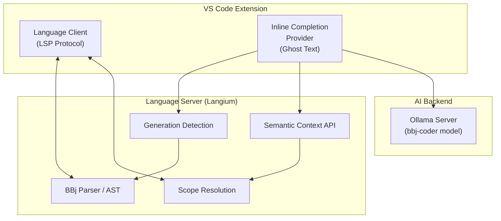
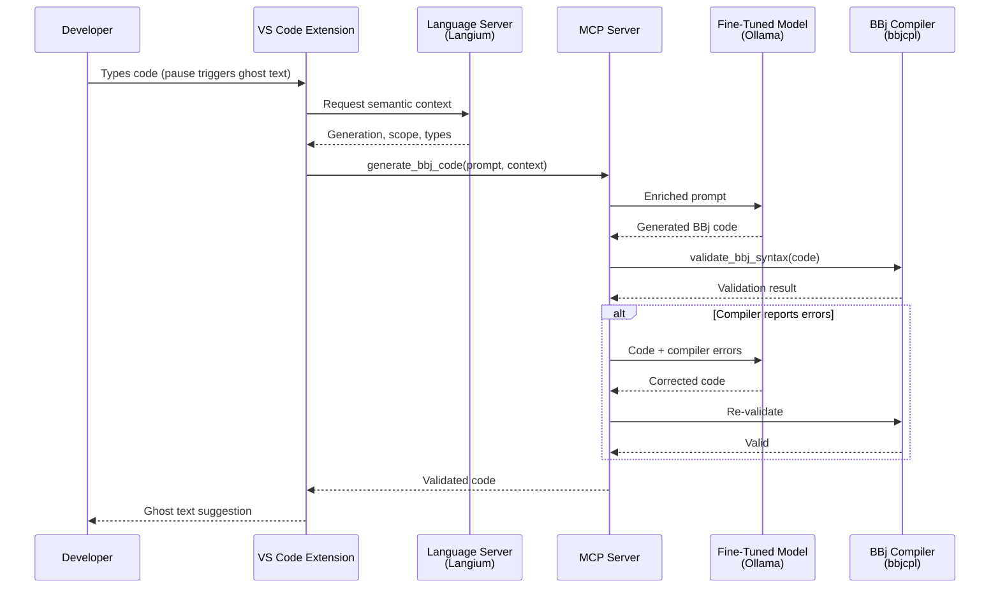

# IDE Integration

:::tip[TL;DR]
The [bbj-language-server](https://github.com/BBx-Kitchen/bbj-language-server) (v0.5.0, shipped on the VS Code Marketplace) provides the foundation for AI-powered BBj development. The architecture layers two completion mechanisms -- deterministic popup completion via Langium and generative ghost text via a fine-tuned LLM -- with a compiler validation step that runs every AI-generated snippet through the BBj compiler before presentation. This generate-validate-fix loop ensures ground-truth syntax validation: the code either compiles or the LLM corrects it. A Copilot BYOK bridge provides interim chat-based AI access, but custom inline completion with compiler validation is the strategic path.
:::

[Chapter 3](/docs/fine-tuning) describes how to build a BBj-aware language model. This chapter answers the next question: how does that model reach the developer? The answer is IDE integration -- specifically, a VS Code extension that combines traditional language intelligence with LLM-powered code generation.

The vision is an editor that understands all four BBj generations natively. When a developer types `#window!.` in a DWC class, the extension offers both a deterministic list of available members (from the Langium parser) and a generative multi-line suggestion (from the fine-tuned model) that matches the surrounding generation context. Before any suggestion reaches the developer, the BBj compiler validates it -- ensuring ground-truth syntax correctness that no amount of model training can guarantee alone. These are complementary mechanisms, not competing ones.

What makes this achievable rather than aspirational is that the foundation already exists. The bbj-language-server is a real, shipped product -- not a prototype or a proposal. Building AI-powered completion on top of it is an extension of working infrastructure, not a greenfield project.

## The Foundation: bbj-language-server

The [bbj-language-server](https://github.com/BBx-Kitchen/bbj-language-server) is the BBj language extension for VS Code, built on the [Langium](https://langium.org/) framework and published on the [VS Code Marketplace](https://marketplace.visualstudio.com/). It is the single most important piece of existing infrastructure for BBj AI integration.

Key facts:

| Attribute | Value |
|-----------|-------|
| Version | v0.5.0 (January 2026) |
| Framework | Langium (Eclipse Foundation, v4.x) |
| Language | TypeScript (87.9%), with Java interop |
| License | MIT |
| Contributors | 13 |
| Commits | 450+ |
| Structure | `bbj-vscode` (extension + language server) + `java-interop` (classpath via JSON-RPC) |

The extension ships with production-grade features:

- **Syntax highlighting** -- full BBj grammar support including all four generational syntaxes
- **Code completion** -- Langium-powered symbol completion with scope awareness
- **Diagnostics** -- real-time error detection and reporting
- **Code formatting** -- automatic formatting for BBj source files
- **BBj Properties viewing** -- inspect `config.bbx` and BBj properties from the editor
- **Code execution** -- run BBj programs directly from VS Code
- **Enterprise Manager integration** -- connect to BBj Enterprise Manager

This is not a future plan. It is a shipped, maintained product with 450+ commits and 13 contributors. Every AI integration feature described in this chapter builds on top of this foundation.

### Why Langium Matters

[Langium](https://langium.org/) is a language engineering framework from the Eclipse Foundation that generates a full language server from a grammar definition. It provides:

- **Parser and AST generation** -- the BBj grammar is defined declaratively; Langium generates the parser, AST types, and visitor infrastructure
- **Scope resolution** -- knows which symbols are visible at any given cursor position
- **Type inference** -- understands BBj's type system including object references (`!` suffix), field references (`#` prefix), and generation-specific APIs
- **LSP integration** -- native Language Server Protocol support, so the language server works with any LSP-compatible editor
- **Dependency injection** -- services like completion providers, validators, and formatters can be customized or extended without modifying the core

For AI integration, the critical value of Langium is **semantic context**. A Langium-based language server does not just tokenize text -- it builds a full abstract syntax tree with scope information, type resolution, and cross-reference analysis. This structured understanding of the code is exactly what an LLM needs in its prompt to generate accurate, context-appropriate completions.

## Two Completion Mechanisms

The architecture uses two fundamentally different completion mechanisms, each optimized for a different use case. Understanding why both are necessary is key to the design.

| | Popup Completion | Ghost Text |
|---|---|---|
| **Source** | Langium scope resolution | Fine-tuned LLM via Ollama |
| **Trigger** | `.` key or Ctrl+Space | Pause in typing (debounced) |
| **Latency** | < 10ms | 200-1000ms |
| **Correctness** | 100% -- only valid symbols | High but not guaranteed |
| **Output** | List of symbols to choose from | Inline suggestion to accept/reject |
| **Use case** | Member access, keyword selection, method names | Multi-line code, pattern completion, boilerplate |
| **Generation-aware** | Inherently (Langium knows the AST) | Via prompt engineering with generation context |

:::info[Decision: Two-Layer Completion Architecture]
**Choice:** Maintain both deterministic Langium completion and generative LLM completion as separate, complementary mechanisms.

**Rationale:** Popup completion must be instant and correct -- developers rely on it for discovering available APIs. A 200ms delay or a hallucinated method name would destroy trust. Ghost text can afford higher latency because it appears passively, and developers evaluate it before accepting. Merging these into a single mechanism would compromise the strengths of both.

**Alternatives considered:** LLM-only completion (too slow for popup, too unreliable for symbol lists), Langium-only completion (cannot generate multi-line code or novel patterns), hybrid single provider (latency compromise unacceptable for popup).

**Status:** Popup completion is shipped via the bbj-language-server. Ghost text completion is planned.
:::

### Ghost Text Architecture

Ghost text -- the dimmed inline suggestion that appears as you type -- is powered by VS Code's [`InlineCompletionItemProvider`](https://code.visualstudio.com/api/references/vscode-api#InlineCompletionItemProvider) API. This is the same API that GitHub Copilot uses internally for its suggestions.

The lifecycle for a ghost text completion:

1. **User types** -- the developer writes or modifies code
2. **Debounce** -- a short delay (300-500ms) prevents triggering on every keystroke
3. **Context extraction** -- the extension queries the Langium language server for semantic context: current scope, containing class/method, detected generation, visible symbols
4. **Prompt assembly** -- the extracted context is assembled into a structured prompt for the LLM (see [Generation-Aware Completion](#generation-aware-completion) below)
5. **LLM call** -- the prompt is sent to the Ollama server running the fine-tuned BBj model
6. **Render ghost text** -- the response is displayed as dimmed inline text; the developer presses Tab to accept or continues typing to dismiss

The extension-side implementation follows the standard VS Code pattern:

```typescript
import * as vscode from 'vscode';

const provider: vscode.InlineCompletionItemProvider = {
    async provideInlineCompletionItems(
        document: vscode.TextDocument,
        position: vscode.Position,
        context: vscode.InlineCompletionContext,
        token: vscode.CancellationToken
    ): Promise<vscode.InlineCompletionList> {
        // 1. Extract semantic context from Langium language server
        const semanticContext = await languageClient.sendRequest(
            'bbj/semanticContext', { uri: document.uri.toString(), position }
        );

        // 2. Detect BBj generation from AST
        const generation = semanticContext.generation;

        // 3. Assemble prompt with generation context + scope info
        const prompt = buildPrompt(document, position, semanticContext);

        // 4. Call Ollama API for completion
        const completion = await ollama.generate({
            model: 'bbj-coder',
            prompt,
            options: { temperature: 0.2, num_predict: 256 }
        });

        // 5. Return inline completion items
        return {
            items: [{
                insertText: completion.response,
                range: new vscode.Range(position, position),
            }],
        };
    },
};

vscode.languages.registerInlineCompletionItemProvider(
    { language: 'bbj' },
    provider
);
```

The `bbj/semanticContext` custom LSP request is the bridge between the Langium language server and the AI completion provider. It exposes the structured understanding that Langium has already built -- scope, types, generation context -- to the component that assembles the LLM prompt.



## Generation-Aware Completion

The most distinctive aspect of BBj AI completion is **generation detection**. As [Chapter 1](/docs/bbj-challenge) establishes, BBj spans four generations of syntax and idioms. Suggesting a `PRINT (sysgui)'WINDOW'(...)` mnemonic in DWC code -- or a `getWebManager()` call in a character UI program -- is worse than no suggestion at all. The LLM must know which generation it is operating in.

The Langium parser can detect the code generation by analyzing AST patterns:

```typescript
interface GenerationContext {
    detected: 'character' | 'vpro5' | 'bbj-gui' | 'dwc' | 'mixed' | 'unknown';
    confidence: number;
    signals: string[];
}

function detectGeneration(ast: BbjProgram): GenerationContext {
    const signals: string[] = [];

    // DWC-specific signals
    if (hasCall(ast, 'BBjAPI().getWebManager')) {
        signals.push('dwc:getWebManager');
    }

    // BBj GUI signals (also valid in DWC)
    if (hasCall(ast, 'BBjAPI().getSysGui')) {
        signals.push('bbj:getSysGui');
    }

    // Visual PRO/5 signals
    if (hasStatement(ast, "PRINT (sysgui)'WINDOW'")) {
        signals.push('vpro5:window-mnemonic');
    }

    // Character UI signals
    if (hasMnemonic(ast, '@(') && !hasAnyGuiCode(ast)) {
        signals.push('character:mnemonics-only');
    }

    return inferGeneration(signals);
}
```

The detection relies on **signal accumulation** rather than single-token matching. A file that contains both `BBjAPI().getSysGui()` and `getWebManager()` calls is classified as `dwc` (DWC subsumes BBj GUI). A file with only `@(x,y)` mnemonics and no GUI API calls is classified as `character`. Mixed-generation files -- which exist in real codebases during migration -- are flagged as `mixed` with reduced confidence.

### Semantic Context for Prompts

Generation detection is one component of the broader semantic context that Langium provides. The full context available for prompt assembly includes:

```typescript
interface SemanticContext {
    // Structural context
    containingClass: string | null;
    containingMethod: string | null;

    // Generation context
    generation: GenerationContext;

    // Scope information
    visibleSymbols: Array<{
        name: string;
        type: string;
        kind: 'field' | 'local' | 'parameter' | 'method';
    }>;

    // Expression context (if completing after dot)
    receiver: {
        expression: string;
        resolvedType: string;
        availableMembers: MemberInfo[];
    } | null;

    // Recent code for flow understanding
    precedingStatements: string[];
}
```

This structured context is what differentiates BBj AI completion from generic code completion tools. A generic LLM sees only raw text. The BBj extension sees an AST with scope, types, generation, and member information -- and encodes all of it in the prompt.

### Enriched Prompt Example

To illustrate the difference, consider a developer with their cursor at `#custGrid!.` after fetching a recordset. Without semantic context, the LLM receives raw code text and must guess at types, members, and generation. With the Langium-powered context, the prompt looks like this:

```text
You are a BBj code completion assistant.

<generation>
Detected: BBj DWC (Browser-based)
Confidence: High
Signals: BBjAPI().getSysGui(), BBjTopLevelWindow, setCallback()
</generation>

<rules>
- Generate code matching the BBj DWC generation
- Use object-oriented patterns (window!, button!, etc.)
- Do NOT suggest Visual PRO/5 mnemonics (PRINT (sysgui)'WINDOW'(...))
- Do NOT suggest character mnemonics (@(x,y)) for GUI code
</rules>

<receiver>
Expression `#custGrid!` has type `CustomerGrid` with members:
- method: setData(BBjRecordSet rs!) returns void
- method: refresh() returns void
- method: clearSelection() returns void
- method: getSelectedRow() returns BBjNumber
</receiver>

<scope>
orderId: BBjNumber (parameter)
rs!: BBjRecordSet (local)
#window!: BBjTopLevelWindow (field)
#custGrid!: CustomerGrid (field)
</scope>

<code>
    method public void loadOrder(BBjNumber orderId)
        #currentOrderId = orderId
        declare BBjRecordSet rs!
        rs! = #getOrderRecordSet(orderId)
        #custGrid!.
    methodend
</code>

Generate only the completion. No explanation.
```

Expected output: `setData(rs!)`

The model does not have to guess that `#custGrid!` is a `CustomerGrid` or that `setData` accepts a `BBjRecordSet`. Langium already resolved the types and members. The LLM's job is reduced from "understand everything about this code" to "pick the most likely next action given full context."

## Compiler Validation: Ground-Truth Syntax Checking

The fine-tuned model described above generates BBj code that is usually correct, but not always. Even a model trained on BBj-specific data can hallucinate syntax, particularly BBj's distinctive variable suffixes (`!`, `$`, `#`) and generation-specific APIs. A model that confuses BBj with another BASIC variant might omit the `!` suffix on object references or use method signatures that do not exist. The question is: how do you catch these errors before the developer sees them as ghost text?

The BBj compiler (`bbjcpl`) provides a ground-truth answer. Unlike pattern matching or heuristic analysis, the compiler performs full syntax validation: the code either compiles or it does not. By running every AI-generated snippet through `bbjcpl` before presenting it as ghost text, the system eliminates an entire class of hallucination errors at the source. The compiler's `-N` flag enables syntax-only validation without execution, making it suitable for rapid checks during the completion pipeline.

The generate-validate-fix loop makes this practical. The LLM generates code, the compiler validates it, and if errors are found, the LLM receives the compiler's error messages and corrects the code. This loop runs automatically, invisible to the developer -- they see only the validated result. The generate-validate-fix loop described in [Chapter 2](/docs/strategic-architecture#generate-validate-fix) defines this pattern at the architecture level; here we examine how it applies specifically to IDE completion.

Consider what happens when an LLM generates the following BBj code:

```bbj
rem Create a window and add a button
sysgui! = BBjAPI().openSysGui("X0")
window = sysgui!.addWindow(100, 100, 400, 300, "My App")
button = window.addButton(101, 10, 250, 100, 25, "Click Me")
```

The LLM assigned object return values to plain numeric variables (`window` and `button` instead of `window!` and `button!`). This is a hallucination pattern where the model confuses BBj with a BASIC variant that does not use type suffixes. It also called `addButton` on a plain variable instead of an object reference. The compiler catches this immediately:

```
temp.bbj: error at line 3 (3): window = sysgui!.addWindow(100, 100, 400, 300, "My App")
```

The compiler reports an error because assigning an object return value to a plain numeric variable is a type violation. The LLM receives this error and produces corrected code:

```bbj
rem Create a window and add a button
sysgui! = BBjAPI().openSysGui("X0")
window! = sysgui!.addWindow(100, 100, 400, 300, "My App")
button! = window!.addButton(101, 10, 250, 100, 25, "Click Me")
```

This is a single illustrative example, but the pattern applies to any syntax error the compiler can detect -- the model learns from the compiler's feedback in real time.

The compiler validation capability is not limited to the custom VS Code extension. Because it is exposed as the `validate_bbj_syntax` MCP tool (defined in [Chapter 2](/docs/strategic-architecture#validate_bbj_syntax)), any MCP-compatible host -- Claude, Cursor, VS Code, or custom applications -- can validate BBj syntax against the compiler. The custom extension provides the richest integration (Langium semantic context enriches the generation step), but the MCP server makes compiler validation accessible to any AI-powered development tool without custom code.

### bbjcpltool: Proof of Concept

To validate the compiler-in-the-loop concept, a proof-of-concept tool (bbjcpltool v1) was developed that automatically invokes the BBj compiler after every AI-generated code change. When the compiler detects syntax errors, the error messages are surfaced to the AI assistant, which then corrects the code before the developer sees the result.

The proof-of-concept demonstrated three key findings: first, the BBj compiler reliably catches syntax errors that the LLM produces, including the variable suffix hallucinations described above; second, LLMs can interpret `bbjcpl` error messages and self-correct without human intervention; and third, the correction cycle adds minimal latency -- a single validation-and-fix pass typically resolves the error.

The bbjcpltool v1 transforms compiler validation from a theoretical architecture pattern into a demonstrated capability. The generate-validate-fix loop works in practice, not just on paper.

The following diagram shows the complete IDE completion pipeline, including the compiler validation step between code generation and ghost text presentation:



The `alt` block shows the generate-validate-fix cycle -- the same pattern described in [Chapter 2](/docs/strategic-architecture#generate-validate-fix), viewed from the IDE completion perspective.

:::info[Decision: Compiler Validation via bbjcpl]
**Choice:** Use the BBj compiler (`bbjcpl`) as a ground-truth validation step in the code generation pipeline, verifying every AI-generated BBj snippet before it reaches the developer.

**Rationale:** A fine-tuned model hallucinates less than a generic LLM, but it still produces syntax errors -- particularly with BBj's distinctive variable suffixes (`!`, `$`, `#`) and generation-specific APIs. The compiler provides a binary, authoritative answer: the code either compiles or it does not. This eliminates an entire class of errors that statistical confidence alone cannot catch.

**Alternatives considered:** Language server / static analysis (catches patterns and known symbols, but does not validate full syntax -- BBj does not have a standalone linter, and the language server is the closest alternative, which is already used for deterministic completions); LLM self-check (the model that hallucinated the error cannot reliably detect its own mistakes -- this is asking the source of the problem to be the solution).

**Status:** Concept validated. bbjcpltool v1 proof-of-concept demonstrates compiler-in-the-loop validation in a working development environment. Integration as the `validate_bbj_syntax` MCP tool is planned.
:::

## LSP 3.18: Server-Side Inline Completion

The VS Code `InlineCompletionItemProvider` API works, but it is an editor-specific extension API. [LSP 3.18](https://microsoft.github.io/language-server-protocol/specifications/lsp/3.18/specification/) introduces `textDocument/inlineCompletion` as a **protocol-level feature**, meaning inline completion can be served from the language server itself rather than requiring editor-specific extension code.

This is architecturally significant for Langium-based servers. Currently, the ghost text provider lives in the VS Code extension client and must query the language server for context via custom requests. With LSP 3.18, the completion logic can live directly in the language server -- closer to the parser, the AST, and the semantic context it needs.

```typescript
// Server capability registration
{
    capabilities: {
        inlineCompletionProvider: {
            // Enable textDocument/inlineCompletion
        }
    }
}

// Handler for textDocument/inlineCompletion
connection.onRequest('textDocument/inlineCompletion', async (params) => {
    const { textDocument, position, context } = params;
    // context.triggerKind: Invoked (1) or Automatic (2)

    // The language server already has the AST and semantic context
    const ast = documentManager.getAST(textDocument.uri);
    const generation = detectGeneration(ast);
    const semanticCtx = extractSemanticContext(ast, position);

    // Assemble prompt and call Ollama directly from the server
    const prompt = buildPrompt(semanticCtx);
    const completion = await ollama.generate({
        model: 'bbj-coder', prompt
    });

    return {
        items: [{
            insertText: completion.response,
            range: { start: position, end: position }
        }]
    };
});
```

Editor adoption of LSP 3.18 inline completion is progressing: [Neovim has merged support](https://github.com/neovim/neovim), Helix has an open pull request, and Zed has an open issue tracking implementation. As adoption grows, a Langium-based server that implements `textDocument/inlineCompletion` can provide AI-powered ghost text completion to any LSP-compatible editor -- not just VS Code.

:::info[Decision: Extension API Now, LSP 3.18 Migration Path]
**Choice:** Implement ghost text completion using VS Code's `InlineCompletionItemProvider` API initially, with a planned migration to LSP 3.18 `textDocument/inlineCompletion` as editor adoption matures.

**Rationale:** VS Code is the primary target editor and supports the extension API today. LSP 3.18 inline completion is not yet universally adopted. Starting with the extension API delivers value immediately while the LSP migration path ensures multi-editor support in the future. The semantic context extraction logic is shared between both approaches.

**Alternatives considered:** Wait for LSP 3.18 adoption (delays delivery), implement both simultaneously (duplicated effort), LSP 3.18 only (limited editor support today).

**Status:** Planned. The bbj-language-server's Langium foundation supports either approach.
:::

## The Copilot Bridge

Developers will naturally ask: "Can't we just use GitHub Copilot with a custom model?" The short answer is: partially, and only for chat -- not for inline completions.

### What BYOK Offers

As of VS Code v1.99 (March 2025), Copilot supports [Bring Your Own Key (BYOK)](https://code.visualstudio.com/docs/copilot/customization/language-models) with Ollama as a built-in model provider. Configuration is straightforward:

1. Open Command Palette and select **Chat: Manage Language Models**
2. Select **Add Models** and choose **Ollama**
3. Enter endpoint: `http://localhost:11434`
4. Select the model (e.g., `bbj-coder`)

This gives Copilot Chat access to the fine-tuned BBj model. Developers can ask questions like "How do I create a window in BBj?" or "Convert this Visual PRO/5 code to DWC" and receive answers from a model that actually understands BBj.

### What BYOK Does Not Offer

**BYOK does not support inline code completions.** The dimmed ghost text suggestions that appear as you type -- arguably the most valuable Copilot feature for daily coding -- still come exclusively from GitHub's cloud-hosted models. There is no mechanism to route inline completions through a local Ollama model via BYOK.

This means BYOK with a fine-tuned BBj model gives you:
- **Chat:** BBj-aware conversational assistance (works)
- **Inline completions:** Generic suggestions from GitHub's models, with no BBj knowledge (unchanged)

Additionally, as of January 2026:
- BYOK is not yet available for [Copilot Business or Enterprise plans](https://code.visualstudio.com/docs/copilot/customization/language-models) -- only individual subscriptions
- Ollama models work only in Ask Mode, not Agent Mode
- The [separate Copilot extension is being deprecated](https://code.visualstudio.com/blogs/2025/11/04/openSourceAIEditorSecondMilestone) and its functionality merged into the Copilot Chat extension

:::info[Decision: Copilot Bridge is Complementary, Not Primary]
**Choice:** Support the Copilot BYOK path as an interim bridge for chat-based BBj assistance, while building the custom `InlineCompletionItemProvider` as the primary path for inline code completion.

**Rationale:** Copilot BYOK with Ollama provides immediate value for chat interactions -- developers can query the fine-tuned BBj model conversationally without any custom extension code. But the inline completion gap means the most impactful developer workflow (type-and-complete) requires the custom provider. Investing in the custom path also ensures multi-editor support via LSP 3.18 and avoids dependency on Copilot's evolving feature set.

**Alternatives considered:** Wait for Copilot to support custom inline models (timeline uncertain, may never happen), use only Copilot BYOK chat (leaves the highest-value use case unserved), ignore Copilot entirely (wastes a free integration point for chat).

**Status:** Copilot integration in early exploration. Custom inline completion provider planned.
:::

## Alternative Architectures

### Continue.dev

[Continue.dev](https://continue.dev/) is an open-source AI code assistant that supports Ollama for both chat and tab autocomplete. Its autocomplete implementation uses the `InlineCompletionItemProvider` API internally -- the same pattern described above -- combined with LSP for definitions and similarity search over recent files to build context.

Continue.dev validates an important design insight: **autocomplete models do not need to be large.** Their [recommended autocomplete model](https://docs.continue.dev/customize/deep-dives/autocomplete) as of 2026 is Qwen 2.5 Coder 1.5B -- a model small enough to run on any modern laptop. Fill-in-the-middle (FIM) training format, which the Qwen2.5-Coder family supports natively, is more important than raw model size for inline completion quality.

For the BBj use case, Continue.dev serves as an architectural reference rather than a direct solution. It does not have BBj language support, and its context assembly lacks the generation-aware prompting that Langium enables. But its approach to local-model tab completion is sound and informs the custom implementation.

### Langium AI

[TypeFox](https://www.typefox.io/) (the company behind Langium) released [langium-ai-tools](https://www.typefox.io/blog/langium-ai-the-fusion-of-dsls-and-llms/) in 2025 -- a toolbox for bridging Langium-based DSL parsers with LLM integration. The tools include:

- **Evaluation pipelines** -- automated testing of LLM output against DSL grammars
- **DSL-aware splitting** -- chunking code for RAG that respects grammar boundaries
- **Constraint generation** -- producing validation rules from Langium grammars that constrain LLM output

This is directly relevant to the bbj-language-server. However, as of January 2026, langium-ai-tools (v0.0.2) targets Langium 3.4.x, while the bbj-language-server is built on Langium 4.x. Whether the tools will be updated for Langium 4.x compatibility is not yet clear.

Langium AI is an initiative to watch rather than a current dependency. If the version gap is bridged, it could accelerate features like grammar-constrained LLM output validation -- ensuring the fine-tuned model's suggestions are always syntactically valid BBj before they reach the developer.

## Current Status

:::note[Where Things Stand -- January 2026]
**Shipped:** The bbj-language-server (v0.5.0) is published on the [VS Code Marketplace](https://marketplace.visualstudio.com/) with syntax highlighting, code completion, diagnostics, formatting, BBj Properties viewing, and code execution. It is actively maintained with 450+ commits and 13 contributors.

**In progress:** The fine-tuned BBj model is under active development with approximately 10,000 training data points and promising early results (see [Chapter 3](/docs/fine-tuning)). Copilot BYOK integration is in early exploration -- initial testing of the fine-tuned model through Copilot Chat shows encouraging results.

**Planned:** LLM-powered ghost text completion via `InlineCompletionItemProvider`, generation detection in the Langium parser, semantic context API for enriched prompts, and eventual migration to LSP 3.18 `textDocument/inlineCompletion` for multi-editor support.
:::

The path from current state to AI-powered completion is incremental, not revolutionary. The language server already provides the Langium parser, AST, scope resolution, and VS Code integration. Adding generation detection, a semantic context API, and an LLM completion provider extends the existing architecture without replacing it.

## What Comes Next

The fine-tuned model described in [Chapter 3](/docs/fine-tuning) provides the intelligence. This chapter describes how that intelligence reaches the developer's editor. The remaining components complete the picture:

- [**RAG Database**](/docs/rag-database) -- the retrieval layer that feeds documentation context into both IDE completion prompts and chat responses
- [**Documentation Chat**](/docs/documentation-chat) -- a conversational interface for BBj questions, powered by the same model and RAG infrastructure
- [**Strategic Architecture**](/docs/strategic-architecture) -- how the model, RAG database, IDE extension, and chat interface connect as a unified system
- [**Implementation Roadmap**](/docs/implementation-roadmap) -- timelines, milestones, and resource allocation for bringing these components to production
