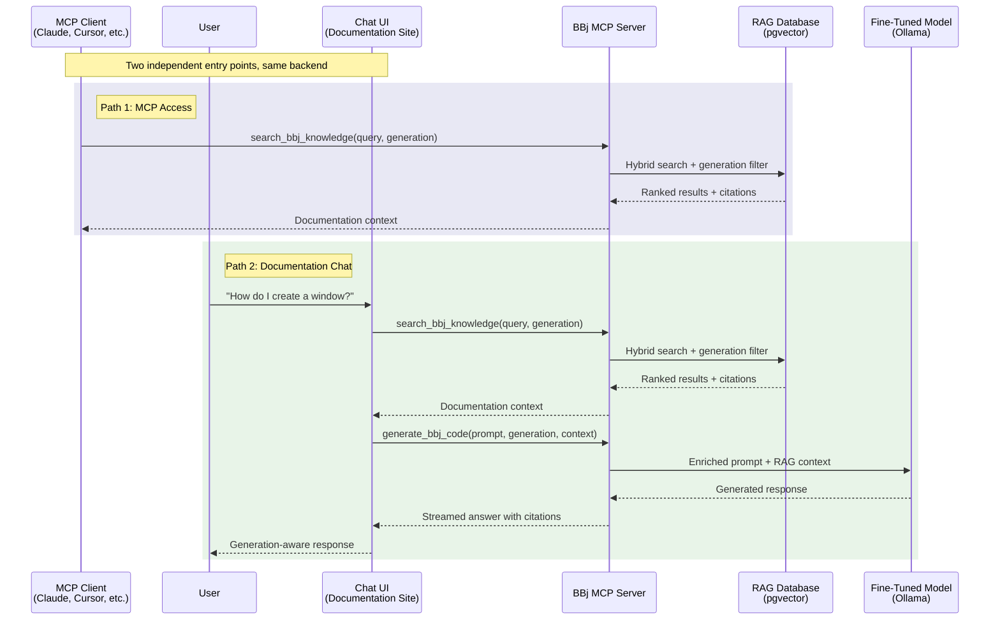

# Documentation Chat

:::tip[TL;DR]
BBj AI knowledge is accessible through two independent, equally important paths: any MCP-compatible client (Claude, Cursor, custom tools) can invoke `search_bbj_knowledge` and `validate_bbj_syntax` for instant access with zero custom code, while an embedded chat interface on the documentation site serves human users with RAG-grounded, cited responses. The chat uses the Claude API with retrieval from the [generation-tagged RAG pipeline](/docs/rag-database) (51K+ documentation chunks across 7 source groups) to produce answers with source citations linking back to the original documentation. A planned `generate_bbj_code` tool will add code generation capabilities once an operational [fine-tuned BBj model](/docs/fine-tuning) is available. Generic chat services fail for BBj (the same core problem [Chapter 1](/docs/bbj-challenge) establishes) -- the RAG-grounded approach with BBj-specific retrieval bridges that gap today.
:::

Developers asking BBj questions today have limited options: search the documentation manually, post on forums, or ask a generic chatbot that hallucinates answers. The BBj AI strategy addresses this through two independent paths to the same shared infrastructure, each serving a different audience.

The first path is **MCP access**: any MCP-compatible client -- Claude, Cursor, VS Code, or a custom application -- can query BBj documentation, generate BBj code, and validate syntax through the three tools defined in [Chapter 2](/docs/strategic-architecture#the-mcp-server-concrete-integration-layer). This is the interface for AI talking to our AI infrastructure. No custom integration code required.

The second path is an **embedded documentation chat**: a conversational interface on the BBj documentation site where developers ask natural language questions and receive generation-aware, cited answers. This is the interface for humans browsing documentation. The vision for the chat side is still forming -- implementation details have not been finalized -- so this chapter focuses on what the system must do and how generation-aware responses work.

## Why Generic Chat Services Fail

The documentation chat market has matured significantly. [kapa.ai](https://www.kapa.ai/) serves over 200 enterprise customers including Docker, OpenAI, and Nokia. Algolia offers AI-powered search across documentation sites. GitHub Copilot Chat answers questions about codebases. These services prove the concept works -- for mainstream technologies.

For BBj, they all share the same fatal flaw: the underlying LLM has never seen BBj code.

| Service | How It Works | Why It Fails for BBj |
|---------|--------------|----------------------|
| **kapa.ai** | Crawls your docs, feeds them to a generic LLM via RAG | The LLM cannot understand BBj code snippets in the retrieved documentation. It will misinterpret syntax, confuse generations, and hallucinate methods that do not exist. |
| **Algolia Ask AI** | Indexes documentation content, uses a generic LLM to generate answers | Same fundamental problem -- the LLM treats BBj code as noise or misidentifies it as BASIC/VBA. No generation awareness. |
| **GitHub Copilot Chat** | Uses GitHub's cloud models with repository context | Suggests wrong syntax, invents nonexistent BBj methods, and cannot distinguish between Visual PRO/5 and modern DWC patterns. |

kapa.ai is particularly instructive. Its architecture -- crawl documentation, chunk it, retrieve relevant sections, feed them to an LLM -- is exactly the right approach. The platform works well for Docker, OpenAI, and Nokia because the underlying LLM already understands Docker commands, Python APIs, and networking protocols. The RAG layer provides specificity; the LLM provides comprehension.

For BBj, the RAG layer would retrieve the right documentation pages, but the LLM would still fail to comprehend the code examples on those pages. A retrieved chunk showing `BBjSysGui.addWindow()` would be meaningless to a model that has never encountered BBj object syntax. The model might attempt to interpret it as Java (recognizing the dot notation) and generate advice based on Java's `Window` class -- confidently wrong.

This is not a RAG problem. It is a model problem. And it is the same model problem that drives the entire BBj AI strategy: generic LLMs need fine-tuning before they can work with BBj.

### The webforJ Contrast

The failure of generic services for BBj becomes even clearer when compared to how the same services handle [webforJ](https://webforj.com/). webforJ is a Java-based web framework -- and generic LLMs understand Java well. A service like kapa.ai, pointed at webforJ documentation, would produce competent answers because the underlying LLM can parse Java code examples, understand Java class hierarchies, and reason about Java design patterns.

BBj gets none of this. The LLM has no prior exposure to BBj's `!` suffix convention for objects, `#` prefix for instance fields, `methodend` block terminators, or the four-generation syntax evolution. Every BBj code snippet in a retrieved documentation chunk is opaque to the model. This asymmetry -- the same RAG architecture working for webforJ but failing for BBj -- is the clearest illustration of why a fine-tuned model is the prerequisite, not the RAG layer.

## The Shared Foundation

Both paths -- MCP access and documentation chat -- consume backend capabilities through the [BBj MCP server](/docs/strategic-architecture#the-mcp-server-concrete-integration-layer) defined in Chapter 2.

The first capability is **RAG retrieval** via the `search_bbj_knowledge` tool. This tool queries the [generation-tagged RAG database](/docs/rag-database) using hybrid search (dense vectors + BM25 keyword matching + source-balanced ranking) and returns ranked documentation chunks with source citations. Whether the query comes from Claude Desktop or from the chat interface, the same retrieval pipeline surfaces the same generation-appropriate results. This tool is operational and available via both stdio and Streamable HTTP transports.

The second capability is **compiler validation** via the `validate_bbj_syntax` tool. This tool provides [compiler-based validation](/docs/ide-integration) through the BBj compiler (`bbjcpl`) -- completing the generate-validate-fix loop described in [Chapter 2](/docs/strategic-architecture#generate-validate-fix). The chat interface uses this to automatically validate BBj code in responses, with visual pass/fail indicators and a 3-attempt auto-fix cycle. This tool is operational and available to any MCP client that needs ground-truth syntax checking.

A planned third capability is **code generation** via the `generate_bbj_code` tool. This tool will send enriched prompts to a [fine-tuned BBj model](/docs/fine-tuning) hosted on Ollama, producing generation-appropriate BBj code with RAG-retrieved context automatically assembled into the prompt. This tool is not yet implemented -- it requires an operational fine-tuned BBj model, which is currently in the research phase (see [Chapter 3](/docs/fine-tuning)).

The current chat implementation takes a different approach: rather than using `generate_bbj_code`, it sends queries directly to the Claude API (Anthropic SDK) with RAG-retrieved documentation as context. This produces high-quality, grounded answers today without waiting for a fine-tuned model. When `generate_bbj_code` becomes available, it will offer an additional path with deeper BBj code comprehension.

For complete tool schemas and the MCP server architecture, see [Chapter 2: Strategic Architecture](/docs/strategic-architecture#the-mcp-server-concrete-integration-layer).

## Path 1: MCP Access

MCP is the interface for AI talking to our AI infrastructure. Any MCP-compatible client -- Claude, Cursor, VS Code, or a custom application -- can consume BBj knowledge with zero custom integration code.

- **`search_bbj_knowledge`** retrieves generation-aware documentation and code examples from the RAG database, with source citations for provenance. ([Schema](/docs/strategic-architecture#search_bbj_knowledge))
- **`generate_bbj_code`** produces BBj code in the target generation using the fine-tuned model with RAG-enriched context. ([Schema](/docs/strategic-architecture#generate_bbj_code))
- **`validate_bbj_syntax`** validates generated code against the BBj compiler for ground-truth syntax checking. ([Schema](/docs/strategic-architecture#validate_bbj_syntax))

Because the [MCP server exposes standard tool discovery and schema-based invocation](/docs/strategic-architecture#the-mcp-server-concrete-integration-layer), adding a new AI consumer is a UX problem -- designing the right interface for each workflow -- not an AI infrastructure problem. The intelligence is in the shared foundation; the client just invokes it.

## Path 2: Documentation Chat

The documentation chat serves humans browsing the BBj documentation site. Available at the `/chat` endpoint, it lets developers ask natural language questions -- "How do I create a window?" -- and receive accurate, generation-appropriate answers with links to the source documentation.

The current implementation uses the Claude API (Anthropic SDK) as the LLM backend, with RAG retrieval providing documentation context from the 51K+ chunk corpus. This is a different architecture than originally envisioned (which assumed a fine-tuned BBj model via Ollama) -- the Claude API approach was chosen because it delivers high-quality, grounded answers today while the fine-tuned model remains in the research phase. The eventual vision of using a fine-tuned BBj model for deeper code comprehension remains a future goal.

The chat interface goes beyond what raw MCP access provides: it manages conversation context, detects generation hints from the dialogue, streams formatted responses via SSE with inline citations, and automatically validates BBj code in responses using `bbjcpl`. These capabilities are what make a chat experience natural for human users, and they are described in the sections below.

### Generation-Aware Response Design

Generation-aware responses are the core value proposition that no generic chat service can replicate. The same question -- asked in different contexts -- should produce different, accurate answers.

#### Default Behavior: Modern First

When a user asks a question without specifying a generation, the system defaults to modern BBj (DWC/GUI) patterns. This matches the most common use case: developers working on current projects.

**Query:** "How do I create a window in BBj?"

**Response (no generation context):**

> In modern BBj, you create windows using the BBjAPI:
>
> ```bbj
> sysgui! = BBjAPI().getSysGui()
> window! = sysgui!.addWindow(100, 100, 800, 600, "My Application")
> ```
>
> The parameters are: x position, y position, width, height, and title. The `addWindow` method returns a `BBjTopLevelWindow` object that you can use to add child controls.
>
> *Source: [BBjSysGui.addWindow documentation]*
>
> *Note: If you are maintaining legacy Visual PRO/5 code, the older mnemonic-based syntax (`PRINT (sysgui)'WINDOW'(...)`) is also supported. Let me know if you need help with that syntax instead.*

#### Legacy Context Detection

When the query contains explicit or implicit generation signals, the system adjusts both retrieval and response generation.

**Query:** "I'm working on a Visual PRO/5 application. How do I create a window?"

**Response (legacy generation context):**

> In Visual PRO/5, you create windows by opening a SYSGUI device and sending mnemonic strings:
>
> ```bbj
> sysgui = unt
> open (sysgui)"X0"
> print (sysgui)'window'(100,100,400,300,"My Application",$00010003$,$00000000$)
> ```
>
> The parameters are: x position, y position, width, height, title, flags, and event mask. The SYSGUI channel must be opened first with `open (sysgui)"X0"`.
>
> *Source: [Visual PRO/5 GUI Mnemonic Reference]*
>
> *Consider: For new development or gradual modernization, the BBjAPI approach offers more flexibility and better browser support through DWC. I can show you how to migrate this pattern if you are interested.*

#### How Generation Hints Flow

The generation detection pipeline processes each query through three stages:

1. **Query analysis** -- The system scans the user's message for explicit generation markers ("Visual PRO/5", "DWC", "legacy") and implicit signals (mnemonic-style syntax like `PRINT (sysgui)'WINDOW'(...)` vs. object-style syntax like `addWindow()`). Conversation history also provides context -- if the user has been asking about legacy code, subsequent questions inherit that context.

2. **RAG filtering** -- The detected generation hint is passed to the [RAG database](/docs/rag-database) as a metadata filter. If the user is asking about Visual PRO/5, retrieval prioritizes documentation tagged with the `vpro5` generation label. If no generation is detected, retrieval is unfiltered (with a slight bias toward modern documentation).

3. **Prompt assembly** -- The enriched prompt includes the retrieved documentation chunks, the detected generation context, and instructions for the model to respond appropriately. The model receives explicit guidance: "The user is working with Visual PRO/5. Provide answers using Visual PRO/5 syntax and conventions."

This pipeline ensures that the same question produces different -- and correct -- answers depending on context. A generic chat service cannot do this because it has no concept of BBj generations and no generation-tagged document corpus to retrieve from.

### Streaming and Citations

Server-Sent Events (SSE) is the standard streaming pattern for LLM chat applications in 2025/2026. It provides a simple, well-supported mechanism for pushing response tokens from the server to the client as they are generated.

The streaming flow:

1. **Client sends query** via HTTP POST to the chat backend
2. **Backend processes** the query through the generation detection and RAG retrieval pipeline
3. **Backend opens SSE stream** to the client
4. **LLM generates tokens** via the Claude API's streaming interface, and the backend relays each token to the client in real time
5. **Citations are appended** at the end of the stream, referencing the documentation chunks that informed the answer

The current implementation uses the Anthropic SDK's async streaming API. The chat backend acts as an intermediary -- enriching the prompt with RAG-retrieved documentation context before forwarding to the Claude API, and attaching source citations with clickable documentation links to the streamed response. This architecture is also compatible with Ollama's streaming API (OpenAI-compatible `/v1/chat/completions` with `stream: true`), which would be used if the backend is switched to a fine-tuned BBj model in the future.

SSE has a key advantage over WebSockets for this use case: it works through standard HTTP infrastructure (proxies, load balancers, CDNs) without special configuration. For a self-hosted deployment behind a corporate firewall, this reduces the operational surface area.

#### Citation Format

Citations serve two purposes: they build user trust, and they provide a path to deeper reading. Each citation references the source documentation that the RAG pipeline retrieved for the response:

- **Inline citations** reference specific claims within the response text, linking to the relevant documentation page (e.g., "The `addWindow` method accepts position and size parameters ([BBjSysGui reference](https://documentation.basis.cloud/...))").
- **End-of-response citations** list all documentation chunks that informed the answer, providing a bibliography the user can review for additional context.

The exact citation format will be determined during implementation, but the architectural requirement is fixed: every answer must trace back to its sources. This is critical for a documentation chat -- unlike a general-purpose chatbot, the documentation chat's credibility depends on provenance.

### Conversation Context

A documentation chat that forgets previous messages after each query is frustrating to use. Session memory -- maintaining conversation history within a session -- enables natural follow-up questions:

> **User:** "How do I create a window in BBj?"
>
> **Assistant:** *[provides modern BBj answer]*
>
> **User:** "What about the Visual PRO/5 version?"
>
> **Assistant:** *[provides Visual PRO/5 answer, understanding "version" refers to window creation from the previous exchange]*

Conversation history is included in each request to the backend, allowing the model to resolve references ("the Visual PRO/5 version") without the user restating the full question. This also enables the generation detection pipeline to accumulate context -- if a user has been asking about legacy code for three messages, the fourth message inherits that generation context even without explicit markers.

Session memory is bounded: older messages are summarized or dropped after a configurable window (typically 10-20 exchanges) to keep the prompt within the model's context window. For the 14B model with a larger context window, this means balancing conversation history against RAG-retrieved documentation in the available token budget.

#### Token Budget Management

A typical chat request assembles several components into a single prompt, all competing for the context window:

| Component | Typical Tokens | Purpose |
|-----------|---------------|---------|
| System prompt | 100-200 | Model instructions, generation guidance |
| Conversation history | 500-1,500 | Previous exchanges for context |
| RAG-retrieved chunks | 1,000-2,000 | Source documentation for the current query |
| User query | 50-200 | The current question |
| **Reserved for response** | **1,000-2,000** | **Space for the model's answer** |

When conversation history grows long, the system must decide what to compress or drop. A practical strategy is to keep the most recent 3-5 exchanges verbatim and summarize older ones into a compact context block ("The user has been asking about Visual PRO/5 window management"). This preserves generation context without consuming the entire token budget.

The chat is available as an embedded component on the documentation site -- users stay in their documentation context, and the backend runs alongside the RAG database as a service.

## Unified Architecture

The following diagram shows how both paths converge on the same backend infrastructure. The visual similarity between the two paths -- both calling `search_bbj_knowledge` through the same BBj MCP Server -- is the shared foundation in action.



Both paths call the same `search_bbj_knowledge` tool -- the diagram makes this visually explicit. The chat path goes further by also calling `generate_bbj_code` to assemble richer conversational responses with code examples and explanations. The third tool, `validate_bbj_syntax`, completes the MCP ecosystem -- it is primarily relevant for the [generate-validate-fix loop](/docs/strategic-architecture#generate-validate-fix) documented in Chapter 2 and the [IDE completion pipeline](/docs/ide-integration) in Chapter 4, but any MCP client can invoke it when ground-truth syntax checking is needed.

:::info[Decision: MCP Tool for RAG Access]
**Choice:** Expose RAG retrieval through the MCP `search_bbj_knowledge` tool,
making the BBj knowledge base accessible to any MCP-compatible client without
custom integration code.

**Rationale:** The documentation chat backend and every other AI consumer need
the same thing: generation-aware retrieval from the BBj knowledge base. Rather
than building a custom retrieval API for the chat system, the MCP server exposes
`search_bbj_knowledge` as a standard tool that any client can invoke. The chat
backend is one consumer; Claude, Cursor, and custom applications are others.
This follows the [unified infrastructure principle](/docs/strategic-architecture)
established in Chapter 2.

**Alternatives considered:** Custom REST API for chat retrieval (requires
maintaining a separate API alongside MCP; duplicates effort); direct database
queries from the chat backend (couples the chat system to the database schema;
breaks the abstraction layer; prevents other clients from benefiting).

**Status:** Operational. The `search_bbj_knowledge` tool is implemented and
available via the BBj MCP server (stdio and Streamable HTTP transports). The
chat backend and MCP clients both use this tool for RAG retrieval.
:::

## Architectural Requirements

The documentation chat system must satisfy six non-negotiable requirements, derived from the failures of generic services and the unique challenges of BBj's multi-generational ecosystem.

1. **Uses a BBj-aware LLM backend.** The chat backend must use an LLM that can reason about BBj syntax and documentation. The current implementation uses the Claude API with RAG-retrieved documentation context, which grounds responses in the 51K+ chunk corpus. The target architecture is a [fine-tuned BBj model](/docs/fine-tuning) that understands BBj syntax across all four generations -- this will provide deeper code comprehension when an operational fine-tuned model is available.

2. **Retrieves generation-tagged documentation.** The [RAG pipeline](/docs/rag-database) must filter retrieval results by generation metadata. When a user asks about Visual PRO/5, the system should not surface modern DWC documentation (and vice versa) unless the user specifically requests a comparison.

3. **Streams responses in real-time.** Users expect conversational latency, not batch processing. The system must stream tokens as they are generated, providing immediate feedback.

4. **Provides source citations.** Every answer must link back to the documentation it draws from. This builds trust and lets users verify answers against the authoritative source.

5. **Adapts answers to the user's target generation.** The system must detect generation context from the query (explicit mentions like "Visual PRO/5" or implicit signals like mnemonic-style syntax) and tailor both retrieval and response generation accordingly.

6. **Leverages shared infrastructure.** The chat system must not build its own retrieval pipeline. It consumes the same RAG database that the MCP server and IDE extension use. When a fine-tuned BBj model becomes operational, the chat backend can switch to consuming the same Ollama instance.

:::info[Decision: Shared Infrastructure for Documentation Chat]
**Choice:** The documentation chat system uses the same Ollama server and RAG database as the IDE extension -- no separate AI infrastructure.

**Rationale:** Building a second model or a second retrieval pipeline for chat would contradict the [unified infrastructure strategy](/docs/strategic-architecture). The model that understands BBj code completion also understands BBj documentation questions. The RAG database that provides context for IDE suggestions also provides context for chat answers. Sharing infrastructure cuts maintenance in half and ensures consistency -- a fix to the model or the document index benefits both consumers simultaneously.

**Alternatives considered:** Dedicated chat model (higher maintenance, potential drift from IDE model), cloud-hosted LLM with custom RAG (privacy concerns, ongoing API costs, still no BBj comprehension), generic chat service with fine-tuned embeddings only (improves retrieval but not comprehension).

**Status:** Operational for internal exploration. The chat backend consumes the
same RAG database and MCP retrieval pipeline as all other AI consumers. The
current LLM backend is the Claude API; when a fine-tuned BBj model becomes
operational, the chat can switch to the shared Ollama instance.
:::

## Current Status

:::note[Where Things Stand]
- **operational for internal exploration:** Web chat interface at `/chat` endpoint -- Claude API backend with RAG-based retrieval, SSE streaming for real-time responses, and source citations with clickable documentation links.
- **operational for internal exploration:** BBj code validation integrated into chat responses -- automatic syntax checking via `bbjcpl` with visual pass/fail indicators and 3-attempt auto-fix.
- **operational for internal exploration:** MCP access path via `search_bbj_knowledge` (semantic documentation search) and `validate_bbj_syntax` (compiler validation) tools.
- **Planned:** `generate_bbj_code` MCP tool -- requires an operational fine-tuned BBj model (not yet available).
:::

The documentation chat is operational for internal exploration. Engineers can ask questions about BBj, webforJ, and the BASIS ecosystem and receive answers grounded in the 51K+ chunk documentation corpus, with source citations linking back to the original documentation. The chat uses the Claude API as its LLM backend with RAG retrieval from the [full documentation corpus](/docs/rag-database), SSE streaming for real-time responses, and automatic BBj code validation via `bbjcpl`.

The two-path architecture described in this chapter -- MCP access for AI clients and embedded chat for human users -- is operational. The `search_bbj_knowledge` and `validate_bbj_syntax` MCP tools are available via stdio and Streamable HTTP transports. The remaining planned capability is `generate_bbj_code`, which requires an operational [fine-tuned BBj model](/docs/fine-tuning) (currently in the research phase).

## What Comes Next

With the web chat, MCP server, and RAG pipeline operational, the next steps focus on deepening the system's capabilities:

- **`generate_bbj_code` MCP tool** -- Requires an operational fine-tuned BBj model. This tool will enable code generation with deep BBj syntax comprehension, complementing the current Claude API + RAG approach. See [Chapter 3: Fine-Tuning the Model](/docs/fine-tuning) for the research findings and recommended training approach.
- **Deeper MCP integration** -- Expanding the MCP tool ecosystem and exploring how IDE clients ([Chapter 4](/docs/ide-integration)) can leverage the same retrieval and validation infrastructure.
- **Expanded corpus and retrieval quality** -- Continuous improvement of the 51K+ chunk documentation corpus, retrieval tuning, and evaluation methodology.

For context on the related components:

- **[Chapter 6: RAG Database Design](/docs/rag-database)** -- How the generation-tagged document corpus is built, chunked, embedded, and queried. This is the retrieval layer that both paths consume through `search_bbj_knowledge`.
- **[Chapter 2: Strategic Architecture](/docs/strategic-architecture)** -- The unified infrastructure design and MCP server that both paths consume.
- **[Chapter 7: Implementation Roadmap](/docs/implementation-roadmap)** -- Progress to date and forward plan for all components.
