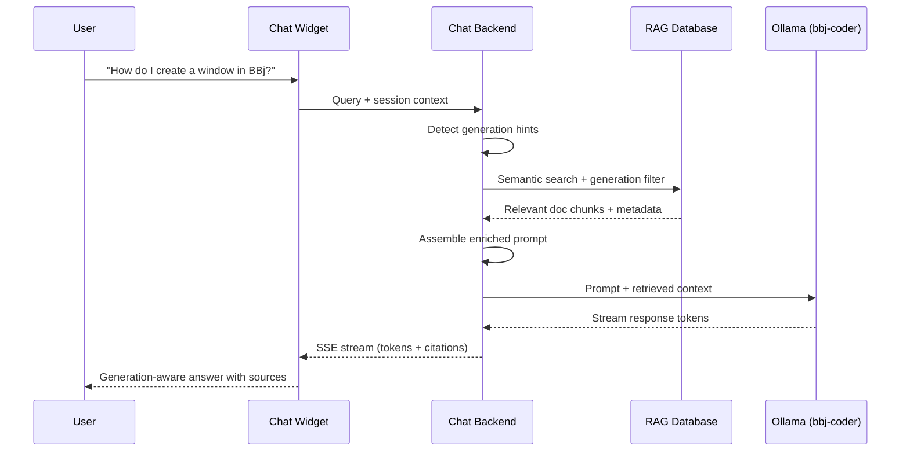

# Documentation Chat

:::tip[TL;DR]
Generic documentation chat services (kapa.ai, Algolia Ask AI) fail for BBj because their underlying LLMs have zero BBj training data -- the same core problem [Chapter 1](/docs/bbj-challenge) establishes for all generic AI tools. A BBj documentation chat must use the [fine-tuned model](/docs/fine-tuning) and [generation-tagged RAG pipeline](/docs/rag-database) described in earlier chapters, streaming generation-aware answers with source citations. The key insight: this is the same shared infrastructure the [IDE extension](/docs/ide-integration) uses, not a second AI system.
:::

Developers asking BBj questions today have limited options: search the documentation manually, post on forums, or ask a generic chatbot that hallucinates answers. A documentation chat embedded in the BBj docs site would let developers ask natural language questions -- "How do I create a window?" -- and receive accurate, generation-appropriate answers with links to the source documentation.

This is the second consumer application of the [shared AI infrastructure](/docs/strategic-architecture) described in Chapter 2. The model is the same. The retrieval pipeline is the same. Only the interface differs: instead of ghost text in an editor, the user gets a conversational response in a browser.

This chapter defines the architectural requirements and design principles for that chat system. The vision is still forming -- deployment model decisions have not been finalized -- so the focus is on what the system must do and how generation-aware responses work, not on a locked-in production architecture.

## Why Generic Chat Services Fail

The documentation chat market has matured significantly. [kapa.ai](https://www.kapa.ai/) serves over 200 enterprise customers including Docker, OpenAI, and Nokia. Algolia offers AI-powered search across documentation sites. GitHub Copilot Chat answers questions about codebases. These services prove the concept works -- for mainstream technologies.

For BBj, they all share the same fatal flaw: the underlying LLM has never seen BBj code.

| Service | How It Works | Why It Fails for BBj |
|---------|--------------|----------------------|
| **kapa.ai** | Crawls your docs, feeds them to a generic LLM via RAG | The LLM cannot understand BBj code snippets in the retrieved documentation. It will misinterpret syntax, confuse generations, and hallucinate methods that do not exist. |
| **Algolia Ask AI** | Indexes documentation content, uses a generic LLM to generate answers | Same fundamental problem -- the LLM treats BBj code as noise or misidentifies it as BASIC/VBA. No generation awareness. |
| **GitHub Copilot Chat** | Uses GitHub's cloud models with repository context | Suggests wrong syntax, invents nonexistent BBj methods, and cannot distinguish between Visual PRO/5 and modern DWC patterns. |

kapa.ai is particularly instructive. Its architecture -- crawl documentation, chunk it, retrieve relevant sections, feed them to an LLM -- is exactly the right approach. The platform works well for Docker, OpenAI, and Nokia because the underlying LLM already understands Docker commands, Python APIs, and networking protocols. The RAG layer provides specificity; the LLM provides comprehension.

For BBj, the RAG layer would retrieve the right documentation pages, but the LLM would still fail to comprehend the code examples on those pages. A retrieved chunk showing `BBjSysGui.addWindow()` would be meaningless to a model that has never encountered BBj object syntax. The model might attempt to interpret it as Java (recognizing the dot notation) and generate advice based on Java's `Window` class -- confidently wrong.

This is not a RAG problem. It is a model problem. And it is the same model problem that drives the entire BBj AI strategy: generic LLMs need fine-tuning before they can work with BBj.

### The webforJ Contrast

The failure of generic services for BBj becomes even clearer when compared to how the same services handle [webforJ](https://webforj.com/). webforJ is a Java-based web framework -- and generic LLMs understand Java well. A service like kapa.ai, pointed at webforJ documentation, would produce competent answers because the underlying LLM can parse Java code examples, understand Java class hierarchies, and reason about Java design patterns.

BBj gets none of this. The LLM has no prior exposure to BBj's `!` suffix convention for objects, `#` prefix for instance fields, `methodend` block terminators, or the four-generation syntax evolution. Every BBj code snippet in a retrieved documentation chunk is opaque to the model. This asymmetry -- the same RAG architecture working for webforJ but failing for BBj -- is the clearest illustration of why a fine-tuned model is the prerequisite, not the RAG layer.

## Architectural Requirements

The documentation chat system must satisfy six non-negotiable requirements, derived from the failures of generic services and the unique challenges of BBj's multi-generational ecosystem.

1. **Uses the BBj-aware model.** The chat backend must use the [fine-tuned model](/docs/fine-tuning) that understands BBj syntax across all four generations. A generic LLM -- even with perfect RAG -- will misinterpret code snippets and hallucinate methods.

2. **Retrieves generation-tagged documentation.** The [RAG pipeline](/docs/rag-database) must filter retrieval results by generation metadata. When a user asks about Visual PRO/5, the system should not surface modern DWC documentation (and vice versa) unless the user specifically requests a comparison.

3. **Streams responses in real-time.** Users expect conversational latency, not batch processing. The system must stream tokens as they are generated, providing immediate feedback.

4. **Provides source citations.** Every answer must link back to the documentation it draws from. This builds trust and lets users verify answers against the authoritative source.

5. **Adapts answers to the user's target generation.** The system must detect generation context from the query (explicit mentions like "Visual PRO/5" or implicit signals like verb-style syntax) and tailor both retrieval and response generation accordingly.

6. **Leverages shared infrastructure.** The chat system must not build its own model or its own retrieval pipeline. It consumes the same Ollama instance and RAG database that the IDE extension uses.

:::info[Decision: Shared Infrastructure for Documentation Chat]
**Choice:** The documentation chat system uses the same Ollama server and RAG database as the IDE extension -- no separate AI infrastructure.

**Rationale:** Building a second model or a second retrieval pipeline for chat would contradict the [unified infrastructure strategy](/docs/strategic-architecture). The model that understands BBj code completion also understands BBj documentation questions. The RAG database that provides context for IDE suggestions also provides context for chat answers. Sharing infrastructure cuts maintenance in half and ensures consistency -- a fix to the model or the document index benefits both consumers simultaneously.

**Alternatives considered:** Dedicated chat model (higher maintenance, potential drift from IDE model), cloud-hosted LLM with custom RAG (privacy concerns, ongoing API costs, still no BBj comprehension), generic chat service with fine-tuned embeddings only (improves retrieval but not comprehension).

**Status:** Architectural requirement defined. Implementation not yet started.
:::

## Generation-Aware Response Design

Generation-aware responses are the core value proposition that no generic chat service can replicate. The same question -- asked in different contexts -- should produce different, accurate answers.

### Default Behavior: Modern First

When a user asks a question without specifying a generation, the system defaults to modern BBj (DWC/GUI) patterns. This matches the most common use case: developers working on current projects.

**Query:** "How do I create a window in BBj?"

**Response (no generation context):**

> In modern BBj, you create windows using the BBjAPI:
>
> ```bbj
> sysgui! = BBjAPI().getSysGui()
> window! = sysgui!.addWindow(100, 100, 800, 600, "My Application")
> ```
>
> The parameters are: x position, y position, width, height, and title. The `addWindow` method returns a `BBjTopLevelWindow` object that you can use to add child controls.
>
> *Source: [BBjSysGui.addWindow documentation]*
>
> *Note: If you are maintaining legacy Visual PRO/5 code, the older `WINDOW CREATE` verb is also supported. Let me know if you need help with that syntax instead.*

### Legacy Context Detection

When the query contains explicit or implicit generation signals, the system adjusts both retrieval and response generation.

**Query:** "I'm working on a Visual PRO/5 application. How do I create a window?"

**Response (legacy generation context):**

> In Visual PRO/5, you create windows using the `WINDOW CREATE` verb:
>
> ```bbj
> WINDOW CREATE wnd_id, @(0,0), 80, 24, "My Application"
> ```
>
> The parameters are: window ID variable, position (column, row), columns, rows, and title. Window sizing uses character cells, not pixels.
>
> *Source: [Visual PRO/5 WINDOW CREATE reference]*
>
> *Consider: For new development or gradual modernization, the BBjAPI approach offers more flexibility and better browser support through DWC. I can show you how to migrate this pattern if you are interested.*

### How Generation Hints Flow

The generation detection pipeline processes each query through three stages:

1. **Query analysis** -- The system scans the user's message for explicit generation markers ("Visual PRO/5", "DWC", "legacy") and implicit signals (verb-style syntax like `WINDOW CREATE` vs. object-style syntax like `addWindow()`). Conversation history also provides context -- if the user has been asking about legacy code, subsequent questions inherit that context.

2. **RAG filtering** -- The detected generation hint is passed to the [RAG database](/docs/rag-database) as a metadata filter. If the user is asking about Visual PRO/5, retrieval prioritizes documentation tagged with the `vpro5` generation label. If no generation is detected, retrieval is unfiltered (with a slight bias toward modern documentation).

3. **Prompt assembly** -- The enriched prompt includes the retrieved documentation chunks, the detected generation context, and instructions for the model to respond appropriately. The model receives explicit guidance: "The user is working with Visual PRO/5. Provide answers using Visual PRO/5 syntax and conventions."

This pipeline ensures that the same question produces different -- and correct -- answers depending on context. A generic chat service cannot do this because it has no concept of BBj generations and no generation-tagged document corpus to retrieve from.

## Chat Architecture

The following diagram shows the complete request flow from user query to streamed response:



Each step serves a specific purpose:

- **Query + session context:** The chat widget sends the user's message along with conversation history, enabling follow-up questions without restating context.
- **Generation hint detection:** The backend analyzes the query (and conversation history) for generation signals before retrieving documentation.
- **Semantic search + generation filter:** The RAG database performs [hybrid search](/docs/rag-database) -- combining semantic similarity with keyword matching -- filtered by any detected generation metadata.
- **Enriched prompt assembly:** Retrieved documentation chunks, generation context, conversation history, and system instructions are combined into a structured prompt for the model.
- **Streaming response:** The LLM generates tokens via Ollama's streaming API, and the backend relays them to the client via Server-Sent Events (SSE) in real time.
- **Citations:** Source documentation references are included in the response, either inline or appended at the end of the stream.

## Deployment Options

The chat frontend can be deployed in several ways. The backend architecture -- RAG retrieval, Ollama inference, streaming -- remains identical regardless of how users access the chat interface.

| Option | Description | Advantages | Trade-offs |
|--------|-------------|------------|------------|
| **Embedded widget** | Chat component rendered directly in the Docusaurus documentation site | Seamless experience -- users stay in docs context. Lowest friction for adoption. | Constrained by static site architecture. May require an iframe or client-side component to handle streaming state. |
| **Standalone service** | Separate web application (similar to [Open WebUI](https://github.com/open-webui/open-webui)) accessible via a link from the docs | Most flexible -- full control over UI, conversation management, and features. Proven open-source templates available. | Users leave the documentation context. Separate deployment to maintain. |
| **Hybrid** | Lightweight chat widget in the docs that connects to a standalone backend service | Best of both: in-docs experience with full backend flexibility. The widget handles display; the backend handles everything else. | Moderate implementation complexity. Requires both a frontend component and a backend service. |

The hybrid approach is architecturally recommended because it cleanly separates concerns: the documentation site remains a static site (simple to deploy and maintain), while the chat backend runs as a service alongside Ollama and the RAG database. The same backend could serve multiple frontends -- the embedded widget, a standalone interface, or even a Slack/Teams integration -- without duplication.

However, the deployment model is not yet decided. The backend architecture is the same in all three cases, so the frontend choice can be deferred until implementation begins.

## Streaming and Citations

Server-Sent Events (SSE) is the standard streaming pattern for LLM chat applications in 2025/2026. It provides a simple, well-supported mechanism for pushing response tokens from the server to the client as they are generated.

The streaming flow:

1. **Client sends query** via HTTP POST to the chat backend
2. **Backend processes** the query through the generation detection and RAG retrieval pipeline
3. **Backend opens SSE stream** to the client
4. **LLM generates tokens** via Ollama's streaming API, and the backend relays each token to the client in real time
5. **Citations are appended** at the end of the stream, referencing the documentation chunks that informed the answer

This approach is compatible with Ollama's native streaming API, which follows the OpenAI-compatible `/v1/chat/completions` format with `stream: true`. The chat backend acts as an intermediary -- enriching the prompt with RAG context before forwarding to Ollama, and attaching citations to the streamed response.

SSE has a key advantage over WebSockets for this use case: it works through standard HTTP infrastructure (proxies, load balancers, CDNs) without special configuration. For a self-hosted deployment behind a corporate firewall, this reduces the operational surface area.

### Citation Format

Citations serve two purposes: they build user trust, and they provide a path to deeper reading. Each citation references the source documentation that the RAG pipeline retrieved for the response:

- **Inline citations** reference specific claims within the response text, linking to the relevant documentation page (e.g., "The `addWindow` method accepts position and size parameters ([BBjSysGui reference](https://documentation.basis.cloud/...))").
- **End-of-response citations** list all documentation chunks that informed the answer, providing a bibliography the user can review for additional context.

The exact citation format will be determined during implementation, but the architectural requirement is fixed: every answer must trace back to its sources. This is critical for a documentation chat -- unlike a general-purpose chatbot, the documentation chat's credibility depends on provenance.

## Conversation Context

A documentation chat that forgets previous messages after each query is frustrating to use. Session memory -- maintaining conversation history within a session -- enables natural follow-up questions:

> **User:** "How do I create a window in BBj?"
>
> **Assistant:** *[provides modern BBj answer]*
>
> **User:** "What about the Visual PRO/5 version?"
>
> **Assistant:** *[provides Visual PRO/5 answer, understanding "version" refers to window creation from the previous exchange]*

Conversation history is included in each request to the backend, allowing the model to resolve references ("the Visual PRO/5 version") without the user restating the full question. This also enables the generation detection pipeline to accumulate context -- if a user has been asking about legacy code for three messages, the fourth message inherits that generation context even without explicit markers.

Session memory is bounded: older messages are summarized or dropped after a configurable window (typically 10-20 exchanges) to keep the prompt within the model's context window. For the 7B model with a 4096-token context, this means balancing conversation history against RAG-retrieved documentation in the available token budget.

### Token Budget Management

A typical chat request assembles several components into a single prompt, all competing for the context window:

| Component | Typical Tokens | Purpose |
|-----------|---------------|---------|
| System prompt | 100-200 | Model instructions, generation guidance |
| Conversation history | 500-1,500 | Previous exchanges for context |
| RAG-retrieved chunks | 1,000-2,000 | Source documentation for the current query |
| User query | 50-200 | The current question |
| **Reserved for response** | **1,000-2,000** | **Space for the model's answer** |

When conversation history grows long, the system must decide what to compress or drop. A practical strategy is to keep the most recent 3-5 exchanges verbatim and summarize older ones into a compact context block ("The user has been asking about Visual PRO/5 window management"). This preserves generation context without consuming the entire token budget.

## Current Status

:::note[Where Things Stand -- January 2026]
- **Shipped:** Nothing. The documentation chat is a planned capability, not a shipped product.
- **Defined:** Architectural requirements and design principles (this chapter). The generation-aware response strategy. The shared infrastructure decision (same model and RAG as the IDE extension).
- **Planned:** Chat backend service, frontend widget or application, integration with the [RAG pipeline](/docs/rag-database) (see [Chapter 6](/docs/rag-database)). The deployment model (embedded, standalone, or hybrid) is not yet decided.
:::

The documentation chat depends on two upstream components that are also in progress: the [fine-tuned model](/docs/fine-tuning) (currently showing promising results with ~10K training data points) and the [RAG database](/docs/rag-database) (source corpus identified, pipeline not yet built). Until both are operational, the chat system cannot be implemented.

The [implementation roadmap](/docs/implementation-roadmap) in Chapter 7 places the documentation chat in Phase 3 -- after the model is validated (Phase 1) and the IDE integration is functional (Phase 2). This sequencing is deliberate: the IDE integration exercises the model and RAG pipeline first, and the documentation chat benefits from whatever improvements emerge during that process.

## What Comes Next

The chapters that follow build the remaining infrastructure this chat system depends on:

- **[Chapter 6: RAG Database Design](/docs/rag-database)** -- How the generation-tagged document corpus is built, chunked, embedded, and queried. This is the retrieval layer the chat backend calls.
- **[Chapter 7: Implementation Roadmap](/docs/implementation-roadmap)** -- Timeline, phasing, and resource allocation for all components including the documentation chat.

For context on the shared infrastructure that makes this approach viable:

- **[Chapter 2: Strategic Architecture](/docs/strategic-architecture)** -- The unified infrastructure design that the chat system consumes.
- **[Chapter 3: Fine-Tuning the Model](/docs/fine-tuning)** -- The model that powers both chat and IDE completion.
- **[Chapter 4: IDE Integration](/docs/ide-integration)** -- The parallel consumer of the same shared infrastructure, using it for code completion instead of conversational answers.
