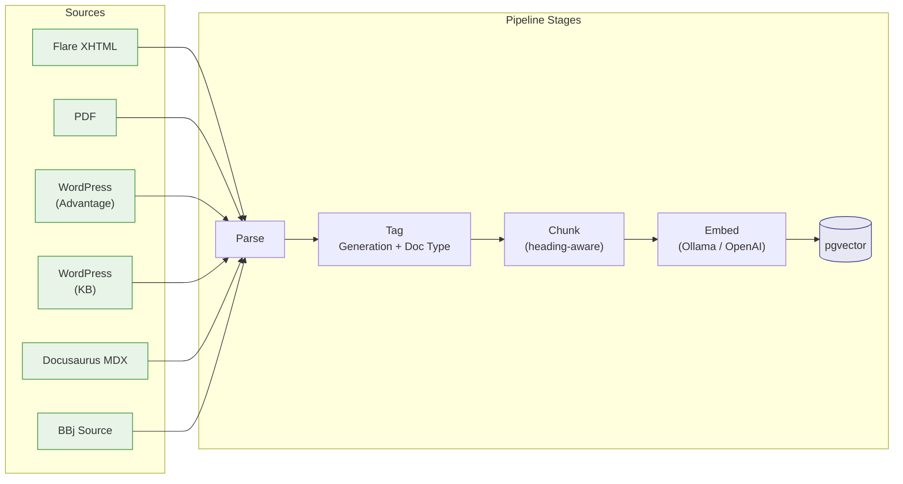

# Getting Started with RAG Ingestion

This page bridges [Chapter 6's design rationale](./index.md) with the actual implementation code. If you want to understand *why* the pipeline works the way it does -- generation tagging strategy, chunking philosophy, hybrid search design -- start with [Chapter 6](./index.md). This page covers *what was built* and *how to use it*.

## Why This Approach

The BBj documentation corpus spans five distinct source formats, each with its own structure: MadCap Flare XHTML topics, PDF manuals, WordPress magazine articles, WordPress knowledge base lessons, Docusaurus MDX tutorials, and BBj source code files. A single generic parser would lose the structural cues that make each format valuable for retrieval. Instead, the pipeline uses **source-by-source ingestion** -- each source has a dedicated parser that understands its native format.

Every chunk produced by the pipeline carries **generation labels** (`all`, `character`, `vpro5`, `bbj_gui`, `dwc`) so that retrieval can filter by the BBj generation a developer is actually working with. A query from a DWC project returns DWC-relevant documentation first, without excluding universal content. Generation tagging is automatic -- derived from file paths, condition tags, and content patterns.

The chunker is **heading-aware**: it splits at section boundaries (## and ###) rather than at arbitrary token counts, and prepends a contextual header like `BBjSysGui > addWindow > Parameters` to each chunk. This preserves document structure so chunks make sense in isolation and produce richer embeddings. See [Chunking Strategy](./index.md#chunking-strategy) in Chapter 6 for the full design rationale.

## Pipeline Architecture



Each source feeds into a shared pipeline: **Parse** extracts text and metadata, **Tag** assigns generation labels and document type, **Chunk** splits at heading boundaries with overlap, **Embed** generates vectors via Ollama (or OpenAI), and **Store** bulk-inserts into PostgreSQL with pgvector.

## Source Coverage

| Source | Parser Module | Content Type | URL Scheme |
|--------|--------------|--------------|------------|
| Flare XHTML | [`parsers/flare.py`][flare] | API reference, concepts, migration guides | `flare://path` |
| PDF | [`parsers/pdf.py`][pdf] | GUI programming guide | `pdf://filename#section` |
| WordPress (Advantage) | [`parsers/wordpress.py`][wordpress] | Magazine articles | `https://basis.cloud/advantage...` |
| WordPress (KB) | [`parsers/wordpress.py`][wordpress] | Knowledge base lessons | `https://basis.cloud/knowledge...` |
| Docusaurus MDX | [`parsers/mdx.py`][mdx] | DWC course tutorials | `mdx://chapter/file` |
| BBj Source | [`parsers/bbj_source.py`][bbj-source] | Code examples | `file://relative-path` |

[flare]: https://github.com/StephanWald/bbj-ai-strategy/blob/main/rag-ingestion/src/bbj_rag/parsers/flare.py
[pdf]: https://github.com/StephanWald/bbj-ai-strategy/blob/main/rag-ingestion/src/bbj_rag/parsers/pdf.py
[wordpress]: https://github.com/StephanWald/bbj-ai-strategy/blob/main/rag-ingestion/src/bbj_rag/parsers/wordpress.py
[mdx]: https://github.com/StephanWald/bbj-ai-strategy/blob/main/rag-ingestion/src/bbj_rag/parsers/mdx.py
[bbj-source]: https://github.com/StephanWald/bbj-ai-strategy/blob/main/rag-ingestion/src/bbj_rag/parsers/bbj_source.py

The URL scheme column shows how each parser constructs `source_url` values stored alongside chunks. These prefixes enable per-source reporting and retrieval filtering.

## Key Data Models

### Document

The parser output contract -- every parser yields validated `Document` objects:

```python
class Document(BaseModel):
    source_url: str
    title: str
    doc_type: str
    content: str
    generations: list[str]
    context_header: str = ""
    deprecated: bool = False
    metadata: dict[str, str] = Field(default_factory=dict)
```

Full source: [`models.py`](https://github.com/StephanWald/bbj-ai-strategy/blob/main/rag-ingestion/src/bbj_rag/models.py)

### Chunk

The storage-ready contract -- extends Document fields with a content hash for deduplication and an embedding vector:

```python
class Chunk(BaseModel):
    source_url: str
    title: str
    doc_type: str
    content: str
    content_hash: str          # SHA-256, auto-computed by from_content()
    generations: list[str]
    context_header: str = ""
    deprecated: bool = False
    metadata: dict[str, str] = Field(default_factory=dict)
    embedding: list[float] | None = None
```

Chunks are always created via the `Chunk.from_content()` factory method, which auto-computes the SHA-256 hash. This hash powers idempotent re-ingestion (`ON CONFLICT (content_hash) DO NOTHING`).

Full source: [`models.py`](https://github.com/StephanWald/bbj-ai-strategy/blob/main/rag-ingestion/src/bbj_rag/models.py)

### DocumentParser Protocol

Every parser implements this protocol:

```python
@runtime_checkable
class DocumentParser(Protocol):
    def parse(self) -> Iterator[Document]:
        """Yield Document objects from the configured source."""
        ...
```

Full source: [`parsers/__init__.py`](https://github.com/StephanWald/bbj-ai-strategy/blob/main/rag-ingestion/src/bbj_rag/parsers/__init__.py)

## BBj Intelligence

Between parsing and chunking, the pipeline applies two classification stages and builds contextual headers. Flare-sourced documents get full intelligence enrichment; other parsers pre-populate these fields during parsing.

**Generation tagger** -- assigns generation labels (`all`, `character`, `vpro5`, `bbj_gui`, `dwc`) using three weighted signal sources: file path prefixes (weight 0.6), MadCap condition tags (weight 0.3--0.5), and content regex patterns (weight 0.4). Signals are aggregated and thresholded at 0.3 to produce the final generation list. Documents below the threshold receive an `untagged` sentinel.

**Document type classifier** -- categorizes each document as `api-reference`, `concept`, `example`, `migration`, `language-reference`, `best-practice`, or `version-note`. Uses a data-driven rule registry that scores heading structure, path patterns, and content patterns. The highest-scoring rule above its threshold wins; `concept` is the fallback default.

**Context headers** -- builds hierarchical headers like `BBj Objects > BBjWindow > addButton > Parameters` from TOC section paths, document titles, and section headings. These are prepended to chunk content before embedding so the vector captures structural context.

Full source: [`intelligence/`](https://github.com/StephanWald/bbj-ai-strategy/tree/main/rag-ingestion/src/bbj_rag/intelligence)

## Running the Pipeline

:::info[Full setup instructions]
See the [`rag-ingestion/README.md`](https://github.com/StephanWald/bbj-ai-strategy/blob/main/rag-ingestion/README.md) for complete prerequisites (PostgreSQL + pgvector, Ollama, Python 3.12+, uv), installation, and configuration.
:::

**Ingest a source:**

```bash
bbj-rag ingest --source <name>
```

Available sources: `flare`, `pdf`, `advantage`, `kb`, `mdx`, `bbj-source`. Each source requires its own configuration -- paths for local sources (Flare, PDF, MDX, BBj source) or URLs for web sources (Advantage, KB).

**Parse only (debug mode):**

```bash
bbj-rag parse --source <name>
```

Runs the parser without embedding or storing -- useful for verifying parse output before a full ingestion run.

**Quality report:**

```bash
bbj-rag report
```

Shows chunk distribution by source, generation, and document type with anomaly warnings.

**Search validation:**

```bash
bbj-rag validate
```

Runs retrieval assertions against embedded data to verify search quality.
