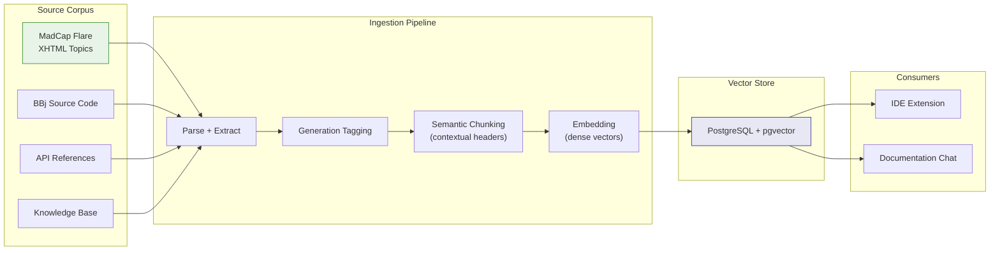

# RAG Database Design

:::tip[TL;DR]
Every piece of BBj documentation enters a retrieval pipeline that tags it by generation (`all`, `character`, `vpro5`, `bbj-gui`, `dwc`), chunks it with contextual headers, embeds it into vectors, and stores it in PostgreSQL with pgvector. Retrieval uses hybrid search -- dense semantic vectors combined with BM25 keyword matching -- followed by cross-encoder reranking and generation-aware scoring. This shared pipeline powers both the [IDE extension](/docs/ide-integration) and [documentation chat](/docs/documentation-chat).
:::

The retrieval layer is the bridge between raw documentation and AI-powered answers. Without it, every query to the fine-tuned model relies solely on what the model memorized during training. With it, the model can ground its responses in actual, current documentation -- citing specific API methods, referencing exact syntax rules, and providing generation-appropriate examples.

As [Chapter 2](/docs/strategic-architecture) establishes, the BBj AI strategy follows a two-layer architecture: a shared foundation consumed by multiple applications. The RAG database is the second pillar of that foundation (alongside the [fine-tuned model](/docs/fine-tuning)). Both the IDE extension's context enrichment and the documentation chat's response generation depend on the same retrieval API, the same chunked corpus, and the same generation metadata.

This chapter is the technical blueprint for that pipeline: what goes in, how it gets processed, and how it comes back out.

## Source Corpus

The RAG database ingests documentation from four primary sources, each contributing a different kind of knowledge:

| Source | Content Type | Volume | Value for Retrieval |
|--------|-------------|--------|-------------------|
| **MadCap Flare documentation** | API references, concepts, tutorials, migration guides | Primary corpus (thousands of topics) | Authoritative, structured, generation-tagged |
| **BBj source code** | Implementation patterns, real-world usage | Supporting corpus | Shows idiomatic usage across generations |
| **API references** | Method signatures, parameters, return types | Structured supplement | Precise answers for "how do I call X?" |
| **Knowledge base articles** | Troubleshooting, FAQs, workarounds | Supplementary | Covers edge cases documentation misses |

The MadCap Flare documentation is the primary source -- it is the authoritative, maintained documentation that BBj developers rely on. The other sources supplement it with practical examples, precise API details, and community knowledge.



## MadCap Flare Ingestion

MadCap Flare is the documentation authoring tool used for BBj's official documentation. Understanding its content format is essential for designing the ingestion pipeline.

### Content Format

Flare stores content as **individual XHTML topics** -- each topic is a separate `.htm` file containing W3C-compliant XML with standard HTML elements. Topics are organized hierarchically through Table of Contents (TOC) files, and build targets define output formats.

The key characteristics for RAG ingestion:

- **W3C XHTML compliance** -- standard XML parsing works; no proprietary binary format
- **One topic per file** -- natural document boundaries for chunking
- **Section hierarchy via headings** -- `<h1>`, `<h2>`, `<h3>` provide contextual structure
- **MadCap namespace extensions** -- proprietary tags (`mc:*`, `data-mc-*`) for conditions, snippets, and cross-references that are irrelevant to RAG content

### Clean XHTML Export

Flare provides a **Clean XHTML** build target that strips all MadCap-specific tags and outputs basic HTML files. This is the recommended ingestion format.

:::info[Decision: Clean XHTML as Ingestion Format]
**Choice:** Use MadCap Flare's Clean XHTML export as the primary input for the RAG ingestion pipeline.

**Rationale:** Clean XHTML strips proprietary MadCap tags (`mc:*`, `data-mc-*`), removes conditional content markers and snippet references, and outputs standard HTML that any parser can process. This avoids building a MadCap-specific parser and produces stable, predictable input for the pipeline.

**Alternatives considered:** Parsing raw Flare project files directly (requires handling MadCap-specific XML namespaces, conditions, and snippets -- significantly more complex). Using Flare's HTML5 output (includes styling and navigation elements that add noise to extracted text).

**Status:** Format selected. Export workflow not yet configured.
:::

### Ingestion Pipeline

The pipeline from Flare export to stored chunks follows a predictable sequence:

```typescript
interface FlareDocument {
    filePath: string;          // e.g., Content/Topics/BBjAPI/addWindow.htm
    title: string;             // Extracted from <head><title>
    body: string;              // Extracted from <body>, HTML stripped
    headings: string[];        // Section hierarchy for contextual headers
    generation: string[];      // Inferred from content + file path
    docType: 'api-reference' | 'concept' | 'example' | 'migration'
           | 'language-reference' | 'best-practice' | 'version-note';
}

// Pipeline steps:
// 1. Export Clean XHTML from Flare (removes MadCap-specific tags)
// 2. Parse XHTML files, extract text + metadata
// 3. Classify document type from structure and content signals
// 4. Apply generation tagging based on API names, syntax patterns, file paths
// 5. Chunk with contextual headers (preserve section context)
// 6. Embed chunks using selected embedding model
// 7. Store in PostgreSQL with pgvector + generation metadata
```

Flare does not expose a programmatic API for content extraction. The export step is a manual build target execution or a file system parse of the Flare project directory. Once exported, the rest of the pipeline is fully automated.

## Multi-Generation Document Structure

The defining design choice for this RAG database is **generation metadata on every chunk**. This is not optional -- it is what makes BBj retrieval fundamentally different from generic documentation search.

As [Chapter 3](/docs/fine-tuning) establishes, BBj spans four generations of UI technology. A developer asking "how do I create a window?" needs different answers depending on whether they are working with character UI, Visual PRO/5, modern BBj GUI, or DWC browser-based code. The generation metadata on each chunk enables the retrieval system to return the right answer for the right context.

### Generation Labels

The RAG database uses the same generation labeling schema as the [training data](/docs/fine-tuning):

| Label | Scope | Example Content |
|-------|-------|----------------|
| `"all"` | Universal patterns | FOR/NEXT loops, file I/O, string functions |
| `"character"` | Character UI (1980s) | `PRINT @(x,y)`, `INPUT` statements |
| `"vpro5"` | Visual PRO/5 (1990s) | `WINDOW CREATE`, `BUTTON CREATE`, `CTRL()` |
| `"bbj-gui"` | BBj GUI/Swing (2000s) | `BBjAPI().getSysGui()`, `addWindow()` |
| `"dwc"` | DWC/Browser (2010s+) | `getWebManager()`, `executeAsyncScript` |

A document can carry multiple generation labels. An API method like `BBjSysGui.addWindow()` that works in both desktop Swing and DWC browser contexts would carry `["bbj-gui", "dwc"]`.

### Document Structure Examples

**Universal documentation (applies to all generations):**

```json
{
    "id": "bbj-for-next-001",
    "type": "language-reference",
    "topic": "FOR/NEXT loop",
    "generation": "all",
    "content": "The FOR/NEXT loop executes a block of statements a specified number of times. Syntax: FOR var = start TO end [STEP increment]...NEXT var",
    "keywords": ["loop", "iteration", "for", "next", "control flow"],
    "contextual_header": "Language Reference > Control Flow > FOR/NEXT"
}
```

**Modern API documentation (multi-generation):**

```json
{
    "id": "bbj-addwindow-001",
    "type": "api-reference",
    "class": "BBjSysGui",
    "method": "addWindow",
    "generation": ["bbj-gui", "dwc"],
    "since_version": "12.00",
    "content": "Creates a new top-level window. Syntax: addWindow(int x, int y, int w, int h, String title)...",
    "signatures": [
        "BBjTopLevelWindow addWindow(int x, int y, int w, int h, String title)",
        "BBjTopLevelWindow addWindow(int id, int x, int y, int w, int h, String title)"
    ],
    "related": ["BBjTopLevelWindow", "BBjChildWindow", "addChildWindow"],
    "supersedes": "vpro5-window-create",
    "keywords": ["window", "gui", "create", "toplevel"],
    "contextual_header": "BBjSysGui > addWindow"
}
```

**Legacy documentation (still valid, but superseded):**

```json
{
    "id": "vpro5-window-create-001",
    "type": "api-reference",
    "verb": "WINDOW CREATE",
    "generation": ["vpro5"],
    "deprecated_in": "12.00",
    "still_valid": true,
    "content": "Creates a GUI window using Visual PRO/5 syntax. WINDOW CREATE wnd_id, @(row,col), rows, cols, title$...",
    "superseded_by": "bbj-addwindow-001",
    "migration_note": "For new development, use BBjSysGui.addWindow() for better DWC compatibility.",
    "keywords": ["window", "gui", "create", "vpro5", "legacy"],
    "contextual_header": "Visual PRO/5 > GUI > WINDOW CREATE"
}
```

The `supersedes` and `superseded_by` links create a graph of modernization paths. When a developer queries legacy documentation, the retrieval system can surface the modern equivalent alongside the legacy answer.

### Document Types

| Type | Generation | Description | Example |
|------|------------|-------------|---------|
| `language-reference` | Usually `"all"` | Core language syntax | FOR/NEXT loops, file I/O |
| `api-reference` | Varies | Method/class documentation | BBjSysGui.addWindow() |
| `concept` | Varies | Conceptual explanation | "Understanding BBj Events" |
| `example` | Varies | Working code sample | "Creating a Grid Application" |
| `migration` | N/A (has from/to) | How to modernize legacy code | "Migrating from WINDOW CREATE" |
| `best-practice` | Often `"all"` | Recommended patterns | "Error Handling in BBj" |
| `version-note` | Varies | Version-specific behavior | "New in BBj 23.04: await parameter" |

The document type informs both chunking strategy (different types get different chunk sizes) and retrieval ranking (API references are boosted for "how do I" queries; migration docs are boosted when the query involves legacy syntax).

## Chunking Strategy

Not all documentation should be chunked the same way. An API reference entry for a single method is compact and self-contained. A conceptual guide explaining the BBj event model spans multiple paragraphs and requires context to be useful. Treating both identically -- either too small or too large -- degrades retrieval quality.

### Document-Type-Aware Chunk Sizes

:::info[Decision: Variable Chunk Sizes by Document Type]
**Choice:** Use different target chunk sizes based on document type rather than a uniform chunk size across the entire corpus.

**Rationale:** API references are dense and self-contained -- a 200-400 token chunk captures a complete method signature with its description. Conceptual documentation needs more context to be meaningful -- a 400-600 token chunk preserves the explanation around a concept. Code examples should never be split mid-function. One-size-fits-all chunking either loses context for concepts or wastes vector space on padded API entries.

**Alternatives considered:** Uniform 512-token chunks (simpler but lower retrieval quality), sentence-level splitting (too granular for technical documentation), full-document embedding (works only for very short documents).

**Status:** Strategy defined. Implementation requires document type classification in the ingestion pipeline.
:::

| Document Type | Target Chunk Size | Rationale |
|--------------|------------------|-----------|
| API references | 200-400 tokens | Compact, self-contained; one method per chunk |
| Conceptual docs | 400-600 tokens | Need surrounding explanation for context |
| Code examples | Variable (keep intact) | Splitting a code example mid-function destroys its value |
| Migration guides | 400-600 tokens | Need both the legacy and modern patterns together |
| Language reference | 300-500 tokens | Core syntax rules with examples |

### Contextual Headers

Every chunk is prepended with its **section hierarchy** -- the path from the top-level topic through subheadings to the chunk's location. This is one of the most impactful improvements in modern RAG systems because it lets the embedding capture the context that would otherwise be lost when a paragraph is extracted from its document.

**Without contextual headers:**
```
"Creates a new top-level window. The first parameter specifies the X coordinate..."
```

The embedding has no idea this is about `BBjSysGui.addWindow()` in BBj.

**With contextual headers:**
```
"BBjSysGui > addWindow > Parameters: Creates a new top-level window. The first parameter specifies the X coordinate..."
```

Now the embedding captures both the semantic meaning and the precise API context. This significantly improves retrieval precision for queries like "addWindow parameters" or "BBjSysGui window creation."

### Overlap Between Chunks

Adjacent chunks share 10-15% overlap at their boundaries. This ensures that information spanning a chunk boundary is captured in at least one chunk. For a 400-token chunk, this means approximately 40-60 tokens of overlap with the preceding and following chunks.

The overlap is especially important for BBj documentation, where a method description often ends with a code example that starts in the next logical section. Without overlap, a query about a method's usage pattern might retrieve the description chunk but miss the example chunk, or vice versa.

## Embedding Strategy

Embeddings are the numeric representations that make semantic search possible. The choice of embedding model determines how well the system understands the meaning behind a query, not just its keywords.

### Starting Point: General-Purpose Embeddings

BBj documentation is primarily written in English prose with embedded code snippets. General-purpose embedding models handle English text well, and the contextual headers strategy (described above) compensates for most domain-specific terminology gaps by providing explicit context.

The recommended starting point is a strong open-source embedding model such as BGE-M3 or a comparable model from the MTEB leaderboard. As of early 2026, open-source embedding models have largely closed the gap with proprietary options for English-language retrieval tasks.

Key selection criteria for the embedding model:

- **Dimension:** 768-1024 dimensions provides a good balance of quality and storage efficiency
- **Sequence length:** Must support at least 512 tokens to handle the larger conceptual chunks
- **Code awareness:** Models trained on mixed code-and-text corpora handle BBj code snippets within documentation better than pure text models
- **Self-hostable:** The embedding model must run locally -- sending BBj documentation to external APIs may conflict with enterprise data policies

### Fine-Tuning Embeddings (Deferred)

Domain-specific embedding fine-tuning is feasible with as few as 1,000-5,000 query-document pairs and can yield 7% or greater improvement in retrieval precision. For BBj, this would mean creating pairs like:

- Query: "how to create a window in DWC" paired with the `BBjSysGui.addWindow()` documentation chunk
- Query: "BBj file I/O" paired with the `OPEN`/`READ`/`WRITE` language reference chunks

However, this optimization should be deferred until the baseline pipeline is operational and retrieval quality can be measured. Premature embedding fine-tuning risks optimizing for the wrong thing before the chunking strategy and corpus coverage are validated.

## Vector Store Selection

The vector store is where embedded chunks live and where similarity search happens. The choice matters less than most RAG guides suggest -- at BBj's corpus scale, the differences between options are negligible.

:::info[Decision: PostgreSQL with pgvector as Default Vector Store]
**Choice:** [pgvector](https://github.com/pgvector/pgvector) (PostgreSQL extension) as the default vector store. As of early 2026.

**Rationale:** BBj's total corpus -- MadCap Flare documentation, source code samples, API references, and knowledge base articles -- will likely produce fewer than 50,000 chunks. At this scale, pgvector and dedicated vector databases (Qdrant, Weaviate, Milvus) perform identically. Benchmarks as of January 2026 show sub-millisecond p50 latency differences between pgvector and Qdrant at datasets under 100K vectors. pgvector avoids running a separate database service, integrates natively with SQL for metadata filtering (generation, document type, version), and uses infrastructure that most organizations already operate.

**Alternatives considered:**
- **Qdrant** -- Purpose-built vector database with excellent filtering and clustering. Better scaling characteristics above 1M vectors. Worth evaluating if the corpus grows significantly or if multi-tenant isolation is needed.
- **Weaviate** -- GraphQL-native vector database with built-in vectorization modules. More complex to operate but offers hybrid search out of the box.
- **Chroma** -- Lightweight, embedded vector store. Good for prototyping but lacks production features.

**Status:** pgvector selected as default. No infrastructure provisioned yet.
:::

### pgvector Capabilities

pgvector supports the features required for BBj's retrieval strategy:

- **HNSW indexing** -- Approximate nearest neighbor search with configurable recall/speed tradeoff. At 50K vectors, exact search (IVFFlat or sequential) is also viable.
- **Distance metrics** -- Cosine similarity (`<=>` operator), L2 distance, and inner product. Cosine similarity is the standard for text embeddings.
- **SQL integration** -- Generation filtering, document type filtering, and metadata joins happen in the same query as the vector search. No separate metadata store needed.
- **Incremental updates** -- New or updated documentation chunks can be inserted or upserted without rebuilding the entire index.

### When to Reconsider

If the corpus grows beyond 500,000 chunks (unlikely for BBj documentation alone, but possible if community-contributed content or extensive source code analysis is added), or if retrieval latency requirements drop below 10ms at p99, dedicated vector databases offer better scaling characteristics. The migration path is straightforward: export chunks with metadata from PostgreSQL, bulk-import into Qdrant or Weaviate, and update the retrieval API endpoint.

## Hybrid Retrieval Strategy

Pure vector search has a well-documented weakness: it struggles with exact terms, identifiers, and API names. A query for `BBjSysGui.addWindow()` benefits more from keyword matching than from semantic similarity. Conversely, a query like "how do I create a window in a BBj web application" is better served by semantic search that understands the intent behind the words.

BBj documentation retrieval requires both. The recommended approach is **hybrid search** with four stages:

### Stage 1: Dense Vector Search

Embed the query using the same model that embedded the corpus. Search pgvector for the top 20 most semantically similar chunks, optionally filtered by generation metadata.

```sql
-- pgvector semantic search with generation filter
SELECT id, content, generation, doc_type,
       1 - (embedding <=> query_embedding) AS similarity
FROM doc_chunks
WHERE generation @> ARRAY['dwc']  -- generation filter
   OR generation = ARRAY['all']    -- always include universal docs
ORDER BY embedding <=> query_embedding
LIMIT 20;
```

### Stage 2: Sparse Keyword Search (BM25)

Use PostgreSQL's built-in full-text search to find chunks containing the query's exact terms. This is critical for BBj because API names, method signatures, and BBj-specific keywords (like `BBjSysGui`, `addWindow`, `CTRL()`, `WINDOW CREATE`) are exact identifiers that semantic search may not rank highly.

```sql
-- PostgreSQL full-text search for keyword matching
SELECT id, content, generation, doc_type,
       ts_rank(search_vector, plainto_tsquery('english', query_text)) AS rank
FROM doc_chunks
WHERE search_vector @@ plainto_tsquery('english', query_text)
ORDER BY rank DESC
LIMIT 20;
```

### Stage 3: Reciprocal Rank Fusion

Merge the semantic and keyword result sets using Reciprocal Rank Fusion (RRF). RRF combines rankings from multiple search methods without requiring score normalization -- each result's fused score is the sum of `1 / (k + rank)` across all methods, where `k` is a constant (typically 60).

The weighting reflects BBj's documentation characteristics: semantic search handles conceptual queries well, while keyword search catches the exact API names and BBj syntax that semantic search misses.

```typescript
function reciprocalRankFusion(
    semanticResults: SearchResult[],
    keywordResults: SearchResult[],
    weights = { semantic: 0.7, keyword: 0.3 },
    k = 60
): SearchResult[] {
    const scores = new Map<string, number>();

    semanticResults.forEach((result, index) => {
        const rrf = weights.semantic / (k + index + 1);
        scores.set(result.id, (scores.get(result.id) ?? 0) + rrf);
    });

    keywordResults.forEach((result, index) => {
        const rrf = weights.keyword / (k + index + 1);
        scores.set(result.id, (scores.get(result.id) ?? 0) + rrf);
    });

    return [...scores.entries()]
        .sort(([, a], [, b]) => b - a)
        .map(([id]) => allResults.get(id)!);
}
```

### Stage 4: Cross-Encoder Reranking

The top 20 fused results are reranked using a cross-encoder model. Unlike bi-encoders (used for initial embedding), cross-encoders process the query and each candidate document together, producing a more accurate relevance score at the cost of higher latency.

Reranking the top 20 down to the top 5 is a standard pattern that balances precision and latency. The cross-encoder is too slow to run against the full corpus but highly effective on a small candidate set.

### The Complete Retrieval Function

Combining all four stages:

```typescript
async function retrieveDocumentation(
    query: string,
    generationHint?: string
): Promise<DocChunk[]> {
    // Stage 1: Dense vector search (semantic similarity)
    const semanticResults = await vectorStore.search(
        embed(query),
        { topK: 20, filter: buildGenerationFilter(generationHint) }
    );

    // Stage 2: Sparse keyword search (BM25)
    const keywordResults = await fullTextSearch(query, { topK: 20 });

    // Stage 3: Reciprocal Rank Fusion
    const fused = reciprocalRankFusion(semanticResults, keywordResults, {
        semanticWeight: 0.7,
        keywordWeight: 0.3
    });

    // Stage 4: Cross-encoder reranking (top 20 -> top 5)
    const reranked = await rerank(fused.slice(0, 20), query, { topK: 5 });

    // Stage 5: Generation-aware scoring adjustment
    return applyGenerationScoring(reranked, generationHint);
}
```

This function is the shared retrieval API that both the [IDE extension](/docs/ide-integration) and [documentation chat](/docs/documentation-chat) consume. The IDE calls it with a generation hint derived from the Langium parser's AST analysis. The chat interface calls it with a generation hint inferred from conversation context.

## Generation-Aware Retrieval

Generation metadata is not just a filter -- it is a scoring factor that adjusts relevance based on the developer's working context. A developer writing DWC code should see DWC documentation first, but universal documentation is always relevant, and legacy documentation may provide useful background.

### Generation Scoring Logic

```typescript
function computeGenerationScore(
    docGeneration: "all" | string | string[],
    targetGeneration?: string
): number {
    // Universal docs are always highly relevant
    if (docGeneration === "all") return 95;

    if (!targetGeneration) {
        // No hint: prefer modern, then universal
        if (Array.isArray(docGeneration)) {
            if (docGeneration.includes('dwc')) return 90;
            if (docGeneration.includes('bbj-gui')) return 85;
        }
        if (docGeneration === 'dwc') return 90;
        if (docGeneration === 'bbj-gui') return 85;
        if (docGeneration === 'vpro5') return 50;
        if (docGeneration === 'character') return 30;
        return 70;
    }

    // With target: exact match scores highest
    if (Array.isArray(docGeneration)) {
        if (docGeneration.includes(targetGeneration)) return 100;
    } else if (docGeneration === targetGeneration) {
        return 100;
    }

    // Close matches for GUI generations
    const guiGenerations = ['vpro5', 'bbj-gui', 'dwc'];
    if (guiGenerations.includes(targetGeneration)) {
        if (Array.isArray(docGeneration) &&
            docGeneration.some(g => guiGenerations.includes(g))) {
            return 70;
        }
    }

    return 20; // Different generation
}
```

The scoring follows these principles:

1. **Universal documentation** (generation `"all"`) is always relevant -- core language constructs apply everywhere.
2. **Exact generation matches** score highest when a target generation is known.
3. **GUI generation proximity** -- `vpro5`, `bbj-gui`, and `dwc` share enough conceptual overlap that cross-references are still useful, even if the exact API differs.
4. **Without a generation hint**, the system defaults to preferring modern documentation (DWC > BBj GUI) since most new development targets current platforms.
5. **Legacy documentation is never excluded** -- it is deprioritized but still retrievable. Developers maintaining character UI or Visual PRO/5 codebases can explicitly target those generations.

### Retrieval Example

Consider a developer working in a DWC context who asks: "How do I create a window?"

The retrieval system:
1. **Semantic search** finds chunks about window creation across all generations
2. **Keyword search** matches "window" and "create" in API references
3. **Fusion** merges results, surfacing `BBjSysGui.addWindow()` and `WINDOW CREATE`
4. **Reranking** evaluates relevance to the specific query
5. **Generation scoring** boosts the `BBjSysGui.addWindow()` chunk (generation `["bbj-gui", "dwc"]`, score 100) and deprioritizes the `WINDOW CREATE` chunk (generation `["vpro5"]`, score 70 due to GUI proximity)

The response includes the modern `addWindow()` documentation first, with a reference to the legacy `WINDOW CREATE` syntax for context -- exactly what a developer migrating or maintaining cross-generation code needs.

## Current Status

:::note[Where Things Stand -- January 2026]
- **Defined:** Source corpus identified -- MadCap Flare documentation (primary), BBj source code, API references, and knowledge base articles. Generation metadata schema established (shared with [training data](/docs/fine-tuning)).
- **Not built:** Ingestion pipeline, vector store, embedding computation, retrieval API. No infrastructure provisioned.
- **Planned next:** Pilot with a subset of API reference documentation. Parse a representative sample of MadCap Flare XHTML topics, chunk with contextual headers, embed, store in pgvector, and validate retrieval quality before processing the full corpus.
:::

The RAG database is designed but not yet implemented. The generation metadata schema is shared with the [fine-tuning training data](/docs/fine-tuning), ensuring consistency between what the model learned and what the retrieval system provides. Implementation is tracked in the [implementation roadmap](/docs/implementation-roadmap).

## What Comes Next

This chapter described the retrieval foundation. The chapters that follow describe its two primary consumers:

- **[IDE Integration](/docs/ide-integration)** -- The VS Code extension uses the retrieval API to enrich code completion prompts with relevant documentation, filtered by the generation the developer is working in.
- **[Documentation Chat](/docs/documentation-chat)** -- The chat interface uses the same retrieval API to ground conversational responses in actual documentation, with citations linking back to source topics.
- **[Fine-Tuning the Model](/docs/fine-tuning)** -- The training data uses the same generation labeling schema described in this chapter, ensuring the model and the retrieval system share a consistent understanding of BBj's generational structure.
- **[Strategic Architecture](/docs/strategic-architecture)** -- The two-layer architecture that positions this RAG pipeline as shared infrastructure consumed by multiple applications.
- **[Implementation Roadmap](/docs/implementation-roadmap)** -- Timeline and phases for building the ingestion pipeline, provisioning the vector store, and validating retrieval quality.
