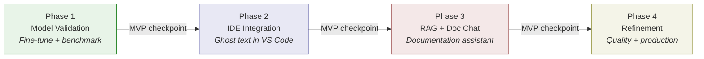

# Implementation Roadmap

:::tip[TL;DR]
A four-phase roadmap with explicit MVP checkpoints, building on the already-shipped [bbj-language-server](https://github.com/BBx-Kitchen/bbj-language-server) and in-progress model fine-tuning (~10K data points). Total infrastructure investment is modest -- roughly $1,500-5,000 one-time plus minimal monthly hosting -- because the strategy uses self-hosted open-source tooling throughout. Each phase delivers standalone value; you can stop at any checkpoint and still have a working system.
:::

The previous chapters laid out the technical blueprints: [why BBj needs a custom AI approach](/docs/bbj-challenge), [the strategic architecture](/docs/strategic-architecture) that ties the components together, [how to fine-tune the model](/docs/fine-tuning), [how IDE integration works](/docs/ide-integration), [the documentation chat vision](/docs/documentation-chat), and [the RAG database design](/docs/rag-database). This chapter answers the remaining questions: **when**, **how much**, and **what could go wrong**.

The primary audience here is technical leads and project managers evaluating whether this strategy is feasible and how to execute it. The roadmap presents a single recommended plan with clear cut points -- not a menu of options, but a sequence of phases where each MVP checkpoint marks a place you could stop and still have delivered value.

## Where We Stand

Before presenting the roadmap, it is important to establish where the project actually is. This is not a greenfield effort starting from zero. Significant work has already been completed, and the roadmap builds on that foundation.

| Component | Paper Status (Jan 2025) | Actual Status (Jan 2026) |
|-----------|------------------------|------------------------|
| Training data | Schema defined, no curated examples | ~10K data points, promising results |
| Base model | Candidates identified (CodeLlama, StarCoder2) | Qwen2.5-Coder selected, fine-tuning in progress |
| Language server | Architecture planned | v0.5.0 shipped, published on VS Code Marketplace |
| Copilot integration | Not mentioned | Early exploration, cautiously optimistic |
| RAG database | Schema designed | Source corpus identified, pipeline not built |
| Documentation chat | Architecture planned | Vision defined, not yet built |

:::info[Decision: Acknowledging Existing Work]
**Choice:** Build the roadmap from the current state rather than starting from zero.
**Rationale:** The language server is already shipped with 450+ commits and 13 contributors. The fine-tuning effort has ~10K training data points with promising results. Presenting a from-scratch roadmap would misrepresent the actual effort remaining and undermine credibility with technical reviewers.
**Impact:** What was originally planned as a 6-month full-project timeline becomes a continuation plan that builds on a partially-complete foundation.
:::

## Implementation Phases

The roadmap is organized into four sequential phases. Each phase ends with an MVP checkpoint -- a point where you could pause (or stop entirely) and still have a functional, valuable system. The phases build on each other, but each checkpoint delivers standalone utility.

### Why This Order

The sequencing is not arbitrary. Each phase produces an artifact that the next phase consumes:

1. **Phase 1 produces the model** -- Without a fine-tuned model that generates valid BBj code, IDE integration would deliver low-quality suggestions and documentation chat would hallucinate answers. The model is the foundation everything else depends on.
2. **Phase 2 produces the IDE integration** -- IDE completions exercise the model under real-world conditions (latency constraints, partial code context, diverse generation patterns). The feedback from this phase directly improves model quality for Phase 3.
3. **Phase 3 produces the RAG pipeline and chat** -- The documentation chat requires both the fine-tuned model (for generation-aware responses) and a retrieval pipeline. Building this after Phase 2 means the model has already been battle-tested in production conditions.
4. **Phase 4 optimizes everything** -- Refinement requires real usage data. It cannot begin until Phases 1-3 are producing measurable outcomes.

The MVP checkpoints are explicitly designed as "safe stopping points." An organization with limited resources could complete Phase 1 and Phase 2, delivering AI-powered IDE completions, and defer Phases 3-4 indefinitely. The investment in Phases 1-2 is not wasted if Phase 3 never happens.

### Phase 1: Model Validation (Current -- Partially Complete)

**Objective:** Produce a fine-tuned model that reliably generates syntactically valid BBj code across all four generations, backed by reproducible evaluation benchmarks.

This phase is already underway. The fine-tuning effort has accumulated ~10K training data points and is producing promising results with [Qwen2.5-Coder-7B](/docs/fine-tuning#why-qwen25-coder) as the base model. The remaining work is expanding the dataset, establishing formal evaluation benchmarks, and validating model quality for the IDE completion use case.

**Key deliverables:**

- **Expanded training dataset** -- Build on the existing ~10K data points with targeted additions for underrepresented generations and patterns. Quality over quantity: as described in [Chapter 3](/docs/fine-tuning#training-data-structure), 1,000 excellent examples outperform 10,000 mediocre ones for low-resource languages.
- **Evaluation benchmark suite** -- A reproducible test harness covering BBj-specific code generation (syntax validity, generation detection, idiomatic patterns) and general code quality (to ensure the model does not lose broad programming ability during fine-tuning).
- **Model validation for completion** -- Test the fine-tuned model specifically for the IDE completion use case: given a code prefix, does it produce valid, generation-appropriate continuations? This is the critical gate for Phase 2.
- **GGUF export and Ollama deployment** -- Package the validated model for [self-hosted inference via Ollama](/docs/fine-tuning#hosting-via-ollama), confirming that it runs within the target hardware constraints (Q4_K_M quantization, ~4GB memory footprint).

**Success criteria:**

- Model generates syntactically valid BBj code in 95%+ of benchmark cases
- Generation detection accuracy exceeds 90% on a held-out test set
- Model runs on consumer hardware (16GB RAM, no dedicated GPU required for inference)
- Evaluation benchmark is automated and reproducible

:::note[MVP Checkpoint 1]
**You could stop here and have:** A fine-tuned BBj language model served through Ollama that developers can query directly for code generation, explanation, and completion. Even without IDE integration, this model can be used via Ollama's API or chat interface for BBj-specific assistance.
:::

### Phase 2: IDE Integration

**Objective:** Deliver AI-powered code completions directly in the developer's editor, building on the existing [bbj-language-server](/docs/ide-integration) architecture.

This phase connects the fine-tuned model to the development workflow. The bbj-language-server already provides deterministic completions (syntax-driven suggestions via the Langium parser). Phase 2 adds generative completions -- ghost text suggestions powered by the fine-tuned model, appearing inline as the developer types.

**Key deliverables:**

- **Generation detection in Langium parser** -- Extend the bbj-language-server's AST analysis to identify which BBj generation the current file or code block belongs to. This metadata enriches every LLM prompt with generation context, as described in [Chapter 4](/docs/ide-integration).
- **Semantic context extraction API** -- Build a service within the language server that assembles rich context (scope information, imported types, generation hints, surrounding code) for LLM prompts.
- **Inline completion provider** -- Implement the VS Code `InlineCompletionItemProvider` to deliver ghost text completions. The provider calls Ollama's API with semantically-enriched prompts and renders suggestions as translucent ghost text.
- **Completion quality guardrails** -- Use the Langium parser to validate LLM suggestions before presenting them. Suggestions that fail syntax parsing are filtered out, providing a safety net against hallucinated code.

**Success criteria:**

- Ghost text completions appear within 500ms (P50 latency)
- Completion acceptance rate exceeds 20% (industry benchmark for AI code completion)
- Generation-appropriate suggestions in 95%+ of cases
- No degradation of existing language server features (diagnostics, formatting, deterministic completion)

:::note[MVP Checkpoint 2]
**You could stop here and have:** A VS Code extension that provides AI-powered BBj code completions alongside the existing deterministic completions. Developers get ghost text suggestions as they type, with generation-aware context and syntax validation. This is a complete, shippable developer tool.
:::

### Phase 3: RAG Pipeline + Documentation Chat

**Objective:** Build the knowledge retrieval infrastructure and a chat interface that answers BBj questions with generation-appropriate, citation-backed responses.

This phase implements the second major capability described in the strategy: a documentation assistant that understands BBj's multi-generational documentation corpus. It requires building the [RAG database](/docs/rag-database) and the [chat interface](/docs/documentation-chat) that consumes it.

**Key deliverables:**

- **MadCap Flare ingestion pipeline** -- Parse the BBj documentation corpus (exported as Clean XHTML from MadCap Flare), extract text and metadata, apply generation tagging, and chunk with contextual headers. See [Chapter 6](/docs/rag-database) for the detailed pipeline architecture.
- **Vector store with generation-tagged chunks** -- Deploy PostgreSQL with pgvector, store embedded documentation chunks with generation metadata, and implement hybrid search (semantic + keyword) with cross-encoder reranking.
- **Chat backend** -- Build a service that accepts user queries, retrieves relevant documentation via the RAG pipeline, assembles enriched prompts with the fine-tuned model, and streams generation-aware responses with source citations.
- **Chat interface** -- Deploy a chat frontend (embedded in documentation site, standalone, or hybrid) that provides conversational access to BBj documentation.

**Success criteria:**

- RAG retrieval Precision@5 exceeds 0.85 on a test query set
- Chat answers include source citations for all factual claims
- Responses are generation-appropriate (e.g., a question about DWC gets DWC-specific documentation, not legacy character UI docs)
- End-to-end response time under 3 seconds for typical queries

:::note[MVP Checkpoint 3]
**You could stop here and have:** A complete BBj AI assistant covering both code completion (IDE) and documentation chat. Developers get inline code suggestions in VS Code and can ask natural-language questions about BBj documentation with cited, generation-aware answers. This is the full vision described in the strategy, ready for user feedback and iteration.
:::

### Phase 4: Refinement + Scaling

**Objective:** Harden all components for production quality based on real-world usage data, and expand coverage based on user feedback.

Phase 4 is not about building new capabilities -- it is about making everything production-grade. The previous phases deliver functional systems; this phase optimizes them based on actual usage patterns.

**Key deliverables:**

- **Training data expansion** -- Use completion acceptance/rejection telemetry and chat feedback to identify weak areas in the model's knowledge. Add targeted training examples for patterns where the model underperforms.
- **Retrieval quality optimization** -- Analyze retrieval logs to identify query patterns with low relevance scores. Tune chunking strategy, embedding model, and reranking weights based on real query data.
- **Latency optimization** -- Profile and optimize the full request path: context assembly, Ollama inference, RAG retrieval, response streaming. Target P95 latency under 1,500ms for completions and under 5 seconds for chat responses.
- **Production deployment hardening** -- Monitoring, alerting, graceful degradation (fall back to deterministic completion if Ollama is unavailable), usage analytics, and operational runbooks.

**Success criteria:**

- All success metrics from Phases 1-3 maintained or improved
- P95 completion latency under 1,500ms
- System handles concurrent users without degradation
- Operational runbooks cover all failure modes

:::note[MVP Checkpoint 4]
**You could stop here and have:** A production-ready BBj AI development platform: fine-tuned model, IDE integration, documentation chat, and RAG pipeline -- all battle-tested with real user data and optimized for production workloads.
:::

## Infrastructure Costs

One of the advantages of the self-hosted, open-source approach described in this strategy is that infrastructure costs are modest. The primary investment is a training GPU; ongoing costs are minimal because inference, vector storage, and the chat backend all run on standard hardware.

| Component | Specification | One-Time Cost | Monthly Cost |
|-----------|--------------|---------------|--------------|
| Training GPU | RTX 4090 24GB (or cloud equivalent) | ~$1,500 (purchase) or $2,000-5,000 (cloud training runs) | $0 (owned hardware) |
| Ollama inference server | 16GB+ RAM, GPU recommended but not required | Existing hardware | $0 (self-hosted) |
| PostgreSQL + pgvector | Standard PostgreSQL instance | $0 (existing infrastructure) | $0-200 (if cloud-hosted) |
| Chat backend hosting | Standard web server | $0 (existing infrastructure) | $50-200 (if cloud-hosted) |
| Embedding computation | One-time full corpus embedding | $10-50 | $5-20 (incremental updates) |
| **Total** | | **~$1,500-5,000** | **~$50-420** |

The one-time cost is dominated by the training GPU. If the organization already has a machine with 24GB+ VRAM (common in development teams working with graphics or ML), the one-time cost drops to near zero. Cloud training is more expensive per run but avoids capital expenditure.

### Cost by Scenario

The total cost depends heavily on existing infrastructure:

| Scenario | One-Time | Monthly | Notes |
|----------|----------|---------|-------|
| **Minimal:** Existing GPU, self-hosted services | $10-50 | $5-20 | Only embedding computation costs; all services run on existing hardware |
| **Typical:** Purchase training GPU, self-hosted | ~$1,500-2,000 | $5-20 | One RTX 4090; inference and services on existing hardware |
| **Cloud-first:** Cloud GPU training, cloud-hosted services | $2,000-5,000 | $100-420 | No hardware purchases; higher ongoing costs for hosting |

For comparison, a single GitHub Copilot Business license costs $19/month per developer. At 20 developers, that is $380/month -- comparable to the cloud-hosted scenario's monthly costs, but without the BBj-specific capabilities that make the investment worthwhile.

The critical insight is that this is not a large-scale infrastructure project. The entire system runs on commodity hardware using open-source software. The architecture described in [Chapter 2](/docs/strategic-architecture) was designed specifically to avoid vendor lock-in and cloud dependency.

:::info[Decision: Hardware and Infrastructure Costs Only]
**Choice:** Present infrastructure costs without staffing or personnel estimates.
**Rationale:** Staffing costs vary enormously by organization, geography, and whether the work is done by existing team members, new hires, or contractors. Including speculative personnel estimates (the original strategy paper estimated $150K-250K in development costs) would distract from the infrastructure discussion and risk undermining credibility with organizations whose cost structures differ.
**Guidance:** Technical leads should estimate staffing based on their own team's capacity and the phase-by-phase deliverable descriptions above.
:::

## Risk Assessment

Every implementation plan carries risks. This section identifies the most significant risks, assesses their likelihood and impact, and proposes concrete mitigations. The assessment structure follows principles from the [NIST AI Risk Management Framework (AI RMF 1.0)](https://www.nist.gov/itl/ai-risk-management-framework), which provides a credible, vendor-neutral methodology for evaluating AI system risks across the dimensions of governance, mapping, measurement, and management.

For this project, the most relevant NIST AI RMF considerations are: ensuring the AI system is valid and reliable (MAP function), monitoring for harmful outputs like hallucinated code (MEASURE function), and having mitigation strategies in place before deployment (MANAGE function).

| Risk | Likelihood | Impact | Mitigation |
|------|-----------|--------|------------|
| Fine-tuned model hallucinates BBj syntax | Medium | High | Langium parser validation of all LLM suggestions before presentation; evaluation benchmarks with known-bad patterns; Copilot bridge as fallback completion source |
| Training data insufficient for all 4 generations | Medium | Medium | Prioritize modern generations (BBj GUI + DWC) first where developer activity is highest; expand to legacy generations iteratively based on user demand |
| Copilot ecosystem changes break bridge integration | Medium | Low | Custom LLM client via `InlineCompletionItemProvider` is the strategic path; Copilot bridge is intentionally designed as an interim solution that can be deprecated |
| MadCap Flare content difficult to parse for RAG | Low | Medium | Clean XHTML export provides a standardized, well-structured format; pilot the ingestion pipeline with a small document subset before full corpus processing |
| Model too large for customer hardware | Low | Medium | Qwen2.5-Coder-7B at Q4_K_M quantization fits in ~4GB memory; offer multiple quantization levels for different hardware profiles; smallest viable model for autocomplete is ~1.5B parameters |
| LLM ecosystem shifts (new models, APIs, paradigms) | High | Low | Architecture-first design means components are model-agnostic; the same training data can retrain on newer base models; the RAG pipeline and IDE integration are independent of the specific LLM |

### Reading the Risk Matrix

- **Likelihood** reflects how probable the risk is given current trends and the project's specific context.
- **Impact** reflects the severity if the risk materializes, considering both the disruption to the project and the effort required to recover.
- **Mitigation** describes concrete actions already planned or in place -- not aspirational responses.

The highest-priority risk (medium likelihood, high impact) is model hallucination. This is mitigated by the Langium validation layer described in [Chapter 4](/docs/ide-integration) -- every LLM suggestion passes through the same parser that powers the language server's diagnostics. Suggestions that fail syntax validation are silently filtered, ensuring that hallucinated code never reaches the developer.

The most likely risk (high likelihood, low impact) is ecosystem shifts. New models, APIs, and paradigms will emerge during and after implementation. The architecture described in [Chapter 2](/docs/strategic-architecture) is designed for this: the model layer, IDE integration, RAG pipeline, and chat interface are loosely coupled. Swapping a base model or updating an API endpoint does not require rearchitecting the system.

### Using This Matrix During Execution

This risk assessment is not a one-time document. During implementation, revisit it at each MVP checkpoint:

- **At Checkpoint 1 (Model Validation):** Re-evaluate the hallucination and training data risks. If the fine-tuned model meets the 95% syntax validity target, the hallucination risk drops from Medium to Low likelihood. If training data gaps are identified for specific generations, the insufficient data risk may need upgraded mitigation (e.g., targeted data collection sprints).
- **At Checkpoint 2 (IDE Integration):** Re-evaluate the Copilot ecosystem risk based on current VS Code releases. The Copilot landscape is changing rapidly; what was true in January 2026 may have shifted by the time Phase 2 begins.
- **At Checkpoint 3 (RAG + Doc Chat):** Re-evaluate the MadCap Flare parsing risk based on pilot results. If the ingestion pipeline handles the test subset well, this risk can be closed. Also assess whether embedding model quality is sufficient or whether fine-tuning (noted in [Chapter 6](/docs/rag-database)) is warranted.

New risks should be added as they are discovered. A risk matrix that does not evolve is not being used.

## Success Metrics

Success should be measured across three dimensions: technical quality, user experience, and business impact. These targets are aspirational benchmarks to evaluate against, not contractual commitments -- they represent industry norms and reasonable expectations for a system of this scope.

### Technical Metrics

| Metric | Target | How to Measure |
|--------|--------|----------------|
| Completion latency (P50) | < 500ms | Telemetry in VS Code extension |
| Completion latency (P95) | < 1,500ms | Telemetry in VS Code extension |
| Syntactically valid completions | > 95% | Automated evaluation benchmark |
| Generation detection accuracy | > 90% | Held-out test set from training data |
| Hallucination rate | < 5% | Manual review of sampled completions |
| RAG Precision@5 | > 0.85 | Precision of top-5 retrieved documents against labeled query set |
| RAG Answer Rate | > 0.90 | Fraction of queries that produce a substantive (non-"I don't know") response |

### User Metrics

| Metric | Target | How to Measure |
|--------|--------|----------------|
| Completion acceptance rate | > 20% | Telemetry: tab presses / suggestions shown |
| Chat satisfaction | > 4/5 | In-chat feedback widget (thumbs up/down + optional comment) |
| Feature adoption | > 50% of active users | Extension telemetry: unique users with AI features enabled |

### Business Metrics

| Metric | Target | How to Measure |
|--------|--------|----------------|
| Customer retention improvement | Measurable increase | CRM data: compare retention for customers using AI tools vs. those not |
| New developer onboarding time | Reduction | Customer surveys: time to first productive contribution |
| Migration project acceleration | Reduction in effort | Project tracking: compare migration timelines before and after AI tooling |

Business metrics are inherently harder to measure and attribute. They should be tracked as long-term indicators rather than short-term KPIs. The technical and user metrics provide more immediate, actionable feedback for guiding development.

### Establishing Baselines

Metrics are only useful when compared to a baseline. Before deploying AI features, establish baseline measurements for:

- **Completion latency:** Measure the existing deterministic completion speed in the bbj-language-server. AI completions should not be dramatically slower than what developers already experience.
- **Support ticket volume:** Track current question volume in support channels, documentation searches, and community forums. This provides the "before" measurement for business impact.
- **Developer onboarding time:** Survey current customers about time-to-productivity for new BBj developers. Even rough estimates provide a comparison point.
- **Code quality indicators:** If the organization tracks code review findings or bug rates, capture current levels before AI-assisted coding is available.

These baselines do not need to be precise. Directional measurements (better/worse/unchanged) are sufficient for evaluating whether the AI tools are delivering value. The technical metrics (latency, accuracy, acceptance rate) provide the precise, continuous measurements.

## Current Status

:::note[Where Things Stand -- January 2026]
- **Phase 1 (Model Validation):** Partially complete. The [bbj-language-server](https://github.com/BBx-Kitchen/bbj-language-server) (v0.5.0) is shipped and published on the VS Code Marketplace. Fine-tuning is in progress with ~10K training data points and promising results using Qwen2.5-Coder-7B as the base model. Evaluation benchmarks are being developed.
- **Phase 2 (IDE Integration):** Planned. The language server provides the foundation; LLM-powered completions have not yet been integrated.
- **Phase 3 (RAG + Doc Chat):** Planned. The documentation corpus (MadCap Flare) has been identified as the primary source. The ingestion pipeline and vector store have not been built.
- **Phase 4 (Refinement):** Planned. Depends on Phases 1-3 delivering functional systems for real-world testing.
- **Total infrastructure investment:** Modest. Estimated $2,000-5,000 one-time (primarily the training GPU) plus $50-420/month for hosting if cloud-deployed.
:::

## Cross-References

This chapter synthesizes the technical details from the preceding chapters into an actionable plan. Each phase of the roadmap maps directly to one or more of the technical chapters that precede it. For the full technical depth behind each phase, see:

- [The BBj Challenge](/docs/bbj-challenge) -- Why generic AI tools fail on BBj and what makes this problem unique
- [Strategic Architecture](/docs/strategic-architecture) -- The two-layer architecture (shared foundation + application layer) that ties all components together
- [Fine-Tuning the Model](/docs/fine-tuning) -- Phase 1 technical detail: training data, base model selection, QLoRA methodology, Ollama deployment
- [IDE Integration](/docs/ide-integration) -- Phase 2 technical detail: language server architecture, inline completion provider, generation detection
- [Documentation Chat](/docs/documentation-chat) -- Phase 3 technical detail: chat architecture, streaming responses, generation-aware conversation
- [RAG Database Design](/docs/rag-database) -- Phase 3 technical detail: ingestion pipeline, vector store, hybrid search, embedding strategy

Together, these seven chapters form a complete strategy: the problem statement, the architectural approach, and the technical execution plan for each component -- culminating in this implementation roadmap that ties them into a sequenced, costed, risk-assessed plan of action.
